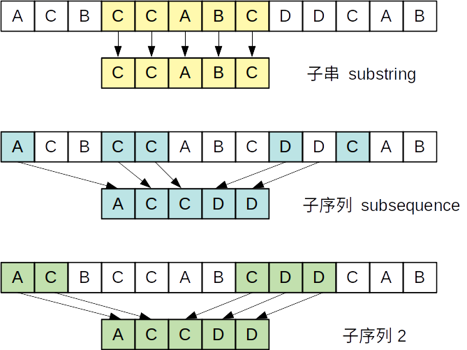
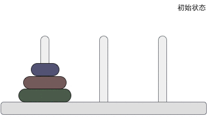
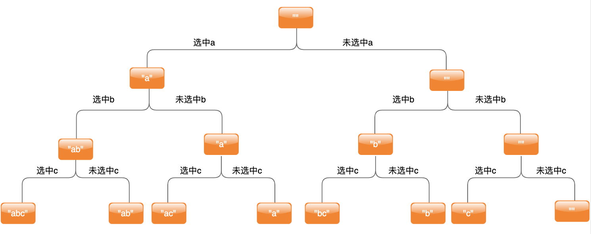
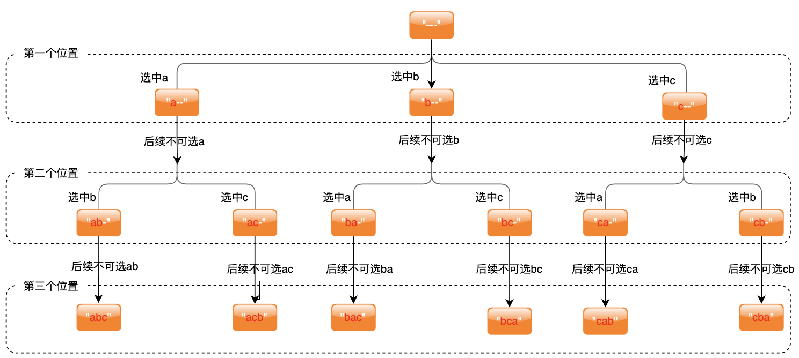
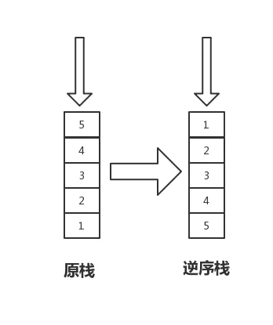
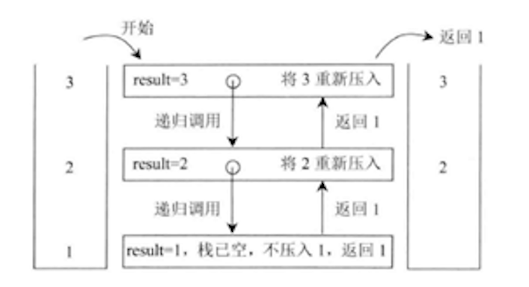
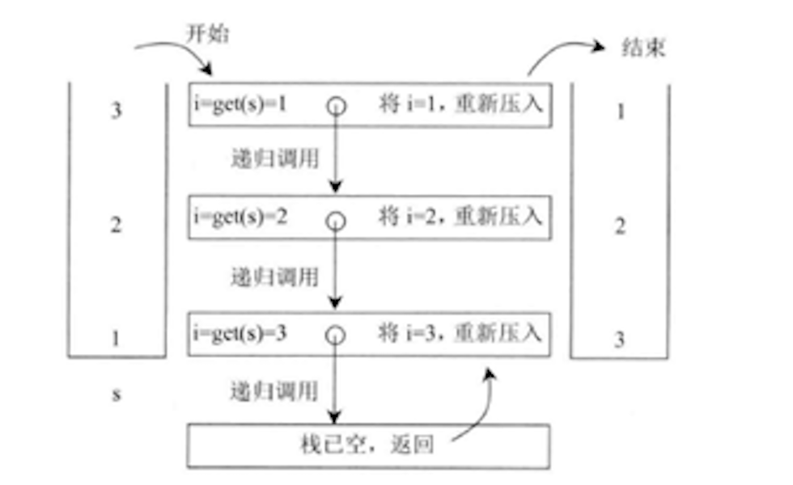

# 认识一些经典递归过程

## 基本概念

### 字符串子串和子序列的区别

在字符串匹配里，子串通常指的是给定字符串的一部分，是连续的不可断开的。而子序列是不同的，是在给定字符串里，按照顺序取字符，可以连续可以断开，然后组合构成新的字符串



字串-连续 子序列-不连续

## 经典递归

### 练习一：打印 n 层汉诺塔从左边移动到最右边的全部过程

汉诺塔问题源自印度一个古老的传说，印度教的“创造之神”梵天创造世界时做了 3 根金刚石柱，其中的一根柱子上按照从小到大的顺序摞着 64 个黄金圆盘。梵天命令一个叫婆罗门的门徒将所有的圆盘移动到另一个柱子上，移动过程中必须遵守以下规则：  
每次只能移动柱子最顶端的一个圆盘；  
每个柱子上，小圆盘永远要位于大圆盘之上；

下图给您展示了包含 3 个圆盘的汉诺塔问题：  
  
一根柱子上摞着 3 个不同大小的圆盘，那么在不违反规则的前提下，如何将它们移动到另一个柱子上呢？下图给大家提供了一种最快的实现方案：



> 汉诺塔问题中，3 个圆盘至少需要移动 7 次，移动 n 的圆盘至少需要操作 2n-1 次。

我们把这个问题拆解一下，想要把 n 层圆盘从左侧移动到右侧，必须先把 n-1 层圆盘移动到中间（黑盒 1），再把第 n 层圆盘移动到右侧，最后把 n-1 层的所有圆盘移动到右侧（黑盒 2），通过这种方式我们就会有 6 种方式移动，最终会得到最后结果，代码如下

```ts
/**
 * @description: 把所有层数根据规则从左侧移动到右侧
 * @param {number} n 层数（从小到大）
 */
function leftToRight(n: number) {
  //只有1层的时候直接移动即可
  if (n == 1) {
    console.log(`从左侧移动数字'${n}'到右侧`);
    return;
  }
  leftToMid(n - 1); //先把n-1层的移动到中间
  console.log(`从左侧移动数字'${n}'到右侧`);
  midToRight(n - 1); //再把n-1层的移动到中间
}

/**
 * @description: 把所有层数根据规则从左侧移动到中间
 * @param {number} n 层数（从小到大）
 */
function leftToMid(n: number) {
  if (n == 1) {
    console.log(`从左侧移动数字'${n}'到中间`);
    return;
  }
  leftToRight(n - 1);
  console.log(`从左侧移动数字'${n}'到中间`);
  rightToMid(n - 1);
}

/**
 * @description: 把所有层数根据规则从右侧移动到中间
 * @param {number} n 层数（从小到大）
 */
function rightToMid(n: number) {
  if (n == 1) {
    console.log(`从右侧移动数字'${n}'到中间`);
    return;
  }
  rightToLeft(n - 1);
  console.log(`从右侧移动数字'${n}'到中间`);
  leftToMid(n - 1);
}

/**
 * @description: 把所有层数根据规则从右侧移动到左侧
 * @param {number} n 层数（从小到大）
 */
function rightToLeft(n: number) {
  if (n == 1) {
    console.log(`从右侧移动数字'${n}'到左侧`);
    return;
  }
  rightToMid(n - 1);
  console.log(`从右侧移动数字'${n}'到左侧`);
  midToLeft(n - 1);
}

/**
 * @description: 把所有层数根据规则从中间移动到左侧
 * @param {number} n 层数（从小到大）
 */
function midToLeft(n: number) {
  if (n == 1) {
    console.log(`从中间移动数字'${n}'到左侧`);
    return;
  }
  midToRight(n - 1);
  console.log(`从中间移动数字'${n}'到左侧`);
  rightToLeft(n - 1);
}

/**
 * @description: 把所有层数根据规则从中间移动到右侧
 * @param {number} n 层数（从小到大）
 */
function midToRight(n: number) {
  if (n == 1) {
    console.log(`从中间移动数字'${n}'到右侧`);
    return;
  }
  midToLeft(n - 1);
  console.log(`从中间移动数字'${n}'到右侧`);
  leftToRight(n - 1);
}

function main(num: number) {
  leftToRight(num);
}

main(3);
//output:
// 从左侧移动数字'1'到右侧
// 从左侧移动数字'2'到中间
// 从右侧移动数字'1'到中间
// 从左侧移动数字'3'到右侧
// 从中间移动数字'1'到左侧
// 从中间移动数字'2'到右侧
// 从左侧移动数字'1'到右侧
```

通过上面的代码可以发现每个函数都有一定的规律，所以可以通过添加参数的方式进行增加功能

```ts
/**
 * @description: 把所有层数根据规则从from侧移动到to侧
 * @param {number} n 层数（从小到大）
 * @param {string} from 初始位置
 * @param {string} to   目标位置
 * @param {string} other 辅助位置
 */
function move(n: number, from: string, to: string, other: string) {
  if (n == 1) {
    console.log(`从${from}移动数字'${n}'到${to}`);
    return;
  }
  move(n - 1, from, other, to);
  console.log(`从${from}移动数字'${n}'到${to}`);
  move(n - 1, other, to, from);
}

function main(num: number) {
  move(num, "左侧", "右侧", "中间");
}

main(3);

//output:
// 从左侧移动数字'1'到右侧
// 从左侧移动数字'2'到中间
// 从右侧移动数字'1'到中间
// 从左侧移动数字'3'到右侧
// 从中间移动数字'1'到左侧
// 从中间移动数字'2'到右侧
// 从左侧移动数字'1'到右侧
```

上面两个函数的复杂度计算为 2^N-1

> 一个递归函数，我们可以用增加参数的方式表达更多的可能性，从而让递归函数支持更多功能。

### 练习二：打印一个字符串的全部子序列

示例：abc 的全部子序列有 "" "a" "b" "c" "ab" "ac" "bc" "abc"  
解题思路：针对于 abc 三个位置上的字符，每个位置的字符都有选中和未选中两种方式，最终会得到所有的子序列，如下图


根据以上方式，可写代码如下：

```ts
/**
 * @param {string} strArr 原字符串数组（固定参数）
 * @param {string} store 存储所有的子序列数组
 * @param {number} index 当前所在的位置
 * @param {string} path 当前已经拼接的路径
 */
function process1(
  strArr: string[],
  store: string[],
  index: number,
  path: string
) {
  //已经到头了，push拼接路径
  if (index == strArr.length) {
    return store.push(path);
  }
  //不选中当前位置参加path
  process1(strArr, store, index + 1, path);
  //选中当前位置参加path
  process1(strArr, store, index + 1, path + strArr[index]);
}

function main(str: string): string[] {
  const ans: string[] = [];
  const strArr = str.split("");
  process1(strArr, ans, 0, "");
  return ans;
}

console.log(main("abc"));

//output：
//['','c','b','bc','a','ac','ab','abc']
```

### 练习三：打印一个字符串的全部子序列，要求不要出现重复子面值的子序列

还是上面的代码，如果我们使用的字符串是"aaa",则会打印

```ts
...
console.log(main("aaa"))
//output：
//['','a','a','aa','a','aa','aa','aaa']
```

会发现有很多重复部分，想要去除中间重复的部分也非常简单，只要我们把数组改成 Set 类型便可以去重，完整代码如下

```ts
/**
 * @param {string} strArr 原字符串数组（固定参数）
 * @param {string} store 存储所有的子序列数组
 * @param {number} index 当前所在的位置
 * @param {string} path 当前已经拼接的路径
 */
function process1(
  strArr: string[],
  store: Set<string>,
  index: number,
  path: string
) {
  if (index == strArr.length) {
    return store.add(path);
  }
  //不选中当前位置参加path
  process1(strArr, store, index + 1, path);
  //选中当前位置参加path
  process1(strArr, store, index + 1, path + strArr[index]);
}

function main(str: string): string[] {
  const ans: Set<string> = new Set();
  const strArr = str.split("");
  process1(strArr, ans, 0, "");
  return [...ans];
}

console.log(main("aaa"));

//output：
//[ '', 'a', 'aa', 'aaa' ]
```

### 练习四：打印一个字符串的全部排列

示例：字符串 abc 的全部排列为 abc acb bac bca cab cba  
解题思路：我们可以先从三个字符串中选中一个填到第一个位置，然后从剩余两个中选中一个填到第二个位置，最后一个数放到最后一个位置（已经填好的数不再重复用）

代码如下：

```ts
/**
 * @description: 交换数组下标内容
 * @param {*} arr 数组
 * @param {*} i i位置
 * @param {*} j j位置
 */
function swap(arr: any[], i: number, j: number) {
  let cache = arr[i];
  arr[i] = arr[j];
  arr[j] = cache;
}
/**
 * @description: 从index位置出发，数组中index之前位置已经确定，后续所有的方法
 * @param {string} strArr 字符串数组(index之前是固定好的)
 * @param {string} store 存储所有的全排列数组
 * @param {number} index 当前所在的位置
 */
function process1(strArr: string[], index: number, store: string[]) {
  if (index == strArr.length) {
    store.push(strArr.join(""));
  }
  for (let i = index; i < strArr.length; i++) {
    //index后面的任意位置都可以当做当前位置数据
    swap(strArr, index, i);
    process1(strArr, index + 1, store);
    //恢复现场
    swap(strArr, i, index);
  }
}

function main(str: string): string[] {
  const ans: string[] = [];
  const strArr = str.split("");
  process1(strArr, 0, ans);
  return ans;
}

console.log(main("abc"));

//output：
//[ 'abc', 'acb', 'bac', 'bca', 'cba', 'cab' ]
```

### 练习五：打印一个字符串的全部排列，要求不出现重复的排列

还是上面的代码，如果我们使用的字符串是"aaa",则会打印

```ts
...
console.log(main("aac"))
//output：
//[ 'aac', 'aca', 'aac', 'aca', 'caa', 'caa' ]
```

会发现会有很多重复值，想要去除重复，我们可以在代码中做一些`剪枝策略`(下面会讲)

```ts
/**
 * @description: 交换数组下标内容
 * @param {*} arr 数组
 * @param {*} i i位置
 * @param {*} j j位置
 */
function swap(arr: any[], i: number, j: number) {
  let cache = arr[i];
  arr[i] = arr[j];
  arr[j] = cache;
}
/**
 * @description: 从index位置出发，数组中index之前位置已经确定，后续所有的方法
 * @param {string} strArr 字符串数组(index之前是固定好的)
 * @param {string} store 存储所有的全排列数组
 * @param {number} index 当前所在的位置
 */
function process1(strArr: string[], index: number, store: string[]) {
  if (index == strArr.length) {
    store.push(strArr.join(""));
  }
  let cache: boolean[] = new Array(128).fill(false); //构建一个长度为128的数组（asc码的范围是0-127）
  for (let i = index; i < strArr.length; i++) {
    const ascCode = strArr[i].charCodeAt(0);
    if (cache[ascCode]) continue; //遇到了重复的直接忽略
    cache[ascCode] = true;
    //index后面的任意位置都可以当做当前位置数据
    swap(strArr, index, i);
    process1(strArr, index + 1, store);
    //恢复现场
    swap(strArr, i, index);
  }
}

function main(str: string): string[] {
  const ans: string[] = [];
  const strArr = str.split("");
  process1(strArr, 0, ans);
  return ans;
}

console.log(main("aac"));

//output：
//[ 'aac', 'aca', 'caa' ]
```

当然我们也可以像子序列去重复那样，直接用一个 Set 类型进行去重（过滤），但是这种方式在速度上更加快，在下一次递归之前就提前将这个分支进行杀死，这种方式也称为`剪枝策略`  
剪枝要比过滤要快, 因为过滤是你没有省掉所有的情况，所有情况你都来了，只是你最后一步过滤它，提前杀死肯定少走很多路

### 练习六：栈逆序问题

一个栈依次压入 1、2、3、4、5，那么从栈顶到栈底分别为 5、4、3、2、1。将这个栈转置后，从栈顶到栈底为 1、2、3、4、5，也就是实现栈中元素的逆序，但是只能运用递归函数来实现，不能使用其他数据结构。  


解题思路：每个栈在执行的时候都会缓存一些活动变量，通过这些活动变量可以缓存栈中的值，从而达到逆序的效果，代码如下

```ts
/**
 * @description: 移除栈底元素并获取该元素的值
 * @param {T} stack 栈
 * @return {*} 栈底元素的值
 */
function getAndRemoveLastElement<T>(stack: T[]): T {
  let result = stack.pop();
  if (stack.length == 0) {
    return result;
  }
  const lastElement = getAndRemoveLastElement(stack);
  stack.push(result);
  return lastElement;
}

/**
 * @description: 递归反转栈元素
 * @param {T} stack 栈
 */
function reverse<T>(stack: T[]) {
  if (stack.length == 0) {
    return;
  }
  let i = getAndRemoveLastElement(stack);
  reverse(stack);
  stack.push(i);
}

/**
 * @description:  用数组来模拟栈结构，但是栈是后进先出的方式 假设只能使用push pop
 * @return {*}  逆序栈
 */
function main() {
  const stack = [1, 2, 3];
  reverse(stack);
  return stack;
}

console.log(main());
//output：
//[ 3, 2, 1 ]
```

如果从 stack 的栈顶到栈底依次为 3、2、1，getAndRemoveLastElement 函数的具体过程如下图所示，

getAndRemoveLastElement 我们简称 get 方法，表示移除并返回当前栈底元素。


## 总结一： 暴力递归尝试的步骤

1. 把大问题转化为规模缩小的同类问题的子问题
2. 有明确的不需要继续进行递归的条件，以后我们称之为 baseCase
3. 有当得到了子问题的结果后决策的过程
4. 不记录每一个子问题的解

## 总结二：做递归要有黑盒思维

比如说你要做一个递归函数，你就规定好这个黑盒（F 函数）, 这个函数它满足什么样的条件。条件包括显示的条件和隐藏的条件潜台词，
就当你这个 F 函数它的含义固定了，你就把它作黑盒来用。  
对于这个黑盒来说，最重要的是它的含义。输入什么,达到什么效果，遵循什么样的限制条件，规定好，basecase 想好规定好，
(basecase 就是什么时候就不用再分解问题了, 直接就能出来规定好), 接下来就想我怎么用这个黑盒。  
设计黑盒函数不要太在意细节。先把黑盒规定好, 接下来就是这个黑盒怎么用问题。
