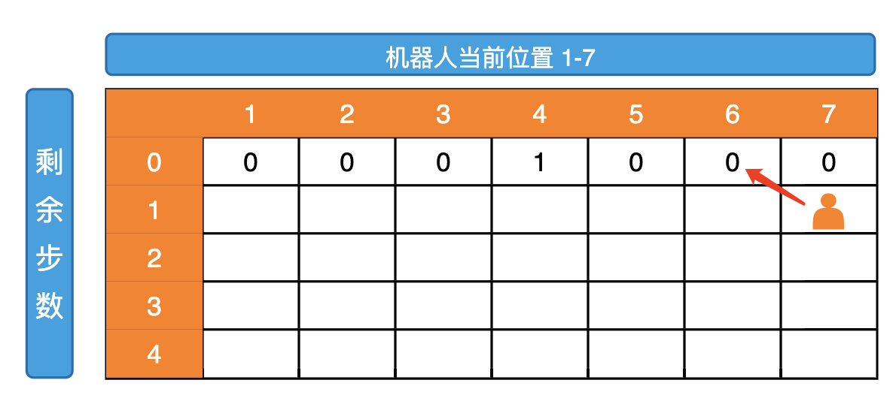
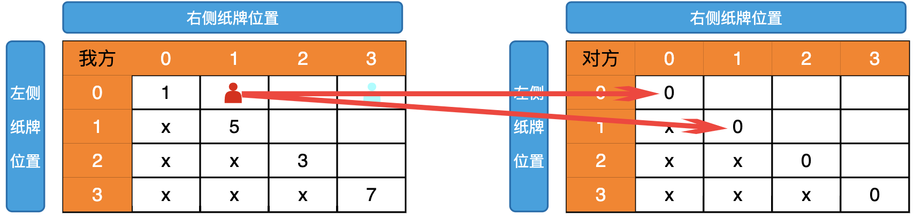
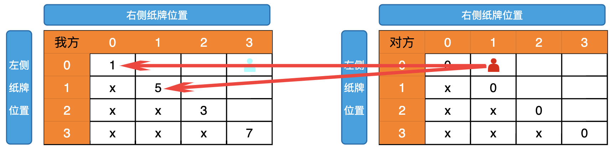

# 暴力递归到动态规划（一）

## 练习

### 练习一： Fibancci 数列

查找斐波纳契数列中第 N 个数。（N 从 0 开始），所谓的斐波纳契数列是必须满足下面两个条件：

1. 前 2 个数是 0 和 1 。
2. 第 i 个数是第 i-1 个数和第 i-2 个数的和。

【示例】斐波纳契数列的前 10 个数字是： 0, 1, 1, 2, 3, 5, 8, 13, 21, 34

根据上面的描述，我们先写一个未优化的最简单版本，代码如下：

```ts
function Fibancci(n: number): number {
  if (n < 2) {
    return n;
  }
  return Fibancci(n - 1) + Fibancci(n - 2);
}

console.log(Fibancci(20));
//output:
//6765
```

把这种暴力递归的解法画一张图出来：


是不是有重复的计算？像这样的二叉树的节点总数是指数级的，所以所有子问题的个数为 (2^n) 噢，这么做会导致时间复杂度爆炸，因为时间复杂度也变成了 O(2^n)

缓存剪枝策略

```ts
function Fibancci(n: number, cache: Map<number, number>): number {
  if (cache.has(n)) {
    return cache.get(n);
  }

  let ans = 0;
  if (n < 2) {
    ans = n;
  } else {
    ans = Fibancci(n - 1, cache) + Fibancci(n - 2, cache);
  }

  cache.set(n, ans);
  return ans;
}

function main(num: number) {
  const cache = new Map();
  return Fibancci(num, cache);
}

console.log(main(20));
//output:
//6765
```

这种带缓存的递归解法是针对暴力递归的解法做的优化，优化的操作其实就是对那颗指数级的二叉树进行剪枝，剪枝会减少重复的树节点(减少了重复的计算)。


红色实线部分圈着的是被剪枝的节点，是不是剪掉了所有的重复树节点？没错是的，所有重复的子问题都被干掉了，时间复杂度骤减。
它时间复杂度也从 O(n^2)降低到了 O(n)

### 练习二：机器人必须走 K 步，最终能来到 P 位置的方法有多少种

假设有排成一行的 N 个位置，记为 1~N，N 一定大于或等于 2 开始时机器人在其中的 start 位置上(M 一定是 1~N 中的一个)  
如果机器人来到 1 位置，那么下一步只能往右来到 2 位置；  
如果机器人来到 N 位置，那么下一步只能往左来到 N-1 位置；  
如果机器人来到中间位置，那么下一步可以往左走或者往右走；  
规定机器人必须走 K 步，最终能来到 aim 位置(aim 也是 1~N 中的一个)的方法有多少种 ？  
给定四个参数 N、start、K、aim，返回方法数。


```ts
/**
 * @description: 从curPos位置出发，还剩restStep要走，返回可以走到aim的方法数
 * @param {number} range 机器人可以走的范围 1——range（固定参数）
 * @param {number} curPos 当前所在的位置
 * @param {number} restStep 还剩restStep步可以走
 * @param {number} aim 终点位置 固定参数
 * @return {*} 方法数
 */
function robotWalk(
  range: number,
  curPos: number,
  restStep: number,
  aim: number
): number {
  if (restStep == 0) {
    //剩余步数为0的时候如果当前位置是重点位置返回一种方法数
    return curPos == aim ? 1 : 0;
  }
  let ways = 0;
  if (curPos == 1) {
    //在1位置只能向右走
    ways = robotWalk(range, curPos + 1, restStep - 1, aim);
  } else if (curPos == range) {
    //在最后位置只能往左走
    ways = robotWalk(range, curPos - 1, restStep - 1, aim);
  } else {
    //其余位置可以左右两个方向走
    //方法1 向右走
    let p1 = robotWalk(range, curPos + 1, restStep - 1, aim);
    //方法2 向左走
    let p2 = robotWalk(range, curPos - 1, restStep - 1, aim);
    ways = p1 + p2;
  }
  return ways;
}

function main(N: number, start: number, K: number, aim: number) {
  return robotWalk(N, start, K, aim);
}

console.log(main(7, 2, 4, 4));
//output:
//4
```

以上方式是纯暴力，上面方式的可变参数就两个，当前所在的位置(curPos)和剩余步数(restStep)，假设当前位置在 7,剩余步数为 10，我们根据下图会发现后续有重复的过程，而且会有很多，所以我们可以用缓存剪枝策略来进行优化，后续也称`记忆化搜索`


#### 记忆化搜索方式

```ts
/**
 * @description: 从curPos位置出发，还剩restStep要走，返回可以走到aim的方法数
 * @param {number} range 机器人可以走的范围 1——range（固定参数）
 * @param {number} curPos 当前所在的位置
 * @param {number} restStep 还剩restStep步可以走
 * @param {number} aim 终点位置 固定参数
 * @param Map<string,number> cache 缓存已经算过方法数的表格
 * @return {*} 方法数
 */
function robotWalk(
  range: number,
  curPos: number,
  restStep: number,
  aim: number,
  cache: Map<string, number>
): number {
  const cacheKey = `${curPos}-${restStep}`;
  //如果缓存中存在，直接获取该值
  if (cache.has(cacheKey)) {
    return cache.get(cacheKey);
  }

  if (restStep == 0) {
    //剩余步数为0的时候如果当前位置是重点位置返回一种方法数
    return curPos == aim ? 1 : 0;
  }
  let ways = 0;
  if (curPos == 1) {
    //在1位置只能向右走
    ways = robotWalk(range, curPos + 1, restStep - 1, aim, cache);
  } else if (curPos == range) {
    //在最后位置只能往左走
    ways = robotWalk(range, curPos - 1, restStep - 1, aim, cache);
  } else {
    //其余位置可以左右两个方向走
    //方法1 向右走
    let p1 = robotWalk(range, curPos + 1, restStep - 1, aim, cache);
    //方法2 向左走
    let p2 = robotWalk(range, curPos - 1, restStep - 1, aim, cache);
    ways = p1 + p2;
  }

  //设置改制到缓存表中
  cache.set(cacheKey, ways);
  return ways;
}

function main(N: number, start: number, K: number, aim: number) {
  let cache = new Map();
  return robotWalk(N, start, K, aim, cache);
}

console.log(main(7, 2, 4, 4));

//output:
//4
```

#### 动态规划方式

通过纯暴力的方式后，我们可知可变参数就两个，当前所在的位置(curPos)和剩余步数(restStep)，curPos 的变化范围是 1-N，restStep 的变化范围是 0-K，根据两个可变参数我们绘制一个表格

根据 baseCase 我们可以知道当 restStep 为 0 的时候，只有 curPos==aim 时方法数才是 1

然后让我们分析普遍位置依赖，当 curPos==1 的时候，他的依赖如下图

当 curPos==N 的时候，他的依赖如下图

其余位置的依赖如下

而我们最终要获取的位置是（4，2）这个位置

根据依赖关系我们可以把第二行的值求出来

从而我们可以求出所有的值


最终得到的结果是 4，详细代码如下：

```ts
function main(N: number, start: number, K: number, aim: number) {
  //创建一个（K+1）*（N+1）的二位数组，并且每个位置的值都是0
  let dp = Array.from(new Array(K + 1), () => new Array(N + 1).fill(0));
  //根据baseCase可得
  dp[0][aim] = 1;
  for (let i = 1; i <= K; i++) {
    for (let j = 1; j <= N; j++) {
      if (j == 1) {
        dp[i][j] = dp[i - 1][j + 1]; //依赖右上角位置
      } else if (j == N) {
        dp[i][j] = dp[i - 1][j - 1]; //依赖左上角位置
      } else {
        dp[i][j] = dp[i - 1][j - 1] + dp[i - 1][j + 1]; //依赖右上角+左上角
      }
    }
  }
  return dp[K][start];
}

console.log(main(7, 2, 4, 4));
//output:
//4
```

### 练习三： A,B 玩家从左右两边拿纸牌,返回最后获胜者的分数


给定一个整型数组 arr，代表数值不同的纸牌排成一条线，玩家 A 和玩家 B 依次拿走每张纸牌，规定玩家 A 先拿，玩家 B 后拿，但是每个玩家每次只能拿走最左或最右的纸牌，玩家 A 和玩家 B 都绝顶聪明。请返回最后获胜者的分数

`【示例1】` arr=[1,2,100,4]  
开始时，玩家 A 只能拿走 1 或 4。如果开始时玩家 A 拿走 1，则排列变为[2,100,4]，接下来玩家 B 可以拿走 2 或 4，然后继续轮到玩家 A...  
如果开始时玩家 A 拿走 4，则排列变为[1,2,100]，接下来玩家 B 可以拿走 1 或 100，然后继续轮到玩家 A...  
玩家 A 作为绝顶聪明的人不会先拿 4，因为拿 4 之后，玩家 B 将拿走 100。所以玩家 A 会先拿 1,让排列变为[2,100,4]，接下来玩家 B 不管怎么选，100 都会被玩家 A 拿走。玩家 A 会获胜，分数为 101。所以返回 101。

`【示例2】` arr=[1,100,2]  
开始时，玩家 A 不管拿 1 还是 2，玩家 B 作为绝顶聪明的人，都会把 100 拿走。玩家 B 会获胜，分数为 100。所以返回 100。

暴力递归分析过程：假设我先拿牌，则我可以拿左侧的牌或者拿右侧的牌，这时我会有两种方案，因为我绝顶聪明，我肯定获取两种方案中最大的那个，然后轮到对手拿牌，对手也可以选择拿左侧或者右侧的牌，不管对手拿哪个牌，只要牌数大于 1，则后续都会有我拿牌得到的分数，对手也决定聪明，肯定给我最小的值，分析代码如下：

```ts
/**
 * @description: 我的拿牌时刻，从[L...R]范围上获取的最好成绩
 * @param {number} pokers 所有的牌 （固定参数）
 * @param {number} L 左侧可以抽的位置
 * @param {number} R 右侧可以抽的位置
 * @return {*} 我获取的最好成绩
 */
function meMoment(pokers: number[], L: number, R: number) {
  //如果只剩一张牌，由于是我拿牌时刻，所以直接拿走
  if (L == R) {
    return pokers[L];
  }
  /**如果剩余牌数大于1张*/
  //我拿左侧的牌
  let p1 = pokers[L] + opponentMoment(pokers, L + 1, R);
  //我拿右侧的牌
  let p2 = pokers[R] + opponentMoment(pokers, L, R - 1);
  return Math.max(p1, p2);
}

/**
 * @description: 对手拿牌时刻,在[L...R]对手让我获取的成绩，对手绝顶聪明，让我获取对他有利的
 * @param {number} pokers 所有的牌 （固定参数）
 * @param {number} L 左侧可以抽的位置
 * @param {number} R 右侧可以抽的位置
 * @return {*} 对手拿牌后，我获取的成绩
 */
function opponentMoment(pokers: number[], L: number, R: number): number {
  //如果只剩一张牌，由于是对手拿牌时刻，我得到的成绩是0
  if (L == R) return 0;
  //对手拿左侧的牌，后续我获取的最好成绩
  let p1 = meMoment(pokers, L + 1, R);
  //对手拿右侧的牌，后续我获取的最好成绩
  let p2 = meMoment(pokers, L, R - 1);
  return Math.min(p1, p2);
}

function main(pokers: number[]) {
  //我先拿牌
  let p1 = meMoment(pokers, 0, pokers.length - 1);
  //对手先拿牌
  let p2 = opponentMoment(pokers, 0, pokers.length - 1);

  return Math.max(p1, p2);
}

console.log(main([1, 5, 233, 7]));

//output：
//234
```

#### 记忆化搜索方式

我们画图分析下具体过程


会发现 5,233 会有重复的部分，这时候我们就可以用记忆化搜索方式进行剪枝来提升速度了，代码如下

```ts
/**
 * @description: 我的拿牌时刻，从[L...R]范围上获取的最好成绩
 * @param {number} pokers 所有的牌 （固定参数）
 * @param {number} L 左侧可以抽的位置
 * @param {number} R 右侧可以抽的位置
 * @param {number} meCache 针对于我的数据的缓存
 * @param {number} opponentCache 针对于对手的数据的缓存
 * @return {*} 我获取的最好成绩
 */
function meMoment(
  pokers: number[],
  L: number,
  R: number,
  meCache: Map<string, number>,
  opponentCache: Map<string, number>
) {
  const cacheKey = `${L}-${R}`;
  if (meCache.has(cacheKey)) {
    return meCache.get(cacheKey);
  }
  //如果只剩一张牌，由于是我拿牌时刻，所以直接拿走
  if (L == R) {
    return pokers[L];
  }
  /**如果剩余牌数大于1张*/
  //我拿左侧的牌
  let p1 = pokers[L] + opponentMoment(pokers, L + 1, R, meCache, opponentCache);
  //我拿右侧的牌
  let p2 = pokers[R] + opponentMoment(pokers, L, R - 1, meCache, opponentCache);
  let res = Math.max(p1, p2);
  meCache.set(cacheKey, res);
  return res;
}

/**
 * @description: 对手拿牌时刻,在[L...R]对手让我获取的成绩，对手绝顶聪明，让我获取对他有利的
 * @param {number} pokers 所有的牌 （固定参数）
 * @param {number} L 左侧可以抽的位置
 * @param {number} R 右侧可以抽的位置
 * @param {number} meCache 针对于我的数据的缓存
 * @param {number} opponentCache 针对于对手的数据的缓存
 * @return {*} 对手拿牌后，我获取的成绩
 */
function opponentMoment(
  pokers: number[],
  L: number,
  R: number,
  meCache: Map<string, number>,
  opponentCache: Map<string, number>
): number {
  const cacheKey = `${L}-${R}`;
  if (opponentCache.has(cacheKey)) {
    return opponentCache.get(cacheKey);
  }
  //如果只剩一张牌，由于是对手拿牌时刻，我得到的成绩是0
  if (L == R) return 0;
  //对手拿左侧的牌，后续我获取的最好成绩
  let p1 = meMoment(pokers, L + 1, R, meCache, opponentCache);
  //对手拿右侧的牌，后续我获取的最好成绩
  let p2 = meMoment(pokers, L, R - 1, meCache, opponentCache);
  let res = Math.min(p1, p2);
  opponentCache.set(cacheKey, res);
  return res;
}

function main(pokers: number[]) {
  let meCache = new Map();
  let meCache1 = new Map();
  let opponentCache = new Map();
  let opponentCache1 = new Map();
  //我先拿牌
  let p1 = meMoment(pokers, 0, pokers.length - 1, meCache, opponentCache);
  //对手先拿牌
  let p2 = opponentMoment(
    pokers,
    0,
    pokers.length - 1,
    meCache1,
    opponentCache1
  );

  return Math.max(p1, p2);
}

console.log(main([1, 5, 233, 7]));

//output：
//234
```

#### 动态规划方式

通过暴力递归的方式，我们可知一共就两个可变参数 L,R
L 的变化范围是 0-(len-1),R 的变化范围也是 0-(len-1)，所以我们构建动态规划表如下，由于 R>L,所以画 x 的位置都是无效位置


根据 baseCase 我们可以得到 L==R 上的两个动态规划表的值如下：


两张表的 0,3 位置的最大值即是我们要求得的位置


接下来我们分析普遍位置依赖，依赖关系如下所示



根据依赖关系，我们求得第一个斜角的值


根据依赖关系，我们求得所有的位置关系，最终结果为 12


分析代码如下：

```ts
function main(pokers: number[]) {
  let len = pokers.length;
  //构建len*len的动态规划表格
  let meDp = Array.from(new Array(len), () => new Array(len));
  let opponentDp = Array.from(new Array(len), () => new Array(len));

  //根据baseCase 设定基础条件
  for (let i = 0; i < len; i++) {
    meDp[i][i] = pokers[i];
    opponentDp[i][i] = 0;
  }

  //根据普遍依赖关系斜角求每个位置的值
  for (let start = 1; start < len; start++) {
    let L = 0;
    let R = start;
    while (R < len) {
      meDp[L][R] = Math.max(
        pokers[L] + opponentDp[L + 1][R],
        pokers[R] + opponentDp[L][R - 1]
      );
      opponentDp[L][R] = Math.min(meDp[L + 1][R], meDp[L][R - 1]);
      L++;
      R++;
    }
  }

  return Math.max(meDp[0][len - 1], opponentDp[0][len - 1]);
}

console.log(main([1, 5, 233, 7]));

//output：
//234
```
