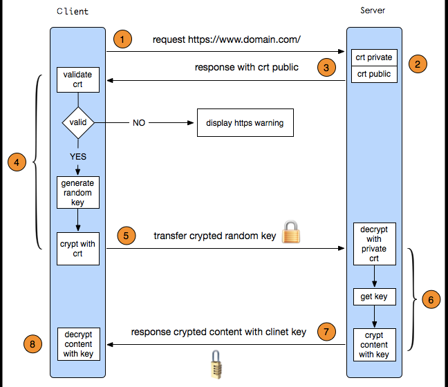
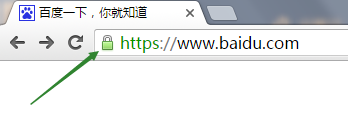
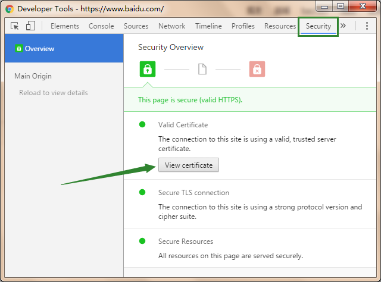
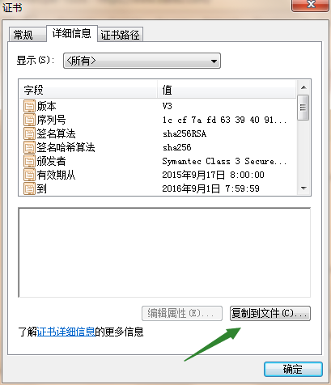
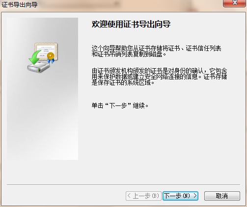
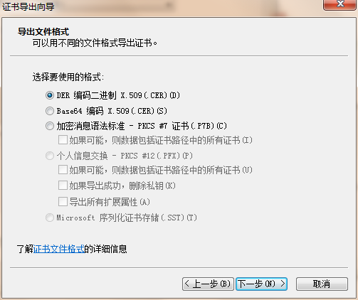
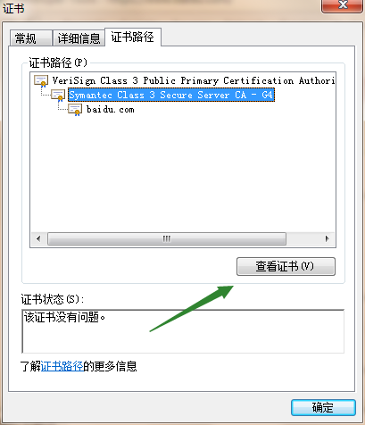
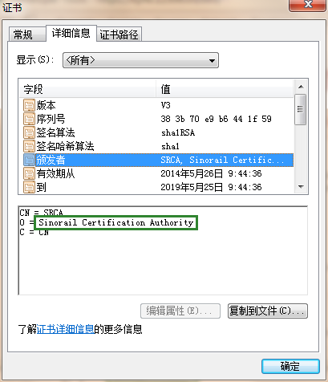
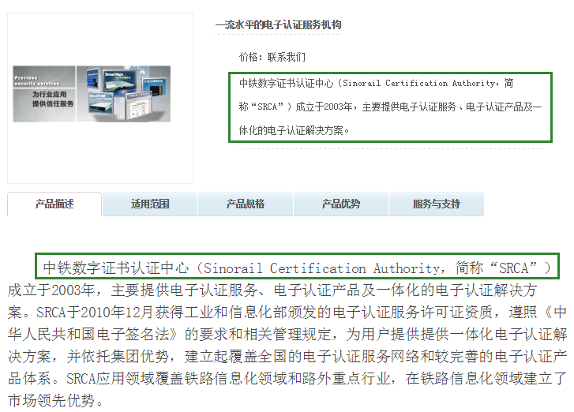

# HTTPS

### 目录

- - [密码学基础](#_6)
  - [HTTPS 通信过程](#HTTPS_35)
  - [数字证书](#_76)
  - [Android 中访问 HTTPS](#AndroidHTTPS_131)

我们知道，HTTP 请求都是明文传输的，所谓的明文指的是没有经过[加密](https://so.csdn.net/so/search?q=%E5%8A%A0%E5%AF%86&spm=1001.2101.3001.7020)的信息，如果 HTTP 请求被黑客拦截，并且里面含有银行卡密码等敏感数据的话，会非常危险。为了解决这个问题，Netscape 公司制定了 HTTPS 协议，HTTPS 可以将数据加密传输，也就是传输的是密文，即便黑客在传输过程中拦截到数据也无法破译，这就保证了网络通信的安全。

---

## 密码学基础

在正式讲解 HTTPS 协议之前，我们首先要知道一些密码学的知识。

明文： 明文指的是未被加密过的原始数据。

密文：明文被某种加密算法加密之后，会变成密文，从而确保原始数据的安全。密文也可以被解密，得到原始的明文。

密钥：密钥是一种参数，它是在明文转换为密文或将密文转换为明文的算法中输入的参数。密钥分为对称密钥与非对称密钥，分别应用在对称加密和非对称加密上。

对称加密：对称加密又叫做私钥加密，即信息的发送方和接收方使用同一个密钥去加密和解密数据。对称加密的特点是算法公开、加密和解密速度快，适合于对大数据量进行加密，常见的对称加密算法有 DES、3DES、TDEA、Blowfish、RC5 和 IDEA。  
其加密过程如下：明文 + 加密算法 + 私钥 => 密文  
解密过程如下：密文 + 解密算法 + 私钥 => 明文  
对称加密中用到的密钥叫做私钥，私钥表示个人私有的密钥，即该密钥不能被泄露。  
其加密过程中的私钥与解密过程中用到的私钥是同一个密钥，这也是称加密之所以称之为 “对称” 的原因。由于对称加密的算法是公开的，所以一旦私钥被泄露，那么密文就很容易被破解，所以对称加密的缺点是密钥安全管理困难。

非对称加密：非对称加密也叫做公钥加密。非对称加密与对称加密相比，其安全性更好。对称加密的通信双方使用相同的密钥，如果一方的密钥遭泄露，那么整个通信就会被破解。而非对称加密使用一对密钥，即公钥和私钥，且二者成对出现。私钥被自己保存，不能对外泄露。公钥指的是公共的密钥，任何人都可以获得该密钥。用公钥或私钥中的任何一个进行加密，用另一个进行解密。  
被公钥加密过的密文只能被私钥解密，过程如下：  
明文 + 加密算法 + 公钥 => 密文， 密文 + 解密算法 + 私钥 => 明文  
被私钥加密过的密文只能被公钥解密，过程如下：  
明文 + 加密算法 + 私钥 => 密文， 密文 + 解密算法 + 公钥 => 明文  
由于加密和解密使用了两个不同的密钥，这就是非对称加密 “非对称” 的原因。  
非对称加密的缺点是加密和解密花费时间长、速度慢，只适合对少量数据进行加密。  
在非对称加密中使用的主要算法有：RSA、Elgamal、Rabin、D-H、ECC（椭圆曲线加密算法）等。

---

## HTTPS 通信过程

HTTPS 协议 = HTTP 协议 + SSL/TLS 协议，在 HTTPS 数据传输的过程中，需要用 SSL/TLS 对数据进行加密和解密，需要用 HTTP 对加密后的数据进行传输，由此可以看出 HTTPS 是由 HTTP 和 SSL/TLS 一起合作完成的。

SSL 的全称是 Secure Sockets Layer，即安全套接层协议，是为网络通信提供安全及数据完整性的一种安全协议。SSL 协议在 1994 年被 Netscape 发明，后来各个浏览器均支持 SSL，其最新的版本是 3.0

TLS 的全称是 Transport Layer Security，即安全传输层协议，最新版本的 TLS（Transport Layer Security，传输层安全协议）是 IETF（Internet Engineering Task Force，Internet 工程任务组）制定的一种新的协议，它建立在 SSL 3.0 协议规范之上，是 SSL 3.0 的后续版本。在 TLS 与 SSL3.0 之间存在着显著的差别，主要是它们所支持的加密算法不同，所以 TLS 与 SSL3.0 不能互操作。虽然 TLS 与 SSL3.0 在加密算法上不同，但是在我们理解 HTTPS 的过程中，我们可以把 SSL 和 TLS 看做是同一个协议。

**HTTPS 为了兼顾安全与效率，同时使用了对称加密和非对称加密。数据是被对称加密传输的，对称加密过程需要客户端的一个密钥，为了确保能把该密钥安全传输到服务器端，采用非对称加密对该密钥进行加密传输，总的来说，对数据进行对称加密，对称加密所要使用的密钥通过非对称加密传输。**

以下图片来自于 [limboy 的博客](http://limboy.me/tech/2011/02/19/https-workflow.html)  


HTTPS 在传输的过程中会涉及到三个密钥：

- 服务器端的公钥和私钥，用来进行非对称加密
- 客户端生成的随机密钥，用来进行对称加密

一个 HTTPS 请求实际上包含了两次 HTTP 传输，可以细分为 8 步。

1.  客户端向服务器发起 HTTPS 请求，连接到服务器的 443 端口。
2.  服务器端有一个密钥对，即公钥和私钥，是用来进行非对称加密使用的，服务器端保存着私钥，不能将其泄露，公钥可以发送给任何人。
3.  服务器将自己的公钥发送给客户端。
4.  客户端收到服务器端的公钥之后，会对公钥进行检查，验证其合法性，如果发现发现公钥有问题，那么 HTTPS 传输就无法继续。严格的说，这里应该是验证服务器发送的数字证书的合法性，关于客户端如何验证数字证书的合法性，下文会进行说明。如果公钥合格，那么客户端会生成一个随机值，这个随机值就是用于进行对称加密的密钥，我们将该密钥称之为 client key，即客户端密钥，这样在概念上和服务器端的密钥容易进行区分。然后用服务器的公钥对客户端密钥进行非对称加密，这样客户端密钥就变成密文了，至此，HTTPS 中的第一次 HTTP 请求结束。
5.  客户端会发起 HTTPS 中的第二个 HTTP 请求，将加密之后的客户端密钥发送给服务器。
6.  服务器接收到客户端发来的密文之后，会用自己的私钥对其进行非对称解密，解密之后的明文就是客户端密钥，然后用客户端密钥对数据进行对称加密，这样数据就变成了密文。
7.  然后服务器将加密后的密文发送给客户端。
8.  客户端收到服务器发送来的密文，用客户端密钥对其进行对称解密，得到服务器发送的数据。这样 HTTPS 中的第二个 HTTP 请求结束，整个 HTTPS 传输完成。

---

## 数字证书

通过观察 HTTPS 的传输过程，我们知道，当服务器接收到客户端发来的请求时，会向客户端发送服务器自己的公钥，但是黑客有可能中途篡改公钥，将其改成黑客自己的，所以有个问题，客户端怎么信赖这个公钥是自己想要访问的服务器的公钥而不是黑客的呢？ 这时候就需要用到数字证书。

在讲数字证书之前，先说一个小例子。假设一个镇里面有两个人 A 和 B，A 是个富豪，B 想向 A 借钱，但是 A 和 B 不熟，怕 B 借了钱之后不还。这时候 B 找到了镇长，镇长给 B 作担保，告诉 A 说：“B 人品不错，不会欠钱不还的，你就放心借给他吧。" A 听了这话后，心里想：“镇长是全镇最德高望重的了，他说 B 没问题的话那就没事了，我就放心了”。 于是 A 相信 B 的为人，把钱借给了 B。

与此相似的，要想让客户端信赖公钥，公钥也要找一个担保人，而且这个担保人的身份必须德高望重，否则没有说服力。这个担保人的就是证书认证中心（Certificate Authority），简称 CA。 也就是说 CA 是专门对公钥进行认证，进行担保的，也就是专门给公钥做担保的担保公司。 全球知名的 CA 也就 100 多个，这些 CA 都是全球都认可的，比如 VeriSign、GlobalSign 等，国内知名的 CA 有 WoSign。

那 CA 怎么对公钥做担保认证呢？CA 本身也有一对公钥和私钥，CA 会用 CA 自己的私钥对要进行认证的公钥进行非对称加密，此处待认证的公钥就相当于是明文，加密完之后，得到的密文再加上证书的过期时间、颁发给、颁发者等信息，就组成了数字证书。

不论什么平台，设备的操作系统中都会内置 100 多个全球公认的 CA，说具体点就是设备中存储了这些知名 CA 的公钥。当客户端接收到服务器的数字证书的时候，会进行如下验证：

1.  首先客户端会用设备中内置的 CA 的公钥尝试解密数字证书，如果所有内置的 CA 的公钥都无法解密该数字证书，说明该数字证书不是由一个全球知名的 CA 签发的，这样客户端就无法信任该服务器的数字证书。
2.  如果有一个 CA 的公钥能够成功解密该数字证书，说明该数字证书就是由该 CA 的私钥签发的，因为被私钥加密的密文只能被与其成对的公钥解密。
3.  除此之外，还需要检查客户端当前访问的服务器的域名是与数字证书中提供的 “颁发给” 这一项吻合，还要检查数字证书是否过期等。

通过浏览器直接获取服务器的公钥很容易，各个浏览器操作大同小异。百度现在已经实现了全站点 HTTPS，我们就以百度为例如何从 Chrome 中获取其公钥。

1.  用 Chrome 打开百度首页，在 https 左侧我们会发现有一个绿色的锁头。  
    
2.  点击该锁头，出现一个弹出面板，点击面板中的 “详细信息” 几个字。  
    
3.  这是会打开 Chrome 的 Developer Tool，并自动切换到 Security 这个页面。  
    
4.  点击 “View ceertificate” 按钮就可以查看该网站的证书了，如下所示：  
    

在 “常规” 这个面板中，我们从中可以查看该证书是又 Symantec 颁发给 baidu.com 这个网站的，有效期是从 2015 年 9 月 17 到 2016 年 9 月 1 日。

5.  切换到 “详细信息” 面板，可以查看证书的一些详细信息，比如证书所使用的数字签名的算法，如下图所示：  
    

上面有个 “复制到文件” 的按钮，点击该按钮就可以将百度的数字证书导出成文件，从而我们就可以保存到自己的机器上，界面如下所示：





我们将其导出成 X.509 格式的证书，以. cer 作为文件扩展名，最后保存到本地机器如下所示：  


6.  切换到 “证书路径” 面板，可以查看证书的证书链。  
    

这里先解释一下什么是证书链。我们之前提到，VeriSign 是一个全球知名的 CA，但是一般情况下，CA 不会用自己的私钥去直接签名某网站的数字证书，一般 CA 会首先签发一种证书，然后用这种证书再去签发百度等的数字证书。在此例中，VeriSign 签发了 Symantec 证书，然后 Symantec 又签发了 baiduc.om，VeriSign 位于最顶端，类似于根结点，因此叫做根 CA，Symatec 位于中间，叫做中间 CA，当然，有可能有多个中间 CA，这样从根 CA 到中间 CA，再到最终的网站的证书，这样自上而下形成了一条证书链。如果想要查看证书链中的某个证书，只需要选中它，比如选中了 Symantec，然后点击下面的 “查看证书” 按钮就会弹出另一个对话框，在其中可以查看 Symantec 的数字证书，当然也可以将其导出成证书文件保存在硬盘上。

---

## Android 中访问 HTTPS

在 Android 中我们也会经常发送 HTTPS 请求，这时需要使用 HttpsURLConnection 这个类，HttpsURLConnection 是继承自 HttpURLConnection 的，其用法跟 HttpURLConnection 是一样的，比如我们想用 HTTPS 访问百度的首页，代码如下所示：

```
URL url = new URL("https://www.baidu.com");
HttpsURLConnection conn = (HttpsURLConnection)url.openConnection();
InputStream is = conn.getInputStream();
...
```

我们通过得到的 InputStream 就可以解析服务器的返回结果了。

如果对应服务器的数字证书存在问题，那么客户端就无法信任该证书，从而无法建立 HTTPS 链接，我们以国内的 12306.cn 网站为例进行说明。

12306.cn 的用户登录是需要 HTTPS 的访问的，如果浏览器第一次打开页面 https://kyfw.12306.cn/otn/regist/init，那么浏览器要么显示证书警告信息，要么索性直接不显示页面，因为 12306.cn 的数字证书存在问题。

其证书链如下所示：  


大家可以看到，该 12306.cn 的证书是由 SRCA 这个机构签发的，也就是说 SRCA 是证书链上的根 CA。

但是 SRCA 是啥呢？没听过啊！

我们选中 SRCA 后，点击 “查看证书” 按钮，SRCA 的证书如下所示：  


也就是说 SRCA 的全称是 Sinorail Certification Authority， 在百度里面搜索该名称，可以查到一个叫做中铁信息工程集团的网站，http://www.sinorail.com/ProductInfos.aspx?id=185，里面有这么一段描述：  


也就是说 SRCA 是铁道部给旗下的网站等做签名的一个所谓 CA，但是它不具备公信力，因为它不是一个全球知名的 CA，所以客户端根本不认可它。

我们在 Android 中直接访问 https://kyfw.12306.cn/otn/regist/init 时，会得到如下异常：  
java.security.cert.CertPathValidatorException: Trust anchor for certification path not found.

这是因为 Android 的客户端内置的可信任 CA 列表中没有包含所谓的 SRCA，这样就出现了 12306.cn 的证书不被客户端信任的异常。

为了解决客户端不信任服务器数字证书的问题，网络上大部分的解决方案都是让客户端不对证书做任何检查，**这是一种有很大安全漏洞的办法**，如下所示：  


首先定义一个自己的 SSLTrustAllManager，其继承自 X509TrustManager，具体来说，用 SSLTrustAllManager 创建一个 SSLContext，然后用 SSLContext 生成一个 SSLSocketFactory，然后通过调用 HttpURLConnectoin 的 setSSLSocketFactory 方法将其给某个具体的连接对象使用。由于 SSLTrustAllManager 没有对其中的三个核心方法进行具体实现，也就是不对证书做任何审查。这样无论服务器的证书如何，都能建立 HTTPS 连接，因为客户端直接忽略了验证服务器证书这一步。

**这样虽然能建立 HTTPS 连接，但是存在很大的安全漏洞。因为黑客有可能拦截到我们的 HTTPS 请求，然后黑客用自己的假证书冒充 12306.cn 的数字证书，由于客户端不对证书做验证，这样客户端就会和黑客的服务器建立连接，这样会导致客户端把自己的 12306 的账号和密码发送给了黑客，所以客户端不对证书做任何验证的做法有很大的安全漏洞。**

解决此问题的办法是让 Android 客户端信任 12306 的证书，而不是不对证书做任何检查。

我们通过上面提到的方法得到 12306 的证书 12306.cer，将其放到 assets 目录下，也就是将 12306.cer 打包到我们的 App 中，然后用如下代码访问 12306 的 HTTPS 站点。

```
class DownloadThread extends Thread{
        @Override
        public void run() {
            HttpsURLConnection conn = null;
            InputStream is = null;
            try {
                URL url = new URL("https://kyfw.12306.cn/otn/regist/init");
                conn = (HttpsURLConnection)url.openConnection();

                //创建X.509格式的CertificateFactory
                CertificateFactory cf = CertificateFactory.getInstance("X.509");
                //从asserts中获取证书的流
                InputStream cerInputStream = getAssets().open("12306.cer");//SRCA.cer
                //ca是java.security.cert.Certificate，不是java.security.Certificate，
                //也不是javax.security.cert.Certificate
                Certificate ca;
                try {
                    //证书工厂根据证书文件的流生成证书Certificate
                    ca = cf.generateCertificate(cerInputStream);
                    System.out.println("ca=" + ((X509Certificate) ca).getSubjectDN());
                } finally {
                    cerInputStream.close();
                }

                // 创建一个默认类型的KeyStore，存储我们信任的证书
                String keyStoreType = KeyStore.getDefaultType();
                KeyStore keyStore = KeyStore.getInstance(keyStoreType);
                keyStore.load(null, null);
                //将证书ca作为信任的证书放入到keyStore中
                keyStore.setCertificateEntry("ca", ca);

                //TrustManagerFactory是用于生成TrustManager的，我们创建一个默认类型的TrustManagerFactory
                String tmfAlgorithm = TrustManagerFactory.getDefaultAlgorithm();
                TrustManagerFactory tmf = TrustManagerFactory.getInstance(tmfAlgorithm);
                //用我们之前的keyStore实例初始化TrustManagerFactory，这样tmf就会信任keyStore中的证书
                tmf.init(keyStore);
                //通过tmf获取TrustManager数组，TrustManager也会信任keyStore中的证书
                TrustManager[] trustManagers = tmf.getTrustManagers();

                //创建TLS类型的SSLContext对象， that uses our TrustManager
                SSLContext sslContext = SSLContext.getInstance("TLS");
                //用上面得到的trustManagers初始化SSLContext，这样sslContext就会信任keyStore中的证书
                sslContext.init(null, trustManagers, null);

                //通过sslContext获取SSLSocketFactory对象
                SSLSocketFactory sslSocketFactory = sslContext.getSocketFactory();
                //将sslSocketFactory通过setSSLSocketFactory方法作用于HttpsURLConnection对象
                //这样conn对象就会信任我们之前得到的证书对象
                conn.setSSLSocketFactory(sslSocketFactory);

                is = conn.getInputStream();
                //将得到的InputStream转换为字符串
                final String str = getStringByInputStream(is);
                handler.post(new Runnable() {
                    @Override
                    public void run() {
                        textView.setText(str);
                        btn.setEnabled(true);
                    }
                });
            }catch (Exception e){
                e.printStackTrace();
                final String errMessage = e.getMessage();
                handler.post(new Runnable() {
                    @Override
                    public void run() {
                        btn.setEnabled(true);
                        Toast.makeText(MainActivity.this, errMessage, Toast.LENGTH_LONG).show();
                    }
                });
            }finally {
                if(conn != null){
                    conn.disconnect();
                }
            }
        }
```

上面的注释写的比较详细，此处我们还是对以上代码进行一下说明。

1.  首先从 asserts 目录中获取 12306.cer 证书的文件流，然后用 CertificateFactory 的 generateCertificate 方法将该文件流转化为一个证书对象 Certificate，该证书就是 12306 网站的数字证书。
2.  创建一个默认类型的 KeyStore 实例，keyStore 用于存储着我们信赖的数字证书，将 12306 的数字证书放入 keyStore 中。
3.  我们获取一个默认的 TrustManagerFactory 的实例，并用之前的 keyStore 初始化它，这样 TrustManagerFactory 的实例也会信任 keyStore 中 12306.cer 证书。通过 TrustManagerFactory 的 getTrustManagers 方法获取 TrustManager 数组，该数组中的 TrustManager 也会信任 12306.cer 证书。
4.  创建一个 TLS 类型的 SSLContext 实例，并用之前的 TrustManager 数组初始化 sslContext 实例，这样该 sslContext 实例也会信任 12306.cer 证书。
5.  通过 sslContext 获取 SSLSocketFactory 对象，将 sslSocketFactory 通过 setSSLSocketFactory 方法作用于 HttpsURLConnection 对象，这样 conn 对象就会信任 keyStore 中的 12306.cer 证书。这样一来，客户端就会信任 12306 的证书，从而正确建立 HTTPS 连接。

以上的处理过程是 Google 官方建议的流程，步骤流程总结如下：

证书文件流 InputStream -> Certificate -> KeyStore -> TrustManagerFactory -> TrustManager[] -> SSLContext -> SSLSocketFactory -> HttpsURLConnection

以上步骤的起点是获取证书文件的文件流，不一定非要从 assets 目录中获取，也可以通过其他途径得到，只要能拿到证书的文件流即可。

上面的过程是对的，但是还存在一点问题。我们将 12306 网站自身的 12306.cer 放到了 assets 目录中，然后让我们创建的 HttpsURLConnection 的实例信任了 12306.cer。但是，数字证书都是有过期时间的，如果 12306 网站的数字证书到期了，那么 12306 会去 SRCA 那里重新生成一个数字证书，这时候 12306 网站的公钥和私钥都会更新，那这样就存在问题了。我们 App 的 assets 目录中存储的是老的 12306.cer 证书，这样 12306 网站重新生成了新的数字证书，那么老的数字证书就自动作废了，因为我们 App 中的 12306.cer 中的老的公钥无法解密 12306 网站最新的私钥了（公钥和私钥只能成对出现，旧的公钥只能解密旧的私钥）。

很不幸的是，网上大部分的解决方案就是直接信任 12306.cer 这种网站自身的数字证书，虽然这种办法暂时可以解决 HTTPS 问题，但是不是长久之计，会为以后的数字证书的更新埋下隐患。

那怎么解决这个问题呢？

最好的办法不是让我们的 App 直接信任 12306.cer，而是让我们的 App 直接信任 12306 数字证书的签发者 SRCA 的数字证书。

我们用之前提到过的办法将 12306 的签发者 SRCA 的数字证书导出，取名 SRCA.cer，将其放到 assets 目录下，我们只需要改一行代码里面的参数即可，我们将代码：

```
InputStream cerInputStream = getAssets().open("12306.cer");
```

修成该

```
InputStream cerInputStream = getAssets().open("SRCA.cer");
```

也就是我们读取的是 SRCA.cer 证书的文件流，而不再是 12306.cer 的。

通过让 HttpsURLConnection 实例信任 SRCA.cer，也能够正常建立 HTTPS 连接，这是为什么呢？

我们之前提到了证书链的概念，假设存在如下证书链：  
CA -> A -> B -> C

CA 是根 CA 证书，例如 SRCA.cer，C 是最终的网站的数字证书，例如 12306.cer，A 和 B 都是中间证书，理论上来说，只要客户端信任了该数字证书链中的任何一个证书，那么 C 证书都会被信任。比如客户端信任了根证书 CA，由于 CA 信任 A，所以客户端也会信任 A，由于 A 信任 B，那么客户端也信任 B，由于 B 信任 C，那么客户端也信任 C。所以在 12306 的例子中，只要信任了 SRCA.cer，那么客户端就信任 12306 网站自身的 12306.cer 数字证书了。

Android 客户端不信任服务器证书的原因主要是因为客户端不信任证书链中的根证书 CA。12306 网站的自身的数字证书可能会过几年就会重新生成，发生变动，但是 SRCA 作为其签发者，发生变动的次数会少的多，或者说是很长时间内不会改动，所以我们的 App 去信任 SRCA.cer 比直接去信任 12306.cer 要更稳定一些。

---

总结：

1.  HTTPS 的传输过程涉及到了对称加密和非对称加密，对称加密加密的是实际的数据，非对称加密加密的是对称加密所需要的客户端的密钥。
2.  为了确保客户端能够确认公钥就是想要访问的网站的公钥，引入了数字证书的概念，由于证书存在一级一级的签发过程，所以就出现了证书链，在证书链中的顶端的就是根 CA。
3.  Android 客户端不信任服务器证书的原因主要是因为客户端不信任证书链中的根证书 CA，我们应该让我们的 App 去信任该根证书 CA，而不是直接信任网站的自身的数字证书，因为网站的数字证书可能会发生变化。

希望本身对大家有所帮助！

参考：  
[Limboy 的《图解 HTTPS》](http://limboy.me/tech/2011/02/19/https-workflow.html)  
[阮一峰的《数字签名是什么？》](http://www.ruanyifeng.com/blog/2011/08/what_is_a_digital_signature.html)  
[Google 官方的《Security with HTTPS and SSL》](https://developer.android.com/training/articles/security-ssl.html)

相关阅读：  
[我的 Android 博文整理汇总](http://blog.csdn.net/iispring/article/details/47690011)  
[Android 中 HttpURLConnection 使用详解](http://blog.csdn.net/iispring/article/details/51474529)
