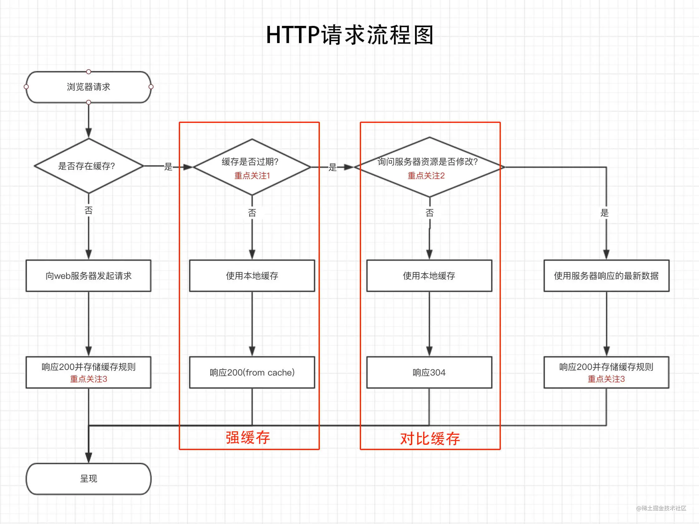
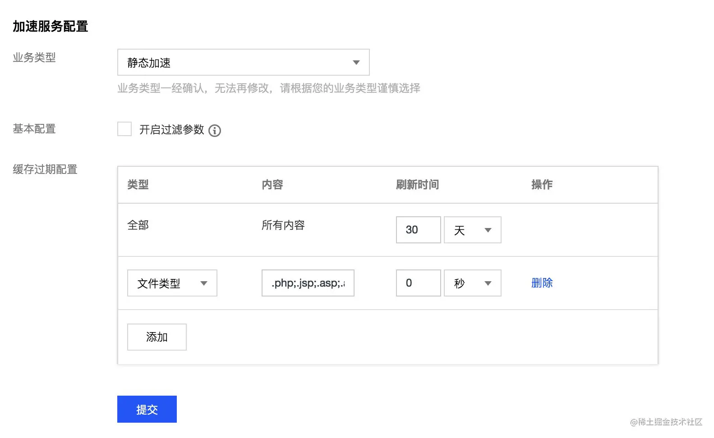
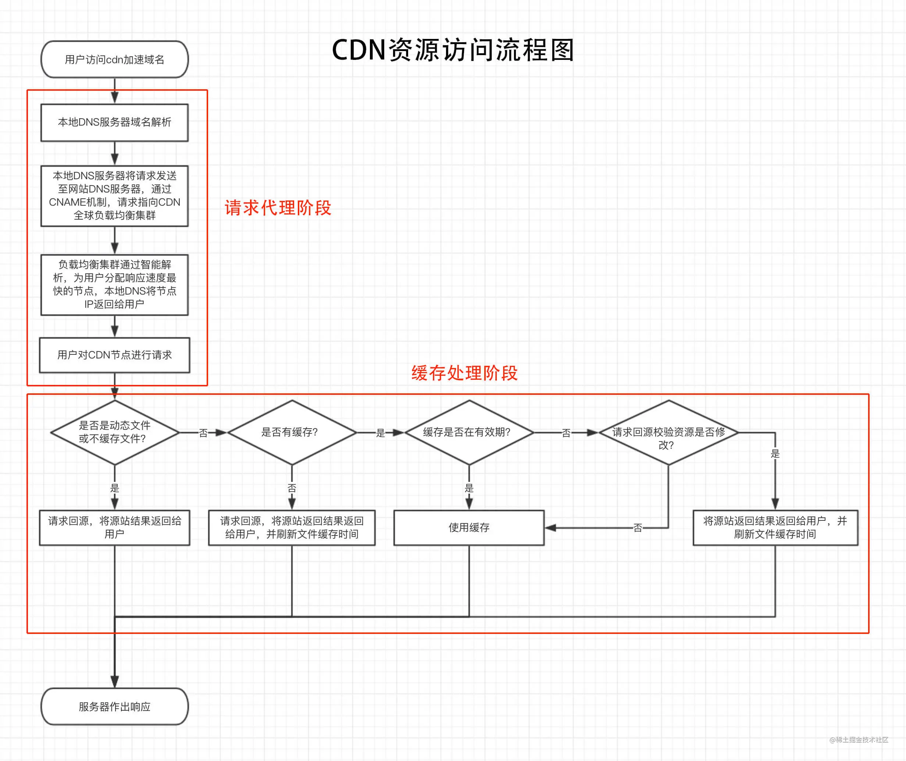
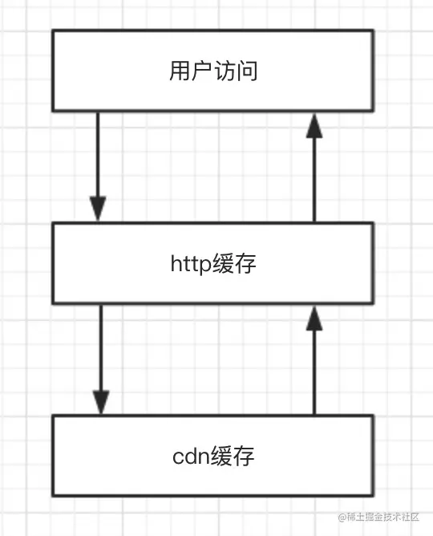

# http缓存与cdn缓存配置指南
>  
> 
> 配置 http 缓存与 cdn 缓存一直以来都是 web 性能优化中重要而常见的手段。合理的 http 缓存与 cdn 缓存配置可以起到减轻服务器压力，缓解网络瓶颈，提升用户体验等作用，不当的缓存配置却会导致资源无法及时更新，用户体验差异，甚至流程出错等问题。本文主要讲解 http 缓存与 cdn 缓存的原理和配置规则，希望通过本文的讲解能够让大家清楚什么是合理的缓存配置，如何为自己的项目定制化缓存方案，以及如果碰到缓存问题，应该如何分析解决。

首先，让我们来看这样一个场景

项目 A 上线了一个新特性，包含着逻辑的改动和页面 UI 的更新，小明作为项目开发将代码提交后进行了预发布。产品经理小红开始体验新特性，奇怪的是，小红进入项目后却并没有看到最新的特性，这时小明思考了一会说，小红你点击刷新再试试，果然，刷新后项目有了变化，新特性出来了，但是这时又有了新的问题，项目里的图片似乎还是旧图，小明又思考了一会，随后在电脑前捣鼓一番，让小红再次体验，终于，这个时候特性完整验收通过。上述的案例中，其实就包含着 http 缓存和 cdn 缓存的应用，当然，这是一个反面教材，实际上线过程中，我们不可能让每一个用户点击刷新来体验我们的新特性，那应该如何解决上述问题呢，接下来上干货。

**http 缓存**
-----------

### 简介

http 缓存是客户端缓存，浏览器作为客户端接受到服务端响应后，对于响应首部字段进行解析，分析出相应的缓存规则，将资源按规则进行缓存，再次请求时如果命中缓存则直接读取本地缓存不再发出请求。

### 缓存规则

http 缓存规则由响应首部字段进行控制，其中的关键字段有 **Expires**，**Cache-Control** ，**Last-Modified** ，**Etag** 四个字段，**Expires** 和 **Cache-Control** 用来确定确定缓存的存储时间，**Last-Modified** 和 **Etag** 则用来确定缓存是否要被更新，我们简单来看一下区别。

*   expires: HTTP1.0 中用来控制缓存时间的参数，响应头包含日期 / 时间， 即在此时间之后，响应过期。
*   cache-control: HTTP1.1 中用来控制缓存时间的参数
    *   public: 表明响应可以被任何对象（包括：发送请求的客户端，代理服务器，等等）缓存。
    *   private: 表明响应只能被单个用户缓存，不能作为共享缓存（即代理服务器不能缓存它）。
    *   max-age=`<seconds>`: 设置缓存存储的最大周期，相对于请求的时间缓存 seconds 秒，在此时间内，访问资源直接读取本地缓存，不向服务器发出请求。（与 expires 同时出现时，max-age 优先级更高）
    *   s-maxage=`<seconds>`: 规则等同 max-age，覆盖 max-age 或者 Expires 头，但是仅适用于共享缓存 (比如各个代理)，并且私有缓存中它被忽略。（与 expires 或 max-age 同时出现时，s-maxage 优先级更高）
    *   no-store: 不缓存服务器响应的任何内容，每次访问资源都需要服务器完整响应
    *   no-cache: 缓存资源，但立即过期，每次请求都需要跟服务器对比验证资源是否被修改。（等同于 max-age=0）
*   Last-modified: 源头服务器认定的资源做出修改的日期及时间。精确度比 Etag 低。包含有 If-Modified-Since 或 If-Unmodified-Since 首部的条件请求会使用这个字段。
*   Etag: HTTP 响应头是资源的特定版本的标识符。 

我们通过 chrome 控制台可以很轻松的找到一个案例：

图中配置

1.  cache-control: max-age=31535000 代表相对于请求时间，缓存 31536000 秒，即 365 天，在此时间内，再次访问资源直接读取本地缓存，不向服务器发送请求.
2.  last-modified: Mon... 上次修改时间，如果缓存时间过期，该字段将用于与请求中的 If-Modified-Since 字段进行对比，一致则继续使用之前缓存，不一致则认定缓存失效
3.  expires: 在 http1.0 版本下被 cache-control 覆盖，此处意为缓存至 Sat, 11 Aug ...

### 缓存流程

缓存规则在其中是如何起作用的呢，我们来看几个重点关注部分

重点关注 1: 缓存是否过期

基于该资源上次响应缓存规则同时满足下列条件则视为缓存未过期。需要注意的是，判断缓存是否过期只跟客户端有关系，与服务端无关。1&2&3 同时满足即认为缓存未过期，相反则是已过期

1.  cache-control 值为 max-age
2.  max-age > 0
3.  当前 date < 上次请求时的 date + max-age

注：expire 可同等转化为 cache-control=max-age 形式，不再赘述，s-maxage 与 maxage 规则相同，不再赘述

重点关注 2: 询问服务器资源是否修改

判断资源是否修改，需要客户端与服务器共同协作，客户端在首次拿到资源缓存后会存储 Etag（若有）和 Last-Modified（若有）, 在下次缓存过期时会将 Etag 写在请求头部中的 If-None-Match 中，将 Last-Modified 值写在请求头部中的 If-Modified-Since 中，服务端优先对 Etag 进行对比，然后再对比 Last-Modified，完全通过后即视为缓存没有修改，有一项不通过则认为资源已被修改，缓存失效

重点关注 3: 缓存规则

缓存规则主要由 cache-control 字段和 expires 字段体现，同时出现则以 cache-control 为准具体情况如下：

1.  cache-control=no-store 不缓存任何资源
2.  cache-control=no-cache 缓存但立即过期
3.  cache-control=max-age（s-maxage） = 0 缓存但立即过期（等同于 no-cache）
4.  cache-control=max-age（s-maxage）= seconds （seconds > 0）—— 基于请求时间缓存 seconds 秒
5.  cache-control = 其他 根据 http 标准，如果不携带任何关于缓存时常的标记，则缓存时间等于当前时间和 Last-Modified 时间的差值的 10%，等同于 cache-control=max-age=（date - Last-Modified）/ 10，通过 fiddler 抓包可看到英文原文：No explicit HTTP Cache Lifetime information was provided.Heuristic expiration policies suggest defaulting to: 10% of the delta between Last-Modified and Date.
6.  expires = 过去的时间或无效时间，缓存但立即过期，等同于 cache-control=no-cache
7.  expires = 未来的时间，缓存到对应时间

### 缓存配置

从上述规则和与流程图中我们可以看到，缓存规则的配置其实并不复杂，除开 Etag 和 Last-Modified 用于缓存对比（实际使用中只需要开启该功能即可），我们需要关注的其实只是 cache-control（expires 可转化为 max-age 形式，不再赘述），方案如下：

1.  cache-control: no-store：不缓存，每次访问都从服务下载所有资源。
2.  cache-control: no-cache 或 cache-control: max-age=0：对比缓存，缓存当前资源，但每次访问都需要跟服务器对比，检查资源是否被修改。
3.  cache-control: max-age=seconds //seconds > 0：强缓存，缓存当前资源，在一定时期内，再次请求资源直接读取本地缓存。

注：强缓存下资源也并非不可更新，例如 chrome 的 ctrl + f5 等同于直接触发方案 1，f5 或者 webview 的刷新键会直接触发方案 2，但都是基于客户端操作，不建议纳入实际项目考虑。

实际项目中，方案 1 的应用基本上看不到，对比方案 2 和方案 3，方案 1 没有任何优势。在方案 2 和方案 3 的选择中，我们会对资源作区分。

*   对于 img，css，js，fonts 等非 html 资源，我们可以直接考虑方案 3，并且 max-age 配置的时间可以尽可能久，类似于缓存规则案例中，cache-control: max-age=31535000 配置 365 天的缓存，需要注意的是，这样配置并不代表这些资源就一定一年不变，其根本原因在于目前前端构建工具在静态资源中都会加入戳的概念（例如，webpack 中的 [hash]，gulp 中的 gulp-rev），每次修改均会改变文件名或增加 query 参数，本质上改变了请求的地址，也就不存在缓存更新的问题。
*   对于 html 资源，我们建议根据项目的更新频度来确定采用哪套方案。html 作为前端资源的入口文件，一旦被强缓存，那么相关的 js，css，img 等均无法更新。对于高频维护的业务类项目，建议采用方案 2，或是方案 3 但 max-age 设置一个较小值，例如 3600，一小时过期。对于一些活动项目，上线后不会进行较大改动，建议采用方案 3，不过 max-age 也不要设置过大，否则一旦出现 bug 或是未知问题，用户无法及时更新。

除了以上考虑，有时候其他因素也会影响缓存的配置，例如 QQ 红包除夕活动，高并发大流量很容易给服务器带来极大挑战，这时我们作为前端开发，就可以采用方案 3 来避免用户多次进入带来的流量压力。

### 小结

对于 http 缓存的配置，我们始终要做到两点，一是清楚明白 http 缓存的原理与规则，二是明确缓存的配置不是一次性的，根据不同的情况配置不同的规则，才能够更好的发挥 http 缓存的价值。

cdn 缓存
------

cdn 缓存是一种服务端缓存，CDN 服务商将源站的资源缓存到遍布全国的高性能加速节点上，当用户访问相应的业务资源时，用户会被调度至最接近的节点最近的节点 ip 返回给用户，在 web 性能优化中，它主要起到了，缓解源站压力，优化不同用户的访问速度与体验的作用。

### 缓存规则

与 http 缓存规则不同的是，这个规则并不是规范性的，而是由 cdn 服务商来制定，我们以腾讯云举例，打开 cdn 加速服务配置，面板如下。

可以看到，提供给我们的配置项只有文件类型（或文件目录）和刷新时间，意义也很简单，针对不同文件类型，在 cdn 节点上缓存对应的时间。

### cdn 运作流程

由图我们可以看出，cdn 缓存的配置主要作用在缓存处理阶段，虽然配置项只有文件类型和缓存时间，但流程却并不简单，我们先来明确一个概念——回源，回源的意思就是返回源站，何为源站，就是我们自己的服务器，很多人误解接入 cdn 就是把资源放在了 cdn 上，其实不然，如图中所示，接入 cdn 后，我们的服务器就是源站，源站一般情况下只会在 cdn 节点没有资源或 cdn 资源失效时接收到 cdn 节点的请求，其他时间，源站并不会接收请求（当然，如果我们知道源站的地址，我们可以直接访问源站）。明确了回源的概念后，cdn 的流程就显得不那么复杂了，简单的理解就是，没有资源就去源站读取，有资源就直接发送给用户。与 http 缓存不同的是，cdn 中没有 no-cache（max-age=0）的情况，当我们设置缓存时间为 0 的时候，该类型文件就被认定为不缓存文件，就是所有请求直接转发源站，只有当缓存时间大于 0 且缓存过期的时候，才会与源站对比缓存是否被修改。

### 缓存配置

cdn 缓存配置并不麻烦，整体来说，建议和 http 缓存配置保持统一。需要特别注意的是，cdn 的缓存配置会受到 http 缓存配置的影响，而且各个 cdn 服务商并不完全一致，以腾讯云为例，在缓存配置的文档中特别有以下说明。

这会对我们有什么影响呢？

1.  如果我们 http 缓存设置 cache-control: max-age=600，即缓存 10 分钟，但 cdn 缓存配置中设置文件缓存时间为 1 小时，那么就会出现如下情况，文件被访问后第 12 分钟修改并上传到服务器，用户重新访问资源，响应码会是 304，对比缓存未修改，资源依然是旧的，一个小时后再次访问才能更新为最新资源
2.  如果不设置 cache-control 呢，在 http 缓存中我们说过，如果不设置 cache-control，那么会有默认的缓存时间，但在这里，cdn 服务商明确会在没有 cache-control 字段时主动帮我们添加 cache-control: max-age=600。

注：针对问题 1，也并非没有办法，当我们必须要在缓存期内修改文件，并且不向想影响用户体验，那么我们可以使用 cdn 服务商提供的强制更新缓存功能，主要注意的是，这里的强制更新是更新服务端缓存，http 缓存依然按照 http 头部规则进行自己的缓存处理，并不会受到影响。

### 小结

cdn 缓存的配置并不复杂， 复杂的情况在于 cdn 缓存配置会受到 http 缓存配置的影响，并且不同的 cdn 运营商对于这种影响的处理也都不一致，实际使用时，建议去对应的 cdn 服务商文档中找到对应的注意事项。

http 缓存与 cdn 缓存的结合
------------------

当我们分别理解了 http 缓存配置和 cdn 缓存配置后，我们还有一件事情，就是理解二者结合时，请求的流向问题

当用户访问我们的业务服务器时，首先进行的就是 http 缓存处理，如果 http 缓存通过校验，则直接响应给用户，如果未通过校验，则继续进行 cdn 缓存的处理，cdn 缓存处理完成后返回给客户端，由客户端进行 http 缓存规则存储并响应给用户。当我们分析缓存问题时，一定要将两个流程独立开来分析，现在来看开篇时的错误案例，很明显，第一个问题时由于 http 缓存配置不合理，导致用户必须进行强制刷新才能更新资源，第二个问题则是 cdn 缓存未及时更新造成的。

总结
--

http 缓存和 cdn 缓存分别作为客户端缓存和服务端缓存共同影响着我们的 web 请求流向，要想做好缓存配置，首先是清楚缓存的原理和配置规则，其次则是结合项目分析缓存级别，具体情况具体处理。
