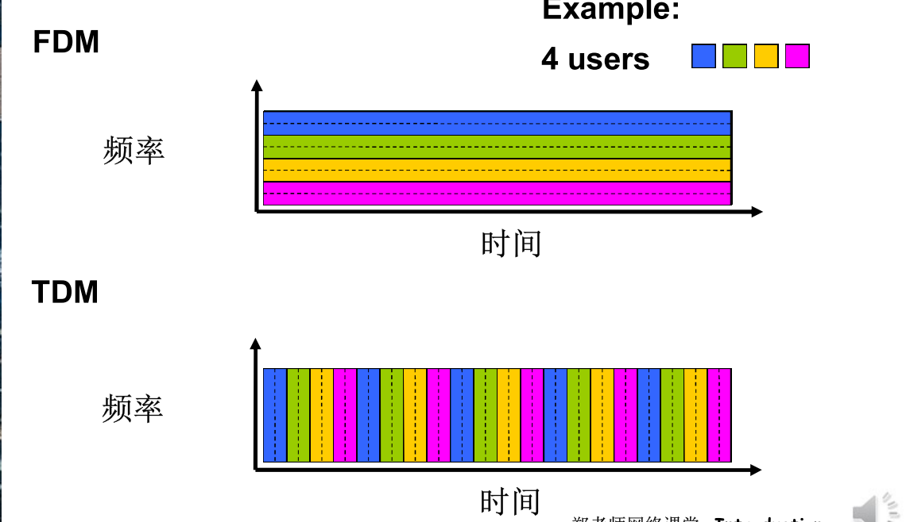

### 文章目录

- [1.1 什么是 Internet?](#11Internet_4)
- - [概念](#_6)
  - [internet 结构](#internet__14)
  - [网络结构](#_32)
- [1.2 网络边缘](#12_46)
- [1.3 网络核心： 数据交换的功能](#13__64)
- - [电路交换](#_72)
  - [分组交换](#_89)
  - [分组交换: 排队延迟和丢失](#__93)
  - [网络核心的关键功能](#_98)
  - [电路交换和分组交换的比较](#_101)
  - - [电路交换](#_103)
    - [分组交换](#_110)
  - [分类](#_114)
- [1.4 接入网和物理媒体](#14__116)
- - [住宅接入 ： modem](#__modem_126)
  - [接入网: digital subscriber line (DSL)](#_digital_subscriber_line_DSL_128)
- [1.5 互联网络结构：网络的网络 & ISP](#15_____ISP_132)
- - [网络的网络](#_153)
- [ISP](#ISP_155)
- [1.6 分组延时、丢失和吞吐量](#16__165)
- - [四种分组延时](#_168)
  - [节点延时](#_179)
  - [分组丢失](#_199)
  - [吞吐量](#_202)
- [1.7 协议层次及服务模型 （重要）](#17___211)
- - [俩个栗子](#_216)
  - [服务和服务访问点](#_223)
  - [服务与协议的区别](#_228)
  - [分层处理的好处](#_238)
  - [协议栈](#_240)
  - [1.8 历史](#18_250)
  - 

    ==**🌹 感谢阅读 🌹**==

> 学习推荐 ： [中科大计算机网络自顶向下](https://www.bilibili.com/video/BV1JV411t7ow/?p=2&vd_source=088a4df2b5756b8a98b819dab3a53174)  
> 

# 1.1 什么是 Internet?

- 公共英特网 ： 作为讨论计算机网络及其协议的主要载体 (由软件和硬件构成 、 能够根据为分布式应用提供服务的联网基础设施来描述英特网)

## 概念

- 设备 : 和互联网连接的设备 ，称为**主机** or **端系统 (end system)**
- 端系统通过**通信链路**和**分组交换机**连接在一起.
- 链路的传输 为 bit /s or bps
- 发送数据形成的信息包称为分组
- 分组交换机从它的一条入通信链路接受到达的分组，并从它的一条出通信链路转发该分组
- 分组交换器 和 路由器都是交换器 ，他们共同从 发送段系统到接收端系统。
- 英特网提供商 ISP

## internet 结构

-  节点
  -  主机及其上运行的应用程序
  -  路由器、交换机等网络交换设备
-  边：通信链路
  -  接入网链路：主机连接到互联网的链路
  -  主干链路：路由器间的链路
-  网络协议:
  -  类似人类协议
  -  机器之间的协议而非人 与人之间的协议
  -  Internet 中所有的通信 行为都受协议制约
  - 协议定义了在两个或多 个通信实体之间交换的 报文格式和次序，以及 在报文传输和 / 或接收或 其他事件方面所采取的 动作

- 服务角度
  -  使用通信设施进行通信的分布式应用
  -  通信基础设施为 apps 提供编程接口（通信服务）

## 网络结构

-  网络边缘：
  -  主机
  -  应用程序（客户端和服务 器）
-  网络核心：
  -  互连着的路由器
  -  网络的网络
-  接入网、物理媒体：
  -  有线或者无线通信链路  
    

# 1.2 网络边缘

- access : 接入 core ： 网络核心 edge 网络边缘
- 边缘通过接入接入到核心 ， 核心把所有边缘节点接在一起, 使得任意俩个端系统之间相互的通行。  
  
- 整个网络核心最重要的部分： 数据交换
- 下图为应用进程之间通行的模式  
  
- CS 模式 ： 主机多 ，集中式 、损失很大 ， 可扩展性差， 请求载荷增加， 能力下降 ， 到阈值处，会达到断崖式下降
- [P2P](https://so.csdn.net/so/search?q=P2P&spm=1001.2101.3001.7020)：分布式 ， 解决服务器的扩容总满足不了用户请求的需求 eg 文件分发系统（迅雷）  
    
  

# 1.3 网络核心： 数据交换的功能

-  网络核心：路由器的网状网络
-  基本问题：数据怎样通过网络进行 传输？
-  电路交换：为每个呼叫预留一条 专有电路：如电话网
-  分组交换：
  -  将要传送的数据分成一个个单位： 分组
  -  将分组从一个路由器传到相邻路由 器（hop），一段段最终从源端传 到目标端
  -  每段：采用链路的最大传输能力（ 带宽）

## 电路交换

- 为呼叫预留端 - 端资源
  -  链路带宽、交换能力
  -  专用资源：不共享
  -  保证性能
  -  要求建立呼叫连接
- 网络资源（如带宽）被 分成片  
   为呼叫分配片  如果某个呼叫没有数据， 则其资源片处于空闲状态 （不共享 )

- TDM 波分
- TDM 时分
- 电路交换 不适用于计算机之间的通信  计算机之间的通信有突发性，如果使用线路交 换，则浪费的片较多  即使这个呼叫没有数据传递，其所占据的片也不能 够被别的呼叫使用

## 分组交换

  

## 分组交换: 排队延迟和丢失

-  如果到达速率 > 链路的输出速率:
  -  分组将会排队，等待传输
  -  如果路由器的缓存用完了，分组将会被抛弃 （丢包）

## 网络核心的关键功能

- 路由: 决定分组采用的源到 目标的路径  路由算法
- 转发: 将分组从路由器的输 入链路转移到输出链路

## 电路交换和分组交换的比较

- 同样的网络资源，分组交换允许更多用户使用网络！

### 电路交换

-  适合于对突发式数据传输
  -  资源共享
  -  简单，不必建立呼叫
-  过度使用会造成网络拥塞：分组延时和丢失
-  对可靠地数据传输需要协议来约束：拥塞控制
-  Q: 怎样提供类似电路交换的服务？  保证音频 / 视频应用需要的带宽  一个仍未解决的问题 (chapter 7)

### 分组交换

分组交换: 分组的存储转发一段一段从源端传到目标端 ，按照有无网络层的连接，分成：

1.  数据报网络：  分组的目标地址决定下一跳  在不同的阶段，路由可以改变  类似：问路  Internent
2.  虚电路网络：  每个分组都带标签（虚电路标识 VC ID），标签决定下一跳  在呼叫建立时决定路径，在整个呼叫中路径保持不变  路由器维持每个呼叫的状态信息

## 分类

# 1.4 接入网和物理媒体

- Q: 怎样将端系统和边缘路由器连接?  
   住宅接入网络  单位接入网络（学校、公 司）  
   无线接入网络  
  注意：  
   接入网络的带宽 (bits per second) ？  
   共享 / 专用？

## 住宅接入 ： modem

## 接入网: digital subscriber line (DSL)

# 1.5 互联网络结构：网络的网络 & ISP

- 端系统通过接入 ISPs (Internet Service Providers) 连 接到互联网

  - • 住宅，公司和大学的 ISPs

-  接入 ISPs 相应的必须是互联的

  -  因此任何 2 个端系统可相互发送分组到对方

-  导致的 “网络的网络” 非常复杂

  - • 发展和演化是通过经济的和国家的政策来驱动的

- **问题: 给定数百万接入 ISPs，如何将它们互联到一起 ??**
- N \* （N - 1） == O (N2)  
  
- 所以就有了 全局 ISP (如果 联通 移动 电信)
- 

- 内容提供商网络 (Internet Content Providers,) eg :Google, Microsoft, Akamai ，baidu 可能会构建它们自己的网络，将它们的服务、内容更 加靠近端用户，向用户提供更好的服务, 减少自己的运营支出  
  
- 优点 ： 付费小， 用户体验更快

## 网络的网络

# ISP

-  松散的层次模型  
   **中心：第一层 ISP**（\*\*\*\* 如 UUNet, BBN/Genuity, Sprint, AT&T）国家 / 国际覆盖，速率极高  直接与其他第一层 ISP 相连  与大量的第二层 ISP 和其他客户网络相连

 **第二层 ISP**: 更小些的 (通常是区域性的) ISP  与一个或多个第一层 ISPs，也可能与其他第二层 ISP

- 一个分组要经过许多网络

# 1.6 分组延时、丢失和吞吐量

## 四种分组延时

- 分组传输延迟  
    
  
- 传播延时 如果长度小 几乎可以忽略不计

  

## 节点延时

  

- **33:34 （1.6）**  
  
- TTL ： time to live 

-  在 Windows 系统下  Tracerert hostname  如 Tracerert www.gucas.ac.cn  
   更完整的例子  
   `tracert [-d] [-h maximum_hops] [-j computer-list] [-w timeout] target_name`  
   请见帮助：  
  `http://www.linkwan.com/gb/broadmeter/article/trace -help.htm`  
   测试网址：  www.traceroute.org  www.linkwan.com

## 分组丢失

## 吞吐量

  
  

# 1.7 协议层次及服务模型 （重要）

- 网络是一个复杂的系统!
- 问题是： 如何组织和实现这个复 杂的网络功能?

## 俩个栗子

## 服务和服务访问点

  

## 服务与协议的区别

- 服务 垂直关系
- 协议 水平关系  
  
- SAP 服务访问点 用于区分不同的上层用户  
    
    
  

## 分层处理的好处

## 协议栈

  

## 1.8 历史

