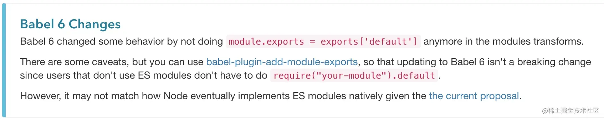
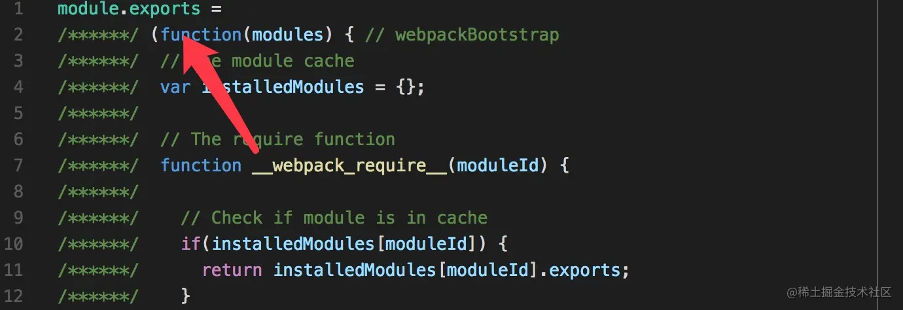

# import、require、export、module.exports 混合使用详解

## 前言

自从使用了 es6 的模块系统后，各种地方愉快地使用 `import` `export default`，但也会在老项目中看到使用 commonjs 规范的 `require` `module.exports`。甚至有时候也会常常看到两者互用的场景。使用没有问题，但其中的关联与区别不得其解，使用起来也糊里糊涂。比如：

1.  为何有的地方使用 `require` 去引用一个模块时需要加上 `default`？ `require('xx').default`
2.  经常在各大 UI 组件引用的文档上会看到说明 `import { button } from 'xx-ui'` 这样会引入所有组件内容，需要添加额外的 babel 配置，比如 `babel-plugin-component`？
3.  为什么可以使用 es6 的 import 去引用 commonjs 规范定义的模块，或者反过来也可以又是为什么？
4.  我们在浏览一些 npm 下载下来的 UI 组件模块时（比如说 element-ui 的 lib 文件下），看到的都是 webpack 编译好的 js 文件，可以使用 import 或 require 再去引用。但是我们平时编译好的 js 是无法再被其他模块 import 的，这是为什么？
5.  babel 在模块化的场景中充当了什么角色？以及 webpack ？哪个启到了关键作用？
6.  听说 es6 还有 `tree-shaking` 功能，怎么才能使用这个功能？

如果你对这些问题都了然于心，那么可以关掉本文了，如果有疑问，这篇文章就是为你准备的！

## webpack 与 babel 在模块化中的作用

### webpack 模块化的原理

webpack 本身维护了一套模块系统，这套模块系统兼容了所有前端历史进程下的模块规范，包括 `amd` `commonjs` `es6` 等，本文主要针对 `commonjs es6` 规范进行说明。模块化的实现其实就在最后编译的文件内。

我编写了一个 demo 更好的展示效果。

```js
// webpack

const path = require("path");

module.exports = {
  entry: "./a.js",
  output: {
    path: path.resolve(__dirname, "dist"),
    filename: "bundle.js",
  },
};
```

```js
// a.js
import a from "./c";

export default "a.js";
console.log(a);
```

```js
// c.js

export default 333;
```

```js
(function (modules) {
  function __webpack_require__(moduleId) {
    var module = {
      i: moduleId,
      l: false,
      exports: {},
    };
    modules[moduleId].call(
      module.exports,
      module,
      module.exports,
      __webpack_require__
    );
    return module.exports;
  }

  return __webpack_require__(0);
})([
  function (module, __webpack_exports__, __webpack_require__) {
    // 引用 模块 1
    "use strict";
    Object.defineProperty(__webpack_exports__, "__esModule", { value: true });
    /* harmony import */ var __WEBPACK_IMPORTED_MODULE_0__c__ =
      __webpack_require__(1);

    /* harmony default export */ __webpack_exports__["default"] = "a.js";
    console.log(__WEBPACK_IMPORTED_MODULE_0__c__["a" /* default */]);
  },
  function (module, __webpack_exports__, __webpack_require__) {
    // 输出本模块的数据
    "use strict";
    /* harmony default export */ __webpack_exports__["a"] = 333;
  },
]);
```

上面这段 js 就是使用 webpack 编译后的代码（经过精简），其中就包含了 webpack 的运行时代码，其中就是关于模块的实现。

我们再精简下代码，会发现这是个自执行函数。

```js
(function (modules) {})([]);
```

自执行函数的入参是个数组，这个数组包含了所有的模块，包裹在函数中。

自执行函数体里的逻辑就是处理模块的逻辑。关键在于 `__webpack_require__` 函数，这个函数就是 `require` 或者是 `import` 的替代，我们可以看到在函数体内先定义了这个函数，然后调用了他。这里会传入一个 `moduleId`，这个例子中是 0，也就是我们的入口模块 `a.js` 的内容。

我们再看 `__webpack_require__` 内执行了

```js
modules[moduleId].call(module.exports, module, module.exports, __webpack_require__);
return module.exports；
```

即从入参的 modules 数组中取第一个函数进行调用，并入参

- module
- module.exports
- **webpack_require**

我们再看第一个函数（即入口模块）的逻辑（精简）：

```js
function (module, __webpack_exports__, __webpack_require__) {

/* harmony import */ var __WEBPACK_IMPORTED_MODULE_0__c__ = __webpack_require__(1);

    /* harmony default export */ __webpack_exports__["default"] = ('a.js');
    console.log(__WEBPACK_IMPORTED_MODULE_0__c__["a" /* default */]);

  }
```

我们可以看到入口模块又调用了 `__webpack_require__(1)` 去引用入参数组里的第 2 个函数。

然后会将入参的 `__webpack_exports__` 对象添加 `default` 属性，并赋值。

这里我们就能看到模块化的实现原理，这里的 `__webpack_exports__` 就是这个模块的 `module.exports` 通过对象的引用传参，间接的给 module.exports 添加属性。

最后会将 module.exports return 出来。就完成了 `__webpack_require__` 函数的使命。

比如在入口模块中又调用了 `__webpack_require__(1)`，就会得到这个模块返回的 `module.exports`。

** 但在这个自执行函数的底部，`webpack` 会将入口模块的输出也进行返回 **

```js
return __webpack_require__(0);
```

目前这种编译后的 js，将入口模块的输出（即 `module.exports`） 进行输出没有任何作用，只会作用于当前作用域。这个 js 并不能被其他模块继续以 `require` 或 `import` 的方式引用。

### babel 的作用

按理说 webpack 的模块化方案已经很好的将 es6 模块化转换成 webpack 的模块化，但是其余的 es6 语法还需要做兼容性处理。babel 专门用于处理 es6 转换 es5。当然这也包括 es6 的模块语法的转换。

**其实两者的转换思路差不多，区别在于 webpack 的原生转换 可以多做一步静态分析，使用 tree-shaking 技术（下面会讲到）**

> babel 能提前将 es6 的 import 等模块关键字转换成 commonjs 的规范。这样 webpack 就无需再做处理，直接使用 webpack 运行时定义的 `__webpack_require__` 处理。

这里就解释了 **问题 5**。

> babel 在模块化的场景中充当了什么角色？以及 webpack ？哪个启到了关键作用？

那么 babel 是如何转换 es6 的模块语法呢？

#### 导出模块

es6 的导出模块写法有

```js
export default 123;

export const a = 123;

const b = 3;
const c = 4;
export { b, c };
```

babel 会将这些统统转换成 commonjs 的 exports。

```js
exports.default = 123;
exports.a = 123;
exports.b = 3;
exports.c = 4;
exports.__esModule = true;
```

babel 转换 es6 的模块输出逻辑非常简单，即将所有输出都赋值给 exports，并带上一个标志 `__esModule` 表明这是个由 es6 转换来的 commonjs 输出。

babel 将模块的导出转换为 commonjs 规范后，也会将引入 import 也转换为 commonjs 规范。即采用 require 去引用模块，再加以一定的处理，符合 es6 的使用意图。

#### 引入 default

对于最常见的

```js
import a from "./a.js";
```

在 es6 中 import a from './a.js' 的本意是想去引入一个 es6 模块中的 default 输出。

通过 babel 转换后得到 `var a = require(./a.js)` 得到的对象却是整个对象，肯定不是 es6 语句的本意，所以需要对 a 做些改变。

我们在导出提到，default 输出会赋值给导出对象的 default 属性。

```js
exports.default = 123;
```

所以 babel 加了个 help `_interopRequireDefault` 函数。

```js
function _interopRequireDefault(obj) {
  return obj && obj.__esModule ? obj : { default: obj };
}

var _a = require("assert");
var _a2 = _interopRequireDefault(_a);

var a = _a2["default"];
```

所以这里最后的 a 变量就是 require 的值的 default 属性。如果原先就是 commonjs 规范的模块，那么就是那个模块的导出对象。

#### 引入 \* 通配符

我们使用 `import * as a from './a.js'` es6 语法的本意是想将 es6 模块的所有命名输出以及 defalut 输出打包成一个对象赋值给 a 变量。

已知以 commonjs 规范导出：

```js
exports.default = 123;
exports.a = 123;
exports.b = 3;
exports.__esModule = true;
```

那么对于 es6 转换来的输出通过 `var a = require('./a.js')` 导入这个对象就已经符合意图。

所以直接返回这个对象。

```js
if (obj && obj.__esModule) {
  return obj;
}
```

如果本来就是 commonjs 规范的模块，导出时没有 default 属性，需要添加一个 default 属性，并把整个模块对象再次赋值给 default 属性。

```js
function _interopRequireWildcard(obj) {
  if (obj && obj.__esModule) {
    return obj;
  } else {
    var newObj = {}; // (A)
    if (obj != null) {
      for (var key in obj) {
        if (Object.prototype.hasOwnProperty.call(obj, key))
          newObj[key] = obj[key];
      }
    }
    newObj.default = obj;
    return newObj;
  }
}
```

#### import {a} from './a.js'

直接转换成 `require('./a.js').a` 即可。

#### 总结

经过上面的转换分析，我们得知即使我们使用了 es6 的模块系统，如果借助 babel 的转换，es6 的模块系统最终还是会转换成 commonjs 的规范。所以我们如果是使用 babel 转换 es6 模块，混合使用 es6 的模块和 commonjs 的规范是没有问题的，因为最终都会转换成 commonjs。

**这里解释了问题 3**

> 为什么可以使用 es6 的 import 去引用 commonjs 规范定义的模块，或者反过来也可以又是为什么？

### babel5 & babel6

我们在上文 babel 对导出模块的转换提到，es6 的 `export default` 都会被转换成 `exports.default`，即使这个模块只有这一个输出。

**这也解释了问题 1**

> 为何有的地方使用 `require` 去引用一个模块时需要加上 `default`？ `require('xx').default`

我们经常会使用 es6 的 export default 来输出模块，而且这个输出是这个模块的唯一输出，我们会误以为这种写法输出的是模块的默认输出。

```js
// a.js

export default 123;
```

```js
// b.js 错误

var foo = require("./a.js");
```

在使用 `require` 进行引用时，我们也会误以为引入的是 a 文件的默认输出。

结果这里需要改成 `var foo = require('./a.js').default`

这个场景在写 webpack 代码分割逻辑时经常会遇到。

```js
require.ensure([], (require) => {
  callback(null, [require("./src/pages/profitList").default]);
});
```

这是 babel6 的变更，在 babel5 的时候可不是这样的。



[babeljs.io/docs/plugin…](https://link.juejin.cn?target=http%3A%2F%2Fbabeljs.io%2Fdocs%2Fplugins%2Ftransform-es2015-modules-commonjs%2F%23strict "http://babeljs.io/docs/plugins/transform-es2015-modules-commonjs/#strict")

在 babel5 时代，大部分人在用 require 去引用 es6 输出的 default，只是把 default 输出看作是一个模块的默认输出，所以 babel5 对这个逻辑做了 hack，如果一个 es6 模块只有一个 default 输出，那么在转换成 commonjs 的时候也一起赋值给 `module.exports`，即整个导出对象被赋值了 default 所对应的值。

这样就不需要加 default，`require('./a.js')` 的值就是想要的 default 值。

但这样做是不符合 es6 的定义的，在 es6 的定义里，default 只是个名字，没有任何意义。

```js
export default = 123;
export const a = 123;
```

这两者含义是一样的，分别为输出名为 default 和 a 的变量。

还有一个很重要的问题，一旦 a.js 文件里又添加了一个具名的输出，那么引入方就会出麻烦。

```js
// a.js

export default 123;

export const a = 123; // 新增
```

```js
// b.js

var foo = require("./a.js");

// 由之前的 输出 123
// 变成 { default: 123, a: 123 }
```

所以 babel6 去掉了这个 hack，这是个正确的决定，升级 babel6 后产生的不兼容问题 可以通过引入 [babel-plugin-add-module-exports](https://link.juejin.cn?target=https%3A%2F%2Fwww.npmjs.com%2Fpackage%2Fbabel-plugin-add-module-exports "https://www.npmjs.com/package/babel-plugin-add-module-exports") 解决。

## webpack 编译后的 js，如何再被其他模块引用

通过 webpack 模块化原理章节给出的 webpack 配置编译后的 js 是无法被其他模块引用的，webpack 提供了 `output.libraryTarget` 配置指定构建完的 js 的用途。

### 默认 var

如果指定了 `output.library = 'test'` 入口模块返回的 module.exports 暴露给全局 var test = returned_module_exports

### commonjs

如果 library: 'spon-ui' 入口模块返回的 module.exports 赋值给 exports['spon-ui']

### commonjs2

入口模块返回的 module.exports 赋值给 module.exports

所以 element-ui 的构建方式采用 commonjs2 ，导出的组件的 js 最后都会赋值给 module.exports，供其他模块引用。



**这里解释了问题 4**

> 我们在浏览一些 npm 下载下来的 UI 组件模块时（比如说 element-ui 的 lib 文件下），看到的都是 webpack 编译好的 js 文件，可以使用 import 或 require 再去引用。但是我们平时编译好的 js 是无法再被其他模块 import 的，这是为什么？

## 模块依赖的优化

### 按需加载的原理

我们在使用各大 UI 组件库时都会被介绍到为了避免引入全部文件，请使用 `babel-plugin-component` 等 babel 插件。

```js
import { Button, Select } from "element-ui";
```

由前文可知 import 会先转换为 commonjs， 即

```js
var a = require("element-ui");
var Button = a.Button;
var Select = a.Select;
```

`var a = require('element-ui');` 这个过程就会将所有组件都引入进来了。

所以 `babel-plugin-component`就做了一件事，将 `import { Button, Select } from 'element-ui'` 转换成了

```js
import Button from "element-ui/lib/button";
import Select from "element-ui/lib/select";
```

即使转换成了 commonjs 规范，也只是引入自己这个组件的 js，将引入量减少到最低。

所以我们会看到几乎所有的 UI 组件库的目录形式都是

```js
|-lib
||--component1
||--component2
||--component3
|-index.common.js
```

`index.common.js` 给 `import element from 'element-ui'` 这种形式调用全部组件。

lib 下的各组件用于按需引用。

**这里解释了问题 2**

> 经常在各大 UI 组件引用的文档上会看到说明 `import { button } from 'xx-ui'` 这样会引入所有组件内容，需要添加额外的 babel 配置，比如 `babel-plugin-component`？

### tree-shaking

webpack2 开始引入 tree-shaking 技术，通过静态分析 es6 的语法，可以删除没有被使用的模块。他只对 es6 的模块有效，所以一旦 babel 将 es6 的模块转换成 commonjs，webpack2 将无法使用这项优化。所以要使用这项技术，我们只能使用 webpack 的模块处理，加上 babel 的 es6 转换能力（需要关闭模块转换）。

最方便的使用方法为修改 babel 的配置。

```js
use: {
     loader: 'babel-loader',
     options: {
       presets: [['babel-preset-es2015', {modules: false}]],
     }
   }
```

修改最开始 demo

```js
// webpack

const path = require("path");

module.exports = {
  entry: "./a.js",
  output: {
    path: path.resolve(__dirname, "dist"),
    filename: "bundle.js",
  },
  module: {
    rules: [
      {
        test: /\.js$/,
        exclude: /(node_modules|bower_components)/,
        use: {
          loader: "babel-loader",
          options: {
            presets: [["babel-preset-es2015", { modules: false }]],
          },
        },
      },
    ],
  },
};
```

```js
// a.js
import a from "./c";

export default "a.js";
console.log(a);
```

```js
// c.js

export default 333;

const foo = 123;
export { foo };
```

修改的点在于增加了 babel，并关闭其 modules 功能。然后在 c.js 中增加一个输出 `export { foo }`，但是 a.js 中并不引用它。

最后在编译出的 js 中，c.js 模块如下:

```js
"use strict";
/* unused harmony export foo */
/* harmony default export */ __webpack_exports__["a"] = 333;

var foo = 123;
```

foo 变量被标记为没有使用，在最后压缩时这段会被删除。

需要说明的是，即使在 引入模块时使用了 es6 ，但是引入的那个模块却是使用 commonjs 进行输出，这也无法使用 tree-shaking。

而第三方库大多是遵循 commonjs 规范的，这也造成了引入第三方库无法减少不必要的引入。

所以对于未来来说第三方库要同时发布 commonjs 格式和 es6 格式的模块。es6 模块的入口由 package.json 的字段 module 指定。而 commonjs 则还是在 main 字段指定。
