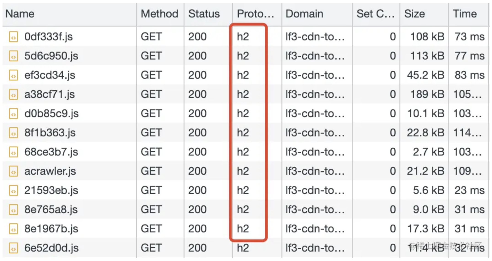

# 性能优化

我们把性能优化的方向分为以下两个方面，有助于结构化的思考与系统分析。

1.  加载性能。如何更快地把资源从服务器中拉到浏览器，如 http 与资源体积的各种优化，都是旨在加载性能的提升。
2.  渲染性能。如何更快的把资源在浏览器上进行渲染。如减少重排重绘，rIC 等都是旨在渲染性能的提升。

# 核心性能指标与 Performance API


- LCP: 加载性能。最大内容绘制应在 2.5s 内完成。
- FID: 交互性能。首次输入延迟应在 100ms 内完成。
- CLS: 页面稳定性。累积布局偏移，需手动计算，CLS 应保持在 0.1 以下。

## 计算与收集

- [web-vitals](https://link.juejin.cn?target=https%3A%2F%2Fweb.dev%2Fvitals%2F "https://web.dev/vitals/")

当收集浏览器端每个用户核心性能指标时，可通过 `web-vitals` 收集并通过 [sendBeacon](https://link.juejin.cn?target=https%3A%2F%2Fdeveloper.mozilla.org%2Fzh-CN%2Fdocs%2FWeb%2FAPI%2FNavigator%2FsendBeacon "https://developer.mozilla.org/zh-CN/docs/Web/API/Navigator/sendBeacon") 上报到打点系统。

```js
import { getCLS, getFID, getLCP } from 'web-vitals'

function sendToAnalytics(metric) {
  const body = JSON.stringify(metric);
  navigator.sendBeacon('/analytics', body))
}

getCLS(sendToAnalytics);
getFID(sendToAnalytics);
getLCP(sendToAnalytics);
```

## 更快的传输

### CDN

将资源分发到 CDN 的边缘网络节点，使用户可就近获取所需内容，大幅减小了光纤传输距离，使全球各地用户打开网站都拥有良好的网络体验。


### http2

`http2` 的诸多特性决定了它更快的传输速度。

1.  多路复用，在浏览器可并行发送 N 条请求。
2.  首部压缩，更小的负载体积。
3.  请求优先级，更快的关键请求

目前，网站已大多上了 http2，可在控制台面板进行查看。



由于 http2 可并行请求，解决了 http1.1 线头阻塞的问题，以下几个性能优化点将会过时

1.  资源合并。如 `https://shanyue.tech/assets??index.js,interview.js,report.js`
2.  域名分片。
3.  雪碧图。将无数小图片合并成单个大图片。

### 充分利用 HTTP 缓存

更好的资源缓存策略，对于 CDN 来讲可减少回源次数，对于浏览器而言可减少请求发送次数。无论哪一点，对于二次网站访问都具有更好的访问体验。

- 缓存策略
  - 强缓存: 打包后带有 hash 值的资源 (如 /build/a3b4c8a8.js)
  - 协商缓存: 打包后不带有 hash 值的资源 (如 /index.html)
- 分包加载 (Bundle Spliting)
  - 避免一行代码修改导致整个 bundle 的缓存失效

### 减少 HTTP 请求及负载

对一个网站的资源进行压缩优化，从而达到减少 HTTP 负载的目的。

- js/css/image 等常规资源体积优化，这是一个大话题，再以下分别讨论
- 小图片优化，将小图片内联为 Data URI，减小请求数量
- 图片懒加载
  - 新的 API: IntersectionObserver API
  - 新的属性: loading=lazy

## 更小的体积

### gzip/brotli

对 JS、CSS、HTML 等文本资源均有效，但是对图片效果不大。

- `gzip` 通过 LZ77 算法与 Huffman 编码来压缩文件，重复度越高的文件可压缩的空间就越大。
- `brotli` 通过变种的 LZ77 算法、Huffman 编码及二阶文本建模来压缩文件，更先进的压缩算法，比 gzip 有更高的性能及压缩率

可在浏览器的 `Content-Encoding` 响应头查看该网站是否开启了压缩算法，目前知乎、掘金等已全面开启了 `brotli` 压缩。

```js
# Request Header
Accept-Encoding: gzip, deflate, br

# gzip
Content-Encoding: gzip

# gzip
Content-Encoding: br
```

### 压缩混淆工具

[Terser](https://link.juejin.cn?target=https%3A%2F%2Fterser.org%2Fdocs%2Fapi-reference.html%23compress-options "https://terser.org/docs/api-reference.html#compress-options") 是 Javascript 资源压缩混淆的神器。

它可以根据以下策略进行压缩处理:

1.  长变量名替换短变量
2.  删除空格换行符
3.  预计算: `const a = 24 * 60 * 60 * 1000` -> `const a = 86400000`
4.  移除无法被执行的代码
5.  移除无用的变量及函数

可在 [Terser Repl](https://link.juejin.cn?target=https%3A%2F%2Ftry.terser.org%2F "https://try.terser.org/") 在线查看代码压缩效果。


1.  [swc](https://link.juejin.cn?target=https%3A%2F%2Fgithub.com%2Fswc-project%2Fswc "https://github.com/swc-project/swc") 是另外一个用以压缩 Javascript 的工具，它拥有与 `terser` 相同的 API，由于它是由 `rust` 所写，因此它拥有更高的性能。
2.  [html-minifier-terser](https://link.juejin.cn?target=https%3A%2F%2Fgithub.com%2Fterser%2Fhtml-minifier-terser "https://github.com/terser/html-minifier-terser") 用以压缩 HTML 的工具

### 更小的 Javascript

关于更小的 Javascript，上边已总结了两条:

1.  gzip/brotli
2.  terser (minify)

还有以下几点可以考虑考虑:

1.  路由懒加载，无需加载整个应用的资源
2.  Tree Shaking: 无用导出将在生产环境进行删除
3.  browserlist/babel: 及时更新 browserlist，将会产生更小的垫片体积

再补充一个问题:

如何分析并优化当前项目的 Javascript 体积？如果使用 `webpack` 那就简单很多。

1.  使用 `webpack-bundle-analyze` 分析打包体积
2.  对一些库替换为更小体积的库，如 moment -> dayjs
3.  对一些库进行按需加载，如 `import lodash` -> `import lodash/get`
4.  对一些库使用支持 Tree Shaking，如 `import lodash` -> `import lodash-es`

### 更小的图片

在前端发展的现在，`webp` 普遍比 `jpeg/png` 更小，而 `avif` 又比 `webp` 小一个级别

为了无缝兼容，可选择 `picture/source` 进行回退处理

```js
<picture>
  <source srcset="img/photo.avif" type="image/avif">
  <source srcset="img/photo.webp" type="image/webp">
  
</picture>
```

1.  更合适的尺寸: 当页面仅需显示 100px/100px 大小图片时，对图片进行压缩到 100px/100px
2.  更合适的压缩: 可对前端图片进行适当压缩，如通过 `sharp` 等

## 渲染优化

以下五个步骤为关键渲染路径

1.  HTML -> DOM，将 html 解析为 DOM
2.  CSS -> CSSOM，将 CSS 解析为 CSSOM
3.  DOM/CSSOM -> Render Tree，将 DOM 与 CSSOM 合并成渲染树
4.  RenderTree -> Layout，确定渲染树中每个节点的位置信息
5.  Layout -> Paint，将每个节点渲染在浏览器中

渲染的优化很大程度上是对关键渲染路径进行优化。

### preload/prefetch

`preload`/`prefetch` 可控制 HTTP 优先级，从而达到关键请求更快响应的目的。

```html
<link rel="prefetch" href="style.css" as="style" />
<link rel="preload" href="main.js" as="script" />
```

1.  preload 加载当前路由必需资源，优先级高。一般对于 Bundle Spliting 资源与 Code Spliting 资源做 preload
2.  prefetch 优先级低，在浏览器 idle 状态时加载资源。一般用以加载其它路由资源，如当页面出现 Link，可 prefetch 当前 Link 的路由资源。（next.js 默认会对 link 做懒加载 + prefetch，即当某条 Link 出现页面中，即自动 prefetch 该 Link 指向的路由资源

捎带说一下 `dns-prefetch`，可对主机地址的 DNS 进行预解析。

```html
<link rel="dns-prefetch" href="//shanyue.tech" />
```

### 防抖与节流

1.  防抖：防止抖动，单位时间内事件触发会被重置，避免事件被误伤触发多次。代码实现重在清零 clearTimeout。防抖可以比作等电梯，只要有一个人进来，就需要再等一会儿。业务场景有避免登录按钮多次点击的重复提交。
2.  节流：控制流量，单位时间内事件只能触发一次，与服务器端的限流 (Rate Limit) 类似。代码实现重在开锁关锁 timer=timeout; timer=null。节流可以比作过红绿灯，每等一个红灯时间就可以过一批。

无论是防抖还是节流都可以大幅度减少渲染次数，在 React 中还可以使用 `use-debounce` 之类的 hooks 避免重新渲染。

```js
import React, { useState } from "react";
import { useDebounce } from "use-debounce";

export default function Input() {
  const [text, setText] = useState("Hello");
  // 一秒钟渲染一次，大大降低了重新渲染的频率
  const [value] = useDebounce(text, 1000);

  return (
    <div>
      <input
        defaultValue={"Hello"}
        onChange={(e) => {
          setText(e.target.value);
        }}
      />
      <p>Actual value: {text}</p>
      <p>Debounce value: {value}</p>
    </div>
  );
}
```

### 虚拟列表优化

这又是一个老生常谈的话题，一般在视口内维护一个虚拟列表 (仅渲染十几条条数据左右)，监听视口位置变化，从而对视口内的虚拟列表进行控制。

在 React 中可采用以下库:

1.  [react-virtualized](https://link.juejin.cn?target=https%3A%2F%2Fgithub.com%2Fbvaughn%2Freact-virtualized "https://github.com/bvaughn/react-virtualized")
2.  [react-window](https://link.juejin.cn?target=https%3A%2F%2Fgithub.com%2Fbvaughn%2Freact-window "https://github.com/bvaughn/react-window")

### 请求及资源缓存

在一些前端系统中，当加载页面时会发送请求，路由切换出去再切换回来时又会重新发送请求，每次请求完成后会对页面重新渲染。

然而这些重新请求再大多数时是没有必要的，合理地对 API 进行缓存将达到优化渲染的目的。

1.  对每一条 GET API 添加 key
2.  根据 key 控制该 API 缓存，重复发生请求时将从缓存中取得

```js
function Example() {
  // 设置缓存的 Key 为 Users:10086
  const { isLoading, data } = useQuery(["users", userId], () =>
    fetchUserById(userId)
  );
}
```

### Web Worker

试举一例:

在纯浏览器中，如何实现高性能的实时代码编译及转换？

1.  [Babel Repl](https://link.juejin.cn?target=https%3A%2F%2Frollupjs.org%2Frepl%2F "https://rollupjs.org/repl/")

如果纯碎使用传统的 Javascript 实现，将会耗时过多阻塞主线程，有可能导致页面卡顿。

如果使用 `Web Worker` 交由额外的线程来做这件事，将会高效很多，基本上所有在浏览器端进行代码编译的功能都由 `Web Worker` 实现。

### WASM

---

1.  JS 性能低下
2.  C++/Rust 高性能
3.  使用 C++/Rust 编写代码，然后在 Javascript 环境运行

试举一例:

在纯浏览器中，如何实现高性能的图片压缩？

基本上很难做到，Javascript 的性能与生态决定了实现图片压缩的艰难。

而借助于 WASM 就相当于借用了其它语言的生态。

1.  [libavif](https://link.juejin.cn?target=https%3A%2F%2Fgithub.com%2FAOMediaCodec%2Flibavif "https://github.com/AOMediaCodec/libavif"): C 语言写的 avif 解码编码库
2.  [libwebp](https://link.juejin.cn?target=https%3A%2F%2Fgithub.com%2Fwebmproject%2Flibwebp "https://github.com/webmproject/libwebp"): C 语言写的 webp 解码编码库
3.  [mozjpeg](https://link.juejin.cn?target=https%3A%2F%2Fgithub.com%2Fmozilla%2Fmozjpeg "https://github.com/mozilla/mozjpeg"): C 语言写的 jpeg 解码编码库
4.  [oxipng](https://link.juejin.cn?target=https%3A%2F%2Fgithub.com%2Fshssoichiro%2Foxipng "https://github.com/shssoichiro/oxipng"): Rust 语言写的 png 优化库

而由于 WASM，完全可以把这些其它语言的生态移植到浏览器中，从而实现一个高性能的离线式的图片压缩工具。

如果想了解这种的工具，请看看 [squoosh](https://link.juejin.cn?target=https%3A%2F%2Fsquoosh.app%2F "https://squoosh.app/")


