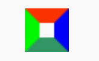
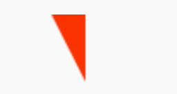

# Border

## border-width

`border-width` 和 `margin，padding` 不同，是不支持百分比的，因为创造者设计 `border` 的初衷就是让区域更加明显一些，没有需要使用百分比的场景，像 `outline`、`box-shadow`、`text-shadow` 等都是不支持百分比的

border-width 属性值：

- 数值：1px
- 关键字：
  - thin：薄薄的，等同于 1px。
  - medium（默认值）：薄厚均匀，等同于 3px。
  - thick：厚厚的，等同于 4px。

border 默认值设置为 `medium` 的原因是因为 `border-style:double` 至少 `3px` 才会有效果

## border-style

1. border-style:none (默认值)
2. border-style:solid
3. border-style:dashed
   虚线效果，这虚线颜色区的宽高比以及颜色区和透明区的宽度比例在不同浏览器下是有差异的
4. border-style:dotted
   虚点边框在表现上同样有兼容性差异，虽然规范上明确表示是个圆点，但是 Chrome 以及 Firefox 浏览器下虚点实际上是个小方点
5. border-style:double
   双线边框表现规则：双线宽度永远相等，中间间隔+1。不同值下的表现如下表

   

   从表可以看出，当边框宽度是 1px 和 2px 的时候，其表现和 `border-style:solid` 是一模一样的

   我们可以利用双线边框表现规则绘制等比例的“三道杠”图标效果

   ```css
   .icon-menu {
     width: 120px;
     height: 20px;
     border-top: 60px double;
     border-bottom: 20px solid;
   }
   ```

   

6. 其他 border-style 属性
   `inset`（内凹）、`outset`（外凸）、`groove`（沟槽）、`ridge`（山脊）风格老土过时，且兼容性惨不忍睹。因此，它们没有任何实用价值

   

## border-color 和 color

border-color 有一个很重要也很实用的特性，就是`默认颜色就是 color 色值`。具有类似特性的属性还有 `outline`、`box-shadow` 和 `text-shadow` 等

利用这个特性可以帮我们有效的减少很多代码

## border 与透明边框技巧

1. 右下方 background 定位的技巧
   在 CSS3 新世界还没到来的时候，`background` 定位有一个比较大的局限性，就是只能相对左上角数值定位，不能相对右下角，我们可以利用透明边框来实现

```css
.box {
  border-right: 50px solid transparent;
  background-position: 100% 50%;
}
```

默认 `background` 背景图片是相对于 `padding box`定位的，也就是说，`background-position:100%`的位置计算默认是不会把 border-width 计算在内的。

2. 优雅地增加点击区域大小

```css
.icon-clear {
  width: 16px;
  height: 16px;
  border: 11px solid transparent;
}
```

点击区域由原来的`16*16`变成了`38*38`

3. 三角等图形绘制

```css
div {
  width: 0;
  border: 10px solid;
  border-color: #f30 transparent transparent;
}
```


## border 与图形构建

`border` 属性可以轻松实现兼容性非常好的三角图形效果，为什么可以呢？其底层原因受 `inset/outset` 等看上去没有实用价值的 `border-style` 属性的`转角规则`影响,效果如下图

```css
div {
  width: 10px;
  height: 10px;
  border: 10px solid;
  border-color: #f30 #00f #396 #0f0;
}
```



当我们把宽度从 10 变成 0 时，便会生成 4 个三角形，利用 border 的这种特性我们可以实现各种各样的三角形特效

```css
div {
  width: 0;
  border-width: 10px 20px;
  border-style: solid;
  border-color: #f30 #f30 transparent transparent;
}
```



利用三角形生成各种气泡效果


> 只要是与三角形或者梯形相关的图形，都可以使用 border 属性来模拟

## border 等高布局

在前面章节我们已经说过 `margin` 实现等高布局，下面我们来实现下 `border` 版本


```css
.box {
  border-left: 150px solid #333;
  background-color: #f0f3f9;
}
.box > nav {
  width: 150px;
  margin-left: -150px;
  float: left;
}
.box > section {
  overflow: hidden;
}
```

元素边框高度总是和元素自身高度保持一致，因此可以巧妙地实现等高布局效果
