# (七)常用部件常用 Widget

## Text

### 默认显示

在我们进行日常开发工作中，`Text`可以说是我们使用最多的部件了，那么我们来研究一下`Text`的相关使用； 首先，我们来看一下一段文本在`Text`上的默认显示效果：

```js
Text(
  "Flutter是谷歌的移动UI框架，可以快速在iOS和Android上构建高质量的原生用户界面。 Flutter可以与现有的代码一起工作。在全世界，Flutter正在被越来越多的开发者和组织使用，并且Flutter是完全免费、开源的。"
);
```

其显示效果如下： 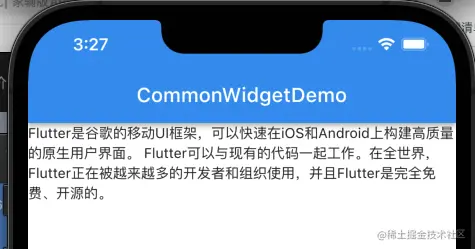

### 居中显示

```js
textAlign: TextAlign.center,
```

显示效果如下： 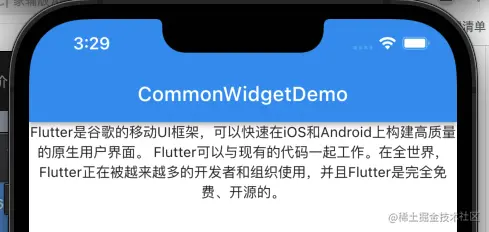

### TextStyle

创建一个`TextStyle`给`Text`的`style`属性赋值，用来改变字体大小及粗细；

```js
final TextStyle _textStyle = const TextStyle(
    fontSize: 20.0,
    fontWeight: FontWeight.w800,
  );

  @override
  Widget build(BuildContext context) {
    return Text(
      'Flutter是谷歌的移动UI框架，可以快速在iOS和Android上构建高质量的原生用户界面。 Flutter可以与现有的代码一起工作。在全世界，Flutter正在被越来越多的开发者和组织使用，并且Flutter是完全免费、开源的。',
      textAlign: TextAlign.center,
      style: _textStyle,
    );
  }
```

显示效果如下： 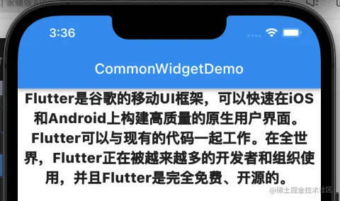

### maxLines

显示最大行数：

```js
return Text(
      'Flutter是谷歌的移动UI框架，可以快速在iOS和Android上构建高质量的原生用户界面。 Flutter可以与现有的代码一起工作。在全世界，Flutter正在被越来越多的开发者和组织使用，并且Flutter是完全免费、开源的。',
      textAlign: TextAlign.center,
      style: _textStyle,
      maxLines: 2,
    );
```

代码运行效果如下： 

### overflow

� 多余行数我们以`...`来显示： 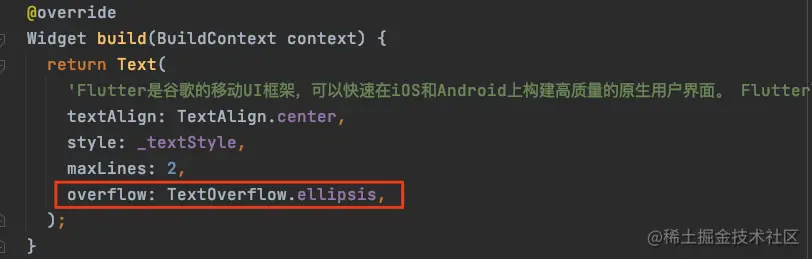 显示效果： 

### 文本拼接

显示文字很容易，但是在开发过程中经常是需要拼接文本的，那么又该如何处理呢？ ​

我们先定义几个文本字符串：

```js
final String _title = '《法外狂徒张三的自我修养》';
  final String _lector = '讲师：';
  final String _name = '罗翔';
```

那么，我们如何将这三个字符串进行拼接呢？在`Flutter`中可以使用`$`来进行操作：

```js
Text(
	'$_title -- $_lector$_name',
	textAlign: TextAlign.center,
	style: _textStyle,
);
```

我们来看一下显示效果： 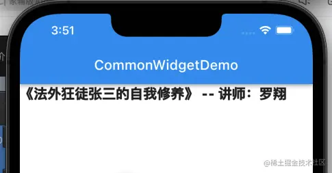

## RichText

简单的`Text`显示文字很容易，但是这还不足以满足我们的开发需求，我们在开发过程中经常会有需要显示富文本的情况，那么又该如何处理呢？ ​

这个时候就需要使用`RichText`部件了；再使用`RichText`时结合`TextSpan`一起使用： 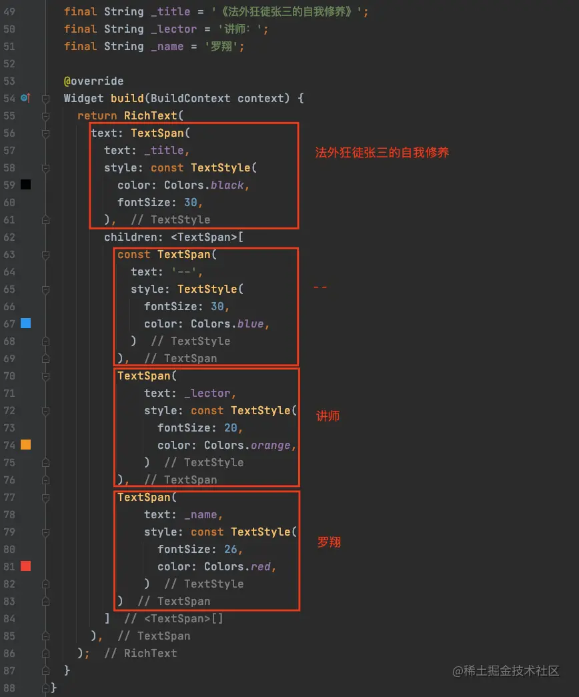 最终显示效果如下： 

## Container

`Container`这个部件在我们开发过程中会经常用到; ​

我们先来给`Container`添加一个颜色：

```js
Container(
	color: Colors.orange,
);
```

我们执行代码之后发现，这个`Container`是整个屏幕大小： 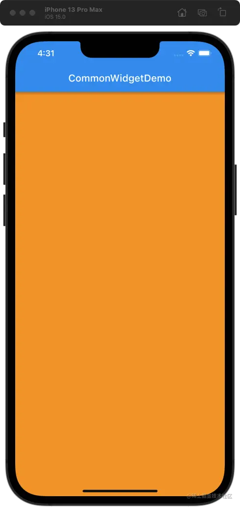 这是为什么呢？这是因为`Container`默认大小是由其`父部件`决定的，会铺满`父部件`; ​

我们在`Container`里边使用`Row`部件布局，再添加一个`Container`： 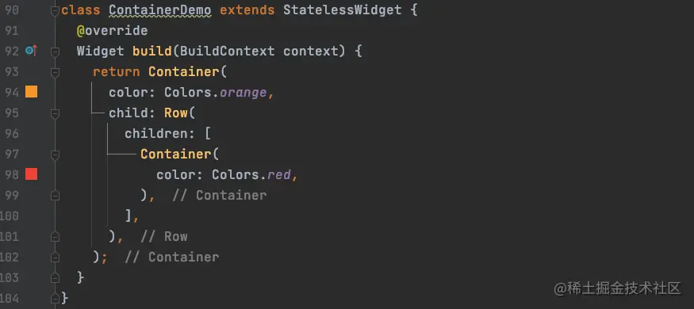 运行发现，红色的`Container`是无法显示的，橙色的`Container`依然是全屏显示，那么我们给这个红色的`Container`添加一个子部件： 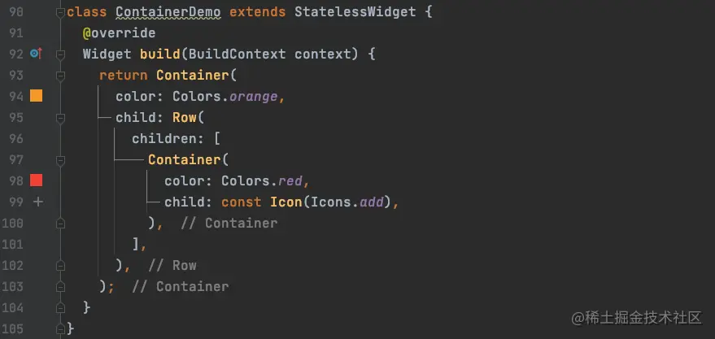 这个时候我们再次刷新界面发现效果如下：  添加了一个`Icon`图标之后，`Container`显示出来了，而且原来的橙色的`Container`高度也改变了；这是自适应弹性布局的渲染效果：父部件会跟随子部件的内容进行改变； ​

我们再给红色`Container`添加一个内边距： 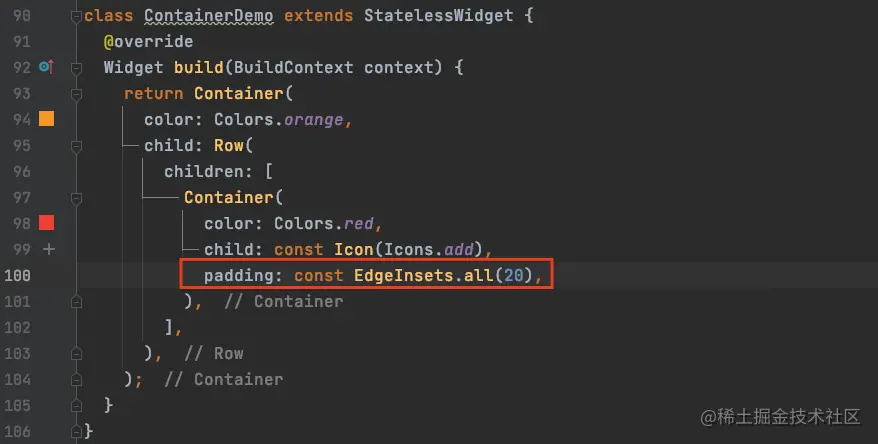 这个时候我们再来看一下运行效果： 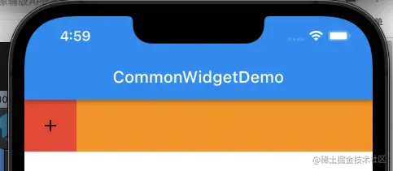 结果，红色`Container`区域扩大，同时橙色的`Container`也同步扩大；那么再增加一个外边距呢： 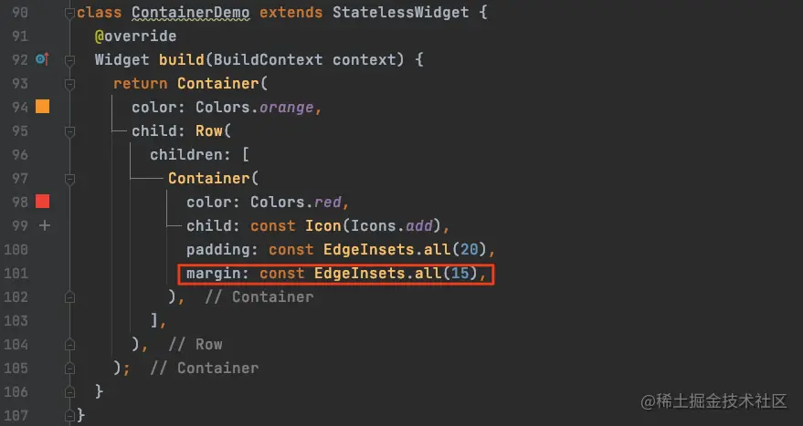 我们再次查看渲染效果： 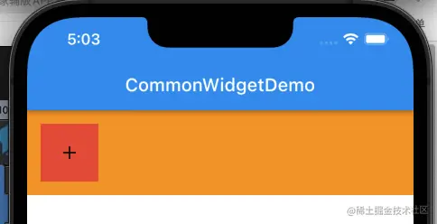 红色`Container`大小不变，而橙色的`Container`区域再次扩大了；高度扩大了`15*2`； ​

那么，如果红色区域的`Container`高度设置过小或者过大会出现什么情况呢？

我们先给`Icon`高度设置为`30`，那么按照目前高度的计算，红色区域`Container`高度为：

> 20 + 30 + 20 = 70

接下来，我们给红色`Container`高度设置为`200`；代码如下： 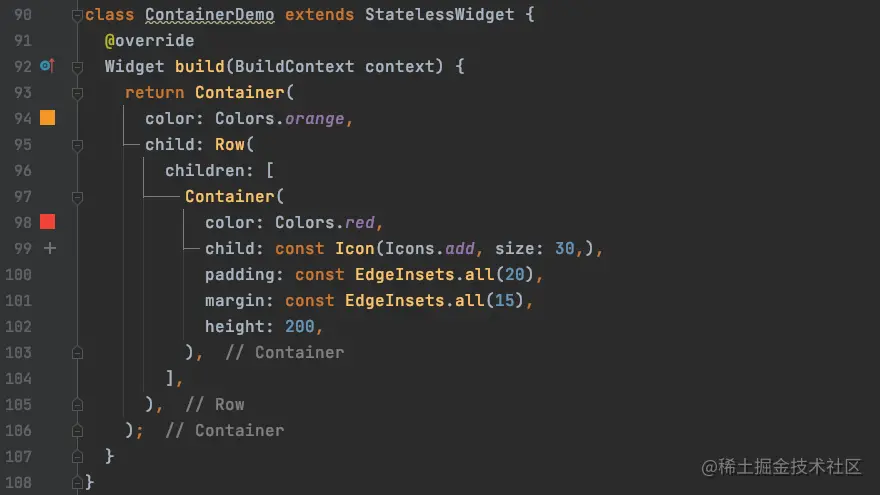 运行结果； 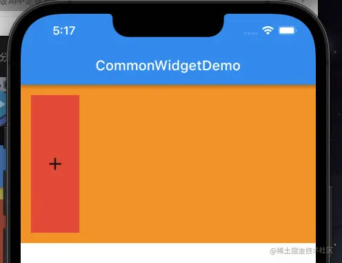

然后，我们再将高度设置为`50`： 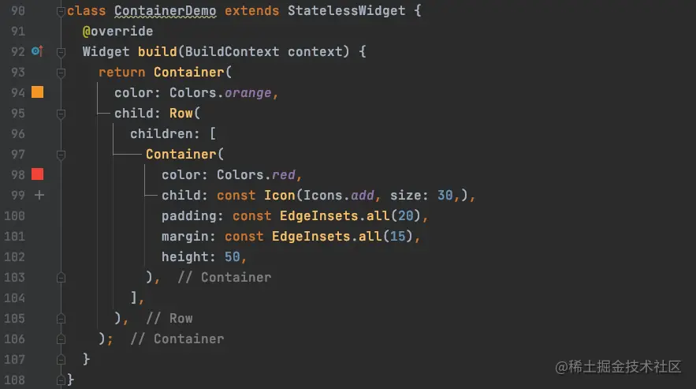 运行结果； 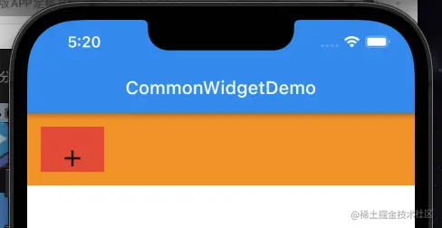 结果显示，高度改变之后，`Container`的高度显示正确，但是内部的小部件因为布局无法满足的问题，显示将会出现问题； ​

同样的，我们去掉红色`Container`的高度，然后改变橙色`Container`的高度来看一下结果；按照当前高度的计算：

> 30 + 20 _ 2+ 15 _ 2 = 100

橙色`Container`的高度是 100，那么如果给`Container`的高度设置为小于`100`会是什么样子呢？ 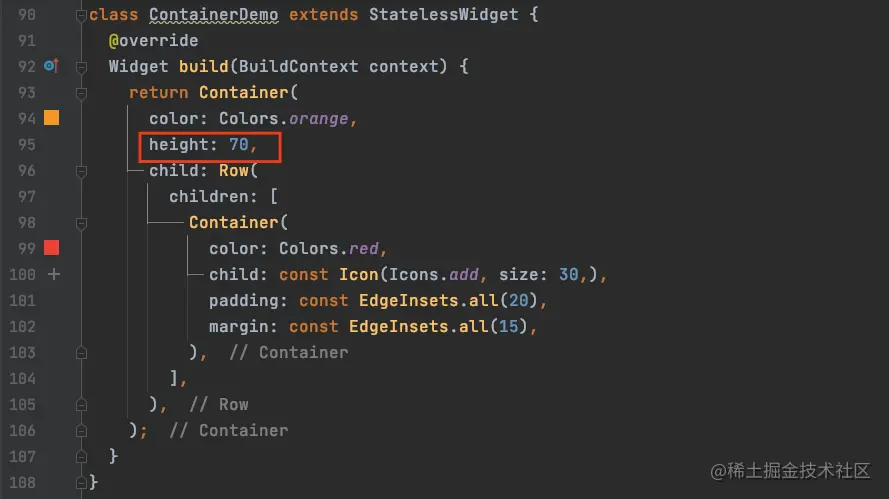 运行结果如下：  内部部件显示也会出现问题，所以我们在进行布局的时候，关于布局的计算一定要细心；
