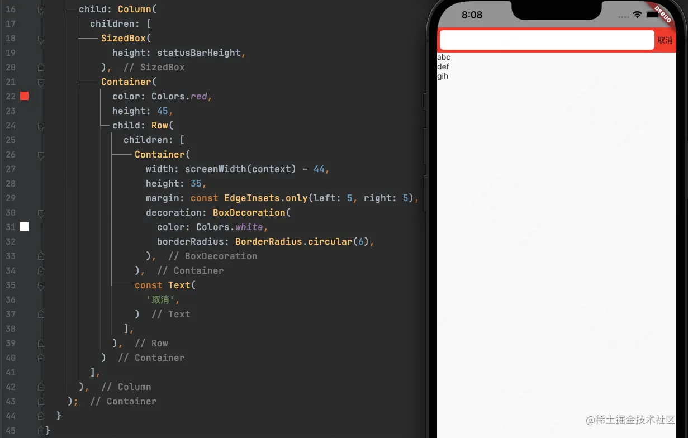

# (三十)实战-微信聊天搜索输入框

我们已经实现了微信的聊天列表界面，在微信中聊天界面上方还有一个搜索功能，可以搜索微信的聊天信息，今天我们来模仿实现此功能；

## 添加搜索入口

在微信的首页，我们滑动页面可以发现，搜索框是随着列表一起滑动的，那么说明搜索部件和`ListView`很有可能是一体的，我们现在来实现此部件；

```js
class ChatSearchCell extends StatelessWidget {
  @override
  Widget build(BuildContext context) {
    return Container(color: Colors.red, height: 40,);
  }
}
```

我们先给此部件一个简单的红色背景及高度；

接下来，我们要对聊天界面的代码进行修改，因为搜索框也是`ListView`的一部分了，我们将其当做是第一个`Cell`，那么`ListView`的`itemCount`个数应该`+1`:

```js
return ListView.builder(
  itemCount: _list.length + 1,
  itemBuilder: _itemBuilderForRow);
```

之后，在`_itemBuilderForRow`方法中做判断，当是第一个`cell`的时候，显示搜索框，之后的`cell`进行`index--`操作，显示聊天列表的数据，代码及效果如下：


## 布局搜索入口 UI

为了更好的对照微信进行布局，我们将导航栏颜色设置为灰色背景，因为此处的搜索入口是需要进行点击事件响应的，因此使用手势包括起来：


### 隐藏导航栏下方阴影

我们看到导航栏下方，有一条阴影线，我们将其隐藏，需要设置对应页面`AppBar`的`elevation`属性，将其设置为`0`:


### 添加白色背景

很明显，我们此处应该显示一个`Stack`，在一个圆角白色背景上边显示搜索文字和图标：


使用`Stack`进行布局，先添加一个圆角的白色背景；

### 添加搜索图标及文字

通过在`Stack`上先添加了一个圆角白色背景的`Container`，因为搜索图标和文字是横向的，因此我们需要再添加一个`Row`来布局，效果如下：


- `Stack`的`alignment`属性可以设置白底`Container`和`Row`都居中对齐；
- `Row`的`mainAxisAlignment`属性可以设置`Row`中的`Icon`和`Text`在主轴方向上居中对齐；

## 搜索页面

### 头部搜索框

从搜索页面布局来看，页面大致分为两部分，上部为搜索输入框，下部为显示结果的`ListView`，那么在搜索页面我们就可以使用`Column`来进行布局：


上半部分显示搜索的`SearchBar`，下半部分显示`ListView`，但是我们发现此时运行代码是会报错的，报错信息如下：


这是因为我们在添加一个`ListView`的时候，需要给`ListView`指定高度，此时有两种解决方案，为了便于分析，我们将`ListView`放进`Container`里边：

- 第一种，使用`Expended`把`ListView`包起来，代码及效果如下：


- 第二种，使用`ListView`的`shrinkWrap`属性，将其设置为`true`，代码及效果如下：


> 两者结果：使用`Expanded`的方式，`ListView`会根据布局自适应剩下的区域；而`shrinkWrap`该属性将决定列表的长度是否仅包裹其内容的长度。当 ListView 嵌在一个无限长的容器组件中时，shrinkWrap 必须为 true，否则 Flutter 会给出警告

我们此处采用`Expanded`的方式，需要注意的是`Expanded`需要设置`flex`，由于我们此处直接使用了`flex`默认为`1`；

### ListView 偏移问题

我们虽然成功添加了`ListView`，但是`ListView`的内容是向下偏移了的，这个时候我们需要将这部分偏移移除；需要使用`MediaQuery.removePadding`方法移除头部偏移，代码如下：


### 搜索框布局

我们来看一下目前头部红色区域的代码：


> `statusBarHeight`获取状态栏高度；

因为我们的搜索框是显示在下半部，也就是状态栏下方的，因此我们采用`Column`进行布局，代码如下：


接下来，红色区域使用`Row`进行左右布局，左边是`白色背景的Container`，右边是`取消按钮`，：



将此区域分为两部分，上半部分采用`SizeBox`填充`状态栏(安全区)`，下半部分显示`搜索区域`和`取消`；

### 输入框布局

输入框分为三部分，`左边放大镜`，`中间输入框`，`右边是清除按钮`，这样我们来使用`Row`进行布局，代码及效果如下：


- 放大镜的`Icon`使用`SizeBox`包一下，可以设置宽度，调整大小；
- 中间的输入框`TextField`使用`Expanded`包起来，可以让输入框自适应大小，将`清除`按钮自动布局到右侧；

#### 输入框光标颜色

`TextField`的`CursorColor`属性可以修改输入框的光标的颜色

```js
cursorColor: Colors.green, // 输入框光标颜色
```

代码及效果如下： 

#### 文字的大小颜色和宽度

`TextField`的文本信息依然是`style`属性，并且`style`是`TextStyle`类型的：

```js
style: TextStyle(fontSize: 18, color: Colors.black, fontWeight: FontWeight.w300),
```

效果如下：


#### 输入框的边框

当我们在输入框内输入过多文字的时候，会出现如下情况：


此时需要设置`TextField`的装饰器`decoration`：


#### 输入框下方黑线

我们仔细看此时的输入框，在输入框的下边是有一条黑线的，那么如何隐藏呢？需要设置装饰器`InputDecoration`的`border`属性：


#### 占位符

设置`TextField`占位文本，使用属性`hintText`：


#### 第一响应

如果我们需要输入框自动聚焦获得第一响应，调起键盘，可以使用`TextField`的`autofocus`属性：

：

### 清除按钮

#### 清除按钮样式：


#### 清除按钮功能

我们点击清除按钮的时候，是需要清空输入框中的内容的，要想实现此功能，需要使用到`TextEditingController`，我们来定义一个：

```js
final TextEditingController _textEditingController = TextEditingController();
```

然后将`_textEditingController`赋值给`TextField`的`controller`属性：


这样，我们就能通过`_textEditingController`来控制输入框的相关功能；

当在输入框中输入文本信息时，`TextField`的`onChange`方法将会产生回调，返回当前输入框中的内容：


我们将此方法抽出为：

```js
void _textFieldOnChange(text) {

  }
```

我们是需要控制清除按钮的显示与隐藏的，默认情况下隐藏，当输入框中有内容是，清除按钮显示，那么我们就需要一个`bool`值来标识显示与隐藏：

```js
bool _showClear = false; // 是否隐藏请求按钮
```

再添加清除按钮式需要根据此属性值来添加，如果为`true`，则添加清除按钮：


然后在`_textFieldOnChange`方法中，判断是否显示隐藏，效果如下：


清除按钮也是可以点击清除输入框内容的，我们需要给`Icon`添加手势：


我们使用`_textEditingController.clear()`方法来清除输入框文本内容，但是需要注意的是，此方法并不会触发`TextField`的`onChange`方法，那么点击清除之后，清除按钮本身并不会被隐藏，因此我们需要手动调用`onChange`方法：


> 目前，搜索框相关功能已经完全实现；
