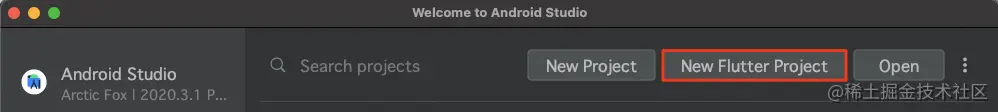
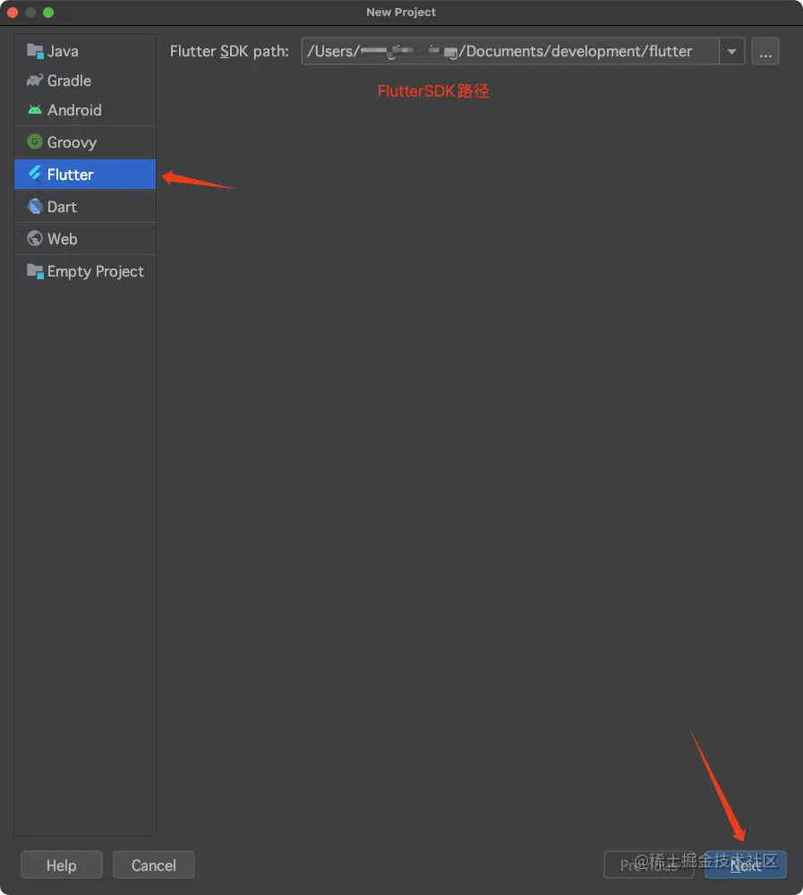
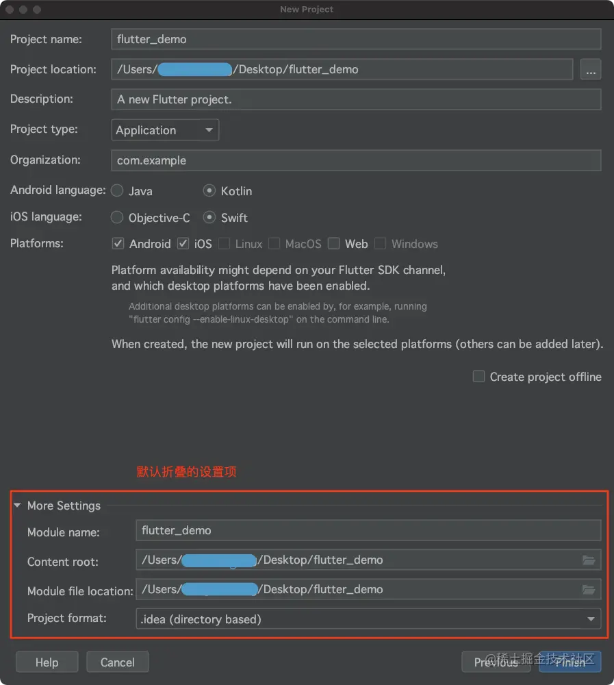
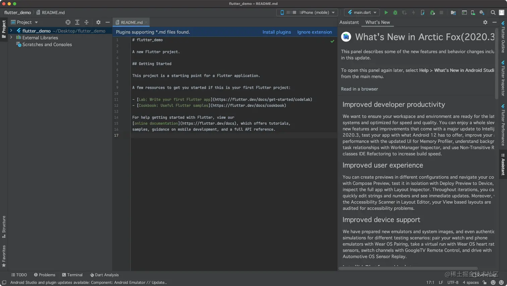
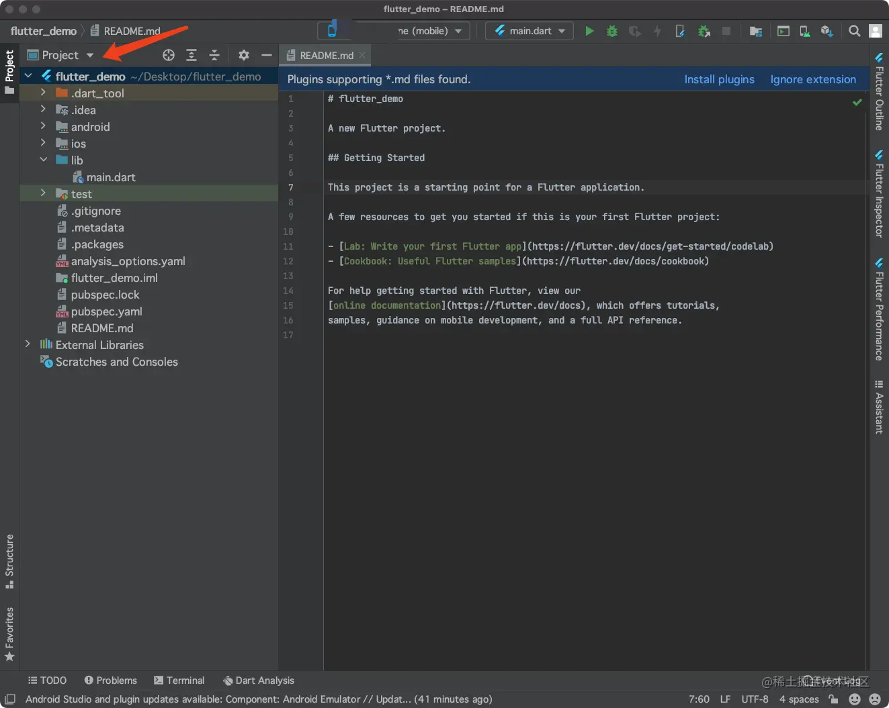
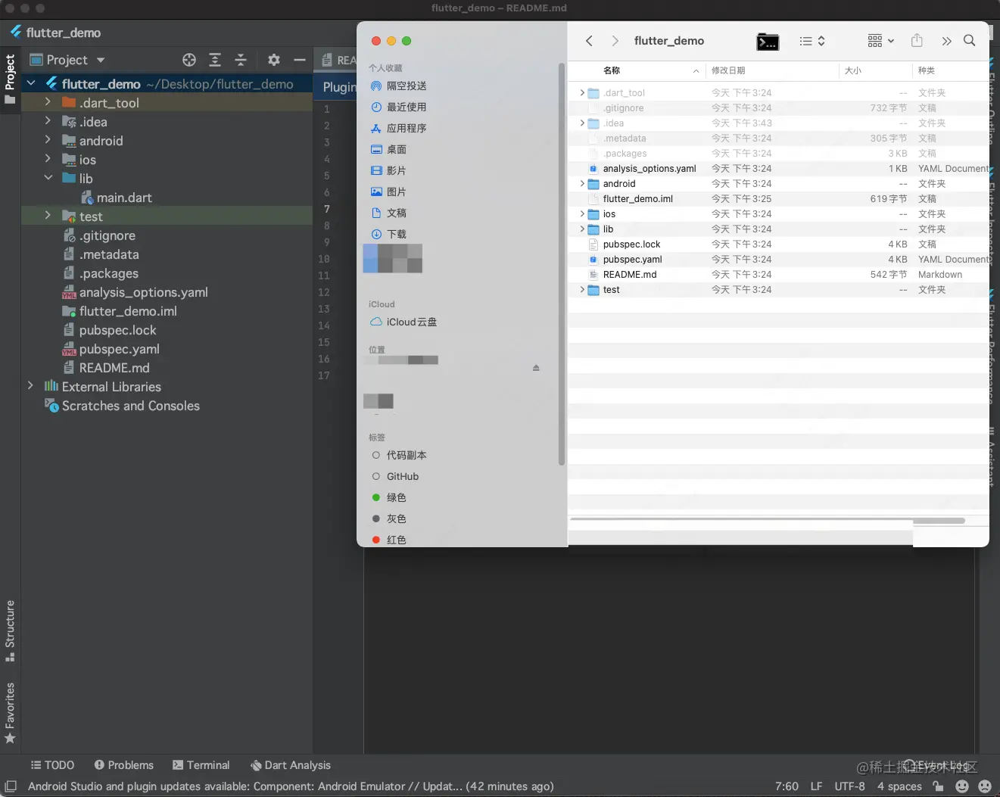
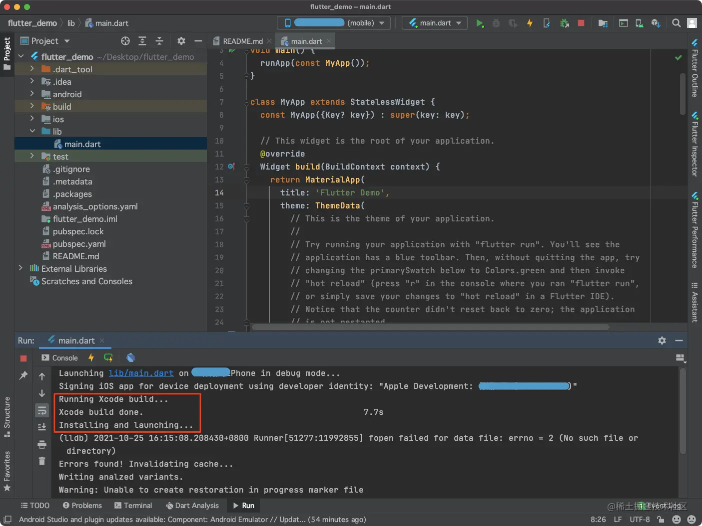
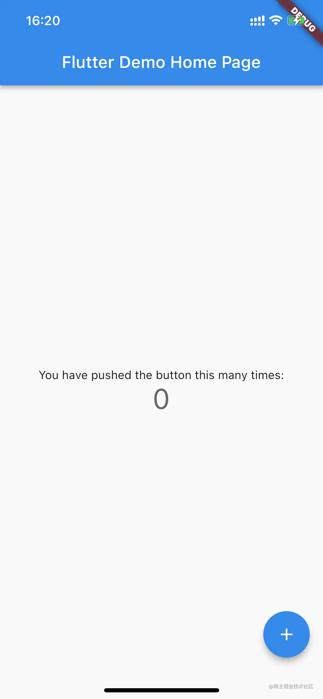
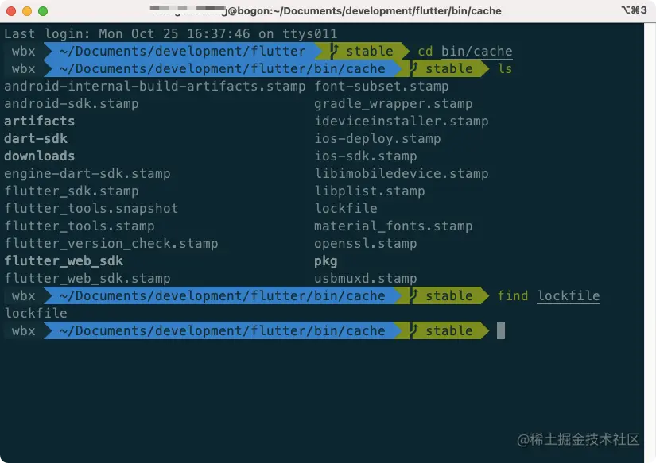

# (二)创建 Flutter 工程

我们已经配好了`Android Studio`的`Flutter`环境，那么我们接下来就是用`Android Studio`来创建工程：  打开`Android Studio`，然后点击`New Flutter Project`：  选中`Flutter`，确保`Flutter SDK path`后边的路径正确，然后点击`next`： 

- `Project name`：工程名字；需要注意的是，`Flutter`工程名字不能使用`驼峰命名`格式，`Flutter`推荐使用`下划线(_)`来链接；
- `Project location`：工程存放目录；需要注意的是，如果在修改目录之前，输入了工程名字，那么目录会多一级工程名字的路径，如果更改了目录之后，在输入名字，那么路径会少一级工程名字的路径，需要手动补全；
- `Description`：工程描述；
- `Project type`：`Flutter`工程类型；分为`Application`，`Plugin`，`Package`和`Module`四种；
  - `Application`：`Flutter`工程；
  - `Plugin`：`Flutter`插件，里边包含`Dart`代码和各平台相应的原生代码；
  - `Package`：`Flutter`框架包，比如第三方框架，里边只有`Dart`代码；
  - `Module`：是进行`Flutter`混合开发时使用的，比如与原生混合开发；
- `Organization`：组织，类似于`Xcode`创建`iOS`工程时，填写`Bundle ID`的功能；
- `Android language`：`Android`原生工程开发语言；`Java`或者`Kotlin`；
- `iOS language`：`iOS`原生工程开发语言；`Objective-C`或者`Swift`；
- `Platforms`：可选的支持平台；`Android`，`iOS`，`Linux`，`MacOS`，`Web`或者`Windows`；

​

> `More Settings`里边的设置项可以不用修改，直接使用；

点击`Finish`创建工程： 

> 第一次创建项目，会从网络上拉取数据，会消耗点时间；

 此处选择不同的选项，目录显示状态也会有所不同，我们一般选择`Project`选项，目录如下： 

> 这个时候的文件目录，与工程在文件夹里边的目录是一致的；

- `android`：`Android`工程目录；
- `ios`：`iOS`工程目录；
- `lib`：我们存放`Dart`代码的目录；

在`Android Studio`的控制台我们可以看到，虽然使用的是`Android Studio`运行的`Flutter`项目，但是由于我们的设备是`iPhone`，所以最终还是要借助于`Xcode`来实现`编译`和`安装`：  运行效果，界面如下：  至此，我们已经将`Flutter`示例工程运行成功了；

## Android Studio 中 Flutter 的一个小 bug

如果我们的`Android Studio`正在运行`Flutter`项目，这个时候我们使用快捷键`comman+Q`进行强退，那么`Flutter`将会有一定概率出现`lock`锁死状态；这个时候，我们再次打开项目运行将会出现问题；这是因为为了保护数据，`Android Studio`存在一个缓存机制；解决方案就是删除缓存文件； 缓存文件存放位置在`Flutter SDK`目录下：

> flutter/bin/cache/

此目录下有一个文件`lockfile`，将其删除即可； 

## Flutter 的优势

我们以前使用`ReactNative`是在`原生UI`的基础上进行的封装，需要通过`JavaScript`代码调用`RN`框架，然后通过原生控件进行渲染；那么就会产生一个问题，如果`UI`层进行了更新升级，那么`RN`就需要马上升级版本进行适配兼容，对原生的依赖性非常强； `Flutter`并非基于`原生UI`进行封装的，`Flutter`会将一个专门的渲染引擎安装在手机上，所以引入`Flutter`之后，安装包体积将会增大；`引擎`负责解析`Dart`代码，渲染界面；不依赖于`原生UI`，且效率很高；因为基于同一套渲染引擎，所以`Android`和`iOS`两个平台，渲染效果高度统一；

## 关于热更新

由于`Apple`禁止了`热更新`功能在`App`中的使用，所以`Flutter`对外宣称不支持`热更新`；但是我们注意到在`Debug`版本中存在`热重载`功能，在`Release`版本中则不存在此功能；那么基于`热重载`功能，开发者可以自定义开发`热更新`功能；这就需要修改`渲染引擎`，较为复杂，需要技术难度较高；
