# (二十七)-异步与多线程相结合

在之前的文章中，我们已经学习了`Future`异步编程和`Isolate`多线程的使用，今天我们来看一下，如何使用异步编程与多线程结合使用；

## 异步与多线程结合使用

我们先来看一段代码：

```js
void main() {
  testIsoLoad();
}

void testIsoLoad() {
  Future(() => compute(func, 123)).then((value) => print('1'));
  Future(() => compute(func, 123)).then((value) => print('2'));
  Future(() => compute(func, 123)).then((value) => print('3'));
  Future(() => compute(func, 123)).then((value) => print('4'));
  Future(() => compute(func, 123)).then((value) => print('5'));
}

func(int message) {}
```

运行工程，查看打印结果：

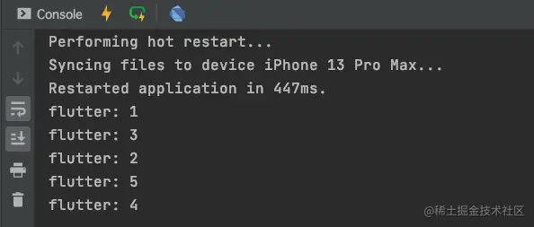

从打印结果我们可以得到结论，这几个`print`操作时异步的，他是在子线程处理的；

但是按照我们之前对`Future`的研究，多个`Future`之间应该是同步的才对，那么为什么此处却变成了异步的呢？接下来，我们在其他代码保持不变的情况下，将`testIsoLoad`方法中的代码进行如下修改：

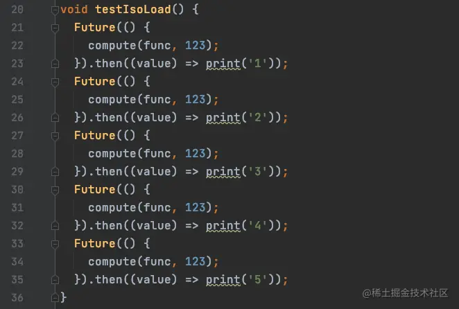

然后，我们运行工程，看到一下打印结果：

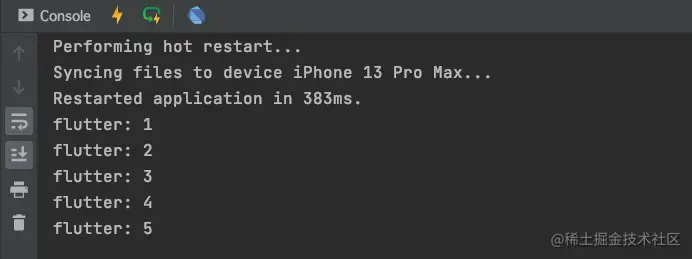

警告我们多次运行项目，最后发现打印顺序都是`1、2、3、4、5`，那么这是为什么呢？怎么又变成了同步的呢？我们仅仅只是将`=>`的调用方式换成了`{}`，怎么代码的执行结果就不一样了呢？

需要注意的是，`=>`在调用的过程中，有将执行结果进行`return`操作的含义，也就是说`=> compute(func, 123)`的执行，会将`compute(func, 123)`的结果进行`return`操作，我们来验证一下，将`testIsoLoad`方法修改如下：

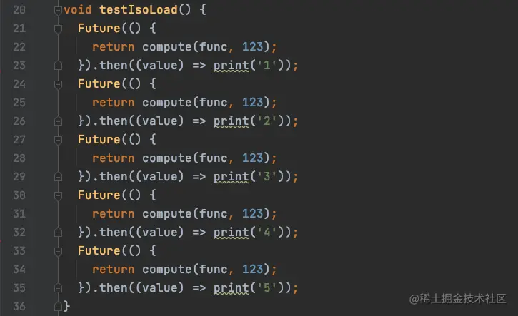

运行结果如下：

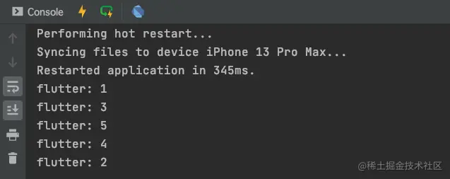

多次运行之后，发现结果并不是固定的，也就是说，我们进行了`return`操作之后，同步的执行流程变成了异步的，这也验证了我们上边所说的`=>`函数的调用方式会将结果进行`return`操作；

如果在`Future`中`return`了子线程的`Future`(`compute`是对`Future`的封装)，那么其`then`将会处理子线程的异步任务；那么既然`then`是子线程的异步操作了，那么`Future`中的任务是什么情况呢？

我们在`Future`中添加如下打印：

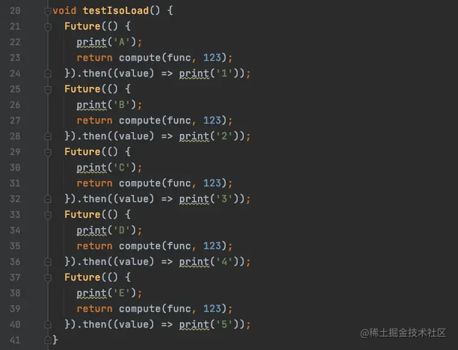

运行结果；

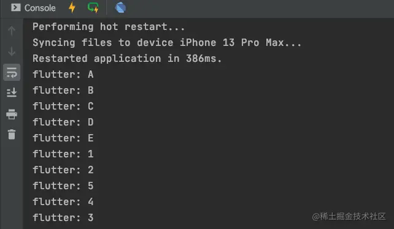

可以看到，虽然`then`处理的是子线程的异步任务，但是`Future`中依然还是同步任务；

## Future 与微任务

我们来看下边这样代码：

```js
Future f = Future(() {
    print('异步任务1');
    scheduleMicrotask(() {
      print('微任务1');
    });
  });
```

很明显，我们都能才到执行结果是：异步任务先执行，然后执行微任务；

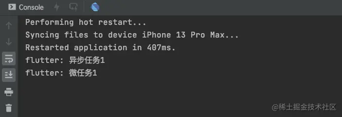

如果，我们继续给`f`添加一个`then`方法呢？

```js
Future f = Future(() {
    print('异步任务1');
    scheduleMicrotask(() {
      print('微任务1');
    });
  });
  f.then((value) {
    print('微任务2');
  });
```

此时的执行结果如何呢？

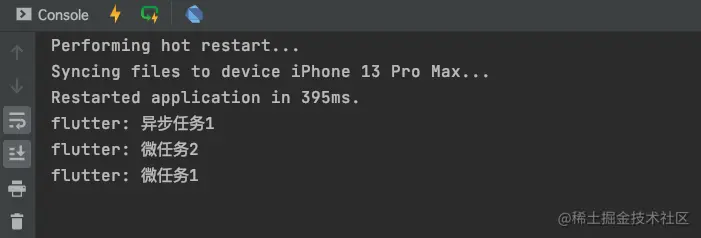

结果是`微任务2`比`微任务1`先执行，这是因为`then`方法我们可以看做和`Future`的任务是一个整体，也就是`then`方法 (一个微任务) 先添加进入队列，然后`微任务1`的微任务会添加到`then`方法后边，所以`then`方法先执行；

不仅仅如此，我们再添加一个`whenComplete`方法查看打印结果：

```js
Future f = Future(() {
    print('异步任务1');
    scheduleMicrotask(() {
      print('微任务1');
    });
  });
  f.whenComplete(() {
    print('完成');
  });
  f.then((value) {
    print('微任务2');
  });
```

打印结果如下：

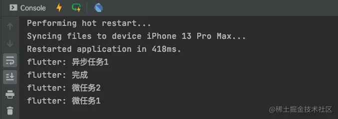

> `whenComplete`也可以看做和`Future`的任务是一个整体，`whenComplete`和`then`会按照添加顺序执行；

## 异步与多线程的选择

那么究竟什么时候使用异步任务，什么时候使用多线程操作呢？

虽然`Future`是个异步任务，但是在`Future`中的耗时操作是会阻塞主线程的。看如下代码：


我们在相机按钮的点击方法中添加了一个`for`循环来模拟耗时操作，可以从打印结果看到，当`Future`中的耗时操作开始执行之后，界面被阻塞，无法滑动！当耗时操作结束之后，才能进行滑动操作；

这个时候，我们可以使用`compute`来操作：

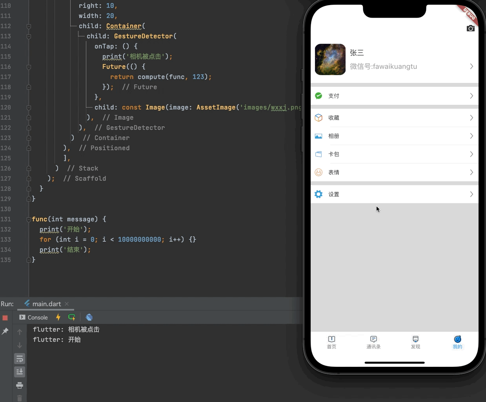

将耗时操作放在`compute`的方法中，将不会阻塞主线程，此处可以直接使用`compute`，不用`Future`；
