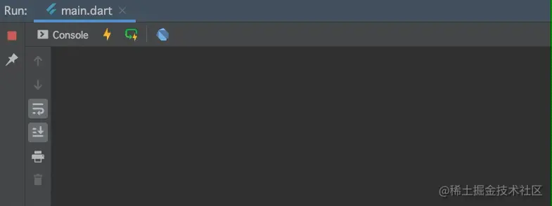
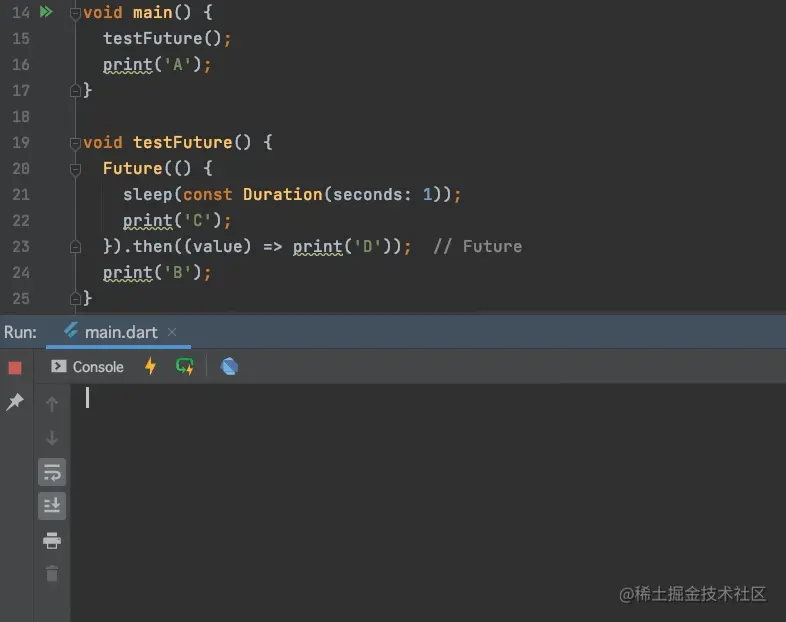
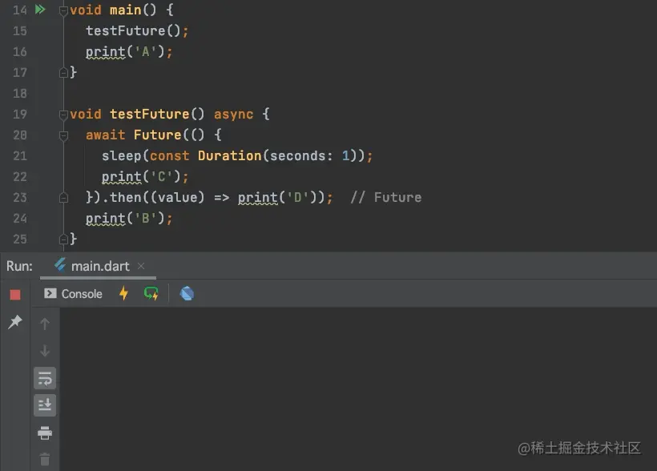
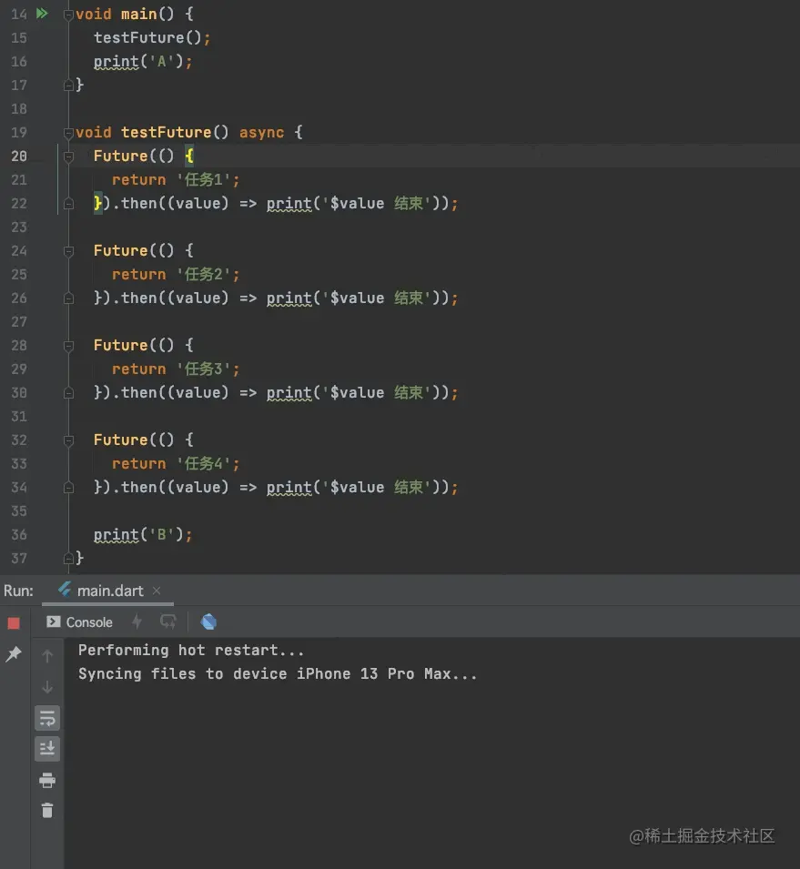
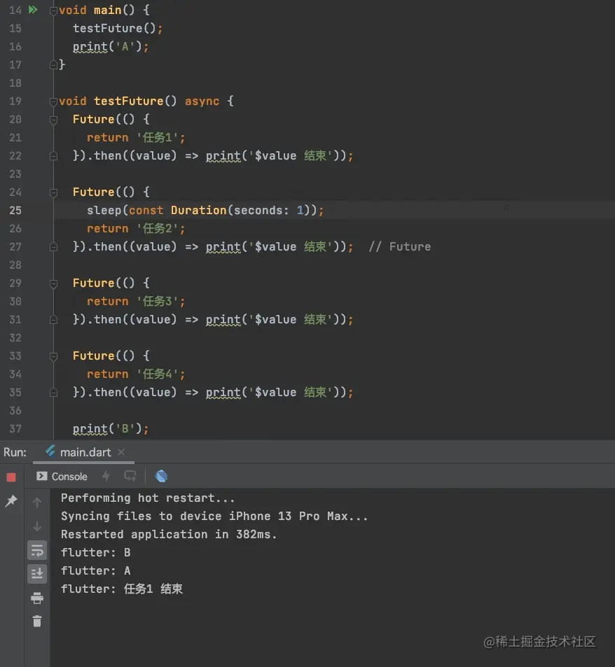
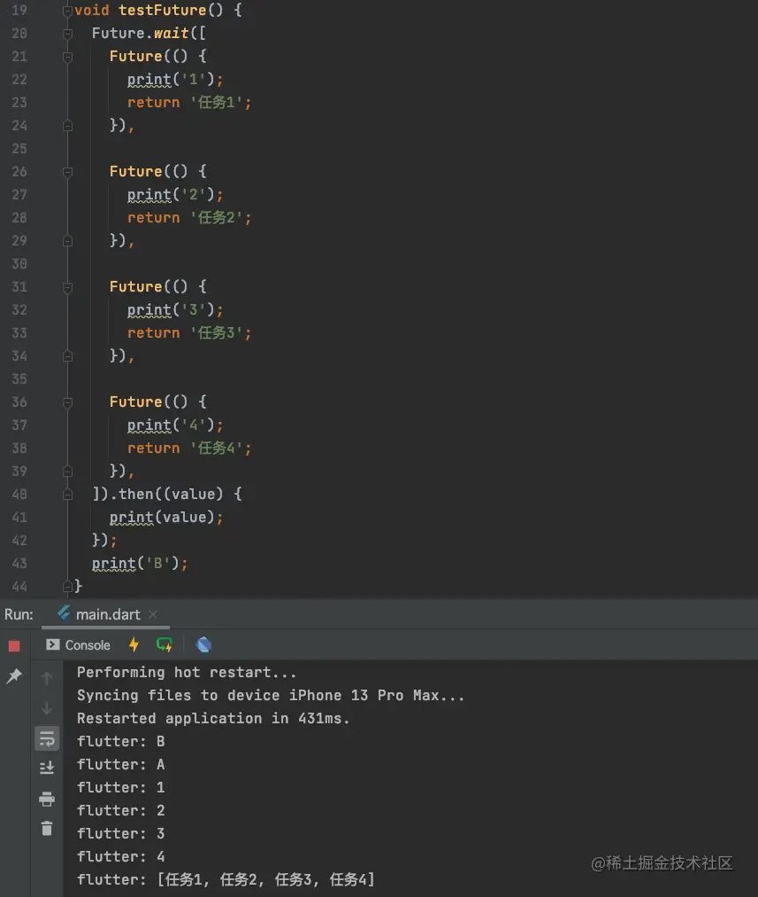
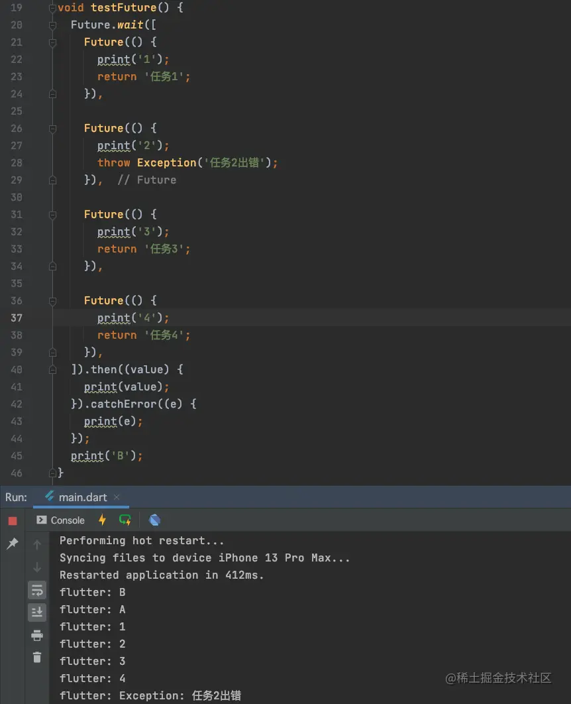

# (二十三)-多个异步编程

我们已经初步的学会了`Future`的使用，接下来我们了解一下关于异步编程的知识点；

## 异步编程

首先，我们来看一段代码，如下：

```js
void main() {
  testFuture();
  print('A');
}

void testFuture() {
  Future(() {
    sleep(const Duration(seconds: 1));
    print('C');
  });
  print('B');
}
```

执行结果：



可以看到此时输出结果`B、A、C`，此时都是同步执行的；

我们在`Future`后边添加`then`方法，执行结果：

 可以看到，此时依然还是同步执行的，只不过在`C`处理完之后，处理了`D`；最终打印结果为`B、A、C、D`；

那么我们添加上`async`和`await`会是什么效果呢？



可以看到此时的打印顺序明显的发生了变化，结果为`A、C、D、B`，这个时候整个`testFuture`方法变成了异步的；在`testFuture`方法内部，因为添加了`await`标识，所以`B`需要等待`Future`方法执行完成再执行；

> 添加了`async`和`await`之后，方法变成了异步的；

## 多个 Future 任务

我们在`testFuture`方法中添加多个`Future`任务，代码及执行结果如下：



可以看到，我们执行多次，结果都是四个任务按照顺序执行的；那么我们在其中一个任务中进行`sleep`操作呢：



虽然我们在`任务2`中延迟了操作，但是任务依然是按照顺序执行了；四个任务按照代码的添加顺序有序进行操作，是一个有序的队列；

## 任务的依赖

我们在实际开发过程中，如果无法判断多个任务的执行顺序，而其中任务有存在依赖关系的时候，那么应该如何处理呢？

这个时候就需要使用`then`方法进行处理了，代码如下：

```js
void testFuture() async {
  Future(() {
    return '任务1';
  }).then((value) {
    sleep(const Duration(seconds: 1));
    print('$value 结束');
    return '任务2';
  }).then((value) {
    print('$value 结束');
    return '任务3';
  }).then((value) {
    print('$value 结束');
    return '任务4';
  });
}
```

## Future.wait

有的时候，我们需要等待多个异步任务都执行结束之后才进行下一步操作，这个时候我们需要使用`Future.wait`，它接受的是一个`Future`数组，只有数组中的`Future`都执行完成之后，才会触发`then`的回调，只要有其中任一个`Future`执行失败，就会触发错误回调。

### 成功回调



四个任务都执行完成之后，最终的`then`才会进行回调，并且`then`中返回的`value`是四个`Future`方法返回值的数组形式；

### 异常回调



虽然四个任务都执行了，但是其中的`任务2`抛出了异常，最终结果`then`没有调用，而`catchError`被触发；
