# (二十二)-Dart 中的异步编程 Future

今天这篇文章我们来介绍一下`Dart`中的异步编程；

我们先来看一段代码：

```js
String _string = '默认';

void main() {
  getData();
  print('其他业务');
}

getData() {
  print('开始');
  for (int i = 0; i < 10000000000; i++) {
    _string = '耗时操作';
  }
  print('结束：$_string');
}
```

其执行打印结果如下：

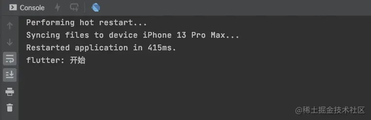

在这段代码中，`for`循环的耗时操作卡着了后续代码的执行；

那么如何想`for`循环变成异步操作呢？这个时候我们需要用到`Future`;

## Future

`Future`与`JavaScript`中的`Promise`非常相似，表示一个异步操作的最终完成及其结果的表示。简单来说`Future`就是用来处理异步操作的，异步处理成功了就执行成功的操作，异步处理失败了就捕获错误或者停止后续操作。一个`Future`只会对应一个结果，要么成功，要么失败；

需要注意的是，`Future`的所有`API`的返回值仍然是一个`Future`对象，所以我们可以很方便的进行链式调用；

我们将代码修改如下：

```js
String _string = '默认';

void main() {
  getData();
  print('其他业务');
}

getData() {
  print('开始：$_string');
  Future(() {
    for (int i = 0; i < 10000000000; i++) {
      _string = '耗时操作';
    }
    print('结束：$_string');
  });
}
```

运行结果：

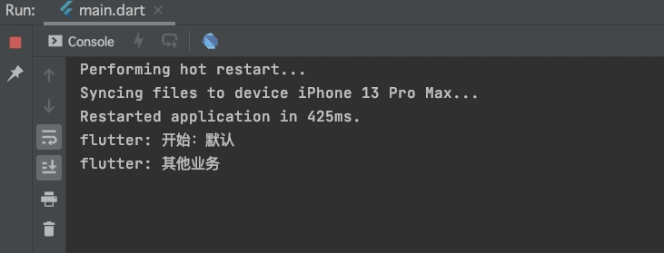

通过运行结果我们发现，将`for`循环放进`Future`中之后，耗时操作将不会阻塞代码的执行；

## await/async

在`Flutter`中还有一种方式可以让我们像写同步代码一样来执行异步任务而不用使用回调的方式，这就是`async/await`了，我们来看一段代码：

```js
String _string = '默认';

void main() {
  getData();
  print('其他业务');
}

getData() async {
  print('开始：$_string');
  await Future(() {
    for (int i = 0; i < 1000000000; i++) {
      _string = '网络数据';
    }
    print('获取到数据：$_string');
  });
  print('结束：$_string');
}
```

在此段代码中`getData`方法使用了`async`标识，而在方法内部`for`循环所在的`Future`添加了`await`标识，那么会有什么效果呢？

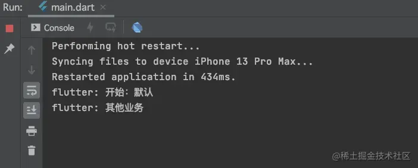

可以看到，`Future`之外的代码，等到`Future`中代码执行完毕之后才继续执行了；

那么，`sync`和`await`都是什么作用呢？

- `async`用来表示函数是异步的，定义的函数会返回一个`Future`对象，可以使用`then`方法添加回调函数；
- `await`后面是一个`Future`，表示等待该异步任务完成，异步完成后才会继续往下执行；`await`必须出现在`async`函数内部；

可以看到，我们通过使用`async`和`await`将一个异步流调用使用同步的代码逻辑表示了出来；

> `async`和`await`只是一个语法糖，编译器或者解释器最终都会将其转化为一个`Future`的调用链；

## then

那么，如果不使用`await`，我们能否实现同样的效果呢？

`Future`方法的返回值依然是一个`Future`对象，我们使用`Future`对象接收此返回值；然后通过`future.then`来打印一下返回的数据： 我们将`getData`方法修改如下：

```js
getData() async {
  print('开始：$_string');
  Future future = Future(() {
    for (int i = 0; i < 1000000000; i++) {
      _string = '网络数据';
    }
    print('获取到数据：$_string');
  });
  future.then((value) {
    print('then方法: $_string');
  });
  print('结束：$_string');
}
```

我们看一下打印结果：

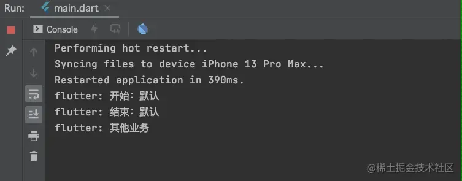

我们可以看到，虽然没有了`await`标识，但是`Future`对象的`then`方法中依然可以获取到异步任务的数据；

但是此时`then`方法中的`value`却是空的：


这是因为，`Future`中捕获的异步任务没有返回值，那么我们给这个异步任务添加一个返回值，我们将`getData`方法修改如下：

```js
getData() async {
  print('开始：$_string');
  Future future = Future(() {
    for (int i = 0; i < 1000000000; i++) {
      _string = '网络数据';
    }
    print('获取到数据：$_string');
    return '返回数据';
  });
  future.then((value) {
    print('then方法: $_string, value: $value');
  });
  print('结束：$_string');
}
```

我们再来看一下打印结果：

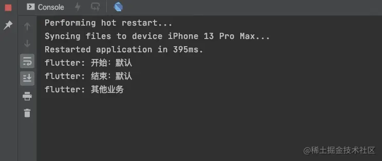

此时，`then`方法中返回的`value`已经有值了，值为异步任务中`return`的返回值；在`Future`中返回的数据会被包装进`Future`的对象中，然后返回一个`Future`的对象；

## catchError

很多情况下，我们在进行网络处理的时候的时候，会抛出异常，那么在`Future`中应该如何处理异常呢？

我们来看下边代码：

```js
getData() async {
  print('开始：$_string');
  Future future = Future(() {
    for (int i = 0; i < 1000000000; i++) {
      _string = '网络数据';
    }
    throw Exception('网络异常');
  });
  future.then((value) {
    print('then方法: $_string, value: $value');
  });
  print('结束：$_string');
}
```

在`Future`内部，通过`throw`抛出了一个`Exception`，我们来看一下代码的执行结果：

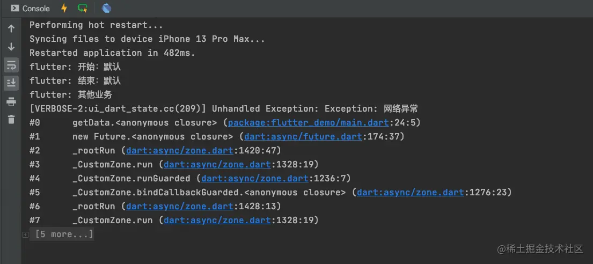

可以看到，执行过程中代码报错，抛出了`网络异常`的错误信息；那么我们就需要进行拦截，将`Exception`捕获到，不能在执行中让工程出错，这个时候我们就需要使用`catchError`捕获异常，我们将代码修改如下：

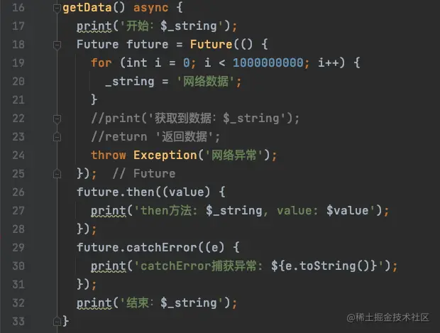

运行结果：

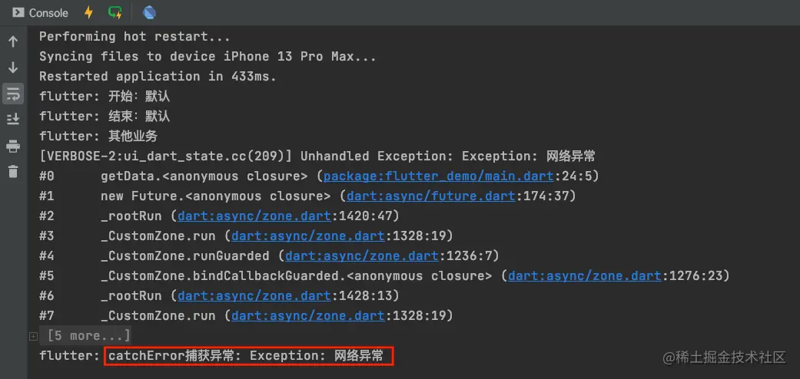

我们确实捕获到了异常，但是工程依然报错了，这是为什么呢？这个时候，我们需要用到链式调用，在`then`方法之后，直接使用链式调用来捕获异常，代码如下：

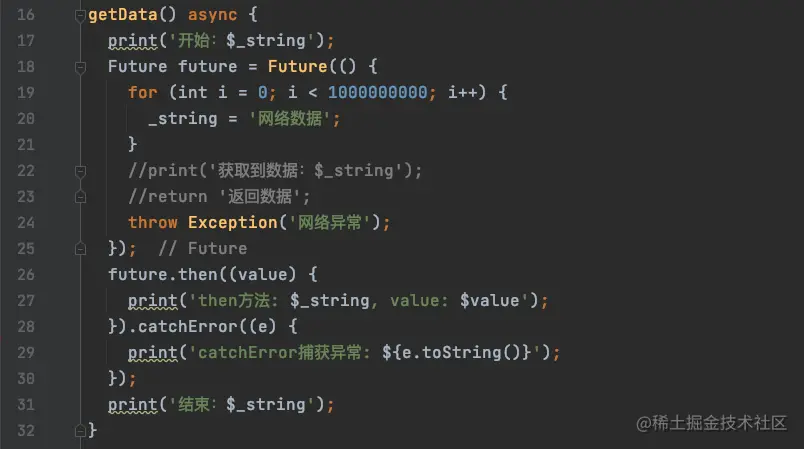

运行结果：

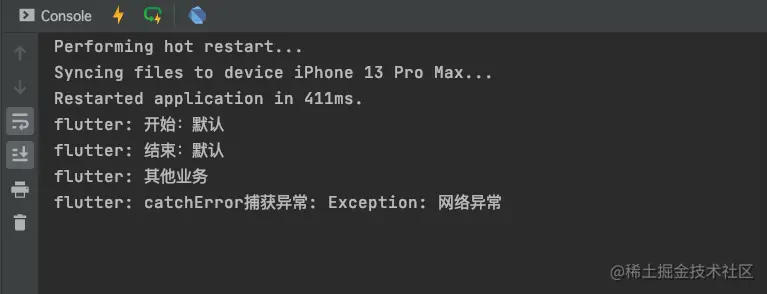

## onError

`then`的定义如下：

```js
Future<R> then<R>(FutureOr<R> onValue(T value), {Function? onError});
```

我们发现，在`then`方法中还有一个`onError`方法，此方法也可以用来处理错误以及异常：

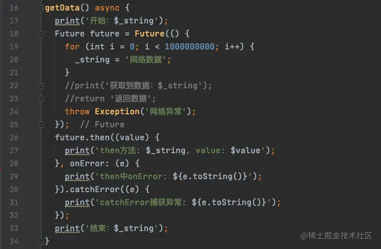

运行结果：

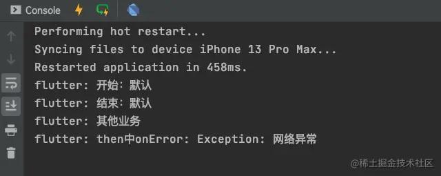

可以看到，使用`then`中的`onError`方法捕获错误之后，`catchError`将不会调用；

> 此处的`onError`方法是在`then`内部定义的，所以需要在`then`方法内部调用，而非平级；

`catchError`是在整个`Future`的链式调用过程中捕获异常，而`onError`只在当前`then`中处理；我们在一个链式调用的过程中可能存在多个`then`；

我们将`catchError`与`then`方法交换顺序：

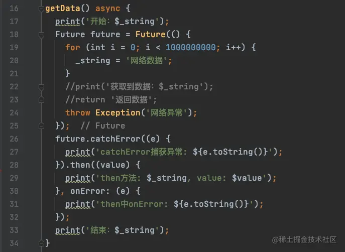

运行结果：

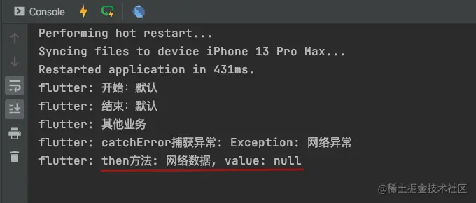

我们发现，如果`catchError`在`then`方法前面，即使在`catchError`中捕获了异常，那么`then`方法依然会执行；

## whenComplete

有时候，我们的异步任务无论成功与失败，都需要去做一些其他事情的时候，有两种方式处理 \*

- 在`then`或者`catchError`中处理；
- 使用`Future`的`whenComplete`回调处理；

我们将代码修改如下：

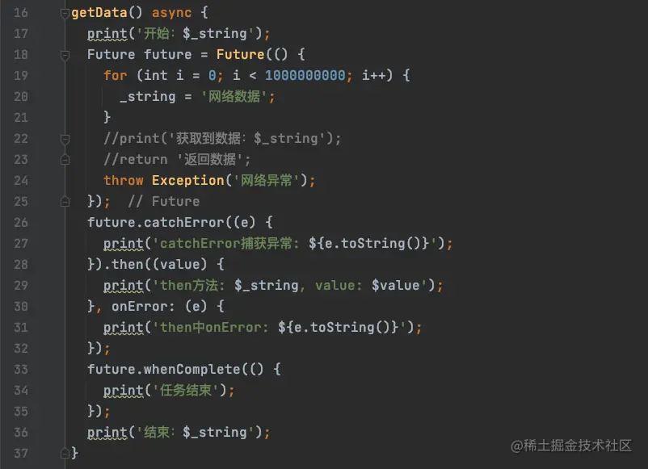

运行结果：

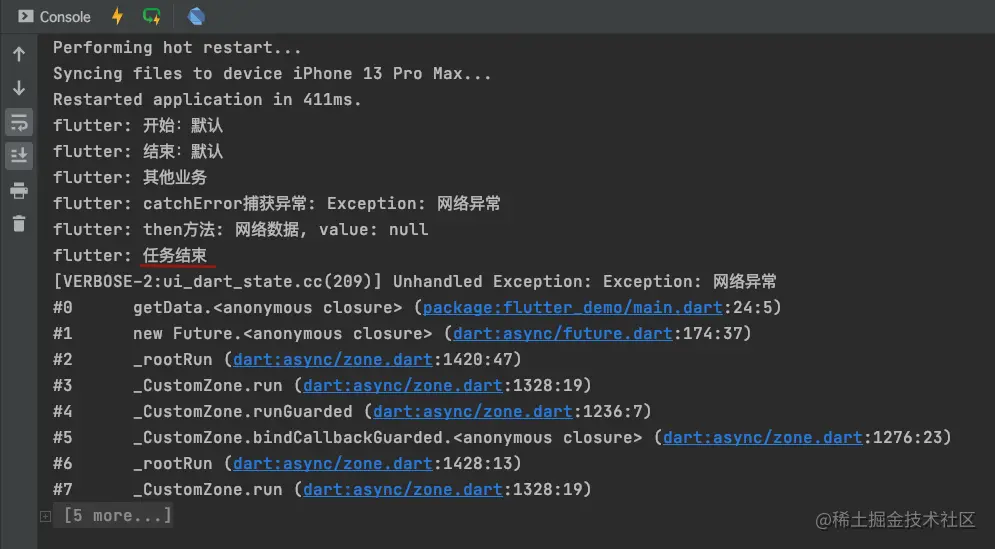

虽然我们的`whenComplete`完成状态执行了，但是异常依然被抛出了；这里有两种方式处理：

- `whenComplete`使用链式调用方式，不使用`Future`的对象调用；
- 在`whenComplete`之后，再次捕获异常，代码如下：

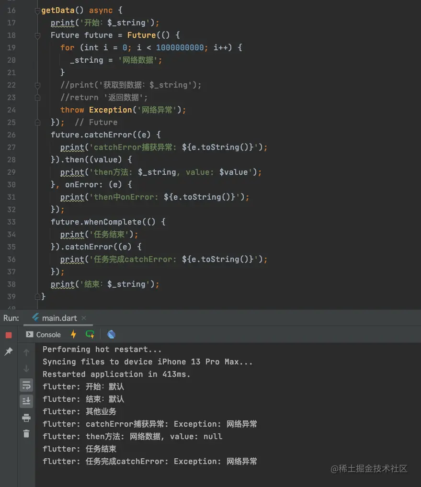

我们一般使用过程中将`then`方法中放在前面，这样当异常捕获时，`then`方法将不会执行：

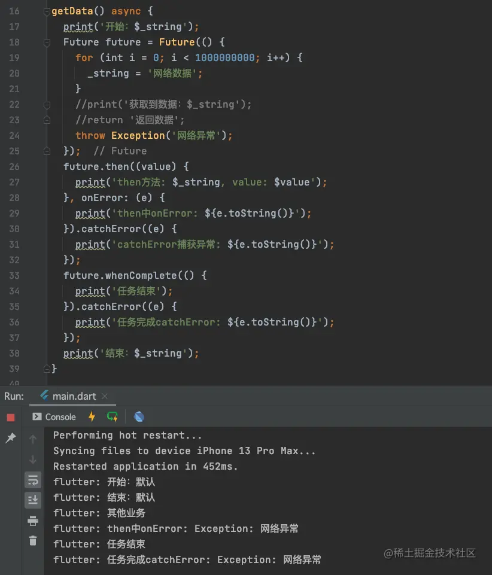

在项目中使用时，我们推荐以下写法：

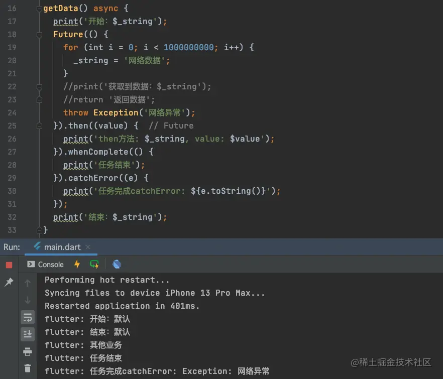

推荐将各个状态的逻辑处理方法抽出，如下：

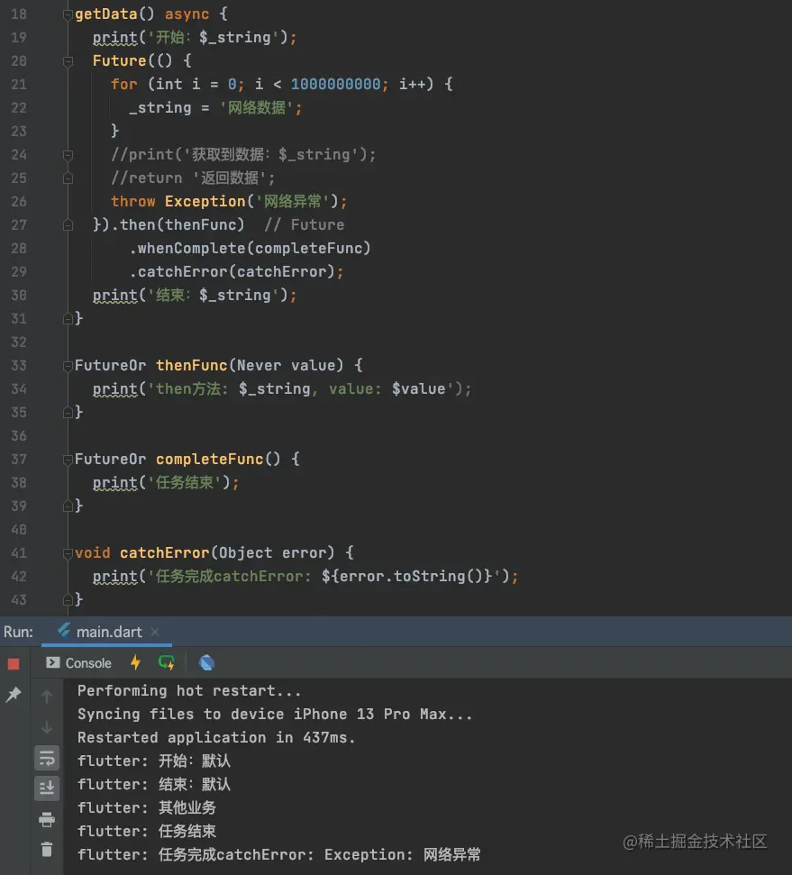
