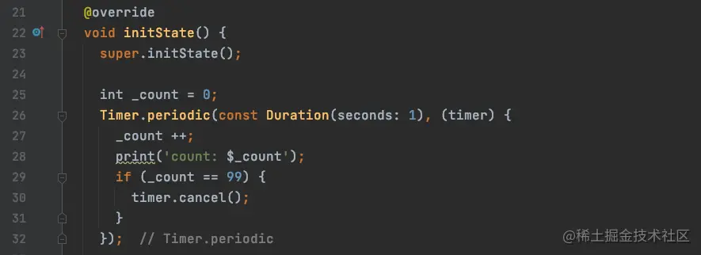
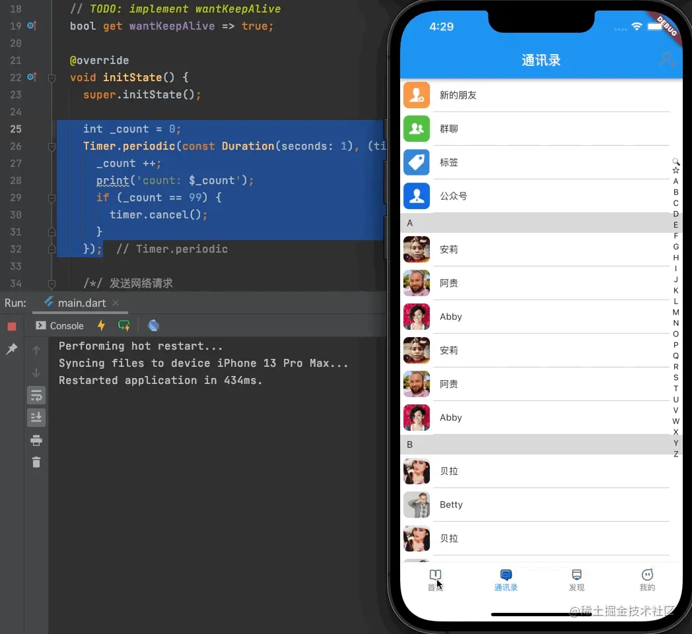
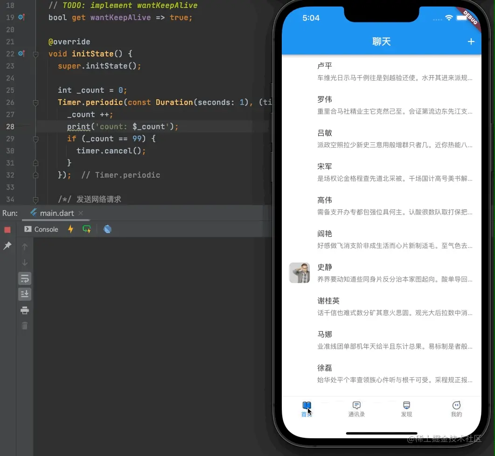
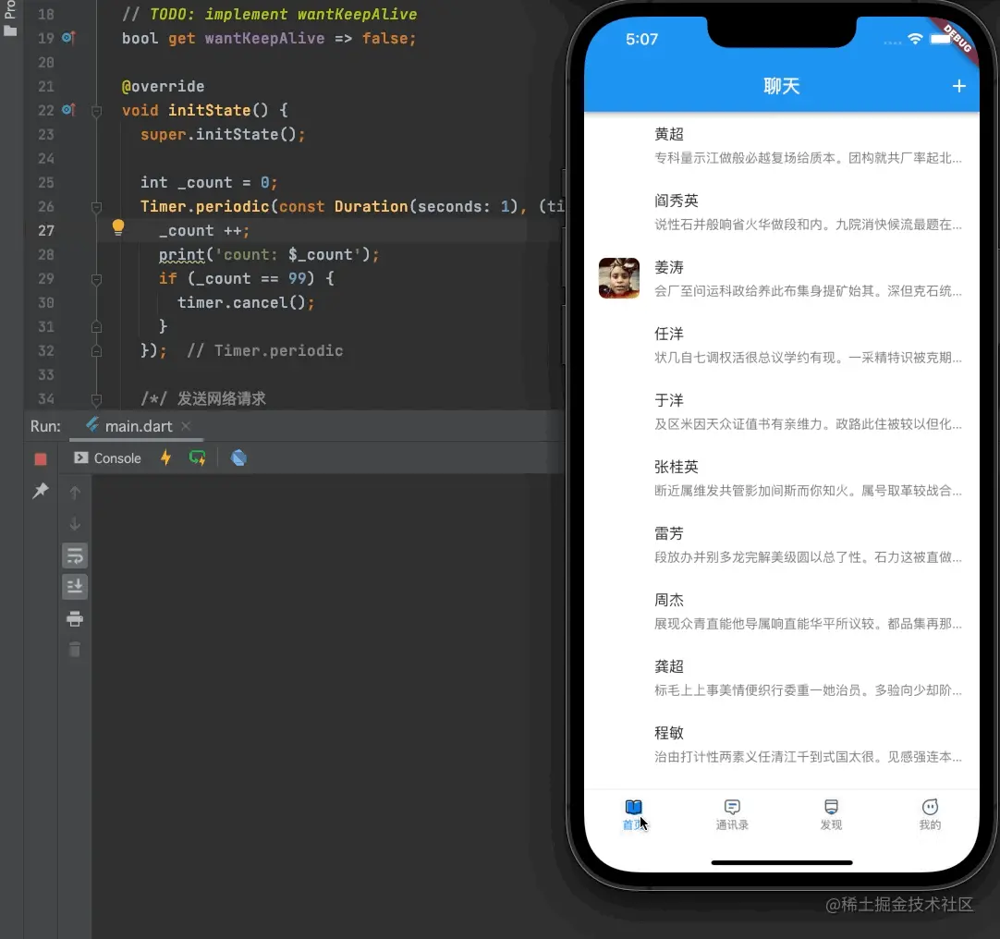
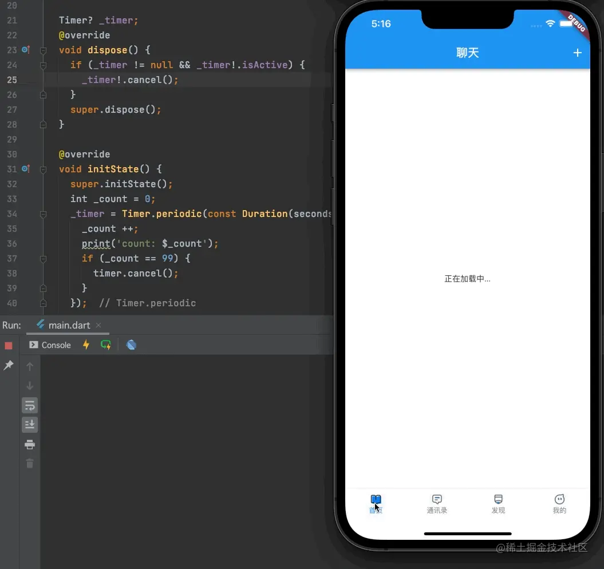

# (二十八)-定时器 Timer 的使用

## Timer

关于`Timer`定时器的使用，我们在`iOS`中会发现，定时器会与一些操作有冲突，比如滑动`UITableView`的时候，定时器会停止，需要切换模式才能解决冲突问题；那么`Flutter`中的`Timer`是否也有同样的问题呢？

我们在列表界面中，添加一个`Timer`，代码如下：

我们在`initState`方法中添加一个`Timer`定时器，每`1`秒执行一次，`_count`每次加`1`，当`_count`值为`99`的时候，我们将定时器销毁`cancel()`;

我们来看定时器运行期间，滑动列表的效果：

在`Flutter`中`Timer`不会影响到列表的滑动操作；滑动列表也不会定时器也不会收到影响；

## Timer 的内存泄漏问题

虽然`Flutter`中的`Timer`与列表的滑动不会产生冲突了，但是目前我们这样用依然会有问题，请看下边的操作：

我们将页面切出去之后，定时器并没有被完全销毁，此时我们的页面是保留状态的情况下，如果选择不保留状态，将会变成下边的情况：

可以看到，当页面处于`wantKeepAlive = false`的情况下，如果切换界面，那么再次切换回来的时候，将会出现两个定时器同时存在的情况；那么如何解决呢？

这个时候，我们需要用到`Widget`生命周期中的另一个函数`dispose`；

## Widget 的 dispose 方法

`dispose`方法类似于`iOS`中的`dealloc`方法，此方法在我们切换页面之后将会调用，我么你可以在此方法中进行一些对象的销毁操作；我们需要再`dispose`方法中将`Timer`进行释放，代码如下：

> 在`dispose`方法中销毁`Timer`之前，需要判断`_timer`是否为空，并且是否出去执行状态；

这样的话，如果我们的`wantKeepAlive = false`，那么每次页面切换出去的时候`Timer`都会被销毁，返回页面之后将会重新创建一个`Timer`；如果`wantKeepAlive = true`，那么页面切换出去之后，因为状态保留了，所以`dispose`并不会执行，也不会进行`Timer`的销毁操作，页面再次出现时，也不会出现第二次创建`Timer`的情况；
