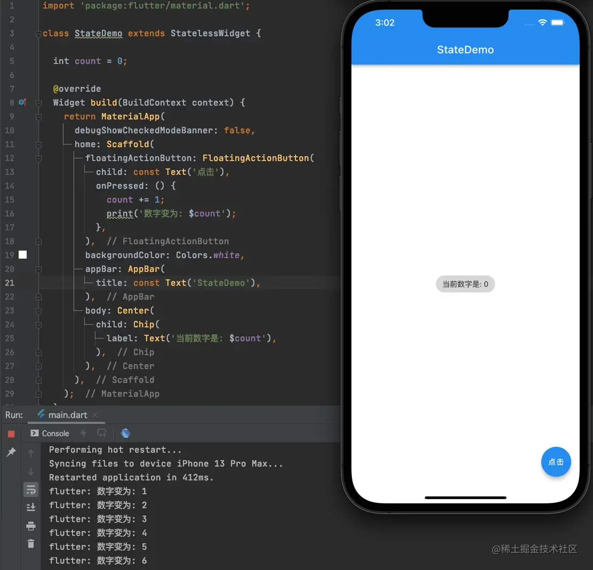

# (十)基础知识-Widget 的状态管理

## 状态管理

“状态管理” 是响应式编程框架中的一个永恒的主题，无论是`React`、`Vue`还是`Flutter`中处理的思想都是一致的。

常见的状态管理的方法：

- `Widget`管理自己的状态；
- `Widget`管理`子Widget`的状态；
- 混合管理：`父Widget`和`子Widget`都管理状态；

那么，如果决定到底使用哪一种管理方案呢？在此，官方给出了一些建议：

- 如果状态是用户数据，如选中状态，滑块位置等，则该状态建议由`父Widget`管理；
- 如果状态是界面效果，如颜色，动画等，则该状态建议由`Widget`自身来管理；
- 如果状态是不同`Widget`共享的，则该状态建议由`父Widget`管理；

> 在`Widget`内部管理状态时，便于封装；而`父Widget`中管理状态时则会比较灵活。如果我们在开发过程中不确定到底选用哪种状态管理，那么推荐在`父Widget`中管理，灵活性越高，就越容易扩展；

## 计数器案例

我们注意到，`Flutter`中很多`Widget`的属性都是由`final`来修饰的，而`final`修饰的属性只能被赋值一次，赋值之后不能再次修改，所以`Flutter`的渲染机制是使用新的`Widget`替换掉原来的`Widget`；对`Flutter`来说界面就没有必要拥有状态；但是如果所有的界面都没有状态，那么对于开发者来说，复杂的界面设计及数据的保留都会有问题；

其实，在我们`Flutter`初始化工程中，点击按钮，数字变化的过程就是状态管理的一个小案例，在数字改变的过程中，渲染时是通过一个个部件的相互替换来实现的，虽然部件没有状态，但是数字改变了，那么数字我们是要保留的；针对这种情况，`Flutter`中为我们提供了`有状态的Widget`。在`有状态Widget`中，渲染逻辑和数据逻辑是分开管理的，数据逻辑保留，渲染逻辑也就是 UI 不保留；

我们今天通过一个计数器的小例子来初步试用一下状态管理；

我们来看一段代码：  我们在屏幕上添加了一个气泡，气泡中显示数字，通过`count`赋值；

我们在界面上添加一个悬浮按钮，然后通过按钮点击，改变`count`的值：  我们发现，按钮点击之后，`count`发生了变化，但是界面上显示的数字并没有改变，还是默认的`0`；而且，此时如果我们使用`热重载`刷新界面，那么再次点击按钮时会发现`count`又从`0`开始了，也就是说，`count`的值并没有被保留下来；

如果我们需要点击时，界面上的数字发生变化，那么至少需要做到两方面：

- 点击按钮时渲染界面
- 要把`count`的值保留下来

我们注意到，此时`StateDemo`是发生了警告的 (波浪线)，我们将鼠标移动到`StateDemo`上，弹出警告信息如下：  这个警告的信息提示我们，在`StateDemo`中，有一个或多个属性没有使用`final`修饰，既然没有用`final`修饰，那么说明开发者可能在之后的操作中，会不止一次的修改属性的值，那么解决方法就有两种：

- 将属性使用`final`修饰，那么该属性只被允许赋值一次；
- 将`StateDemo`修改为`有状态`的；

很明显，我们的功能是需要多次修改`count`属性的值的，所以，我们只能修改`StateDemo`为`有状态的(StatefulWidget)`；修改之后代码如下：  此时，我们再次点击按钮，查看结果：  我们发现，`count`的值改变了，但是界面上显示的数字依然没有改变，此时我们`热重载`，然后查看效果：  `热重载`之后，界面上显示了改变之后的`6`，此时再次点击按钮会发现，打印的结果是从`6`开始累加，变成了`7`，也就是说`count`的状态我们已经保留了，但是没有在`count`发生改变是，让界面重新渲染而已；

那么咱么才能在`count`修改时，能够同时刷新界面呢，此时我们可以使用`setState`方法：  我们将`count += 1`代码使用`setState`方法包起来，那么每次点击按钮时，`count`改变，都会重新渲染界面了；

> `setState`方法被调用时，会重新执行`build`方法，重新刷新界面；`Flutter`的渲染机制查找整个渲染树，看`count`影响那个部件，那么在重新刷新渲染界面时，就只会重新渲染受影响的那个部件，不会整个界面重新渲染；
