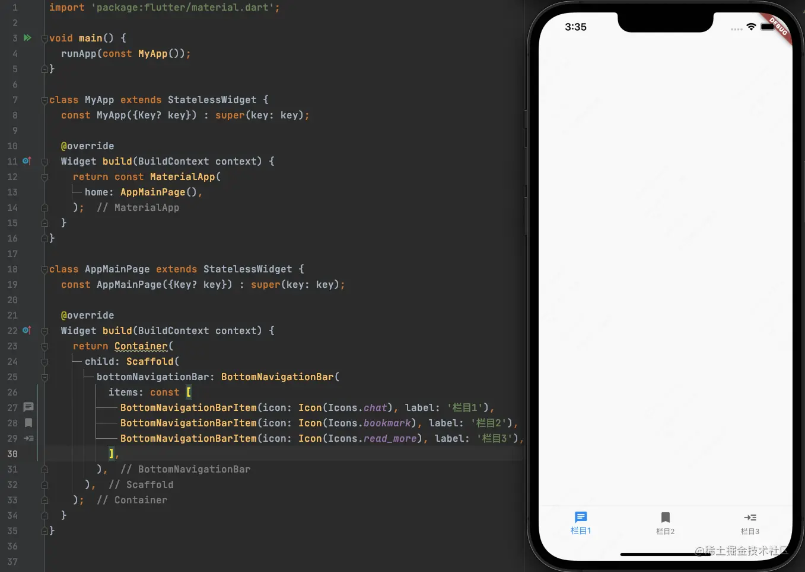
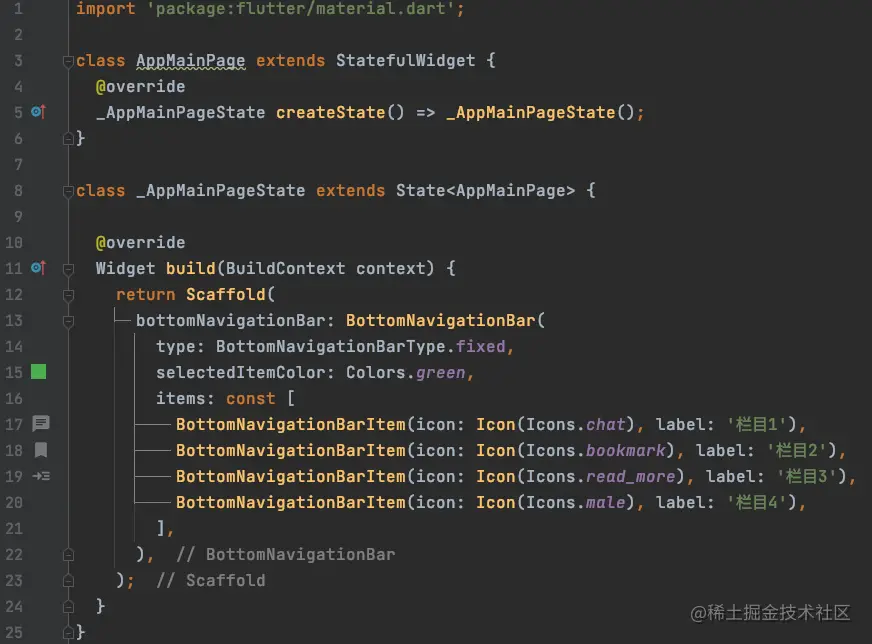

# (十一)实战-项目搭建

我们在前边的文章中已经已经讲解了常用的基础部件，那么我们从现在开始，尝试去完成一个完整的项目开发；

## 主框架搭建

### 底部导航

我们在前边介绍过`MaterialApp`这个小部件，在`Flutter`中，我们常用的创建`App`框架的手段就是基于此部件进行封装的，那么我们先来基于`MaterialApp`这个部件，把项目的主界面搭建出来：



- `Scaffold`中有`bottomNavigationBar`属性可以设置底部导航栏；
- `BottomNavigationBar`中`items`属性可以设置导航栏`BottomNavigationBarItem`的数组；

如果此时，我们再添加一个`BottomNavigationBarItem`呢？按照正常的逻辑，应该显示`4`个栏目，但是结果确实： 

> 注意，此时四个栏目其实已经显示出来了，但是渲染的效果出了问题，颜色默认了白色；

这个时候我们需要设置一下样式的问题，将`BottomNavigationBar`的`type`属性设置为`BottomNavigationBarType.fixed`，效果如下：


### 底部导航栏选中颜色

目前默认`栏目1`选中颜色为`蓝色`，那么如何修改器选中状态时的颜色呢？该效果可以通过两种方式来实现：

- 设置`BottomNavigationBar`的`fixedColor`属性：


- `BottomNavigationBar`的`selectedItemColor`属性：


### 切换选中的 Item

在`Item`切换之后，颜色也要跟着发生变化，想要实现这种效果，那么就需要用到状态管理，那么我们就需要对当前的代码进行改造： 我们将`AppMainPage`单独抽出，因为需要进行状态的改变，所以需要用到`有状态的Widget`，代码调整如下： 

那么，如何进行`Item`的切换呢？

在`BottomNavigationBar`中有`onTap`这样一个点击方法，其定义如下：

```js
final ValueChanged<int>? onTap;
```

- `int`为当前点击的`item`的索引；

我们来定义一个点击事件的方法，并将其赋值给`onTap`：

```js
void _itemTap(int index) async {

}

onTap: _itemTap,
```

这个时候，我们还需要一个`int`属性，来记录上次点击的`item`的索引，最终代码如下：

 状态改变时的代码：

```js
setState(() {
	_currentIndex = index;
});
```

也可以写为：

```js
_currentIndex = index;
setState(() {

});
```

我们一般推荐第一种写法；

### Item 对应的界面

首先，我们创建四个界面，因为在界面中需要设置导航栏，所以我们通常也是用`Scaffold`将界面包括起来，分别设置为不同的背景颜色；


然后，我们用一个数组来保存这几个界面：

```js
final List<Widget> _pages = [HomePage(), ContactsPage(), MessagePage(), MinePage()];
```

而界面是通过`Scaffold`的`body`属性来显示的，那么我们只要给`body`属性赋值就可以了：

```js
body: _pages[_currentIndex],
```

完整代码如下： 

## 细节补充

### MaterialApp 的 title 属性

此属性为安卓使用的，在 App 退出前台之后，在后台列表中 App 显示的 title； 

### 底部导航栏点击时的水波纹

底部导航栏上的`Item`在被点击或者被弹开的时候，会出现水波纹；想要取消水波纹效果，需要设置`MaterialApp`的`theme`属性：

```js
theme: ThemeData(
	highlightColor: const Color.fromRGBO(1, 0, 0, 0.0),
	splashColor: const Color.fromRGBO(1, 0, 0, 0.0)
),
```

- `highlightColor`：将被选中时的主题颜色设置为透明；
- `splashColor`：将被弹开时的主题颜色设置为透明；

### 底部导航栏点击时文字放大效果

底部导航栏`Item`被点击时，默认效果文字会被放大，想要取消放大效果，可以通过设置`BottomNavigationBar`的`selectedFontSize`和`unselectedFontSize`两个属性，将选中和未选中时两种状态的文字大小设置为一样大小即可： 

- `selectedFontSize`：默认大小为`14.0`；
- `unselectedFontSize`：默认大小为`12.0`；

### 导航栏背景色

想要修改导航栏背景色，需要设置`MaterialApp`中`theme`的`primarySwatch`属性：

```js
primarySwatch: Colors.pink,
```

> 这个设置是全局性的，整个 App 的导航栏颜色都会被修改；

效果如下： 

## 关于 Scaffold 的注意点

在使用`MaterialApp`时，我们一般结合`Scaffold`一起使用： 

那么，如果我们单独使用`Scaffold`会发生什么情况呢？

 

可以看到，`Scaffold`脱离`MaterialApp`单独使用就会报错：
