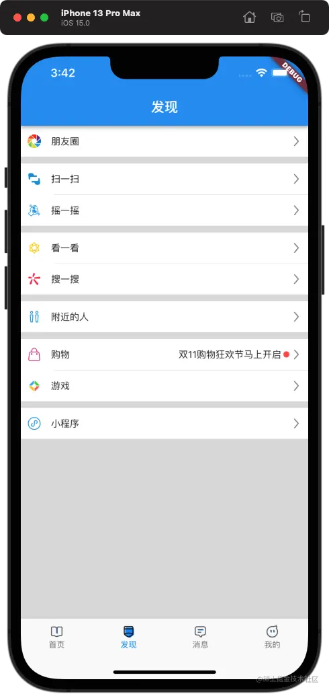
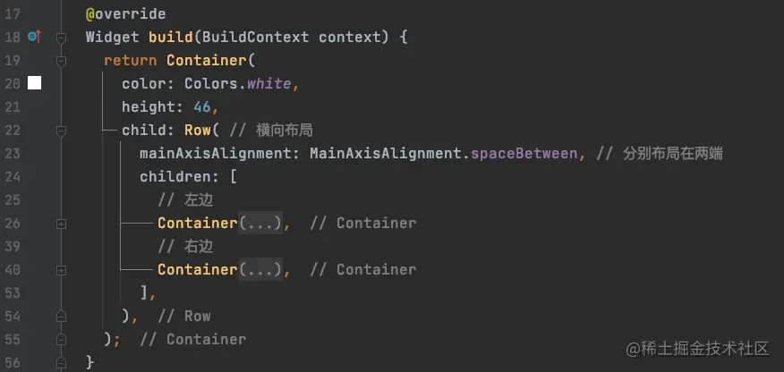
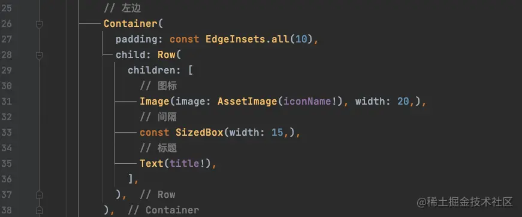
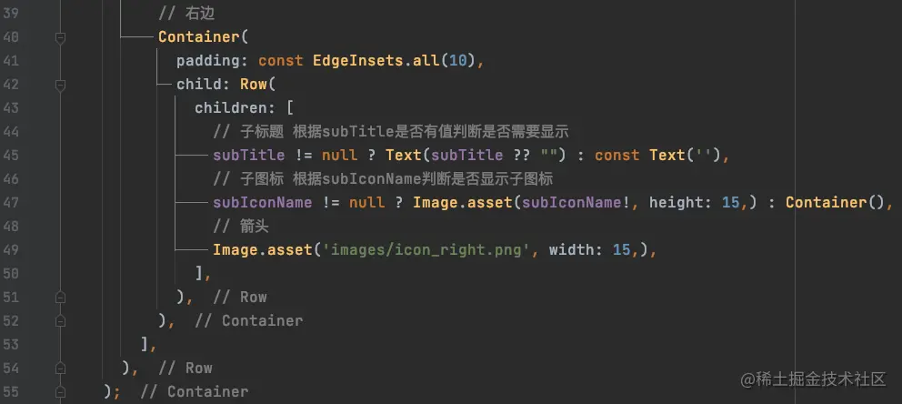
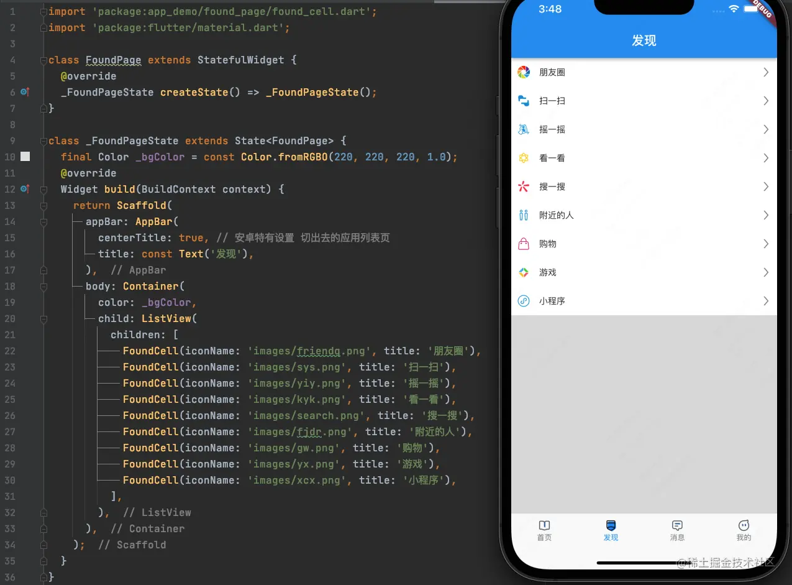
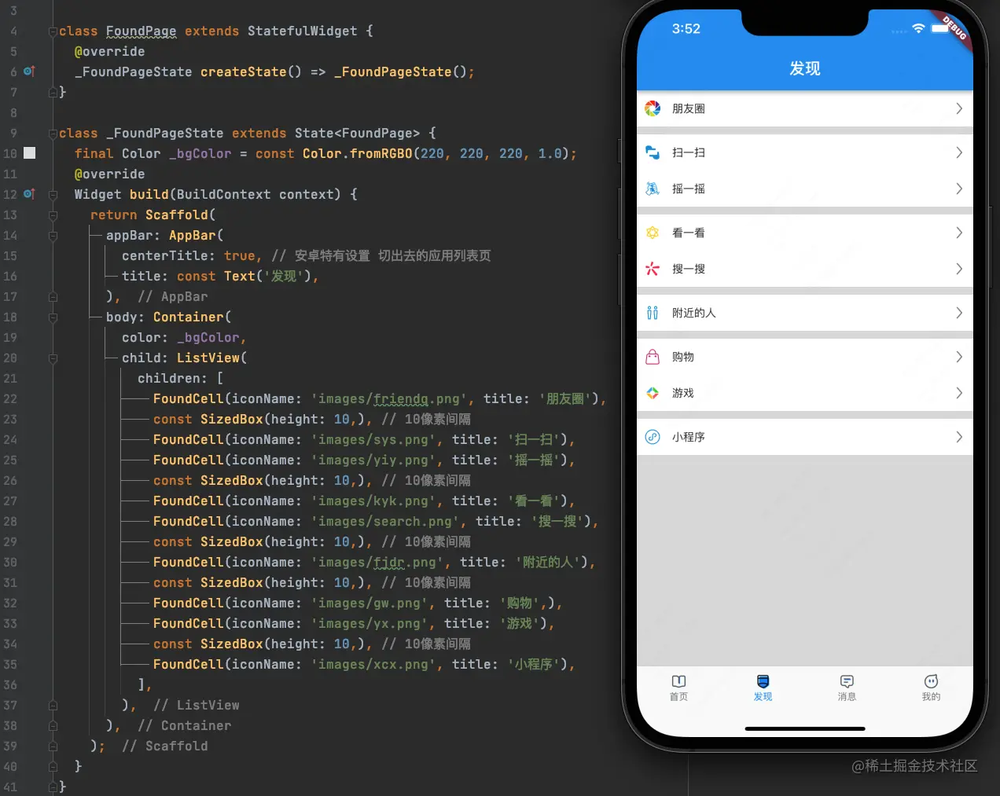
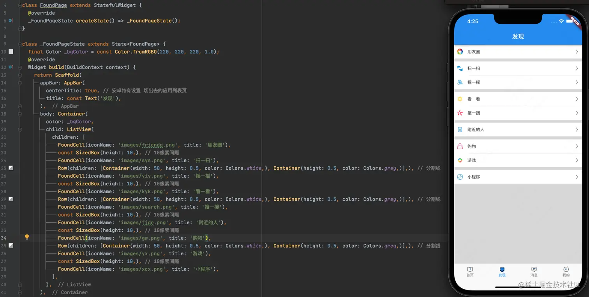
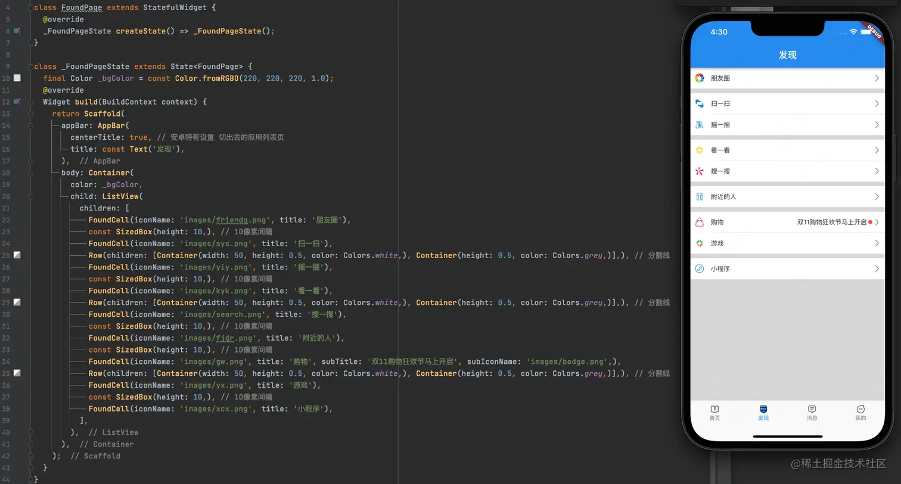

# (十三)实战-模仿微信发现界面

在之前的文章中我们已经搭建好了一个完整项目的框架，并且已经学会如何去加载本地的图片资源，那么今天我们就运用所学的知识，来模仿搭建微信的发现界面；我们先来看一下最终效果：



## 自定义 cell

### 属性及构造方法

首先我们来看一下这个界面上，每一个条目的元素组成，其元素最多的条目，也就是购物条目，有五个元素：图标，标题，子标题，红点 (称为子图标)，箭头，但是由于箭头这个元素是每一个条目固定的，所以我们在自定义的时候，只需要暴露四个元素即可；另外，由于子标题和子图标并非每一个条目都有的，所以期应该设置为`空安全`的：

```js
final String? iconName; // 图标名字
  final String? title; // 名字
  final String? subTitle; // 子标题
  final String? subIconName; // 子图标名字

  FoundCell({
    required this.iconName, // 必须要有
    required this.title, // 必须要有
    this.subTitle,
    this.subIconName,
  }) : assert(title != null, 'title 不能为空'), assert(iconName != null, 'iconName 不能为空');
```

> assert 断言，当 title 和 iconName 中有任何一个属性为空的时候，将会报错；

### 布局

我们从整体上看条目，可以将条目上的元素分为两部分：

- 第一部分：图标，标题；
- 第二部分：子图标，子标题，箭头
- 第一部分与第二部分分别布局在条目的两端

那么，我们可是使用`Row`进行布局：  首先看左边，左边的两个元素：图标和标题，我们可以在`Container`中使用`Row`进行布局，在其中添加`Image`和`Text`两个部件： 

- 图标和标题上下左右都有空白，我们使用`padding`给部件添加内边距；
- 在图标和标题中间有间隔，使用`SizeBox`增加`15`像素的空白；

右边元素分为三个部件：子标题，子图标，箭头，但是子标题和子图标这两个部件并非必须要显示的，所以需要根据属性来判断： 

- 子标题：当子标题为空时，我们直接给返回的`Text`部件赋值一个空字符串，否则赋值子标题；
- 子图标：当子图标为空时，我们返回一个空的`Container`部件，否则返回`Image`；

> `Image.asset('')`和`AssetImage('')`是两种加载本地图片的方式；

## 界面布局

从整体上看，发现界面是一个`ListView`来构建的，我们在之前曾经是用过`ListView`，在之前我们使用的是：

```js
ListView.builder(itemBuilder: itemBuilder)
```

发现界面相对简单，条目数量也有限，那么我们今天换一种思路来实现：  直接通过`ListView`的构造方法，将所有的条目，逐行添加到`ListView`上面；

那么条目之间的间隙怎么添加呢，这里有两种方式，一种是添加`Container`，一种是使用`SizeBox`，此处我们使用`SizeBox`来添加条目之间的间隔： 

### 分割线处理

我们注意到，在微信中，两个相邻的`cell`之间是有分割线的，而且分割线左侧是和`文字对齐`的；那么这个分割线我们怎么实现呢？这里我们推荐使用`Row`，在这里我们第一个想到的部件基本上回事`Container`，但是需要注意的是，使用`Container`的话，不管是设置`padding`还是`margin`在左侧都会显示出空白的区域，那么机会将底部灰色显示出来；

我们此处使用`Row`，可以在`Row`中添加两个`Container`，第一个白色背景，宽度`50`，第二个灰色背景，高度均为`0.5`： 

### 子标题和子图标


