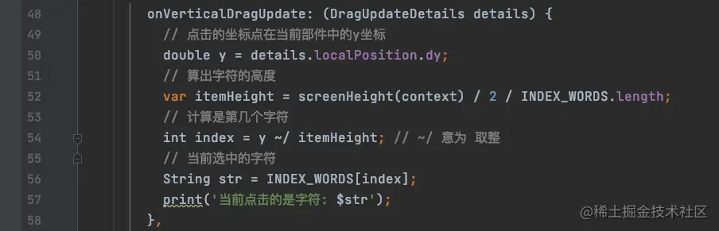

# (十八)实战-通讯录索引条

简单的通讯录列表页我们已经实现了，今天我们来实现通讯录的索引条；我们都知道通讯录的索引条是悬浮在列表上方的，在屏幕右侧；那么，我们的构建方式就要进行修改；

## 构建索引条

我们需要使用`Stack`来构建整个界面，使索引条显示在列表上面：


## 显示索引条数据

我们在索引条上显示一下信息：

```js
const INDEX_WORDS = [
  "🔍",
  "☆",
  "A",
  "B",
  "C",
  "D",
  "E",
  "F",
  "G",
  "H",
  "I",
  "J",
  "K",
  "L",
  "M",
  "N",
  "O",
  "P",
  "Q",
  "R",
  "S",
  "T",
  "U",
  "V",
  "W",
  "X",
  "Y",
  "Z",
];
```

索引条是竖着显示的，那么很明显，需要使用`Column`进行布局，我们先将`Column`的`children`对应的`Widget`数组创建好：

```js
final List<Widget> _indexList = []; // 索引条Widget数组

@override
  void initState() {
    super.initState();
    ......
    // 索引条
    for (int i = 0; i < INDEX_WORDS.length; i++) {
      _indexList.add(Text(INDEX_WORDS[i], style: const TextStyle(fontSize: 12),));
    }
  }
```

这样，我们就讲所有需要显示的`Widget`放在`_indexList`中，只需要给`Column`的`children`赋值为`_indexList`即可：


## 索引条布局优化

目前，所有的索引字母都是在最上面开始显示的，而且各个字母之间的距离过近，此时我们可使用`Expanded`将`Text`包起来，让他们自适应布局：

```js
// 索引条
for (int i = 0; i < INDEX_WORDS.length; i++) {
  _indexList.add(
      Expanded(
        child: Text(
          INDEX_WORDS[i],
          style: const TextStyle(fontSize: 12),
        ),
      )
  );
}
```

此时，重新渲染界面，效果如下：


我们改一下索引条的位置如下：


为了便于操作及扩展，我们将索引条抽取出来，放在`IndexBar`中，完整代码如下：


这样我们在`Stack`中直接使用`IndexBar`即可，也便于后续扩展功能；


## 索引条的状态改变

接下来，修改一下索引条在不同情况下的状态变化：默认透明背景，黑色字体，点击或者在上边滑动时背景变黑，字体变白；

我们定义两个颜色，一个背景色，一个字体颜色：

```js
Color _bgColor = const Color.fromRGBO(1, 1, 1, 0.0); // 背景色 默认透明
  Color _textColor = Colors.black; // 字体颜色 默认黑色
```

接下来，在手势触发时，修改两个颜色：


这个时候，我们发现在手势触发时，背景色变了，而字体颜色没有发生改变，这是因为我们字体使用的`Text`控件的初始化放在了`initState`方法中，而此方法只有在界面创建时才会调用；`setState`触发的是`build`方法，所以我们应该将创建`Text`的循环过程放在`build`中进行，最终代码如下：


效果如下：


> 需要注意的是，`_indexList`的定义也要放在`build`中，否则每一次渲染，列表都会被渲染一次，而数组没有重新创建，会一直往里边增加元素；

## 确定鼠标所在的索引位置

现在索引条我们已经基本完成了，那么我们如果知道点击的时候，当前是点击的哪一个字母呢？我们注意到手势的事件是否参数的：

```js
DragDownDetails({
  this.globalPosition = Offset.zero,
  Offset? localPosition,
})
```

那么这两个参数都是什么意思呢？我们来打印一下：


我们通过打印信息可以确定，这两个都是坐标位置：

- `globalPosition`：当前点击点在全局的位置；
- `localPosition`：当前点击点在当前部件中的位置；

`localPosition`也是可以通过`globalPosition`计算得到的：


接下来我们就可以确定，当前点击的是第几个字符了：



我么你讲此处的操作封装为方法：

```js
String getIndexString(BuildContext context, Offset localPosition) {
  // 点击的坐标点在当前部件中的y坐标
  double y = localPosition.dy;
  // 算出字符的高度
  var itemHeight = screenHeight(context) / 2 / INDEX_WORDS.length;
  // 计算是第几个字符
  int index = y ~/ itemHeight; // ~/ 意为 取整
  // 当前选中的字符
  String str = INDEX_WORDS[index];
  return str;
}
```

但是此时是有问题的，如果我们滑动的区域超出了索引条的区域就会报错：


所以，我们的`index`取值范围是有限制的：

```js
String getIndexString(BuildContext context, Offset localPosition) {
  // 点击的坐标点在当前部件中的y坐标
  double y = localPosition.dy;
  // 算出字符的高度
  var itemHeight = screenHeight(context) / 2 / INDEX_WORDS.length;
  // 计算是第几个字符
  int index = (y ~/ itemHeight).clamp(0, INDEX_WORDS.length - 1); // ~/ 意为 取整 区域限制在[0, length-1]
  // 当前选中的字符
  String str = INDEX_WORDS[index];
  return str;
}
```

## 索引条与联系人列表联动

通常我们点击索引条的时候，是需要联系人列表滚动到相应位置的，那么我们就需要`IndexBar`对外保留一个接口：

```js
// 点击索引字符的回调；
final void Function(String str)? indexBarCallBack;
IndexBar({this.indexBarCallBack});
```

然后在`IndexBar`触发手势事件时，回调该函数：


这样，我们就能在使用`IndexBar`时，在其构造函数中获取点击的字符：


接下来，如果需要`ListView`同步滚动的话，需要使用到`ListView`中的属性`controller`，我们先定义一个`_scrollController`的属性，然后在`initState`中初始化：


然后将`_scrollController`赋值给`ListView`的`controller`属性：


这样的话，如果我们需要滚动`ListView`，那么我们只需要拿到`_scrollController`进行滚动即可；如下：


点击索引字符之后，让`ListView`滚动到`260`像素的位置，总共动画时长为`1`秒，`Curves.easeIn`的意思是动画开始和结束时速度快，中间速度慢；效果如下：


现在我们滚动到了一个固定值，那么只要我们能够算出每一个分组的位置，就能实现点击字符，滚动到某一个分组的效果；

## 计算索引分组的位置

我们如果想要滚动到分组的位置，那么就需要提前把位置信息计算出来，我们创建一个`Map`用来存放每一个分组与其高度的对应关系：

```js
/*存放分组的字符和其对应的高度*/
final Map _groupOffsetMap = {
  INDEX_WORDS[0]: 0.0,
  INDEX_WORDS[1]: 0.0,
};
```

`0`和`1`两个位置不是字母，可以不用滚动，所以其高度定为`0`；然后在`initState`中循环计算每一个分组头的高度：

```js
final double _rowHeight = 51;
final double _groupHeaderHeight = 30;

// 循环计算，将每一个分组头的字符位置计算出来，放入map中
var _groupOffset = _rowHeight * _headerList.length; // 头部四个的高度
for (int i = 0; i < _listDatas.length; i++) {
  if (i < 1) {
    // 第一个一定有头
    _groupOffsetMap.addAll(
        {_listDatas[i].indexLetter: _groupOffset}); // 第一个头部高度为 51 * 4
    // 改变偏移位置
    _groupOffset += _rowHeight + _groupHeaderHeight;
  } else if (_listDatas[i].indexLetter == _listDatas[i - 1].indexLetter) { // 前后两个indexLetter相同的话不用保存；
    // 不存map，只添加偏移
    _groupOffset += _rowHeight;
  } else {
    _groupOffsetMap.addAll({_listDatas[i].indexLetter: _groupOffset});
    // 改变偏移位置
    _groupOffset += _rowHeight + _groupHeaderHeight;
  }
}
```

在滚动时，从`Map`中取出高度，然后滚动到具体位置：


运行效果如下：


## 索引条指示器

如果需要显示索引条的指示器，那么我们就需要修改索引条的布局：


我们在添加上气泡，然后默认显示一个`A`，在气泡中居中显示：


其中，文字在气泡中居中显示是使用了`Stack`的`alignment`属性，用来调整位置；接下来就是控制气泡显示的位置了，警告我们尝试，气泡上下两端位置的显示区域如下：


我们除了要控制指示器显示的位置，显示的文字还得判断指示器的隐藏和显示状态，我们定义三个变量：

```js
double _indicatorY = 0.0; // 指示器默认Y值
String _indicatorTitle = 'A'; // 指示器文字 默认A
bool _indicatorHidden = true; // 指示器显示与隐藏 默认隐藏
```

我们将之前写的获取选中字符的方法修改一下，返回字符的索引值：

```js
/*获取选中的字符索引*/
int getIndex(BuildContext context, Offset localPosition) {
  // 点击的坐标点在当前部件中的y坐标
  double y = localPosition.dy;
  // 算出字符的高度
  var itemHeight = screenHeight(context) / 2 / INDEX_WORDS.length;
  // 计算是第几个字符
  int index = (y ~/ itemHeight).clamp(0, INDEX_WORDS.length - 1); // ~/ 意为 取整 clamp限制取值范围在[0, length - 1]
  return index;
}
```

最终指示器代码如下：


运行效果如下：


> 至此，通讯录界面效果已完全实现；
