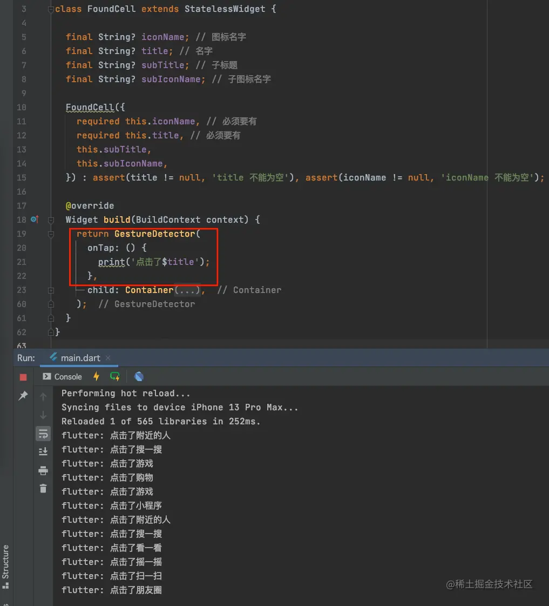
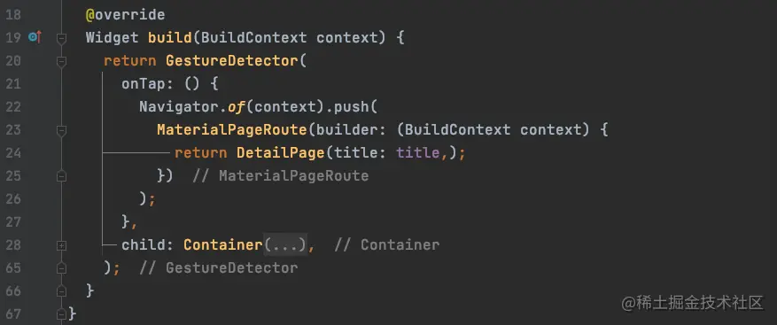
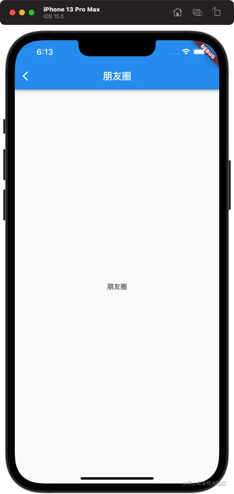
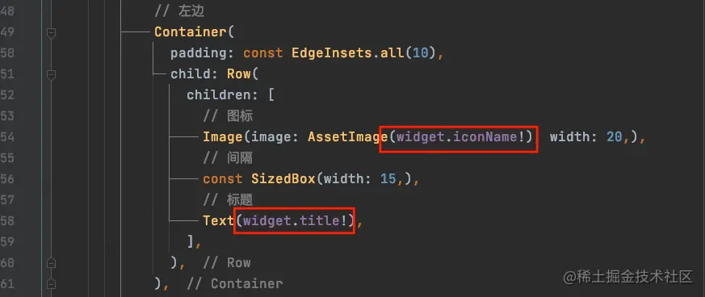
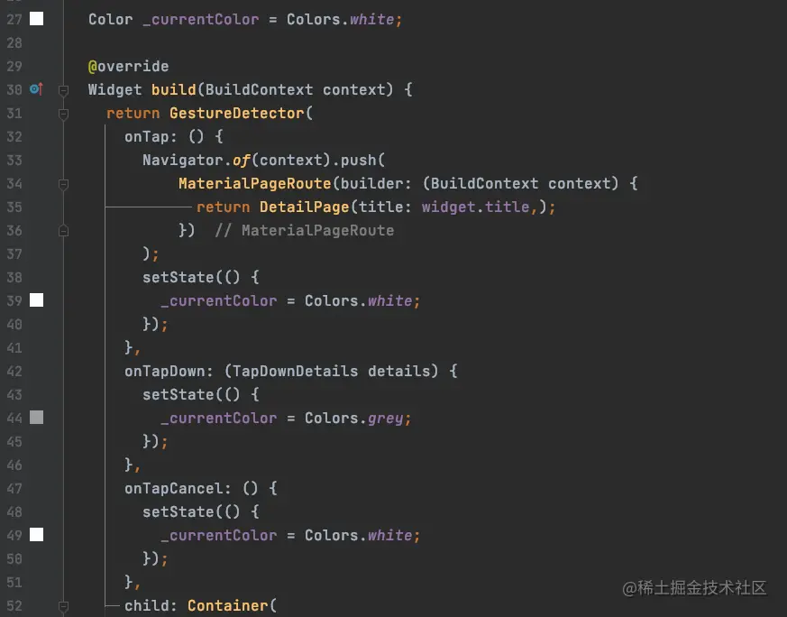
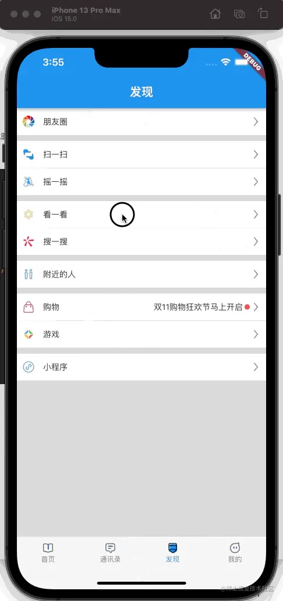

# (十四)实战-cell 的点击处理

我们已经实现了微信的发现界面的效果，但是此时还有一个问题，`cell`的点击事件如何处理，以及`cell`点击时状态的变化，比如背景色等；这些问题在本篇文章中，我们来一一讲解；

## cell 的点击事件

我们的`cell`是用`Container`来构建的，但是`Container`并不能支持手势操作，在`Flutter`中，手势的操作通过`GestureDetector`来实现。我们将`Container`用`GestureDetector`包起来，这样我们就可以定义点击事件了： 

## GestureDetector 小知识

`GestureDetector`是`Flutter`中一个用于手势识别的功能性组件，通过它，我们可以识别各种手势；在其内部封装了`Listener`用来识别语义化的手势；

我们通过将`Container`包含在`GestureDetector`中来实现手势操作，常见的手势操作如下：

- `onTap`：点击；
- `onTapDown`：按下；
- `onTapCancel`：取消；
- `onDoubleTap`：双击；
- `onLongPress`：长安；

## Navigator 介绍

它是一个路由管理的组件，提供`打开`和`退出`路由页的方法。`Navigator`通过一个`栈`来管理活动路由集合。通常当前屏幕显示的页面就是`栈顶的路由。` 最常用的两个方法为：

- Future push(Route route)
  - 将给定的路由`入栈`，也就是打开新的界面，返回值是一个`Future`对象，用来接收新路由`出栈`(关闭页面) 时的返回数据；
- bool pop([result])
  - 将栈顶路由`出栈`，`result`为页面关闭时返回给上一个页面的数据。

除此之外，`Navigator`还有很多其他方法，如`Navigator.replace`、`Navigator.popUntil`等，我们后续用到再讲解；

## cell 点击跳转界面

`cell`的点击事件已经完成了，怎么少得了进行`push`操作呢？接下来我们演示如果使用`Navigator`进行`push`操作；通过`push`方法的定义，我们知道需要给`push`方法传递一个`Route`，在我们`Flutter`中有一个`MaterialPageRoute`这样一个现成的`Route`，我们此处使用它进行操作，其定义如下：

```js
MaterialPageRoute({
    required this.builder,
    RouteSettings? settings,
    this.maintainState = true,
    bool fullscreenDialog = false,
  })
```

- `builder`是一个`WidgetBuilder`类型的回调函数，作用是构建路由页面的内容，返回值是一个`Widget`。一般我们实现此回调，用来返回路由的实例；
- `settings`包含路由的配置信息，比如名称，是否初始路由 (首页)；
- `maintainState`默认情况，当入栈一个新的路由时，原来的路由仍然会被保存在内存中，如果想要在路由没用的时候释放其所占用的所有资源，则可以设置`maintainState`为`false`；
- `fullscreenDialog`表示新的路由页面是否是一个全屏的模态对话框。`iOS`中，如果`fullscreenDialog`为`true`，新页面将会从屏幕底部滑入 (而不是水平方向)；

我们比如给`MaterialPageRoute`的构造方法传递一个`builder`的参数，通常我们的理解`builder`是用来渲染的，其类型定义为：

```js
typedef WidgetBuilder = Widget Function(BuildContext context);
```

简单来说，就是一个带`BuildContext context`参数的方法，其返回值为`Widget`，我就是说，我们需要在`builder`中定义一个返回`新页面`(需要打来的界面) 的方法，方法带参数`BuildContext context`： 

> `DetailPage`是我们要进行`push`打开的新界面，在新界面中，我们定义了其构造方法，传递一个`title`，用来显示导航栏标题：

```js
class DetailPage extends StatelessWidget {

  final String? title;

  DetailPage({this.title});

  @override
  Widget build(BuildContext context) {
    return Scaffold(
      appBar: AppBar(
        title: Text(title ?? ''),
      ),
      body: Center(
        child: Text(title ?? ''),
      ),
    );
  }
}
```

效果如下： 

## 有状态的 cell

我们注意到，在`cell`点击的时候，微信的条目是会变灰然后恢复白色的，此时很明显，微信的`cell`是有状态的，那么我们首先需要将我们的`cell`从`StatelessWidget`改为`StatefulWidget`;

改为`有状态`的`StatefulWidget`之后，我们需要创建`FoundCellState`继承自`State`：

```js
class _FoundCellState extends State<FoundCell> {}
```

然后，将原来的`build`方法，转移到`_FoundCellState`中来，转移之后会发现，原来的属性不能直接访问了，此时我们需要使用`widget.title`来访问`title`属性： 

> 此时的`widget`指向我们定义的`StatefulWidget`，也就是`FoundCell`；

此时，我们需要处理手势的三个状态：点击，点下去，取消；

```js
return GestureDetector(
      onTap: () {
        print('1');
        Navigator.of(context).push(
            MaterialPageRoute(builder: (BuildContext context) {
              return DetailPage(title: widget.title,);
            })
        );
      },
      onTapDown: (TapDownDetails details) {
        print('2');
      },
      onTapCancel: () {
        print('3');
      },
    );
```

我们分别在这三个手势事件中打印数字，结果发现：

- 进行`push操作`，输出`2 1`；
- 点击拖动操作，输出`2 3`；

那么，也就是说，我们需要在`onTapDown`方法中，将`cell`背景变灰色，`onTap`和`onTapCancel`两个方法中将`cell`背景变白色：  效果如下：



> 需要注意的是，如果`cell`非常复杂，我们把`cell`整个改为`有状态`的将会影响性能，在`cell`比较复杂的情况下，我们只需要将需要改变状态的那部分`Widget`改为`StatefulWidget`即可； 在将整个`cell`都改为`有状态`时，`cell`也并非整体渲染；`Widget`是界面的`描述`，并非真正的界面；重新构建时，构建的是描述，而非界面本身；真正消耗性能的是其他东西，我们后续再讲；
