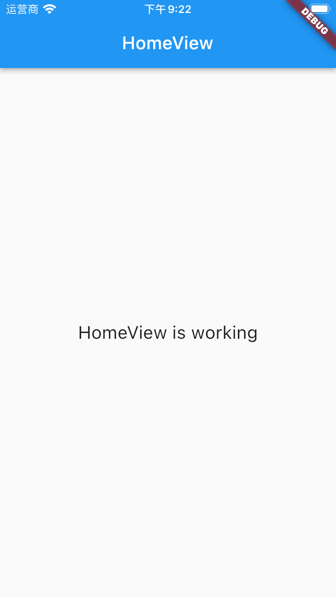

# GetX Cli

## GetX Cli 安装

[零基础视频教程地址](https://www.bilibili.com/video/BV1uq4y1U7fF?p=17)

### 第一步：安装 Cli 脚手架

我们通过命令`flutter pub global activate get_cli` 进行脚手架的全局安装，本文以`Mac OS`为例。

```dart
JMdeMacBook-Pro:~ jm$ flutter pub global activate get_cli

Resolving dependencies...
+ _fe_analyzer_shared 25.0.0
+ analyzer 2.2.0
+ ansicolor 2.0.1
+ archive 3.1.2
+ args 2.2.0
+ async 2.8.2
+ charcode 1.3.1
+ cli_dialog 0.5.0
+ cli_menu 0.3.0-nullsafety.0
+ cli_util 0.3.3
+ clock 1.1.0
+ collection 1.15.0
+ convert 3.0.1
+ crypto 3.0.1
+ dart_console 1.0.0
+ dart_style 2.0.3
+ ffi 1.1.2
+ file 6.1.2
+ get_cli 1.6.0
+ glob 2.0.1
+ http 0.13.3
+ http_parser 4.0.0
+ intl 0.17.0
+ matcher 0.12.11
+ meta 1.7.0
+ package_config 2.0.0
+ path 1.8.0
+ pedantic 1.11.1
+ process_run 0.12.1+1
+ pub_semver 2.0.0
+ pubspec 2.0.1
+ quiver 3.0.1
+ recase 4.0.0
+ source_span 1.8.1
+ stack_trace 1.10.0
+ string_scanner 1.1.0
+ synchronized 3.0.0
+ term_glyph 1.2.0
+ typed_data 1.3.0
+ uri 1.0.0
+ version 2.0.0
+ watcher 1.0.0
+ win32 2.2.9
+ yaml 3.1.0
Downloading get_cli 1.6.0...
Downloading version 2.0.0...
Downloading recase 4.0.0...
Downloading pubspec 2.0.1...
Downloading cli_menu 0.3.0-nullsafety.0...
Downloading cli_dialog 0.5.0...
Downloading ansicolor 2.0.1...
Downloading uri 1.0.0...
Downloading process_run 0.12.1+1...
Downloading synchronized 3.0.0...
Downloading dart_console 1.0.0...
Downloading quiver 3.0.1...
Downloading dart_style 2.0.3...
Downloading analyzer 2.2.0...
Downloading _fe_analyzer_shared 25.0.0...
Downloading win32 2.2.9...
Building package executables...
Built get_cli:get.
Installed executables get and getx.
Warning: Pub installs executables into $HOME/.pub-cache/bin, which is not on your path.
You can fix that by adding this to your shell's config file (.bashrc, .bash_profile, etc.):

export PATH="$PATH":"$HOME/.pub-cache/bin"

Activated get_cli 1.6.0.
```

### 第二步：设置环境变量

一般`Mac`的环境变量都是通过根目录的`.bash_profile`进行环境变量设置。

```dart
#getX
export PATH="$PATH":"$HOME/.pub-cache/bin"
```

### 第三步：使设置的环境变量生效

我们可以通过`source` 加上路径，对环境变量生效。

```dart
JMdeMacBook-Pro:~ jm$ source "/Users/jm/.bash_profile"
```

### 第四步：校验是否成功安装

我们通过`get`命令，看能不能打印如下，如果有，那么恭喜你安装成功了。

```dart
JMdeMacBook-Pro:~ jm$ get

List available commands:

  create:
    controller:  Generate controller
    page:  Use to generate pages
    project:  Use to generate new project
    provider:  Create a new Provider
    screen:  Generate new screen
    view:  Generate view
  generate:
    locales:  Generate translation file from json files
    model:  generate Class model from json
  help:  Show this help
  init:  generate the chosen structure on an existing project:
  install:  Use to install a package in your project (dependencies):
  remove:  Use to remove a package in your project (dependencies):
  sort:  Sort imports and format dart files
  update:  To update GET_CLI
  --version:  Shows the current CLI version'

Time: 1814 Milliseconds
```

## Cli 创建工程

我们可以通过`get create project`来进行创建工程，

```dart
JMdeMacBook-Pro:getx jm$ get create project
```

然后出现如下提示，我们选择创建`Flutter Project`

```dart
-->   1) Flutter Project
      2) Get Server
```

选择之后需要输入**工程名称**、**公司域名**、**选择 iOS 语言**、**选择 Android 语言**、**是否空安全**、**是否校验**，选完知道就会为我们开始创建工程。

```dart
JMdeMacBook-Pro:getx jm$ get create project
-->   1) Flutter Project
      2) Get Server
? what is the name of the project? getx_example
? What is your company's domain?  Example: com.yourcompany  com.jimi

what language do you want to use on ios?

      1) Swift
-->   2) Objective-C

what language do you want to use on android?

      1) Kotlin
-->   2) Java

Do you want to use null safe?

-->   1) Yes!
      2) No

do you want to use some linter?

      1) no
      2) Pedantic [Deprecated]
      3) Effective Dart [Deprecated]
-->   4) Dart Recommended

Running `flutter create /Users/jm/Desktop/Project/getx/getx_example` …

$ flutter create --no-pub -i objc -a java --org com.jimi /Users/jm/Desktop/Project/getx/getx_example
Creating project ....
  test/widget_test.dart (created)
  pubspec.yaml (created)
  README.md (created)
  lib/main.dart (created)
  windows/runner/flutter_window.cpp (created)
  windows/runner/utils.h (created)
  windows/runner/utils.cpp (created)
  windows/runner/runner.exe.manifest (created)
  windows/runner/CMakeLists.txt (created)
  windows/runner/win32_window.h (created)
  windows/runner/Runner.rc (created)
  windows/runner/win32_window.cpp (created)
  windows/runner/resources/app_icon.ico (created)
  windows/runner/main.cpp (created)
  windows/runner/resource.h (created)
  windows/runner/flutter_window.h (created)
  windows/flutter/CMakeLists.txt (created)
  windows/.gitignore (created)
  windows/CMakeLists.txt (created)
  ios/Runner.xcworkspace/contents.xcworkspacedata (created)
  ios/Runner.xcworkspace/xcshareddata/IDEWorkspaceChecks.plist (created)
  ios/Runner.xcworkspace/xcshareddata/WorkspaceSettings.xcsettings (created)
  ios/Runner/Info.plist (created)
  ios/Runner/Assets.xcassets/LaunchImage.imageset/LaunchImage@2x.png (created)
  ios/Runner/Assets.xcassets/LaunchImage.imageset/LaunchImage@3x.png (created)
  ios/Runner/Assets.xcassets/LaunchImage.imageset/README.md (created)
  ios/Runner/Assets.xcassets/LaunchImage.imageset/Contents.json (created)
  ios/Runner/Assets.xcassets/LaunchImage.imageset/LaunchImage.png (created)
  ios/Runner/Assets.xcassets/AppIcon.appiconset/Icon-App-76x76@2x.png (created)
  ios/Runner/Assets.xcassets/AppIcon.appiconset/Icon-App-29x29@1x.png (created)
  ios/Runner/Assets.xcassets/AppIcon.appiconset/Icon-App-40x40@1x.png (created)
  ios/Runner/Assets.xcassets/AppIcon.appiconset/Icon-App-20x20@1x.png (created)
  ios/Runner/Assets.xcassets/AppIcon.appiconset/Icon-App-1024x1024@1x.png (created)
  ios/Runner/Assets.xcassets/AppIcon.appiconset/Icon-App-83.5x83.5@2x.png (created)
  ios/Runner/Assets.xcassets/AppIcon.appiconset/Icon-App-20x20@3x.png (created)
  ios/Runner/Assets.xcassets/AppIcon.appiconset/Contents.json (created)
  ios/Runner/Assets.xcassets/AppIcon.appiconset/Icon-App-20x20@2x.png (created)
  ios/Runner/Assets.xcassets/AppIcon.appiconset/Icon-App-29x29@3x.png (created)
  ios/Runner/Assets.xcassets/AppIcon.appiconset/Icon-App-40x40@2x.png (created)
  ios/Runner/Assets.xcassets/AppIcon.appiconset/Icon-App-60x60@3x.png (created)
  ios/Runner/Assets.xcassets/AppIcon.appiconset/Icon-App-60x60@2x.png (created)
  ios/Runner/Assets.xcassets/AppIcon.appiconset/Icon-App-76x76@1x.png (created)
  ios/Runner/Assets.xcassets/AppIcon.appiconset/Icon-App-40x40@3x.png (created)
  ios/Runner/Assets.xcassets/AppIcon.appiconset/Icon-App-29x29@2x.png (created)
  ios/Runner/Base.lproj/LaunchScreen.storyboard (created)
  ios/Runner/Base.lproj/Main.storyboard (created)
  ios/Runner.xcodeproj/project.xcworkspace/contents.xcworkspacedata (created)
  ios/Runner.xcodeproj/project.xcworkspace/xcshareddata/IDEWorkspaceChecks.plist (created)
  ios/Runner.xcodeproj/project.xcworkspace/xcshareddata/WorkspaceSettings.xcsettings (created)
  ios/Runner.xcodeproj/xcshareddata/xcschemes/Runner.xcscheme (created)
  ios/Flutter/Debug.xcconfig (created)
  ios/Flutter/Release.xcconfig (created)
  ios/Flutter/AppFrameworkInfo.plist (created)
  ios/.gitignore (created)
  getx_example.iml (created)
  .gitignore (created)
  web/favicon.png (created)
  web/index.html (created)
  web/manifest.json (created)
  web/icons/Icon-maskable-512.png (created)
  web/icons/Icon-192.png (created)
  web/icons/Icon-maskable-192.png (created)
  web/icons/Icon-512.png (created)
  .metadata (created)
  macos/Runner.xcworkspace/contents.xcworkspacedata (created)
  macos/Runner.xcworkspace/xcshareddata/IDEWorkspaceChecks.plist (created)
  macos/Runner/Assets.xcassets/AppIcon.appiconset/app_icon_16.png (created)
  macos/Runner/Assets.xcassets/AppIcon.appiconset/app_icon_1024.png (created)
  macos/Runner/Assets.xcassets/AppIcon.appiconset/app_icon_256.png (created)
  macos/Runner/Assets.xcassets/AppIcon.appiconset/app_icon_64.png (created)
  macos/Runner/Assets.xcassets/AppIcon.appiconset/app_icon_512.png (created)
  macos/Runner/Assets.xcassets/AppIcon.appiconset/app_icon_128.png (created)
  macos/Runner/Assets.xcassets/AppIcon.appiconset/Contents.json (created)
  macos/Runner/Assets.xcassets/AppIcon.appiconset/app_icon_32.png (created)
  macos/Runner/DebugProfile.entitlements (created)
  macos/Runner/Base.lproj/MainMenu.xib (created)
  macos/Runner/MainFlutterWindow.swift (created)
  macos/Runner/Configs/Debug.xcconfig (created)
  macos/Runner/Configs/Release.xcconfig (created)
  macos/Runner/Configs/Warnings.xcconfig (created)
  macos/Runner/Configs/AppInfo.xcconfig (created)
  macos/Runner/AppDelegate.swift (created)
  macos/Runner/Info.plist (created)
  macos/Runner/Release.entitlements (created)
  macos/Runner.xcodeproj/project.xcworkspace/xcshareddata/IDEWorkspaceChecks.plist (created)
  macos/Runner.xcodeproj/project.pbxproj (created)
  macos/Runner.xcodeproj/xcshareddata/xcschemes/Runner.xcscheme (created)
  macos/Flutter/Flutter-Debug.xcconfig (created)
  macos/Flutter/Flutter-Release.xcconfig (created)
  macos/.gitignore (created)
  ios/Runner/AppDelegate.h (created)
  ios/Runner/main.m (created)
  ios/Runner/AppDelegate.m (created)
  ios/Runner.xcodeproj/project.pbxproj (created)
  android/app/src/profile/AndroidManifest.xml (created)
  android/app/src/main/res/mipmap-mdpi/ic_launcher.png (created)
  android/app/src/main/res/mipmap-hdpi/ic_launcher.png (created)
  android/app/src/main/res/drawable/launch_background.xml (created)
  android/app/src/main/res/mipmap-xxxhdpi/ic_launcher.png (created)
  android/app/src/main/res/mipmap-xxhdpi/ic_launcher.png (created)
  android/app/src/main/res/values-night/styles.xml (created)
  android/app/src/main/res/values/styles.xml (created)
  android/app/src/main/res/drawable-v21/launch_background.xml (created)
  android/app/src/main/res/mipmap-xhdpi/ic_launcher.png (created)
  android/app/src/main/AndroidManifest.xml (created)
  android/app/src/debug/AndroidManifest.xml (created)
  android/gradle/wrapper/gradle-wrapper.properties (created)
  android/gradle.properties (created)
  android/.gitignore (created)
  android/settings.gradle (created)
  android/app/build.gradle (created)
  android/app/src/main/java/com/jimi/getx_example/MainActivity.java (created)
  android/build.gradle (created)
  android/getx_example_android.iml (created)
  analysis_options.yaml (created)
  .idea/runConfigurations/main_dart.xml (created)
  .idea/libraries/Dart_SDK.xml (created)
  .idea/libraries/KotlinJavaRuntime.xml (created)
  .idea/modules.xml (created)
  .idea/workspace.xml (created)
  linux/main.cc (created)
  linux/my_application.h (created)
  linux/my_application.cc (created)
  linux/flutter/CMakeLists.txt (created)
  linux/.gitignore (created)
  linux/CMakeLists.txt (created)
Wrote 129 files.

All done!
In order to run your application, type:

  $ cd .
  $ flutter run

Your application code is in ./lib/main.dart.


Running `flutter pub get` …

$ flutter pub get
Running "flutter pub get" in getx_example...                       898ms
$ dart migrate --apply-changes --skip-import-check
Migrating /Users/jm/Desktop/Project/getx/getx_example

See https://dart.dev/go/null-safety-migration for a migration guide.

Analyzing project...
All sources appear to be already migrated.  Nothing to do.
✖  + HandshakeException: Connection terminated during handshake

✓  File: analysis_options.yaml created successfully at path: analysis_options.yaml
-->   1) GetX Pattern (by Kauê)
      2) CLEAN (by Arktekko)

Your lib folder is not empty. Are you sure you want to overwrite your application?
 WARNING: This action is irreversible

-->   1) Yes!
      2) No
✓  'Package: get installed!
✓  File: main.dart created successfully at path: lib/main.dart
✓  File: home_controller.dart created successfully at path: ./lib/app/modules/home/controllers/home_controller.dart
✓  File: home_view.dart created successfully at path: ./lib/app/modules/home/views/home_view.dart
✓  File: home_binding.dart created successfully at path: ./lib/app/modules/home/bindings/home_binding.dart
✓  File: app_routes.dart created successfully at path: lib/app/routes/app_routes.dart
✓  File: app_pages.dart created successfully at path: lib/app/routes/app_pages.dart
✓  home route created successfully.
✓  Home page created successfully.
✓  GetX Pattern structure successfully generated.

Running `flutter pub get` …

$ flutter pub get
Running "flutter pub get" in getx_example...                       968ms

Time: 53925 Milliseconds
```

如果能看到如上就证明通过`Cli`创建工程成功了。

[](./static/getx_create_project.png)

## Cli 创建页面

#### 第一种：Getx_pattern

我们可以通过`get create page:login`来快速创建一个页面，这个页面有`controller`、`view`、`binding`、`routes`等配置，结构是`Getx_pattern`

```dart
JMdeMacBook-Pro:getx_example jm$ get create page:login
✓  File: login_controller.dart created successfully at path: ./lib/app/modules/login/controllers/login_controller.dart
✓  File: login_view.dart created successfully at path: ./lib/app/modules/login/views/login_view.dart
✓  File: login_binding.dart created successfully at path: ./lib/app/modules/login/bindings/login_binding.dart
✓  login route created successfully.
✓  Login page created successfully.

Time: 453 Milliseconds

JMdeMacBook-Pro:getx_example jm$
```

#### 第二种：CLEAN

我们可以通过`get create page:login`来快速创建一个页面，这个页面有`controller`、`view`、`binding`、`routes`等配置，结构是`CLEAN`。

```dart
JMdeMacBook-Pro:getx_example jm$ get create screen:name
✓  File: name.controller.dart created successfully at path: ./lib/presentation/name/controllers/name.controller.dart
✓  File: name.screen.dart created successfully at path: ./lib/presentation/name/name.screen.dart
✓  File: name.controller.binding.dart created successfully at path: lib/infrastructure/navigation/bindings/controllers/name.controller.binding.dart
✓  File: routes.dart created successfully at path: lib/infrastructure/navigation/routes.dart
✓  File: routes.dart created successfully at path: lib/infrastructure/navigation/routes.dart
✓  name route created successfully.
✓  File: navigation.dart created successfully at path: lib/infrastructure/navigation/navigation.dart
✓  Name navigation added successfully.

Time: 482 Milliseconds
```

## Cli 创建控制器

我们可以通过`get create controller:login`来快速为已存在的 page 进行创建`controller`，并且他还重新了`controller`的生命周期以及初始化方法。

```dart
get create controller:another on home
✓  File: another_controller.dart created successfully at path: ./lib/app/modules/home/controllers/another_controller.dart
✓  The Another has been added to binding at path: lib/app/modules/home/bindings/home_binding.dart'

Time: 387 Milliseconds

JMdeMacBook-Pro:getx_example jm$
```

## Cli 创建 View

如果我们只是想单独创建一个`View`，那我们可以通过`get create view:alogin on login`来进行创建。

```dart
get create view:alogin on login
✓  File: alogin_view.dart created successfully at path: ./lib/app/modules/login/views/alogin_view.dart

Time: 378 Milliseconds

JMdeMacBook-Pro:getx_example jm$
```

## Cli 创建 Provider

如果我们需要创建`GetConnect`，那我们可以通过`get create provider:blogin on login`来进行创建。

```dart
JMdeMacBook-Pro:getx_example jm$ get create provider:blogin on login
✓  File: blogin_provider.dart created successfully at path: ./lib/app/modules/login/providers/blogin_provider.dart

Time: 357 Milliseconds

JMdeMacBook-Pro:getx_example jm$
```

## Cli 创建国际化

如果我们需要对应用进行国际化配置，那我们可以通过`get generate locales assets/locales`来进行创建。

```dart
JMdeMacBook-Pro:getx_example jm$ get generate locales assets/locales
✓  File: locales.g.dart created successfully at path: lib/generated/locales.g.dart
✓  locale files generated successfully.

Time: 416 Milliseconds

JMdeMacBook-Pro:getx_example jm$
```

## Cli 通过 json 生成模型

#### 第一种：不仅创建模型类，还会提供 Provider

如果我们需要对某个 json 文件生成模型，那我们可以通过`get generate model on home with assets/models/user.json`来进行生成

```dart
JMdeMacBook-Pro:getx_example jm$ get generate model on home with assets/models/user.json
✓  File: user_model.dart created successfully at path: ./lib/app/modules/home/user_model.dart
✓  File: user_provider.dart created successfully at path: ./lib/app/modules/home/providers/user_provider.dart

Time: 499 Milliseconds

JMdeMacBook-Pro:getx_example jm$
```

#### 第二种：只生成模型类

```dart
JMdeMacBook-Pro:getx_example jm$ get generate model on login with assets/models/user.json --skipProvider
✓  File: user_model.dart created successfully at path: ./lib/app/modules/login/user_model.dart

Time: 408 Milliseconds
```

#### 第三种：通过连接生成模型类

```dart
JMdeMacBook-Pro:getx_example jm$ get generate model on home from "https://api.github.com/users/CpdnCristiano"
? Could not set the model name automatically, which name do you want to use? githubHome
✓  File: github_home_model.dart created successfully at path: ./lib/app/modules/home/github_home_model.dart
✓  File: github_home_provider.dart created successfully at path: ./lib/app/modules/home/providers/github_home_provider.dart

Time: 14033 Milliseconds
```

## Cli 安装包（dependencies)

#### 第一种：直接安装最新版本

```dart
JMdeMacBook-Pro:getx_example jm$ get install dio

Installing package "dio" …

✓  'Package: dio installed!

Running `flutter pub get` …

$ flutter pub get
Running "flutter pub get" in getx_example...                     2,656ms

Time: 5815 Milliseconds
```

#### 第二种：同时安装多个包

```dart
JMdeMacBook-Pro:getx_example jm$ get install path dio

Installing package "path" …

✓  'Package: path installed!

Installing package "dio" …

✓  'Package: dio installed!

Running `flutter pub get` …

$ flutter pub get
Running "flutter pub get" in getx_example...                       732ms

Time: 7146 Milliseconds
```

#### 第三种：安装自定版本的包

```dart
JMdeMacBook-Pro:getx_example jm$ get install prodiver:5.0.0

Installing package "prodiver" …

✓  'Package: prodiver installed!
```

## Cli 安装包（dev_dependencies)

我们可以通过`get install flutter_launcher_icons --dev`安装开发时所依赖的包

```dart
JMdeMacBook-Pro:getx_example jm$ get install flutter_launcher_icons --dev


The [--dev] is not necessary


Installing package "flutter_launcher_icons" …

✓  'Package: flutter_launcher_icons installed!
```

## Cli 卸载包

#### 第一种：卸载某个安装包

```dart
JMdeMacBook-Pro:getx_example jm$ get remove http

Removing package: "http"


Package: http is not installed in this application


Running `flutter pub get` …

$ flutter pub get
Running "flutter pub get" in getx_example...                       772ms

Time: 2641 Milliseconds
```

#### 第二种：同时卸载多个包

```dart
JMdeMacBook-Pro:getx_example jm$ get remove dio path

Removing package: "dio"

✓  Package: dio removed!

Removing package: "path"

✓  Package: path removed!

Running `flutter pub get` …

$ flutter pub get
Running "flutter pub get" in getx_example...                     1,085ms

Time: 3142 Milliseconds
```

## Cli 更新脚手架

我们可以通过`get update`对脚手架进行更新

```dart
JMdeMacBook-Pro:getx_example jm$ get update

Latest version of get_cli already installed


Time: 3315 Milliseconds
```

## Cli 查看版本号

我们可以通过`get -v` 查看当前脚手架的版本号

```dart
JMdeMacBook-Pro:getx_example jm$ get -v
░██████╗░███████╗████████╗   ░█████╗░██╗░░░░░░██╗
██╔════╝░██╔════╝╚══██╔══╝   ██╔══██╗██║░░░░░░██║
██║░░██╗░█████╗░░░░░██║░░░   ██║░░╚═╝██║░░░░░░██║
██║░░╚██╗██╔══╝░░░░░██║░░░   ██║░░██╗██║░░░░░░██║
╚██████╔╝███████╗░░░██║░░░   ╚█████╔╝███████╗ ██║
░╚═════╝░╚══════╝░░░╚═╝░░░   ░╚════╝░╚══════╝ ╚═╝

Version: 1.6.0

Time: 148 Milliseconds
```

## Cli 帮助

当我们忘记了命令的使用方式，我们可以通过`get help`进行查看帮助。

```dart
JMdeMacBook-Pro:getx_example jm$ get help

List available commands:

  create:
    controller:  Generate controller
    page:  Use to generate pages
    project:  Use to generate new project
    provider:  Create a new Provider
    screen:  Generate new screen
    view:  Generate view
  generate:
    locales:  Generate translation file from json files
    model:  generate Class model from json
  help:  Show this help
  init:  generate the chosen structure on an existing project:
  install:  Use to install a package in your project (dependencies):
  remove:  Use to remove a package in your project (dependencies):
  sort:  Sort imports and format dart files
  update:  To update GET_CLI
  --version:  Shows the current CLI version'

Time: 94 Milliseconds
```

## 总结

以上就是对 Cli 的脚手架命令的一个实践和总结，相对于自己手动创建结构，用`Cli`就可以很轻松的实现。
