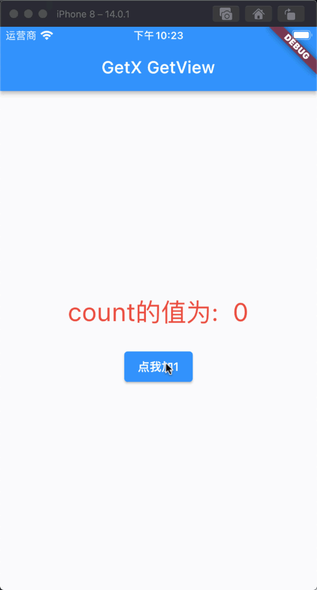

# GetView、GetWidget

## GetView 介绍

`GetView`只是对已注册的`Controller`有一个名为`controller`的 getter 的`const Stateless`的 Widget，如果我们只有单个控制器作为依赖项，那我们就可以使用`GetView`，而不是使用`StatelessWidget`，并且避免了写`Get.Find()`。

[零基础视频教程地址](https://www.bilibili.com/video/BV1uq4y1U7fF?p=16)

## GetView 如何使用

GetView 的使用方法非常简单，只是要将你的视图层继承自`GetView`并传入需要注册的控制器并`Get.put()`即可，我们来看下代码演示：

### 第一步：应用程序入口配置

```dart
import 'package:flutter/material.dart';
import 'package:flutter_getx_example/GetViewAndGetWidgetExample/GetViewAndGetWidgetExample.dart';
import 'package:get/get.dart';

void main() {
  runApp(MyApp());
}

class MyApp extends StatelessWidget {
  @override
  Widget build(BuildContext context) {
    return GetMaterialApp(
      title: "GetX",
      home: GetViewAndGetWidgetExample(),
    );
  }
}
```

### 第二步：继承自 GetView 并使用状态管理

```dart
import 'package:flutter/material.dart';
import 'package:flutter_getx_example/GetViewAndGetWidgetExample/GetViewCountController.dart';
import 'package:get/get.dart';

class GetViewAndGetWidgetExample extends GetView<GetViewCountController> {

  @override
  Widget build(BuildContext context) {

    Get.put(GetViewCountController());
    // Get.create(() => GetViewCountController());

    return Scaffold(
      appBar: AppBar(
        title: Text("GetX GetView"),
      ),
      body: Center(
        child: Column(
          mainAxisAlignment: MainAxisAlignment.center,
          crossAxisAlignment: CrossAxisAlignment.center,
          children: [
            Obx(() => Text(
              "count的值为:  ${controller?.count}",
              style: TextStyle(
                color: Colors.red,
                fontSize: 30
              ),
            )),
            SizedBox(height: 20,),
            ElevatedButton(
                onPressed: () {
                  controller.increment();
                },
                child: Text("点我加1"))
          ],
        ),
      ),
    );
  }
}
```

### 效果展示

[](./static/getx_getview.gif)

它 “缓存 “了一个 Controller，由于*cache*，不能成为一个 “const Stateless”（因为*cache*，所以不能成为一个`const Stateless`）。当我们使用 Get.create(()=>Controller()) `会在每次调用时生成一个新的`Controller Get.find()`

### 第一步：应用程序入口设置

```dart
import 'package:flutter/material.dart';
import 'package:flutter_getx_example/GetViewAndGetWidgetExample/GetViewAndGetWidgetExample.dart';
import 'package:get/get.dart';

void main() {
  runApp(MyApp());
}

class MyApp extends StatelessWidget {
  @override
  Widget build(BuildContext context) {
    return GetMaterialApp(
      title: "GetX",
      home: GetViewAndGetWidgetExample(),
    );
  }
}
```

### 第二步：继承自 GetWidget 并使用

```dart
import 'package:flutter/material.dart';
import 'package:flutter_getx_example/GetViewAndGetWidgetExample/GetViewCountController.dart';
import 'package:get/get.dart';

class GetViewAndGetWidgetExample extends GetWidget<GetViewCountController> {

  @override
  Widget build(BuildContext context) {

    // Get.put(GetViewCountController());
    Get.create(() => GetViewCountController());

    return Scaffold(
      appBar: AppBar(
        title: Text("GetX GetView"),
      ),
      body: Center(
        child: Column(
          mainAxisAlignment: MainAxisAlignment.center,
          crossAxisAlignment: CrossAxisAlignment.center,
          children: [
            Obx(() => Text(
              "count的值为:  ${controller?.count}",
              style: TextStyle(
                color: Colors.red,
                fontSize: 30
              ),
            )),
            SizedBox(height: 20,),
            ElevatedButton(
              onPressed: () {
                controller.increment();
              },
              child: Text("点我加1"))
          ],
        ),
      ),
    );
  }

}
```

### 效果展示

[](./static/getx_getview.gif)

## 总结

在我们平时的开发过程中基本上很少会用到`GetWidget`，因为我们在大部分情况下都不需要缓存 Controller。

当我们的页面中只依赖了一个控制器的情况话，那么使用`GetView`将是很好的选择，因为他大大简化了我们的代码。
