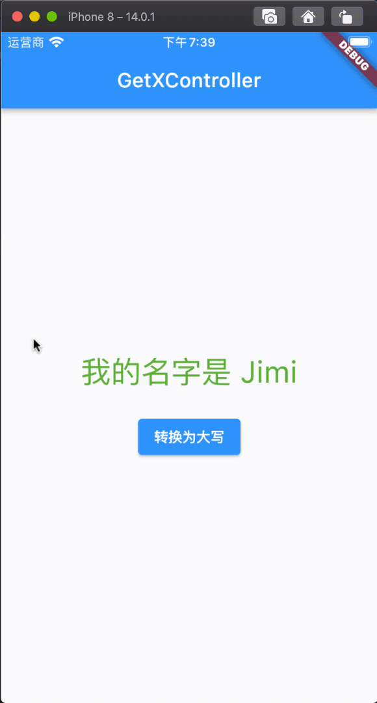
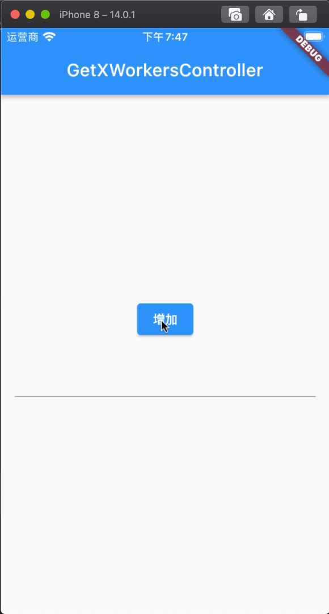
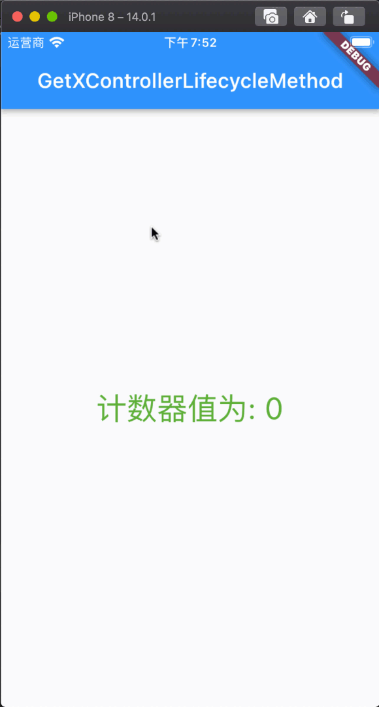

# GetxController

## GetxController 介绍

在实际的项目开发过程中，我们不可能把 UI 代码、业务逻辑都放在一起处理，这样对项目的架构、代码的可读性、后期的维护将会是致命的，好在`GetX`为我们提供了`GetxController`,`GetxController`主要的作用是用于 UI 代码与业务逻辑分离开来。

[零基础视频教程地址](https://www.bilibili.com/video/BV1uq4y1U7fF?p=7)

## GetxController 三种使用方式

这里主要讲解使用`GetxController`动态获取数据的三种方式以及更新数据的方式。

### 第一步：应用程序入口设置

```dart
import 'package:flutter/material.dart';
import 'package:flutter_getx_example/GetXControllerExample/GetXControllerExample.dart';
import 'package:get/get.dart';

void main() {
  runApp(MyApp());
}

class MyApp extends StatelessWidget {
  @override
  Widget build(BuildContext context) {
    return GetMaterialApp(
      title: "GetX",
      home: GetXControllerExample(),
    );
  }
}
```

### 第二步：定义控制器继承自 GetxController

```dart
import 'package:flutter_getx_example/ObxCustomClassExample/Teacher.dart';
import 'package:get/get.dart';

class MyController extends GetxController {

  // 第一种
  // var teacher = Teacher();
  //
  // void convertToUpperCase() {
  //   teacher.name.value = teacher.name.value.toUpperCase();
  // }

  // 第二种
  // var teacher =  Teacher(name: "Jimi", age: 18).obs;
  // void convertToUpperCase() {
  //   teacher.update((val) {
  //     teacher.value.name = teacher.value.name.toString().toUpperCase();
  //   });
  // }

  // 第三种
  var teacher = Teacher();

  void convertToUpperCase() {
    teacher.name.value = teacher.name.value.toUpperCase();
    update();
  }
}
```

### 第三步：实例化控制器并使用

```dart
import 'package:flutter/material.dart';
import 'package:flutter_getx_example/GetXControllerExample/MyController.dart';
import 'package:get/get.dart';

class GetXControllerExample extends StatelessWidget {

  // 第一种
  MyController myController = Get.put(MyController());

  @override
  Widget build(BuildContext context) {
    return Scaffold(
      appBar: AppBar(
        title: Text("GetX Obx---GetXController"),
      ),
      body: Center(
        child: Column(
          mainAxisAlignment: MainAxisAlignment.center,
          crossAxisAlignment: CrossAxisAlignment.center,
          children: [
            // 第一种
            // Obx(() => Text(
            //   "我的名字是 ${myController.teacher.name}",
            //   style: TextStyle(color: Colors.red, fontSize: 30),
            // )),
            // 第二种
            // GetX<MyController>(
            //   init: MyController(),
            //   builder: (controller) {
            //     return Text(
            //       "我的名字是 ${controller.teacher.name}",
            //       style: TextStyle(color: Colors.green, fontSize: 30),
            //     );
            //   },
            // ),
            // 第三种
            GetBuilder<MyController>(
              init: myController,
              builder: (controller) {
                return Text(
                  "我的名字是 ${controller.teacher.name}",
                  style: TextStyle(color: Colors.green, fontSize: 30),
                );
              },
            ),
            SizedBox(height: 20,),
            ElevatedButton(
              onPressed: () {
                // 第一种
                myController.convertToUpperCase();

                // 第二种
                // Get.find<MyController>().convertToUpperCase();

              },
              child: Text("转换为大写"))
          ],
        ),
      ),
    );
  }
}
```

### 效果展示

[](./static/getx-getxcontroller1.gif)

## GetxController 事件监听

这里主要讲解`GetxController`的事件监听，包括监听**单个值**、**多个值**等。

### 第一步：应用程序入口设置

```dart
import 'package:flutter/material.dart';
import 'package:flutter_getx_example/GetXControllerWorkersExample/GetXControllerWorkersExample.dart';
import 'package:get/get.dart';

void main() {
  runApp(MyApp());
}

class MyApp extends StatelessWidget {
  @override
  Widget build(BuildContext context) {
    return GetMaterialApp(
      title: "GetX",
      home: GetXControllerWorkersExample(),
    );
  }
}
```

### 第二步：定义控制器继承自 GetxController

```dart
import 'package:get/get.dart';

class WorkersController extends GetxController {
  var count = 0.obs;

  void increment() {
    count++;
  }
}
```

### 第三步：重写 onInit 并监听事件

```dart
@override
void onInit() {
  // TODO: implement onInit

  // 监听count的值,当它发生改变的时候调用
  ever(count, (callback) => print("ever----$count"));

  // 监听多个值,当它们发生改变的时候调用
  everAll([count], (callback) => print("everAll----$count"));

  // count值改变时调用,只执行一次
  once(count, (callback) => print("once----$count"));

  // 用户停止打字时1秒后调用,主要是防DDos
  debounce(count, (callback) => print("debounce----$count"));

  // 忽略3秒内的所有变动
  interval(count, (callback) => print("interval----$count"));

  super.onInit();
}
```

### 第四步：实例化控制器并使用

```dart
import 'package:flutter/material.dart';
import 'package:flutter_getx_example/GetXControllerWorkersExample/WorkersConroller.dart';
import 'package:get/get.dart';

class GetXControllerWorkersExample extends StatelessWidget {

  WorkersController workersController = Get.put(WorkersController());

  @override
  Widget build(BuildContext context) {
    return Scaffold(
      appBar: AppBar(
        title: Text("GetXWorkersController"),
      ),
      body: Center(
        child: Column(
          mainAxisAlignment: MainAxisAlignment.center,
          crossAxisAlignment: CrossAxisAlignment.center,
          children: [
            ElevatedButton(
                onPressed: () => workersController.increment(),
                child: Text("增加")
            ),
            Padding(
              padding: EdgeInsets.all(16),
              child: TextField(
                onChanged: (val) {
                  workersController.increment();
                },
              ),
            )
          ],
        ),
      ),
    );
  }
}
```

### 效果展示

[](./static/getx-getxcontrollerworkers.gif)

### 控制台输出结果

```dart
flutter: ever----1
flutter: everAll----1
flutter: once----1
[GETX] Worker [once] called
flutter: debounce----1
flutter: interval----1
flutter: ever----2
flutter: everAll----2
flutter: debounce----2
flutter: interval----2
flutter: ever----3
flutter: everAll----3
flutter: ever----4
flutter: everAll----4
flutter: ever----5
flutter: everAll----5
flutter: interval----5
flutter: debounce----5
```

## GetxController 生命周期

这里主要讲解`GetxController`的生命周期，包括**初始化**、**加载完成**、**销毁**等。

### 第一步：应用程序入口设置

```dart
import 'package:flutter/material.dart';
import 'package:flutter_getx_example/GetXControllerLifecycleMethodsExample/GetXControllerLifecycleMethodExample.dart';
import 'package:get/get.dart';

void main() {
  runApp(MyApp());
}

class MyApp extends StatelessWidget {
  @override
  Widget build(BuildContext context) {
    return GetMaterialApp(
      title: "GetX",
      home: GetXControllerLifecycleMethodExample(),
    );
  }
}
```

### 第二步：定义控制器继承自 GetxController

```dart
import 'package:get/get.dart';

class MyLifecycleController extends GetxController {

  var count = 0;

  void increment() async {
    await Future.delayed(Duration(milliseconds: 3000));
    count++;
    update();
  }

  void cleanTask() {
    print("清除了任务");
  }
}
```

### 第三步：重写 GetxController 生命周期方法

```dart
@override
void onInit() {
  // TODO: implement onInit
  print("初始化");
  super.onInit();
}

@override
void onReady() {
  // TODO: implement onReady
  print("加载完成");
  super.onReady();
}

@override
void onClose() {
  // TODO: implement onClose
  print("控制器被释放");
  super.onClose();
}
```

### 第四步：实例化控制器并使用

```dart
import 'package:flutter/material.dart';
import 'package:flutter_getx_example/GetXControllerLifecycleMethodsExample/MyLifecycleController.dart';
import 'package:get/get.dart';

class GetXControllerLifecycleMethodExample extends StatelessWidget {

  MyLifecycleController myLifecycleController = Get.put(MyLifecycleController());

  @override
  Widget build(BuildContext context) {
    print("build");

    return Scaffold(
      appBar: AppBar(
        title: Text("GetXControllerLifecycleMethod"),
      ),
      body: Center(
        child: Column(
          mainAxisAlignment: MainAxisAlignment.center,
          crossAxisAlignment: CrossAxisAlignment.center,
          children: [
            GetBuilder<MyLifecycleController>(
              initState: (data) => myLifecycleController.increment(),
              dispose: (_) => myLifecycleController.cleanTask(),
              builder: (controller) {
                return Text(
                  "计数器值为: ${myLifecycleController.count}",
                  style: TextStyle(color: Colors.green, fontSize: 30),
                );
              },
            ),
          ],
        ),
      ),
    );
  }
}
```

### 效果展示

[](./static/getx-getxcontrollerlifecyclemethod.gif)

### 控制台输出结果

```dart
flutter: 初始化
[GETX] Instance "MyLifecycleController" has been created
[GETX] Instance "MyLifecycleController" has been initialized
[GETX] Instance "GetMaterialController" has been created
[GETX] Instance "GetMaterialController" has been initialized
flutter: build
flutter: 加载完成
flutter: build
flutter: build
```

## GetxController UniqueID

我们在开发的过程中会碰到一种情况，就是多个地方引用了同一个属性，但我只想单独更新某一个地方，那么就可以用`UniqueID`来进行区分。

### 第一步：应用程序入口设置

```dart
import 'package:flutter/material.dart';
import 'package:flutter_getx_example/GetXControllerUniqueIDExample/GetXControllerUniqueIDExample.dart';
import 'package:get/get.dart';

void main() {
  runApp(MyApp());
}

class MyApp extends StatelessWidget {
  @override
  Widget build(BuildContext context) {
    return GetMaterialApp(
      title: "GetX",
      home: GetXControllerUniqueIDExample(),
    );
  }
}
```

### 第二步：定义控制器继承自 GetxController，并且定义 uniqueID

```dart
import 'package:get/get.dart';

class CountController extends GetxController {
  var count = 0;

  void increment() {
    count++;
    update(['jimi_count']);
  }
}
```

### 第三步：实例化控制器并使用

```dart
import 'package:flutter/material.dart';
import 'package:flutter_getx_example/GetXControllerUniqueIDExample/CountConroller.dart';
import 'package:get/get.dart';

class GetXControllerUniqueIDExample extends StatelessWidget {

  CountController countController = Get.put(CountController());

  @override
  Widget build(BuildContext context) {
    return Scaffold(
      appBar: AppBar(
        title: Text("GetX Obx---GetXController"),
      ),
      body: Center(
        child: Column(
          mainAxisAlignment: MainAxisAlignment.center,
          crossAxisAlignment: CrossAxisAlignment.center,
          children: [
            GetBuilder<CountController>(
              builder: (controller) {
                return Text(
                  "计数器值为: ${controller.count}",
                  style: TextStyle(color: Colors.red, fontSize: 30),
                );
              },
            ),
            GetBuilder<CountController>(
              id: 'jimi_count',
              builder: (controller) {
                return Text(
                  "计数器值为: ${controller.count}",
                  style: TextStyle(color: Colors.green, fontSize: 30),
                );
              },
            ),
            SizedBox(height: 20,),
            ElevatedButton(
              onPressed: () => countController.increment(),
              child: Text("增加"))
          ],
        ),
      ),
    );
  }
}
```

### 效果展示

[](./static/getx-getxcontrolleruniqueID.gif)

## 总结

本章节对`GetxController`的**数据赋值**、**数据更新**、**事件监听**、**生命周期**、**UniqueID** 进行了讲解，也明白了怎么用`GetxController`来对项目的 UI 代码与业务逻辑进行拆分。
