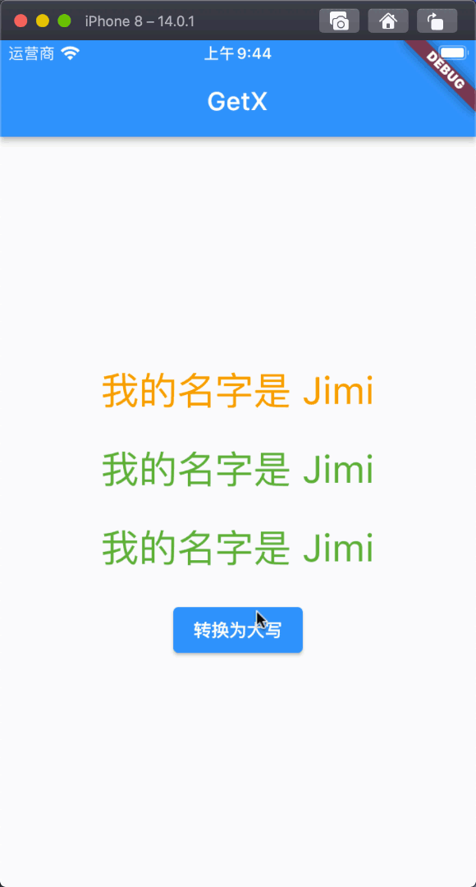

# RxList*E*、Rx*T*([])、.obs 对比分析

--

首先我们知道`GetX`组件里面`obs`状态管理有三种创建属性的方式，我们这里以`List`为例

- Rx([])
- RxList
- .obs

[视频讲解链接](https://www.bilibili.com/video/BV1Q3411i73U)

## 三种方式对比分析

我们声明了一个类 ListController`继承自`GetxController`，用于属性创建以及状态通知的方法，首先我们用三种方式来创建属性并且通过`convertToUpperCase`方法进行对值的改变，然后我们通过调用`update()` 方法来进行数据更新，最后我们使用该属性状态的值，接下来我们看一下三种使用方式的对比。

- 第一种 Rx([])
- 第二种 RxList
- 第三种 .obs

```dart
import 'dart:convert';
import 'package:get/get.dart';

class ListController extends GetxController {
  // 第一种
  final listOne = Rx<List<Map>>([
    {
      "name": "Jimi",
      "age": 18
    }
  ]);

  // 第二种
  final listTwo = RxList([
    {
      "name": "Jimi",
      "age": 18
    }
  ]);

  // 第三种
  final listThree = [{
    "name": "Jimi",
    "age": 18
  }].obs;

  void convertToUpperCase() {
    listOne.value[0]["name"] = listOne.value.first["name"].toUpperCase();
    listTwo.toList().first["name"] = listTwo.toList().first["name"].toString().toUpperCase();
    listThree.toList().first["name"] = listTwo.toList().first["name"].toString().toUpperCase();
    update();
  }
}
```

我们在页面中获取状态更新的值

```dart
import 'package:flutter/material.dart';
import 'package:flutter_getx_dvanced_example/ListController.dart';
import 'package:get/get.dart';


void main() {
  runApp(MyApp());
}

class MyApp extends StatelessWidget {

  ListController listController = Get.put(ListController());

  @override
  Widget build(BuildContext context) {
    return GetMaterialApp(
      title: "GetX",
      home: Scaffold(
        appBar: AppBar(
          title: Text("GetX"),
        ),
        body: Center(
          child: Column(
            mainAxisAlignment: MainAxisAlignment.center,
            crossAxisAlignment: CrossAxisAlignment.center,
            children: [
              GetBuilder<ListController>(
                init: listController,
                builder: (controller) {
                  return Text(
                    "我的名字是 ${controller.listOne.value.first['name']}",
                    style: TextStyle(color: Colors.orange, fontSize: 30),
                  );
                },
              ),
              SizedBox(height: 20,),
              GetBuilder<ListController>(
                init: listController,
                builder: (controller) {
                  return Text(
                    "我的名字是 ${controller.listTwo.first['name']}",
                    style: TextStyle(color: Colors.green, fontSize: 30),
                  );
                },
              ),
              SizedBox(height: 20,),
              GetBuilder<ListController>(
                init: listController,
                builder: (controller) {
                  return Text(
                    "我的名字是 ${controller.listThree.first['name']}",
                    style: TextStyle(color: Colors.green, fontSize: 30),
                  );
                },
              ),
              SizedBox(height: 20,),
              ElevatedButton(
                onPressed: () {
                  listController.convertToUpperCase();
                },
                child: Text("转换为大写"))
            ],
          ),
        ),
      ),
    );
  }
}
```

效果展示

[](./static/getx_dvanced%E4%B8%89%E7%A7%8D%E5%B1%9E%E6%80%A7%E5%88%9B%E5%BB%BA%E6%96%B9%E5%BC%8F%E5%AF%B9%E6%AF%94%E5%88%86%E6%9E%90.gif)

## Rx([]) 源码分析

`Rx<T>` 继承自`_RxImpl<T>`，`_RxImpl<T>`又继承`RxNotifier<T>`并混合 `RxObjectMixin<T>` 类

`RxImpl<T>`它主要的作用是管理泛型的所有逻辑的。

`RxObjectMixin<T>` 它主要的作用是管理注册到`GetX`和`Obx`的全局对象，比如`Widget`的`Rx`值

`Rx<T>`它主要的作用是将自定义模型类用 Rx` 来进行包装，

```dart
class Rx<T> extends _RxImpl<T> {
  Rx(T initial) : super(initial);

  @override
  dynamic toJson() {
    try {
      return (value as dynamic)?.toJson();
    } on Exception catch (_) {
      throw '$T has not method [toJson]';
    }
  }
}

abstract class _RxImpl<T> extends RxNotifier<T> with RxObjectMixin<T> {
  _RxImpl(T initial) {
    _value = initial;
  }

  void addError(Object error, [StackTrace? stackTrace]) {
    subject.addError(error, stackTrace);
  }

  Stream<R> map<R>(R mapper(T? data)) => stream.map(mapper);

  void update(void fn(T? val)) {
    fn(_value);
    subject.add(_value);
  }

  void trigger(T v) {
    var firstRebuild = this.firstRebuild;
    value = v;
    if (!firstRebuild) {
      subject.add(v);
    }
  }
}
```

## RxList 源码分析

`RxList<E>`继承自`ListMixin<E>`实现了`RxInterface<List<E>>`并混合了`NotifyManager<List<E>>, RxObjectMixin<List<E>>`

`RxList<E>`它的主要作用是创建一个类似于`List<T>` 的一个列表

```dart
class RxList<E> extends ListMixin<E>
  with NotifyManager<List<E>>, RxObjectMixin<List<E>>
  implements RxInterface<List<E>> {
  RxList([List<E> initial = const []]) {
    _value = List.from(initial);
  }

  factory RxList.filled(int length, E fill, {bool growable = false}) {
    return RxList(List.filled(length, fill, growable: growable));
  }

  factory RxList.empty({bool growable = false}) {
    return RxList(List.empty(growable: growable));
  }

  /// Creates a list containing all [elements].
  factory RxList.from(Iterable elements, {bool growable = true}) {
    return RxList(List.from(elements, growable: growable));
  }

  /// Creates a list from [elements].
  factory RxList.of(Iterable<E> elements, {bool growable = true}) {
    return RxList(List.of(elements, growable: growable));
  }

  /// Generates a list of values.
  factory RxList.generate(int length, E generator(int index),
                          {bool growable = true}) {
    return RxList(List.generate(length, generator, growable: growable));
  }

  /// Creates an unmodifiable list containing all [elements].
  factory RxList.unmodifiable(Iterable elements) {
    return RxList(List.unmodifiable(elements));
  }

  @override
  Iterator<E> get iterator => value.iterator;

  @override
  void operator []=(int index, E val) {
    _value[index] = val;
    refresh();
  }

  /// Special override to push() element(s) in a reactive way
  /// inside the List,
  @override
  RxList<E> operator +(Iterable<E> val) {
    addAll(val);
    refresh();
    return this;
  }

  @override
  E operator [](int index) {
    return value[index];
  }

  @override
  void add(E item) {
    _value.add(item);
    refresh();
  }

  @override
  void addAll(Iterable<E> item) {
    _value.addAll(item);
    refresh();
  }

  @override
  int get length => value.length;

  @override
  @protected
  List<E> get value {
    RxInterface.proxy?.addListener(subject);
    return _value;
  }

  @override
  set length(int newLength) {
    _value.length = newLength;
    refresh();
  }

  @override
  void insertAll(int index, Iterable<E> iterable) {
    _value.insertAll(index, iterable);
    refresh();
  }

  @override
  Iterable<E> get reversed => value.reversed;

  @override
  Iterable<E> where(bool Function(E) test) {
    return value.where(test);
  }

  @override
  Iterable<T> whereType<T>() {
    return value.whereType<T>();
  }

  @override
  void sort([int compare(E a, E b)?]) {
    _value.sort(compare);
    refresh();
  }
}
```

## .obs 源码分析

当我们在调用`.obs`的时候其实内部的实现源码还是通过`RxList<e>(this)`进行了一层包装，设计这个主要的目的就是为了方便开发者进行使用

```dart
extension ListExtension<E> on List<E> {
  RxList<E> get obs => RxList<E>(this);

  /// Add [item] to [List<E>] only if [item] is not null.
  void addNonNull(E item) {
    if (item != null) add(item);
  }

  // /// Add [Iterable<E>] to [List<E>] only if [Iterable<E>] is not null.
  // void addAllNonNull(Iterable<E> item) {
  //   if (item != null) addAll(item);
  // }

  /// Add [item] to List<E> only if [condition] is true.
  void addIf(dynamic condition, E item) {
    if (condition is Condition) condition = condition();
    if (condition is bool && condition) add(item);
  }

  /// Adds [Iterable<E>] to [List<E>] only if [condition] is true.
  void addAllIf(dynamic condition, Iterable<E> items) {
    if (condition is Condition) condition = condition();
    if (condition is bool && condition) addAll(items);
  }

  /// Replaces all existing items of this list with [item]
  void assign(E item) {
    // if (this is RxList) {
    //   (this as RxList)._value;
    // }

    clear();
    add(item);
  }

  /// Replaces all existing items of this list with [items]
  void assignAll(Iterable<E> items) {
    // if (this is RxList) {
    //   (this as RxList)._value;
    // }
    clear();
    addAll(items);
  }
}
```

## 总结

我们对`Rx<T>([])`、`RxList<E>`、`.obs`进行了一个总结，在我们平时的开发过程中建议大家使用`.obs`即可，因为这是最简单的方式。
