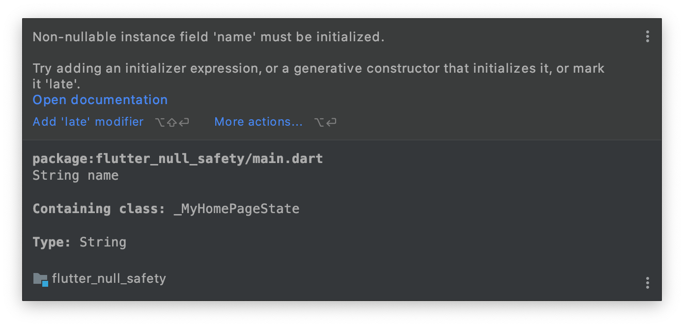
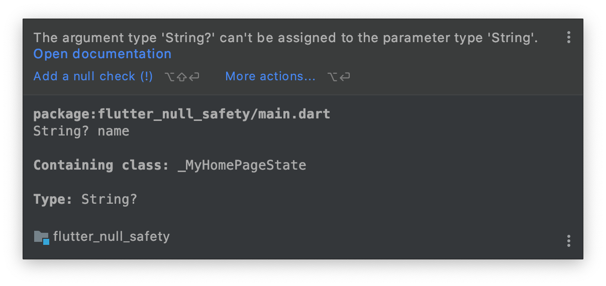
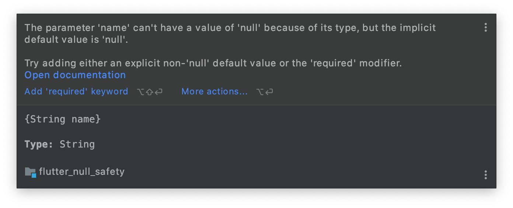
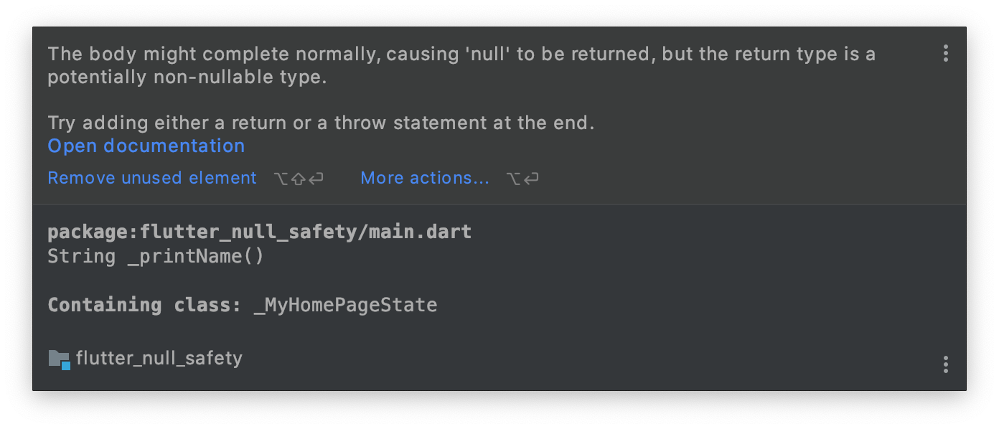

> 本文由 [简悦 SimpRead](http://ksria.com/simpread/) 转码， 原文地址 [liujunmin.com](https://liujunmin.com/flutter/null_safety.html)

> 前言

前言
--

看完本章节你将知道:

*   什么是空安全
*   空安全的原则
*   如何启用空安全
*   空安全的类型
*   空断言运算符
*   late 修饰符

视频教程
----

[空安全视频教程地址](https://www.bilibili.com/video/BV1rv41137TN)

空安全介绍
-----

空安全 [null-safe type system](https://dart.cn/null-safety) 是在 Dart 2.12 中引入的，如果开启空安全，默认情况下代码中的类型不能为空，也就是说除非声明该类型是可以为空的，否则值不能为空。

空安全是官方极力推荐的，现在很多流行的第三方库全部都是支持了空安全，所以空安全是我们必须要掌握的知识。

空安全的原则
------

*   **默认不可空：**除非你将变量显式声明为可空，否则它一定是非空的类型。
*   **渐进迁移：**可以自由地选择何时进行迁移，多少代码会进行迁移，还可以使用混合模式的空安全，在一个项目中同时使用空安全和非空安全的代码。
*   **完全可靠：**对代码的健全性带来的所有优势——更少的 BUG、更小的二进制文件以及更快的执行速度。

启用空安全
-----

空安全在 Dart 2.12 和 Flutter 2.0 中可用，可通过指定 Dart SDK 版本为 2.12 那么就会开启空安全

```
environment:
  sdk: ">=2.12.0 <3.0.0"
```

空安全类型
-----

空安全分可为空和不可为空，可为空就是变量、形参都可以传 null 值，不可为空变量、形参一定不能为空，我们在使用空安全的时候会碰到下面三种情况，接下来的代码演示我们都是 dart 2.12 开启空安全为准

*   变量为空编译时报错
*   传递参数时为空编译时报错
*   方法需要返回参数时必须返回，否则编译时报错

变量可为空和不可为空的使用对比
---------------

### 声明一个空变量

这里我声明了一个变量为`name`的字符串属性，但并没有赋值，所以`name`的内存地址存的是一个空的字符串。

### 错误提示

它提示说不可为空的变量一定要进行初始化

[](./static/Snip20210918_5.png)

### 标明变量可为空

我们可以在`Stirng`后面加一个`?`号，该符号标明`name`这个变量可以为空，这个时候我们发现定义时不会出现报错，但是我们在使用`name`属性的时候会发现有一个报错，它报错的信息是`String?`不能分配给一个`String`，如下：

[](./static/Snip20210918_6.png)

### 空断言运算符

在上面我们使用`name`这个属性的时候会出现一个报错，我们可以使用空断言运算符`!`来标明该值不会为空，所以`Dart`在编译时不会报错，该符号在项目中尽量不要使用，除非你明确知道它是不为空的，因为我们`name`属性还是空的，所以在运行时将会收到如下报错：

```
======== Exception caught by widgets library =======================================================
The following _CastError was thrown building MyHomePage(dirty, state: _MyHomePageState#5824d):
Null check operator used on a null value

The relevant error-causing widget was: 
  MyHomePage MyHomePage:file:///Users/jm/Desktop/Work/Git/my_project/flutter_null_safety/lib/main.dart:29:13
When the exception was thrown, this was the stack: 
..........
(package:flutter/src/rendering/binding.dart:319:5)
#123    SchedulerBinding._invokeFrameCallback (package:flutter/src/scheduler/binding.dart:1143:15)
#124    SchedulerBinding.handleDrawFrame (package:flutter/src/scheduler/binding.dart:1080:9)
#125    SchedulerBinding.scheduleWarmUpFrame.<anonymous closure> (package:flutter/src/scheduler/binding.dart:863:7)
(elided 4 frames from class _RawReceivePortImpl, class _Timer, and dart:async-patch)
====================================================================================================
```

参数可为空和不可为空的使用对比
---------------

### 声明一个需要传参的方法

下面这段代码我们定义了一个可选参数为`name`的字符串，在空安全的机制下，我们必须保证传入的参数不能为空，那么将会收到如下报错：

```
_upperCase({String name}) {
  setState(() {
    value.toUpperCase();
  });
}

floatingActionButton: FloatingActionButton(
  onPressed: _upperCase(),
  child: Icon(Icons.add),
),
```

### 错误提示

它提示参数`name`的类型不能为`null`值，但是被隐式转换成了`null`，我们碰到这种情况有两种解决方案，我们接下来看看如果解决

[](./static/Snip20210919_8.png)

### 解决方法

#### 第一种：给可选参数添加默认值

```
_upperCase({String name = "Jimi"}) {
  setState(() {
    name.toUpperCase();
  });
}
```

#### 第二种：给可选参数增加 required

```
_upperCase({required String name}) {
  setState(() {
    name.toUpperCase();
  });
}
```

当给可选参数增加`required`后，说明可选参数`name`必传，这样会导致调用处会报错，我们来在调用时把`name`传进去，如下：

```
floatingActionButton: FloatingActionButton(
  onPressed: _upperCase(name: name!),
  child: Icon(Icons.add),
),
```

这里使用`name!`来进行传入，在上面我们说过这个是空断言运算符，只有你明确知道该变量会有值时才使用，那么我们这里这样使用还是会报错，所以我们来继续优化，把`name`声明一个有值的变量，如下：

```
String name = "Jimi";

floatingActionButton: FloatingActionButton(
  onPressed: _upperCase(name: name),
  child: Icon(Icons.add),
),
```

方法的返回值可为空和不可为空的使用对比
-------------------

### 声明一个需要有返回值的方法

下面我声明了一个方法用来将 name` 的转换为大写，在我们没有引入空安全之前下来代码是不会报错的，但是引入空安全机制后你会收到如下报错：

```
String name = "Jimi";

String _upperCaseName(String name) {
}
```

### 错误提示

它提示返回类型可能是不能为`null`的类型，可以尝试在最后添加 `return` 或 `throw`语句。

[](./static/Snip20210919_9.png)

### 解决方法

#### 第一种：添加 return 语句

```
String _upperCaseName(String name) {
  return name.toUpperCase();
}
```

#### 第二种：添加 throw 语句

```
String _upperCaseName(String name) {
  throw "no return";
}
```

自定义类字段可为空和不可为空使用对比
------------------

### 声明一个 User 类

我们在平时的开发过程中常常会自定义类，而自定义类中的属性一开始都不会赋值，那么我们引入空安全的情况下将会报错，如下所示：

```
class User {
  String name;
  int age;

  setName(String name) {
    this.name = name;
  }

  getName() {
    return this.name;
  }

  setAge(int age) {
    this.age = age;
  }

  getAge() {
    return this.age;
  }
}
```

### 报错提示

它这里提示`name`以及`age`必须要有初始化值，或者标记为`late`。

[](./static/Snip20210919_10.png)

### 解决方法

#### 第一种：声明变量可为空

我们采用声明变量可为空的方式，在使用的时候我们使用空断言运算符`!`来进行写入和读取操作，但是这也暗示着`null`对于字段来说是有用的值，这样就背道而驰了，所以建议不要采用这种方式，接下来我们来看看第二种解决方案`late`修饰符。

```
String? name;
int? age;
```

#### 第二种：late 修饰符

因为`late`涉及内容较多，我们拿一个章节来讲解。

late 修饰符
--------

`late`修饰符是在运行时而非编译时对变量进行约束，这也就是说`late`相当于何时执行对变量的强制约束。

比如本示例中`name`字段用`late`修饰后并不一定已经被初始化，每次它被读取时，都会插入一个运行时的检查，以确保它已经被赋值。如果并未赋值，就会抛出一个异常，给变量加上`String`类型就是说：“我的值绝对是字符串”，而加上`late`修饰符意味着：” 每次运行我都要检查是不是真的”。

当使用`late`修饰符总结如下：

*   先不给变量赋值
*   稍后再给变量赋值
*   在使用前会给变量赋值
*   在使用前不赋值，将会报错

```
late String name;
late int age;
```

late 修饰符懒加载
-----------

懒加载也有一种说法是初始化延迟执行，当你用`late`修饰变量后，那么它将会被延迟到字段首次被访问时才会执行，而不是在实例化构造器时就初始化了。而且实例字段的初始化内容是无法访问`this`的，因为在所有的初始化方法完成前，是无法访问到新的实例对象。但是，使用了`late`的话就可以访问到`this`、调用方法以及访问实例的字段。

### 不使用 late 修饰符

我们这里就是创建一个`User`类，`name`属性直接调用`getUserName()`方法，最后当我们实例化一个`User`对象并获取`name`的值，我们来看下控制台输出：

```
void main() {
  print("调用构造函数");
  var user = User();
  print("获取值");
  print("获取的值为: ${user.getName()}");

}

class User {
  String name = getUserName();

  setName(String name) {
    this.name = name;
  }

  getName() {
    return this.name;
  }
}

String getUserName() {
  print("返回用户的名称");
  return "Jimi";
}
```

### 控制台输出

```
flutter: 调用构造函数
flutter: 返回用户的名称
flutter: 获取值
flutter: 获取的值为: Jimi
```

### 使用 late 修饰符

代码和上面一样，只是在定义字段处加了一个`late`修饰符，我们来看一下控制台输出：

```
void main() {
  print("调用构造函数");
  var user = User();
  print("获取值");
  print("获取的值为: ${user.getName()}");

}

class User {
  late String name = getUserName();

  setName(String name) {
    this.name = name;
  }

  getName() {
    return this.name;
  }
}

String getUserName() {
  print("返回用户的名称");
  return "Jimi";
}
```

### 控制台输出

```
flutter: 调用构造函数
flutter: 获取值
flutter: 返回用户的名称
flutter: 获取的值为: Jimi
```

我们明显可以看到第二行和第三行反过来了，而在不使用`late`修饰符也就是没有懒加载的情况下，当我们实例化构造器时就直接调用了获取值的方法。而加了`late`修饰符后是在使用该字段的时候才会去进行获取。

总结
--

空安全的引入让我的代码变得更加可靠

*   在类型上都必须是非空的，当然你也可以添加`?`变成可空的，用空断言运算符`!`进行使用。
*   可选参数都必须是非空的，可以使用`required`来构建一个非可选命名参数。
*   `List` 类现在不再允许包含未初始化的元素。
*   `late`修饰符在运行时检查，能够使用非空类型和 `final`，它同时提供了对字段延迟初始化的支持。