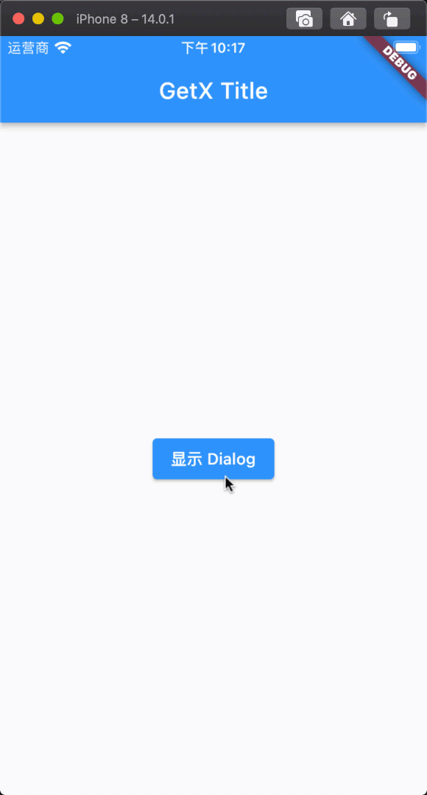

# 介绍、Snackbar、Dialog、BottomSheet、Navigation、Obx

[视频教程地址](https://www.bilibili.com/video/BV1uq4y1U7fF?p=1)

##### 学完本系列课程你将学会：

- 知道什么是 GetX
- 会使用 Snackbar
- 会使用 Dialog
- 会使用 BottomSheet
- 会用 Navigation
- 会用 Obx 响应式状态管理
- 会使用 GetXController（三种使用方式 GetBuilder、事件监听、生命周期、UniqueID）
- 语言国际化配置
- 依赖注入
- GetX Service
- GetX Binding（绑定）
- GetX 获取 API 接口数据并显示
- 获取存储和邮件验证
- GetView 和 GetWidget
- Get Cli 脚手架使用以及常用命令
- GetX 中使用 GetConnect 和 StateMixin 获取 API 数据

## 什么是 GetX ?

[GetX 中文官方文档](https://github.com/jonataslaw/getx/blob/master/README.zh-cn.md#%E5%85%B3%E4%BA%8Eget) [pub 地址](https://pub.flutter-io.cn/packages/get)

> - GetX 是 Flutter 上的一个轻量且强大的解决方案：高性能的状态管理、智能的依赖注入和便捷的路由管理。
> - GetX 有 3 个基本原则：
>   - **性能：** GetX 专注于性能和最小资源消耗。GetX 打包后的 apk 占用大小和运行时的内存占用与其他状态管理插件不相上下。如果你感兴趣，这里有一个[性能测试](https://github.com/jonataslaw/benchmarks)。
>   - **效率：** GetX 的语法非常简捷，并保持了极高的性能，能极大缩短你的开发时长。
>   - **结构：** GetX 可以将界面、逻辑、依赖和路由完全解耦，用起来更清爽，逻辑更清晰，代码更容易维护。

## 为什么使用 GetX？

我们知道状态管理的框架有很多，使用原生的相对复杂，都是用`ChangeNotifier`来更新`Widget`，如果对于业务逻辑比较复杂还使用这种方式无疑是致命的。

其他的状态管理器也不错，但有其细微的差别。

> - BLoC 非常安全和高效，但是对于初学者来说非常复杂，这使得人们无法使用 Flutter 进行开发。
> - MobX 比 BLoC 更容易，而且是响应式的，几乎是完美的，但是你需要使用一个代码生成器，对于大型应用来说，这降低了生产力，因为你需要喝很多咖啡，直到你的代码在`flutter clean`之后再次准备好（这不是 MobX 的错，而是 codegen 真的很慢！）。
> - Provider 使用 InheritedWidget 来传递相同的监听器，以此来解决上面报告的 ChangeNotifier 的问题，这意味着对其 ChangeNotifier 类的任何访问都必须在 widget 树内。

## GetX 响应式状态管理器

响应式编程可能会让很多人感到陌生，因为它很复杂，但是 GetX 将响应式编程变得非常简单。使用 Get 的响应式编程就像使用 setState 一样简单。

> - 你不需要创建 StreamControllers.
> - 你不需要为每个变量创建一个 StreamBuilder。
> - 你不需要为每个状态创建一个类。
> - 你不需要为一个初始值创建一个 get。

## 安装

将 GetX 添加到你的 pubspec.yaml 文件中。

```dart
dependencies:
  get: ^4.3.8
```

在需要用到的文件中导入，它将被使用。

```dart
import 'package:get/get.dart';
```

## Snackbar 介绍

如果想在应用程序中触发某些特定的事件后，需要弹出一则快捷消息，那么使用`Snackbar`则是最佳的选择，接下来我们看一下`GetX`如何来联调`Snackbar`来使用。

### Snackbar 基本使用

#### 第一步：应用程序入口设置

当我们导入依赖后，在应用程序顶层把`GetMaterialApp` 作为顶层，如下所示

```dart
import 'package:flutter/material.dart';
import 'package:get/get.dart';

void main() {
  runApp(MyApp());
}

class MyApp extends StatelessWidget {
  @override
  Widget build(BuildContext context) {
    return GetMaterialApp(
      title: "GetX",
      home: Scaffold(
        appBar: AppBar(title: Text("GetX Title"),),
      ),
    );
  }
}
```

#### 第二步：调用 snackbar

我们可以通过`Get.snackbar()` 来显示 `snackbar` ，如下所示

```dart
import 'package:flutter/material.dart';
import 'package:get/get.dart';

void main() {
  runApp(MyApp());
}

class MyApp extends StatelessWidget {
  @override
  Widget build(BuildContext context) {
    return GetMaterialApp(
      title: "GetX",
      home: Scaffold(
        appBar: AppBar(
          title: Text("GetX Title"),
        ),
        body: Center(
          child: Column(
            mainAxisAlignment: MainAxisAlignment.center,
            crossAxisAlignment: CrossAxisAlignment.center,
            children: [
              ElevatedButton(
                onPressed: () {
                  Get.snackbar("Snackbar 标题", "欢迎使用Snackbar");
                },
                child: Text("显示 Snackbar"))
            ],
          ),
        ),
      ),
    );
  }
}
```

#### 效果展示

如果您运行了代码，那么恭喜你，你已经会用`GetX` 来展示`snackbar` 了。你将得到下面的结果：

[](./static/getx_snackbar.gif)

### Snackbar 属性和说明

> 总共 38 个属性，

<table><thead><tr><th>字段</th><th>属性</th><th>描述</th></tr></thead><tbody><tr><td>title</td><td>String</td><td>弹出的标题文字</td></tr><tr><td>message</td><td>String</td><td>弹出的消息文字</td></tr><tr><td>colorText</td><td>Color</td><td>title 和 message 的文字颜色</td></tr><tr><td>duration</td><td>Duration</td><td>Snackbar 弹出的持续时间（默认 3 秒）</td></tr><tr><td>instantInit</td><td>bool</td><td>当 false 可以把 snackbar 放在 initState，默认 true</td></tr><tr><td>snackPosition</td><td>SnackPosition</td><td>弹出时的位置，有两个选项【TOP，BOTTOM】默认 TOP</td></tr><tr><td>titleText</td><td>Widget</td><td>弹出标题的组件，设置该属性会导致 title 属性失效</td></tr><tr><td>messageText</td><td>Widget</td><td>弹出消息的组件，设置该属性会导致 messageText 属性失效</td></tr><tr><td>icon</td><td>Widget</td><td>弹出时图标，显示在 title 和 message 的左侧</td></tr><tr><td>shouldIconPulse</td><td>bool</td><td>弹出时图标是否闪烁，默认 false</td></tr><tr><td>maxWidth</td><td>double</td><td>Snackbar 最大的宽度</td></tr><tr><td>margin</td><td>EdgeInsets</td><td>Snackbar 外边距，默认 zero</td></tr><tr><td>padding</td><td>EdgeInsets</td><td>Snackbar 内边距，默认 EdgeInsets.all(16)</td></tr><tr><td>borderRadius</td><td>double</td><td>边框圆角大小，默认 15</td></tr><tr><td>borderColor</td><td>Color</td><td>边框的颜色，必须设置 borderWidth，否则无效果</td></tr><tr><td>borderWidth</td><td>double</td><td>边框的线条宽度</td></tr><tr><td>backgroundColor</td><td>Color</td><td>Snackbar 背景颜色，默认 Colors.grey.withOpacity(0.2)</td></tr><tr><td>leftBarIndicatorColor</td><td>Color</td><td>左侧指示器的颜色</td></tr><tr><td>boxShadows</td><td>List<boxshadow></boxshadow></td><td>Snackbar 阴影颜色</td></tr><tr><td>backgroundGradient</td><td>Gradient</td><td>背景的线性颜色</td></tr><tr><td>mainButton</td><td>TextButton</td><td>主要按钮，一般显示发送、确认按钮</td></tr><tr><td>onTap</td><td>OnTap</td><td>点击 Snackbar 事件回调</td></tr><tr><td>isDismissible</td><td>bool</td><td>是否开启 Snackbar 手势关闭，可配合 dismissDirection 使用</td></tr><tr><td>showProgressIndicator</td><td>bool</td><td>是否显示进度条指示器，默认 false</td></tr><tr><td>dismissDirection</td><td>SnackDismissDirection</td><td>Snackbar 关闭的方向</td></tr><tr><td>progressIndicatorController</td><td>AnimationController</td><td>进度条指示器的动画控制器</td></tr><tr><td>progressIndicatorBackgroundColor</td><td>Color</td><td>进度条指示器的背景颜色</td></tr><tr><td>progressIndicatorValueColor</td><td>Animation<color></color></td><td>进度条指示器的背景颜色，Animation<color></color></td></tr><tr><td>snackStyle</td><td>SnackStyle</td><td>Snackbar 是否会附加到屏幕边缘</td></tr><tr><td>forwardAnimationCurve</td><td>Curve</td><td>Snackbar 弹出的动画，默认 Curves.easeOutCirc</td></tr><tr><td>reverseAnimationCurve</td><td>Curve</td><td>Snackbar 消失的动画，默认 Curves.easeOutCirc</td></tr><tr><td>animationDuration</td><td>Duration</td><td>Snackbar 弹出和小时的动画时长，默认 1 秒</td></tr><tr><td>barBlur</td><td>double</td><td>Snackbar 背景的模糊度</td></tr><tr><td>overlayBlur</td><td>double</td><td>弹出时的毛玻璃效果值，默认 0</td></tr><tr><td>snackbarStatus</td><td>SnackbarStatusCallback</td><td>Snackbar 弹出或消失时的事件回调（即将打开、已打开、即将关闭、已关闭）</td></tr><tr><td>overlayColor</td><td>Color</td><td>弹出时的毛玻璃的背景颜色</td></tr><tr><td>userInputForm</td><td>Form</td><td>用户输入表单</td></tr></tbody></table>

## Dialog 介绍

`Dialog` 底层其实是对`AlertDialog`进行了封装， 一般用于二次确认的弹出框，比如当点击某个按钮提交资料时，需要用户二次确认，以防止误操作。

### Dialog 使用

#### 第一步：应用程序入口设置

当我们导入依赖后，在应用程序顶层把`GetMaterialApp` 作为顶层，如下所示

```dart
import 'package:flutter/material.dart';
import 'package:flutter_getx_example/DialogExample/DialogExample.dart';
import 'package:get/get.dart';

void main() {
  runApp(MyApp());
}

class MyApp extends StatelessWidget {
  @override
  Widget build(BuildContext context) {
    return GetMaterialApp(
      title: "GetX",
      home: DialogExample(),
    );
  }
}
```

#### 第二步：调用 Dialog

我们可以通过`Get.defaultDialog()` 来显示 `dialog` ，如下所示

```dart
import 'package:flutter/material.dart';
import 'package:get/get.dart';

class DialogExample extends StatelessWidget {
  @override
  Widget build(BuildContext context) {
    return Scaffold(
      appBar: AppBar(
        title: Text("GetX Title"),
      ),
      body: Center(
        child: Column(
          mainAxisAlignment: MainAxisAlignment.center,
          crossAxisAlignment: CrossAxisAlignment.center,
          children: [
            ElevatedButton(
              onPressed: () {
                Get.defaultDialog();
              },
              child: Text("显示 Dialog"))
          ],
        ),
      ),
    );
  }
}
```

#### 效果展示

如果您运行了代码，那么恭喜你，你已经会用`GetX` 来展示`dialog` 了。你将得到下面的结果：

[](./static/get_dialog.gif)

### Dialog 属性和说明

> 总共 25 个属性

<table><thead><tr><th>字段</th><th>属性</th><th>描述</th></tr></thead><tbody><tr><td>title</td><td>String</td><td>弹出的标题，默认（Alert)</td></tr><tr><td>titlePadding</td><td>EdgeInsetsGeometry</td><td>标题的内边距，默认（EdgeInsets.all(8)）</td></tr><tr><td>titleStyle</td><td>TextStyle</td><td>标题的样式</td></tr><tr><td>middleText</td><td>String</td><td>中间内容区域显示的文字</td></tr><tr><td>middleTextStyle</td><td>TextStyle</td><td>中间内容区域显示的文字样式</td></tr><tr><td>content</td><td>Widget</td><td>弹出的内容，该值设置后 middleText 将无效</td></tr><tr><td>contentPadding</td><td>EdgeInsetsGeometry</td><td>内容的内边距，默认（EdgeInsets.all(8)）</td></tr><tr><td>onConfirm</td><td>VoidCallback</td><td>确认按钮回调</td></tr><tr><td>onCancel</td><td>VoidCallback</td><td>取消按钮回调</td></tr><tr><td>onCustom</td><td>VoidCallback</td><td>自定义按钮回调</td></tr><tr><td>cancelTextColor</td><td>Color</td><td>取消按钮文字的颜色</td></tr><tr><td>confirmTextColor</td><td>Color</td><td>确认按钮文字的颜色</td></tr><tr><td>textConfirm</td><td>String</td><td>确认按钮的文字</td></tr><tr><td>textCancel</td><td>String</td><td>取消按钮的文字</td></tr><tr><td>textCustom</td><td>String</td><td>自定义按钮的文字</td></tr><tr><td>confirm</td><td>Widget</td><td>确认按钮的组件</td></tr><tr><td>cancel</td><td>Widget</td><td>取消按钮的组件</td></tr><tr><td>custom</td><td>Widget</td><td>自定义按钮的组件</td></tr><tr><td>backgroundColor</td><td>Color</td><td>弹出框的背景颜色</td></tr><tr><td>barrierDismissible</td><td>bool</td><td>是否可以通过点击背景关闭弹窗</td></tr><tr><td>buttonColor</td><td>Color</td><td>按钮的文字颜色，根据按钮类型来设定不同的位置</td></tr><tr><td>radius</td><td>double</td><td>弹出框的圆角大小，默认 20</td></tr><tr><td>actions</td><td>List<widget></widget></td><td>增加额外的子组件</td></tr><tr><td>onWillPop</td><td>WillPopCallback</td><td>拦截关闭之前做一些操作</td></tr><tr><td>navigatorKey</td><td>GlobalKey<navigatorstate></navigatorstate></td><td>用于打开对话框的 key</td></tr></tbody></table>

## BottomSheet 介绍

`BottomSheet` 是底部弹出的一个组件，常用于单选、验证码二次校验弹窗等，`GetX`的`BottomSheet`底部弹出是自定义通过路由 push 的方法实现底部弹窗的一个效果。

### BottomSheet 使用

我们可以通过`GetX`很轻松的调用`bottomSheet()`，而且无需传入`context`，下面我给出一个例子，使用`GetX`弹出`bottomSheet`并很轻松的实现切换主题

#### 第一步：应用程序入口设置

当我们导入依赖后，在应用程序顶层把`GetMaterialApp` 作为顶层，如下所示

```dart
import 'package:flutter/material.dart';
import 'package:flutter_getx_example/DialogExample/DialogExample.dart';
import 'package:get/get.dart';

void main() {
  runApp(MyApp());
}

class MyApp extends StatelessWidget {
  @override
  Widget build(BuildContext context) {
    return GetMaterialApp(
      title: "GetX",
      home: DialogExample(),
    );
  }
}
```

#### 第二步：调用 BottomSheet

我们可以通过`Get.bottomSheet()` 来显示 `BottomSheet` ，如下所示

```dart
import 'package:flutter/material.dart';
import 'package:get/get.dart';

class BottomSheetExample extends StatelessWidget {
  GlobalKey<NavigatorState> _navKey = GlobalKey();

  @override
  Widget build(BuildContext context) {
    return Scaffold(
      appBar: AppBar(
        title: Text("GetX Title"),
      ),
      body: Center(
        child: Column(
          mainAxisAlignment: MainAxisAlignment.center,
          crossAxisAlignment: CrossAxisAlignment.center,
          children: [
            ElevatedButton(onPressed: () {
              Get.bottomSheet(
                Container(
                  child: Wrap(
                    children: [
                      ListTile(
                        leading: Icon(Icons.wb_sunny_outlined),
                        title: Text("白天模式"),
                        onTap: () {
                          Get.changeTheme(ThemeData.light());
                        },
                      ),
                      ListTile(
                        leading: Icon(Icons.wb_sunny),
                        title: Text("黑夜模式"),
                        onTap: () {
                          Get.changeTheme(ThemeData.dark());
                        },
                      )
                    ],
                  ),
                )
              );
            }, child: Text("Bottom Sheet"))
          ],
        ),
      ),
    );
  }
}
```

#### 效果展示

如果您运行了代码，那么恭喜你，你已经会用`GetX` 来展示`BottomSheet` 了。你将得到下面的结果：

[](./static/get_bottomsheet1.gif)

### BottomSheet 属性和说明

<table><thead><tr><th>字段</th><th>属性</th><th>描述</th></tr></thead><tbody><tr><td>bottomsheet</td><td>Widget</td><td>弹出的 Widget 组件</td></tr><tr><td>backgroundColor</td><td>Color</td><td>bottomsheet 的背景颜色</td></tr><tr><td>elevation</td><td>double</td><td>bottomsheet 的阴影</td></tr><tr><td>persistent</td><td>bool</td><td>是否添加到路由中</td></tr><tr><td>shape</td><td>ShapeBorder</td><td>边框形状，一般用于圆角效果</td></tr><tr><td>clipBehavior</td><td>Clip</td><td>裁剪的方式</td></tr><tr><td>barrierColor</td><td>Color</td><td>弹出层的背景颜色</td></tr><tr><td>ignoreSafeArea</td><td>bool</td><td>是否忽略安全适配</td></tr><tr><td>isScrollControlled</td><td>bool</td><td>是否支持全屏弹出，默认 false</td></tr><tr><td>useRootNavigator</td><td>bool</td><td>是否使用根导航</td></tr><tr><td>isDismissible</td><td>bool</td><td>点击背景是否可关闭，默认 ture</td></tr><tr><td>enableDrag</td><td>bool</td><td>是否可以拖动关闭，默认 true</td></tr><tr><td>settings</td><td>RouteSettings</td><td>路由设置</td></tr><tr><td>enterBottomSheetDuration</td><td>Duration</td><td>bottomsheet 进入时的动画时间</td></tr><tr><td>exitBottomSheetDuration</td><td>Duration</td><td>bottomsheet 退出时的动画时间</td></tr></tbody></table>

## Navigation 路由跳转

使用`GetX` 进行路由跳转非常的简单，只需要调用`Get.to()`即可进行路由跳转，而系统的路由跳转需要写八行代码，这是不能忍受的事情，而且涉及到**跳转动画设置** 、**动画时长定义**、**动画曲线** 等设置那就更加的复杂，而`GetX`为我们封装了`Navigation`，无需`context`可进行跳转，并且能很方便的使用跳转动画等。

### Navigation—通过 to 方法进行路由跳转

#### 第一步：应用程序入口设置

```dart
import 'package:flutter/material.dart';
import 'package:flutter_getx_example/NavigationForNamedExample/NavigationForNamedExample.dart';
import 'package:get/get.dart';

void main() {
  runApp(MyApp());
}

class MyApp extends StatelessWidget {
  @override
  Widget build(BuildContext context) {
    return GetMaterialApp(
      title: "GetX",
      home: NavigationForNamedExample(),
    );
  }
}
```

#### 第二步：调用 to 方法

```dart
import 'package:flutter/material.dart';
import 'package:flutter_getx_example/NavigationExample/home.dart';
import 'package:get/get.dart';

class NavigationExample extends StatelessWidget {
  GlobalKey<NavigatorState> _navKey = GlobalKey();

  @override
  Widget build(BuildContext context) {
    return Scaffold(
      appBar: AppBar(
        title: Text("GetX Navigation"),
      ),
      body: Center(
        child: Column(
          mainAxisAlignment: MainAxisAlignment.center,
          crossAxisAlignment: CrossAxisAlignment.center,
          children: [
            ElevatedButton(
              onPressed: () async {
                Get.to(Home());
              },
              child: Text("跳转到首页"))
          ],
        ),
      ),
    );
  }
}
```

#### 效果展示

[](./static/getx_navigation_to.gif)

### Navigation—通过 toNamed 进行路由跳转

#### 第一步：应用程序入口设置

```dart
import 'package:flutter/material.dart';
import 'package:flutter_getx_example/NavigationForNamedExample/NavigationForNamedExample.dart';
import 'package:get/get.dart';

void main() {
  runApp(MyApp());
}

class MyApp extends StatelessWidget {
  @override
  Widget build(BuildContext context) {
    return GetMaterialApp(
      title: "GetX",
      initialRoute: "/",
      defaultTransition: Transition.zoom,
      getPages: [
        GetPage(name: "/", page: () => MyApp()),
        GetPage(name: "/home", page: () => Home()),
        GetPage(name: "/my", page: () => My(), transition: Transition.rightToLeft)
      ],
      home: NavigationForNamedExample(),
    );
  }
}
```

#### 第二步：调用 toNamed

```dart
import 'package:flutter/material.dart';
import 'package:get/get.dart';

class NavigationForNamedExample extends StatelessWidget {
  GlobalKey<NavigatorState> _navKey = GlobalKey();

  @override
  Widget build(BuildContext context) {
    return Scaffold(
      appBar: AppBar(
        title: Text("GetX NavigationForNamed"),
      ),
      body: Center(
        child: Column(
          mainAxisAlignment: MainAxisAlignment.center,
          crossAxisAlignment: CrossAxisAlignment.center,
          children: [
            ElevatedButton(
              onPressed: () async {
                Get.toNamed("/my");
              },
              child: Text("跳转到首页"))
          ],
        ),
      ),
    );
  }
}
```

#### 效果展示

[](./static/getx_navigation_to.gif)

## Obx 响应式状态管理

### 介绍

> 响应式编程可能会让很多人感到陌生，因为它很复杂，但是 GetX 将响应式编程变得非常简单。
>
> - 你不需要创建 StreamControllers.
> - 你不需要为每个变量创建一个 StreamBuilder。
> - 你不需要为每个状态创建一个类。
> - 你不需要为一个初始值创建一个 get。
>
> 使用 Get 的响应式编程就像使用 setState 一样简单。

### 定义 Obx 变量的三种方式

```dart
// 第一种 使用 Rx{Type}
// final name = RxString('');
// final isLogged = RxBool(false);
// final count = RxInt(0);
// final balance = RxDouble(0.0);
// final items = RxList<String>([]);
// final myMap = RxMap<String, int>({});

// 第二种是使用 Rx，规定泛型 Rx<Type>。
// final name = Rx<String>('');
// final isLogged = Rx<Bool>(false);
// final count = Rx<Int>(0);
// final balance = Rx<Double>(0.0);
// final number = Rx<Num>(0)
// final items = Rx<List<String>>([]);
// final myMap = Rx<Map<String, int>>({});
// 自定义类 - 可以是任何类
// final user = Rx<User>();

// 第三种更实用、更简单、更可取的方法，只需添加 .obs 作为value的属性。
// final name = ''.obs;
// final isLogged = false.obs;
// final count = 0.obs;
// final balance = 0.0.obs;
// final number = 0.obs;
// final items = <String>[].obs;
// final myMap = <String, int>{}.obs;
// 自定义类 - 可以是任何类
// final user = User().obs;
```

### 计数器案例

#### 第一步：应用程序入口设置

```dart
import 'package:flutter/material.dart';
import 'package:flutter_getx_example/ObxCountExample/ObxCountExample.dart';
import 'package:get/get.dart';

void main() {
  runApp(MyApp());
}

class MyApp extends StatelessWidget {
  @override
  Widget build(BuildContext context) {
    return GetMaterialApp(
      title: "GetX",
      home: ObxCountExample(),
    );
  }
}
```

#### 第二步：声明 Rx 变量以及改变计数器的方法

```dart
RxInt count = RxInt(0);
// var count = Rx<double>(0);
// var count = 0.obs;

void increment() {
  count++;
}
```

#### 第三步：使用 Obx 监听值的改变

```dart
Obx(() => Text(
  "count的值为: $count",
  style: TextStyle(color: Colors.red, fontSize: 30),
)),
```

#### 完整代码

```dart
import 'dart:ffi';

import 'package:flutter/material.dart';
import 'package:get/get.dart';

class ObxCountExample extends StatelessWidget {
  RxInt count = RxInt(0);
  // var count = Rx<double>(0);
  // var count = 0.obs;

  void increment() {
    count++;
  }

  @override
  Widget build(BuildContext context) {
    return Scaffold(
      appBar: AppBar(
        title: Text("GetX Obx---计数器"),
      ),
      body: Center(
        child: Column(
          mainAxisAlignment: MainAxisAlignment.center,
          crossAxisAlignment: CrossAxisAlignment.center,
          children: [
            Obx(() => Text(
              "count的值为: $count",
              style: TextStyle(color: Colors.red, fontSize: 30),
            )),
            SizedBox(height: 20,),
            ElevatedButton(
              onPressed: () {
                increment();
              },
              child: Text("点我加1"))
          ],
        ),
      ),
    );
  }
}
```

#### 效果展示

[](./static/obx---count.gif)

### 自定义类案例

#### 第一步：应用程序入口设置

```dart
import 'package:flutter/material.dart';
import 'package:flutter_getx_example/ObxCustomClassExample/ObxCustomClassExample.dart';
import 'package:get/get.dart';

void main() {
  runApp(MyApp());
}

class MyApp extends StatelessWidget {
  @override
  Widget build(BuildContext context) {
    return GetMaterialApp(
      title: "GetX",
      home: ObxCustomClassExample(),
    );
  }
}
```

#### 第二步：创建 Teacher 类

```dart
import 'package:get/get.dart';

class Teacher {

  // rx 变量
  var name = "Jimi".obs;
  var age = 18.obs;

  // 构造函数创建
  // var name;
  // var age;
  // Teacher({this.name, this.age});
}
```

#### 第三步：监听 Teacher 状态改变

```dart
import 'package:flutter/material.dart';
import 'package:flutter_getx_example/ObxCustomClassExample/Teacher.dart';
import 'package:get/get.dart';

class ObxCustomClassExample extends StatelessWidget {

  var teacher = Teacher();

  // final teacher = Teacher(name: "Jimi", age: 18).obs;

  @override
  Widget build(BuildContext context) {
    return Scaffold(
      appBar: AppBar(
        title: Text("GetX Obx---自定义类"),
      ),
      body: Center(
        child: Column(
          mainAxisAlignment: MainAxisAlignment.center,
          crossAxisAlignment: CrossAxisAlignment.center,
          children: [
            Obx(() => Text(
              "我的名字是 ${teacher.name.value}",
              style: TextStyle(color: Colors.red, fontSize: 30),
            )),
            SizedBox(height: 20,),
            ElevatedButton(
              onPressed: () {
                teacher.name.value = teacher.name.value.toUpperCase();

                // teacher.update((val) {
                //   teacher.value.name = teacher.value.name.toString().toUpperCase();
                // });
              },
              child: Text("转换为大写"))
          ],
        ),
      ),
    );
  }
}
```

#### 效果展示

[](./static/getx_obx_customclass.gif)

## 总结

通过这个章节知道了`GetX`是一个高性能的状态管理、智能的依赖注入和便捷的路由管理，我们介绍了什么`GetX`以及如果使用，包括`Snackbar`、`Dialog`、`BottomSheet`、`Navigation`、`Obx` 等进行了一个简单的介绍，使用`GetX`后能极简的缩减我们的代码。
