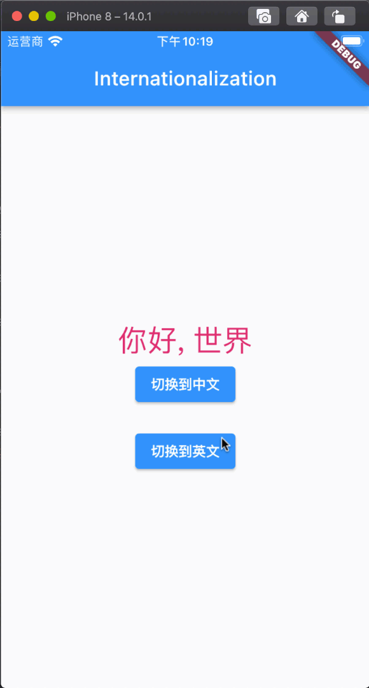

# 国际化配置

## 国际化配置

在我们使用系统自带`MaterialApp`来实现国际化配置，需要进行很多配置，而且还需要手动去依赖第三方组件，而使用`GetX`来实现国际化配置，你只需要一行代码即可实现切换，接下来我们看一下具体实现。

## 视频教程地址

[零基础视频教程地址](https://www.bilibili.com/video/BV1uq4y1U7fF?p=11)

### 第一步：应用程序入口配置

- **translations：** 国际化配置文件
- **locale：** 设置默认语言，不设置的话为系统当前语言
- **fallbackLocale：** 配置错误的情况下, 使用的语言

```dart
import 'package:flutter/material.dart';
import 'package:flutter_getx_example/InternationalizationExample/InternationalizationExample.dart';
import 'package:get/get.dart';

void main() {
  runApp(MyApp());
}

class MyApp extends StatelessWidget {
  @override
  Widget build(BuildContext context) {
    /// 国际化配置
    return GetMaterialApp(
      title: "GetX",
      translations: Messages(),
      locale: Locale('zh', 'CN'), //设置默认语言
      fallbackLocale: Locale("zh", "CN"), // 在配置错误的情况下,使用的语言
      home: InternationalizationExample(),
    );
  }
}
```

### 第二步：创建国际化类

需要继承自`Translations`并重写`keys`方法。

```dart
import 'package:get/get.dart';

class Messages extends Translations {

  @override
  // TODO: implement keys
  Map<String, Map<String, String>> get keys => {
    'zh_CN': {
      'hello': "你好, 世界"
    },
    'en_US': {
      'hello': 'hello world'
    }
  };
}
```

### 第三步：创建控制器类，用于切换语言

```dart
import 'dart:ui';
import 'package:get/get.dart';

class MessagesController extends GetxController {

  void changeLanguage(String languageCode, String  countryCode) {
    var locale = Locale(languageCode, countryCode);
    Get.updateLocale(locale);
  }
}
```

### 第四步：实例化控制器并使用

```dart
import 'package:flutter/material.dart';
import 'package:flutter_getx_example/GetXControllerWorkersExample/WorkersConroller.dart';
import 'package:flutter_getx_example/InternationalizationExample/MessagesCnotroller.dart';
import 'package:get/get.dart';

class InternationalizationExample extends StatelessWidget {

  MessagesController messagesController = Get.put(MessagesController());

  @override
  Widget build(BuildContext context) {
    return Scaffold(
      appBar: AppBar(
        title: Text("Internationalization"),
      ),
      body: Center(
        child: Column(
          mainAxisAlignment: MainAxisAlignment.center,
          crossAxisAlignment: CrossAxisAlignment.center,
          children: [
            Text('hello'.tr, style: TextStyle(color: Colors.pink, fontSize: 30)),
            ElevatedButton(
              onPressed: () => messagesController.changeLanguage('zh', "CN"),
              child: Text("切换到中文")
            ),
            SizedBox(height: 20,),
            ElevatedButton(
              onPressed: () => messagesController.changeLanguage('en', "US"),
              child: Text("切换到英文")
            ),
          ],
        ),
      ),
    );
  }
}
```

### 效果展示

[](./static/getx-update-locale.gif)

## 依赖注入

在前面的文章中，我们经常使用`Get.put(MyController())`来进行控制器实例的创建，这样我们就算不使用控制器实例也会被创建，其实`GetX`还提供很多创建实例的方法，可根据不同的业务来进行创建，接下来我们简单介绍一下几个最常用的

- **Get.put()：** 不使用控制器实例也会被创建
- **Get.lazyPut()：** 懒加载方式创建实例，只有在使用时才创建
- **Get.putAsync()：** `Get.put()` 的异步版版本
- **Get.create()：** 每次使用都会创建一个新的实例

我们来看一下代码演示

### 第一步：应用程序入口配置

```dart
import 'package:flutter/material.dart';
import 'package:flutter_getx_example/DependecyInjectionExample/DependecyInjectionExample.dart';
import 'package:get/get.dart';

void main() {
  runApp(MyApp());
}

class MyApp extends StatelessWidget {
  @override
  Widget build(BuildContext context) {
    return GetMaterialApp(
      title: "GetX",
      home: DependecyInjectionExample(),
    );
  }
}
```

### 第二步：创建控制器

```dart
import 'package:flutter_getx_example/ObxCustomClassExample/Teacher.dart';
import 'package:get/get.dart';

class MyController extends GetxController {
  var teacher = Teacher();

  void convertToUpperCase() {
     teacher.name.value = teacher.name.value.toUpperCase();
  }
}
```

### 第三步：实例化控制器并使用

```dart
import 'package:flutter/material.dart';
import 'package:flutter_getx_example/GetXControllerExample/MyController.dart';
import 'package:get/get.dart';

class DependecyInjectionExample extends StatelessWidget {
  @override
  Widget build(BuildContext context) {

    // 即使不使用控制器实例也会被创建
    // tag将用于查找具有标签名称的实例
    // 控制器在不使用时被处理，但如果永久为真，则实例将在整个应用程序中保持活动状态
    MyController myController = Get.put(MyController(), permanent: true);
    // MyController myController = Get.put(MyController(), tag: "instancel", permanent: true);

    // 实例将在使用时创建
    // 它类似于'permanent'，区别在于实例在不被使用时被丢弃
    // 但是当它再次需要使用时，get 将重新创建实例
    // Get.lazyPut(()=> MyController());
    // Get.lazyPut(()=> MyController(), tag: "instancel");

    // Get.put 异步版本
    // Get.putAsync<MyController>(() async  => await MyController());

    // 每次都将返回一个新的实例
    // Get.create<MyController>(() => MyController());

    return Scaffold(
      appBar: AppBar(
        title: Text("GetXController"),
      ),
      body: Center(
        child: Column(
          mainAxisAlignment: MainAxisAlignment.center,
          crossAxisAlignment: CrossAxisAlignment.center,
          children: [
            ElevatedButton(
              onPressed: () {
                // 实例使用的tag创建
                // Get.find<MyController>(tag: 'instancel');

                Get.find<MyController>();
              },
              child: Text("别点我"))
          ],
        ),
      ),
    );
  }
}
```

## Get Service

这个类就像一个 `GetxController`，它共享相同的生命周期`onInit()`、`onReady()`、`onClose()`。 但里面没有 “逻辑”。它只是通知 **GetX** 的依赖注入系统，这个子类**不能**从内存中删除。所以如果你需要在你的应用程序的生命周期内对一个类实例进行绝对的持久化，那么就可以使用`GetxService`。

### 第一步：创建 Service

```dart
import 'package:get/get.dart';
import 'package:shared_preferences/shared_preferences.dart';

class Service extends GetxService {

  Future<void> getCounter() async {
    SharedPreferences prefs = await SharedPreferences.getInstance();
    int count = (prefs.getInt("counter") ?? 0) + 1;
    print("count 的值为: $count");
    await prefs.setInt("counter", count);
  }
}
```

### 第二步：初始化 Service

```dart
import 'package:flutter/material.dart';
import 'package:flutter_getx_example/GetXServiceExample/GetXServiceExample.dart';
import 'package:flutter_getx_example/GetXServiceExample/Service.dart';
import 'package:get/get.dart';

/// 初始化服务
Future<void> main() async {
  await initServices();
  runApp(MyApp());
}

Future<void> initServices() async {
  print("初始化服务");
  await Get.putAsync(() async => await Service());
  print("所有服务启动");
}

class MyApp extends StatelessWidget {
  @override
  Widget build(BuildContext context) {
    return GetMaterialApp(
      title: "GetX",
      home: GetXServiceExample(),
    );
  }
}
```

### 第三步：调用 Service

```dart
import 'package:flutter/material.dart';
import 'package:flutter_getx_example/GetXServiceExample/Service.dart';
import 'package:get/get.dart';

class GetXServiceExample extends StatelessWidget {

  @override
  Widget build(BuildContext context) {
    return Scaffold(
      appBar: AppBar(
        title: Text("GetX Service"),
      ),
      body: Center(
        child: Column(
          mainAxisAlignment: MainAxisAlignment.center,
          crossAxisAlignment: CrossAxisAlignment.center,
          children: [
            ElevatedButton(
              onPressed: () {
                Get.find<Service>().getCounter();
              },
              child: Text("点我加1"))
          ],
        ),
      ),
    );
  }
}
```

## GetX Binding

在我们使用`GetX`状态管理器的时候，往往每次都是用需要手动实例化一个控制器，这样的话基本页面都需要实例化一次，这样就太麻烦了，而`Binding` 能解决上述问题，可以在项目初始化时把所有需要进行状态管理的控制器进行统一初始化，接下来看代码演示：

### 第一步：声明需要进行的绑定控制器类

```dart
import 'package:flutter_getx_example/GetXBindingExample/controller/BindingHomeController.dart';
import 'package:flutter_getx_example/GetXBindingExample/controller/BindingMyController.dart';
import 'package:get/get.dart';

class AllControllerBinding implements Bindings {

  @override
  void dependencies() {
    // TODO: implement dependencies
    Get.lazyPut<BindingMyController>(() => BindingMyController());
    Get.lazyPut<BindingHomeController>(() => BindingHomeController());
  }
}


import 'package:get/get.dart';

class BindingHomeController extends GetxController {
  var count = 0.obs;
  void increment() {
    count++;
  }
}


import 'package:get/get.dart';

class BindingMyController extends GetxController {
  var count = 0.obs;
  void increment() {
    count++;
  }
}
```

### 第二步：在项目启动时进行初始化绑定

绑定的方式有多种，在不同的情况下有不同的使用方式，这里介绍一种，如果需要更加详细的介绍，观看视频将会是最佳的选择。

```dart
import 'package:flutter/material.dart';
import 'package:flutter_getx_example/GetXBindingExample/binding/AllControllerBinding.dart';
import 'package:flutter_getx_example/GetXBindingExample/GetXBindingExample.dart';
import 'package:get/get.dart';

void main() {
  runApp(MyApp());
}


class MyApp extends StatelessWidget {
  @override
  Widget build(BuildContext context) {
    /// GetX Binding
    return GetMaterialApp(
      title: "GetX",
      initialBinding: AllControllerBinding(),
      home: GetXBindingExample(),
    );
  }
}
```

### 第三步：在页面中使用状态管理器

```dart
import 'package:flutter/material.dart';
import 'package:flutter_getx_example/GetXBindingExample/BHome.dart';
import 'package:flutter_getx_example/GetXBindingExample/binding/BHomeControllerBinding.dart';
import 'package:flutter_getx_example/GetXBindingExample/controller/BindingMyController.dart';
import 'package:get/get.dart';

class GetXBindingExample extends StatelessWidget {
  @override
  Widget build(BuildContext context) {
    return Scaffold(
      appBar: AppBar(
        title: Text("GetXBinding"),
      ),
      body: Center(
        child: Column(
          mainAxisAlignment: MainAxisAlignment.center,
          crossAxisAlignment: CrossAxisAlignment.center,
          children: [
            Obx(() => Text(
              "计数器的值为 ${Get.find<BindingMyController>().count}",
              style: TextStyle(color: Colors.red, fontSize: 30),
            )),
            SizedBox(height: 20,),
            ElevatedButton(
              onPressed: () {
                Get.find<BindingMyController>().increment();
              },
              child: Text("点击加1")
            ),
            SizedBox(height: 20,),
            ElevatedButton(
              onPressed: () {
                Get.to(BHome());

                // Get.toNamed("/bHome");

                // Get.to(BHome(), binding: BHomeControllerBinding());
              },
              child: Text("跳转去首页")
            ),
          ],
        ),
      ),
    );
  }
}
```
