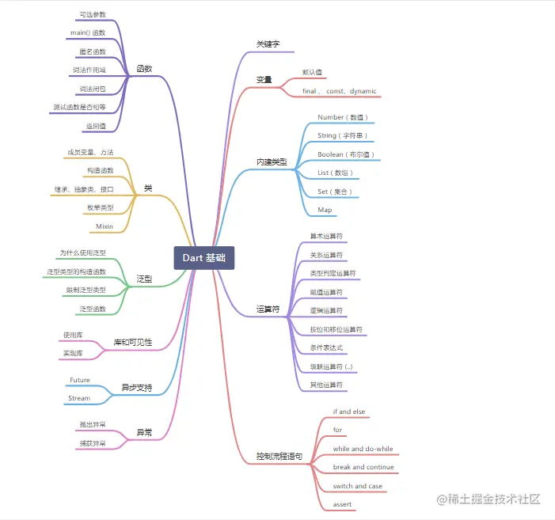
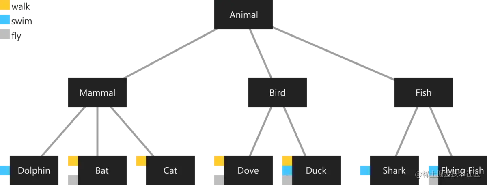
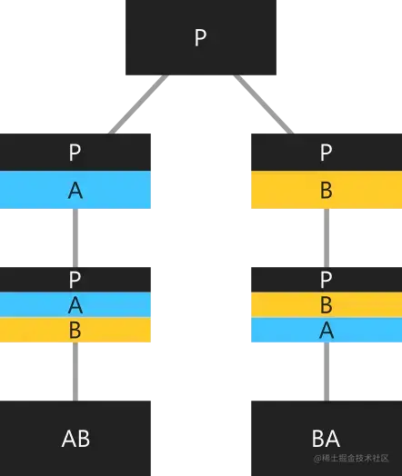
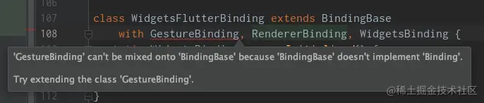
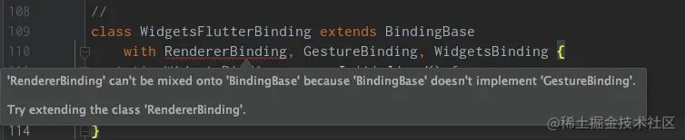

# 基础三：类

## 1.1 思维导图



## 1.2 Dart 基础将分五篇讲解：

<table><thead><tr><th>一</th><th align="left"><a href="https://juejin.cn/post/6928375103780552717" target="_blank" title="https://juejin.cn/post/6928375103780552717">主要讲解关键字、变量、内置类型、操作符、控制流程语句</a></th></tr></thead><tbody><tr><td>二</td><td align="left"><a href="https://juejin.cn/post/6931340267324702733" target="_blank" title="https://juejin.cn/post/6931340267324702733">主要讲解函数</a></td></tr><tr><td>三</td><td align="left"><a href="https://juejin.cn/post/6934661883567800327" target="_blank" title="https://juejin.cn/post/6934661883567800327">主要讲解类</a></td></tr><tr><td>四</td><td align="left"><a href="https://juejin.cn/post/6936901921412382728" target="_blank" title="https://juejin.cn/post/6936901921412382728">主要讲解泛型、库及可见性</a></td></tr><tr><td>五</td><td align="left"><a href="https://juejin.cn/post/6939493546713939982" target="_blank" title="https://juejin.cn/post/6939493546713939982">主要讲解异步支持、异常</a></td></tr></tbody></table>

# 二、类

**Dart 是一种基于类和 mixin 继承机制的面向对象的语言**。 每个对象都是一个类的实例，所有的类都继承于 [Object.](https://link.juejin.cn?target=https%3A%2F%2Fapi.dartlang.org%2Fstable%2Fdart-core%2FObject-class.html "https://api.dartlang.org/stable/dart-core/Object-class.html") 。 **基于 Mixin 继承意味着每个类（除 Object 外） 都只有一个超类， 一个类中的代码可以在其他多个继承类中重复使用。**  

## 2.1 类的成员变量

**对象是由函数和数据（即方法和实例变量）组成**。 方法的调用要通过对象来完成： 调用的方法可以访问其对象的其他函数和数据，使用 (`.`) 来引用实例对象的变量和方法：

```dart
var p = Point(2, 2);
// 为实例的变量 y 设置值。

p.y = 3;
assert(p.y == 3);

// 调用 p 的 distanceTo() 方法。
num distance = p.distanceTo(Point(4, 4));

// 使用 ?. 来代替 . ， 可以避免因为左边对象可能为 null ， 导致的异常：
// 如果 p 为 non-null，设置它变量 y 的值为 4。
p?.y = 4;
```

## 2.2 构造函数

### 2.2.1 使用构造函数

**通过 _构造函数_ 创建对象， 构造函数的名字可以是 `_ClassName_` 或者 `_ClassName_._identifier_`**。例如， 以下代码使用 `Point` 和 `Point.fromJson()` 构造函数创建 `Point` 对象：

```dart
var p1 = Point(2, 2);
var p2 = Point.fromJson({'x': 1, 'y': 2});
```

以下代码具有相同的效果， 但是构造函数前面的的 `new` 关键字是可选的：

```dart
var p1 = new Point(2, 2);
var p2 = new Point.fromJson({'x': 1, 'y': 2});
```

> **版本提示：** 在 Dart 2 中 `new` 关键字变成了可选的。

一些类提供了[常量构造函数](https://link.juejin.cn?target=https%3A%2F%2Fwww.dartcn.com%2Fguides%2Flanguage%2Flanguage-tour%23%25E5%25B8%25B8%25E9%2587%258F%25E6%259E%2584%25E9%2580%25A0%25E5%2587%25BD%25E6%2595%25B0 "https://www.dartcn.com/guides/language/language-tour#%E5%B8%B8%E9%87%8F%E6%9E%84%E9%80%A0%E5%87%BD%E6%95%B0")。 使用常量构造函数，在构造函数名之前加 `const` 关键字 (更多可查看基础一)，来创建编译时常量时：

```dart
var p = const ImmutablePoint(2, 2);
```

构造两个相同的编译时常量会产生一个唯一的， 标准的实例：

```dart
var a = const ImmutablePoint(1, 1);
var b = const ImmutablePoint(1, 1);
assert(identical(a, b)); // 它们是同一个实例。

var a = const ImmutablePoint(2, 2);
var b = const ImmutablePoint(1, 1);
assert(identical(a, b)); // 它们是不是同一个实例，会报错。
```

在 _常量上下文_ 中， 构造函数或者字面量前的 `const` 可以省略。 例如，下面代码创建了一个 const 类型的 map 对象：

```dart
// 这里有很多的 const 关键字。
const pointAndLine = const {
  'point': const [const ImmutablePoint(0, 0)],
  'line': const [const ImmutablePoint(1, 10), const ImmutablePoint(-2, 11)],
};
```

保留第一个 `const` 关键字，其余的全部省略：

```dart
// 仅有一个 const ，由该 const 建立常量上下文。
const pointAndLine = {
  'point': [ImmutablePoint(0, 0)],
  'line': [ImmutablePoint(1, 10), ImmutablePoint(-2, 11)],
};
```

如果常量构造函数在常量上下文之外， 且省略了 `const` 关键字， 此时创建的对象是非常量对象：

```dart
var a = const ImmutablePoint(1, 1); // 创建一个常量对象
var b = ImmutablePoint(1, 1); // 创建一个非常量对象
assert(!identical(a, b)); // 两者不是同一个实例!
```

> **版本提示：** 在 Dart 2 中，一个常量上下文中的 `const` 关键字可以被省略。

  
通过创建一个与其类同名的函数来声明构造函数 （另外，还可以附加一个额外的可选标识符，如 [命名构造函数](https://link.juejin.cn?target=https%3A%2F%2Fwww.dartcn.com%2Fguides%2Flanguage%2Flanguage-tour%23named-constructors "https://www.dartcn.com/guides/language/language-tour#named-constructors") 中所述）。 下面通过最常见的构造函数形式， 即生成构造函数， 创建一个类的实例：

```dart
class Point {
  num x, y;
  Point(num x, num y) {
    // 还有更好的方式来实现下面代码，敬请关注。
    this.x = x;
    this.y = y;
  }
}
```

使用 `this` 关键字引用当前实例。

> **提示：** 近当存在命名冲突时，使用 `this` 关键字。 否则，按照 Dart 风格应该省略 `this` 。

通常模式下，会将构造函数传入的参数的值赋值给对应的实例变量，**Dart 自身的语法糖精简了这些代码**：

```dart
class Point {
  num x, y;
  // 在构造函数体执行前，
  // 语法糖已经设置了变量 x 和 y。
  Point(this.x, this.y); 
}
```

Dart 构造函数有种实现方式：

*   默认构造方法
*   命名构造方法 **`_ClassName_._identifier_`**
*   调用父类构造方法
*   重定向构造函数
*   常量构造函数
*   工厂构造函数: factory

### 2.2.2 默认构造函数

在没有声明构造函数的情况下， Dart 会提供一个默认的构造函数。 **默认构造函数没有参数并会调用父类的无参构造函数。**

### 2.2.3 构造函数不被继承

**子类不会继承父类的构造函数**。 子类不会继承父类的无名有参构造函数和命名构造函数 (即子类只能继承父类无名、无参数的构造函数)，父类构造函数会在子类的构造函数前调用，子类不声明构造函数，那么它就只有默认构造函数 (匿名，没有参数) 。

```dart
 class Person {
    String firstName;

    // 无参数的，非命名的构造函数
    Person() {
        print('in Person');
    }
  }

  class Son extends Person {
    // 因为父类有无参数的，非命名的构造函数，所以可以不用手动调用父类的构造函数      
    Son.fromDictionary(Map data) {
        print('in Son');
    }
  }

// 注意：你无法调用Son()，原因在于你没有定义该构造方法；
// 输出：
// in Person
// in Son
```

如果父类不显示提供无名无参的构造函数，在子类中必须手动调用父类的一个构造函数。这种情况下，调用父类的构造函数的代码放在子类构造函数名后，子类构造函数体前，中间使用 : 分隔

```dart
 class Person {
    String firstName;

    // 命名构造函数
    Person.fromDictionary(Map data) {
        print('in Person');
      }
  }

  class Son extends Person {
    // 父类没有无参数的，非命名的构造函数，所以必须手动调用一个父类的构造函数       
    Son.fromDictionary(Map data) : super.fromDictionary(data) {
        print('in Son');
    }
    
    // 下面即使使用无参构造函数，也必须手动调用父类的构造函数；
    // 除非父类存在无参构造函数，这样一来上面的fromDictionary也无需调用父类构造函数；
    // 这里就可以理解为子类默认是调用了父类的无参构造函数，所以就无需手动调用；
    Son(): super.fromDictionary({}) {
    	print('defalut in Son');
  	}

    // fixme 这种写法会报错，因为父类没有无参数的，非命名的构造函数
    Son.fromDictionary(Map data) {
        print('in Son');
    }          
  }
```

### 2.2.4 命名构造函数

使用命名构造函数可为一个类实现多个构造函数， 也可以使用命名构造函数来更清晰的表明函数意图：

```dart
class Point {
  num x, y;
  
  Point(this.x, this.y);
  
  // 命名构造函数
  Point.origin() {
    x = 0;
    y = 0;
  }
  
}
```

切记，**构造函数不能够被继承**， 这意味着父类的命名构造函数不会被子类继承。 如果希望使用父类中定义的命名构造函数创建子类， 就必须在子类中实现该构造函数。

### 2.2.5 调用父类非默认构造函数

默认情况下，子类的构造函数会自动调用父类的默认构造函数（匿名，无参数）。 父类的构造函数在子类构造函数体开始执行的位置被调用。 如果提供了一个 [initializer list](https://link.juejin.cn?target=https%3A%2F%2Fwww.dartcn.com%2Fguides%2Flanguage%2Flanguage-tour%23initializer-list "https://www.dartcn.com/guides/language/language-tour#initializer-list") （初始化参数列表）， 则初始化参数列表在父类构造函数执行之前执行。 总之，执行顺序如下：

1.  initializer list （初始化参数列表）
2.  superclass’s no-arg constructor （父类的无名构造函数）
3.  main class’s no-arg constructor （主类的无名构造函数）

**如果父类中没有匿名无参的构造函数， 则需要手工调用父类的其他构造函数。 在当前构造函数冒号 (`:`) 之后，函数体之前，声明调用父类构造函数。**  
下面的示例中，Employee 类的构造函数调用了父类 Person 的命名构造函数。  
由于父类的构造函数参数在构造函数执行之前执行， 所以参数可以是一个表达式或者一个方法调用：

```dart
class Person {
  String firstName;

  Person.fromJson(Map data) {
    print('in Person');
  }
}

class Employee extends Person {
  // Person does not have a default constructor;
  // you must call super.fromJson(data).
  Employee.fromJson(Map data) : super.fromJson(data) {
    print('in Employee');
  }
}

main() {
  var emp = new Employee.fromJson({});

  if (emp is Person) {
    // Type check
    emp.firstName = 'Bob';
  }
  (emp as Person).firstName = 'Bob';
}

// 输出
// in Person
// in Employee
```

> **警告：** 调用父类构造函数的参数无法访问 this 。 例如，参数可以为静态函数但是不能是实例函数。

### 2.2.6 初始化列表

**除了调用超类构造函数之外， 还可以在构造函数体执行之前初始化实例变量**。 各参数的初始化用逗号分隔。

```dart
// 在构造函数体执行之前，
// 通过初始列表设置实例变量。
Point.fromJson(Map<String, num> json)
    : x = json['x'],
      y = json['y'] {
  print('In Point.fromJson(): ($x, $y)');
}
```

> **警告：** 初始化程序的右侧无法访问 `this` 。

在开发期间， 可以使用 `assert` 来验证输入的初始化列表。

```dart
Point.withAssert(this.x, this.y) : assert(x >= 0) {
  print('In Point.withAssert(): ($x, $y)');
}
```

使用初始化列表可以很方便的设置 final 字段。 下面示例演示了，如何使用初始化列表初始化设置三个 final 字段。

```dart
import 'dart:math';

class Point {
  final num x;
  final num y;
  final num distanceFromOrigin;

  Point(x, y)
      : x = x,
        y = y,
        distanceFromOrigin = sqrt(x * x + y * y);
}

main() {
  var p = new Point(2, 3);
  print(p.distanceFromOrigin);
}
```

我们再举个例子来说明初始化列表、父类、子类的调用顺序

```dart
class Person {
  String firstName;

  Person(String name) : firstName = 'person' {
    print('in Person : $firstName');
    firstName = name;
    print('in Person : $firstName');
  }
}

class Son extends Person {
  Son(): super('son') {
    print('defalut in Son');
  }
}
void main() {
  Son son = Son();
  // in Person : person
  // in Person : son
  // defalut in Son
}
```

### 2.2.7 重定向构造函数

有时构造函数的唯一目的是重定向到同一个类中的另一个构造函数。 重定向构造函数的函数体为空， 构造函数的调用在冒号 (:) 之后。

```dart
class Point {
  num x, y;
  // 类的主构造函数。
  Point(this.x, this.y);
  // 指向主构造函数
  Point.alongXAxis(num x) : this(x, 0);
}
```

这里总结下，构造函数冒号 (:) 之后的用途有 (无法一起使用)  

*   调用父类非默认构造函数
*   初始化列表参数
*   重定向构造函数

### 2.2.8 常量构造函数

如果该类生成的对象是固定不变的， 那么就可以把这些对象定义为编译时常量。 为此，需要定义一个 `const` 构造函数， 并且声明所有实例变量为 `final`。

```dart
class ImmutablePoint {
  static final ImmutablePoint origin =
      const ImmutablePoint(0, 0);
  final num x, y;
  const ImmutablePoint(this.x, this.y);
}
```

常量构造函数创建的实例并不总是常量。 更多内容，查看构造函数那一小节。

### 2.2.9 工厂构造函数

当执行构造函数并不总是创建这个类的一个新实例时，则使用 `factory` 关键字。 例如，一个工厂构造函数可能会返回一个 cache 中的实例， 或者可能返回一个子类的实例。  
以下示例演示了从缓存中返回对象的工厂构造函数：

```dart
class Logger {
  final String name;
  
  bool mute = false;
  
  // 从命名的 _ 可以知， _cache 是私有属性。
  static final Map<String, Logger> _cache = <String, Logger>{};
  
  factory Logger(String name) {
    if (_cache.containsKey(name)) {
      return _cache[name];
    } else {
      final logger = Logger._internal(name);
      _cache[name] = logger;
      return logger;
    }
  }
  
  Logger._internal(this.name);
  
  void log(String msg) {
    if (!mute) print(msg);
  }
}
```

> **提示：** 工厂构造函数无法访问 this。

工厂构造函的调用方式与其他构造函数一样：

```dart
var logger = Logger('UI');
logger.log('Button clicked');
```

补充说明：借助工厂构造函数能够实现单例；

```dart
 // 使用工厂构造实现简单单例
class DioUtil {
  static final DioUtil _instance = DioUtil._init();
  static Dio _dio;

  factory DioUtil() {
    return _instance;
  }

  DioUtil._init() {
    _dio = new Dio();
  }
}

// GlobalEventBus.instance 或者是 GlobalEventBus()调用，同一实例
class GlobalEventBus {
  EventBus eventBus;

  factory GlobalEventBus() => _getInstance();

  static GlobalEventBus get instance => _getInstance();

  static GlobalEventBus _instance;

  GlobalEventBus._internal() {
    // 创建对象
    eventBus = EventBus();
  }

  static GlobalEventBus _getInstance() {
    if (_instance == null) {
      _instance = GlobalEventBus._internal();
    }
    return _instance;
  }
}
```

## 2.3 获取对象类型

使用对象的 `runtimeType` 属性， 可以在运行时获取对象的类型， `runtimeType` 属性回返回一个 [Type](https://link.juejin.cn?target=https%3A%2F%2Fapi.dartlang.org%2Fstable%2Fdart-core%2FType-class.html "https://api.dartlang.org/stable/dart-core/Type-class.html") 对象。

```dart
print('The type of a is ${a.runtimeType}');
```

## 2.4 实例变量

下面是声明实例变量的示例：

```dart
class Point {
  num x; // 声明示例变量 x，初始值为 null 。
  num y; // 声明示例变量 y，初始值为 null 。
  num z = 0; // 声明示例变量 z，初始值为 0 。
}
```

未初始化实例变量的默认人值为 “null” 。  
所有实例变量都生成隐式 _getter_ 方法。 非 final 的实例变量同样会生成隐式 _setter_ 方法, 有关更多信息，参考方法里的 [Getters 和 setters](https://link.juejin.cn?target=https%3A%2F%2Fwww.dartcn.com%2Fguides%2Flanguage%2Flanguage-tour%23getters-%25E5%2592%258C-setters "https://www.dartcn.com/guides/language/language-tour#getters-%E5%92%8C-setters").

```dart
class Point {
  num x;
  num y;
}
void main() {
  var point = Point();
  point.x = 4; // Use the setter method for x.
  assert(point.x == 4); // Use the getter method for x.
  assert(point.y == null); // Values default to null.
}
```

如果在声明时进行了示例变量的初始化， 那么初始化值会在示例创建时赋值给变量， 该赋值过程在构造函数及其初始化列表执行之前。

## 2.5 方法

方法是为对象提供行为的函数。

### 2.5.1 实例方法

对象的实例方法可以访问 `this` 和实例变量。 以下示例中的 `distanceTo()` 方法就是实例方法：

```dart
import 'dart:math';
class Point {
  num x, y;
  Point(this.x, this.y);
  num distanceTo(Point other) {
    var dx = x - other.x;
    var dy = y - other.y;
    return sqrt(dx * dx + dy * dy);
  }
}
2
```

### 2.5.2 Getter 和 Setter

Getter 和 Setter 是用于对象属性读和写的特殊方法。 回想之前的例子，每个实例变量都有一个隐式 Getter ，通常情况下还会有一个 Setter 。 使用 `get` 和 `set` 关键字实现 Getter 和 Setter ，能够为实例创建额外的属性。

```dart
class Rectangle {
  num left, top, width, height;
  
  Rectangle(this.left, this.top, this.width, this.height);
  
  // 定义两个计算属性： right 和 bottom。
  num get right => left + width;
  set right(num value) => left = value - width;
  
  num get bottom => top + height;
  set bottom(num value) => top = value - height;
}

void main() {
  var rect = Rectangle(3, 4, 20, 15);
  assert(rect.left == 3);
  rect.right = 12;
  assert(rect.left == -8);
}
```

最开始实现 Getter 和 Setter 也许是直接返回成员变量； 随着需求变化， Getter 和 Setter 可能需要进行计算处理而使用方法来实现； 但是，调用对象的代码不需要做任何的修改。

> **提示：** 类似 (++) 之类操作符不管是否定义了 getter 方法，都能够正确的执行。 为了避免一些问题，操作符只调用一次 getter 方法， 然后把值保存到一个临时的变量中。

### 2.5.3 抽象方法

实例方法， getter 和 setter 方法可以是抽象的， 只定义接口不进行实现，而是留给其他类去实现。 抽象方法只存在于 [抽象类](https://link.juejin.cn?target=https%3A%2F%2Fwww.dartcn.com%2Fguides%2Flanguage%2Flanguage-tour%23%25E6%258A%25BD%25E8%25B1%25A1%25E7%25B1%25BB "https://www.dartcn.com/guides/language/language-tour#%E6%8A%BD%E8%B1%A1%E7%B1%BB") 中。  
定义一个抽象函数，使用分号 (;) 来代替函数体：

```dart
abstract class Doer {
  // 定义实例变量和方法 ...
  void doSomething(); // 定义一个抽象方法。
}
class EffectiveDoer extends Doer {
  void doSomething() {
    // 提供方法实现，所以这里的方法就不是抽象方法了...
  }
}
```

调用抽象方法会导致运行时错误。  

## 2.6 抽象类

使用 `abstract` 修饰符来定义 _抽象类_ — 抽象类不能实例化。 抽象类通常用来定义接口，以及部分实现。 如果希望抽象类能够被实例化，那么可以通过定义一个 [工厂构造函数](https://link.juejin.cn?target=https%3A%2F%2Fwww.dartcn.com%2Fguides%2Flanguage%2Flanguage-tour%23%25E5%25B7%25A5%25E5%258E%2582%25E6%259E%2584%25E9%2580%25A0%25E5%2587%25BD%25E6%2595%25B0 "https://www.dartcn.com/guides/language/language-tour#%E5%B7%A5%E5%8E%82%E6%9E%84%E9%80%A0%E5%87%BD%E6%95%B0") 来实现。

```dart
abstract class User {
  String name;
  //默认构造方法
  User(this.name);
  
  //工厂方法返回Child实例
  factory User.test(String name){
    return new Child(name);
  }
  
  void printName();
}

// extends 继承抽象类
class Child extends User{
  Child(String name) : super(name);

  @override
  void printName() {
    print(name);
  }
}

void main() {
  var p = User.test("黄药师");
  print(p.runtimeType); //输出实际类型 Child
  p.printName();//输出实际类型 黄药师
}
```

抽象类通常具有 [抽象方法](https://link.juejin.cn?target=https%3A%2F%2Fwww.dartcn.com%2Fguides%2Flanguage%2Flanguage-tour%23abstract-methods "https://www.dartcn.com/guides/language/language-tour#abstract-methods")。 下面是一个声明具有抽象方法的抽象类示例：

```dart
// 这个类被定义为抽象类，所以不能被实例化。
abstract class AbstractContainer {
  // 定义构造行数，字段，方法...
  void updateChildren(); // 抽象方法。
}
```

## 2.7 隐式接口

每个类都隐式的定义了一个接口 (Dart 没有像 Java 用单独的关键字 interface 来定义接口，普通用 class 声明的类就可以是接口)，**接口包含了该类所有的实例成员及其实现的接口**。 如果要创建一个 A 类，A 要支持 B 类的 API ，但是不需要继承 B 的实现， 那么可以通过 A 实现 B 的接口。  
一个类可以通过 `implements` 关键字来实现一个或者多个接口， 并实现每个接口要求的 API。 例如：

```dart
// person 类。 隐式接口里面包含了 greet() 方法声明。
class Person {
  // 包含在接口里，但只在当前库中可见。
  final _name;
  // 不包含在接口里，因为这是一个构造函数。
  Person(this._name);
  // 包含在接口里。
  String greet(String who) => 'Hello, $who. I am $_name.';
}

// person 接口的实现。
class Impostor implements Person {
  get _name => '';
  String greet(String who) => 'Hi $who. Do you know who I am?';
}

String greetBob(Person person) => person.greet('Bob');

void main() {
  print(greetBob(Person('Kathy')));
  print(greetBob(Impostor()));
  // Hello, Bob. I am Kathy.
  // Hi Bob. Do you know who I am?
}
```

下面示例演示一个类如何实现多个接口： Here’s an example of specifying that a class implements multiple interfaces:

```dart
class Point implements Comparable, Location {...}
```

## 2.8 扩展类（继承）

### 2.8.1 使用 `extends` 关键字来创建子类， 使用 `super` 关键字来引用父类：

```dart
class Television {
  void turnOn() {
    _illuminateDisplay();
    _activateIrSensor();
  }
  // ···
}

class SmartTelevision extends Television {
  void turnOn() {
    super.turnOn();
    _bootNetworkInterface();
    _initializeMemory();
    _upgradeApps();
  }
  // ···
}
```

### 2.8.2 重写类成员

子类可以重写实例方法，getter 和 setter。 可以使用 `@override` 注解指出想要重写的成员：

```dart
class SmartTelevision extends Television {
  @override
  void turnOn() {...}
  // ···
}
```

### 2.8.3 重写运算符

下标的运算符可以被重写。 例如，想要实现两个向量对象相加，可以重写 `+` 方法。

<table><thead><tr><th><code>&lt;</code></th><th><code>+</code></th><th><code>|</code></th><th><code>[]</code></th></tr></thead><tbody><tr><td><code>&gt;</code></td><td><code>/</code></td><td><code>^</code></td><td><code>[]=</code></td></tr><tr><td><code>&lt;=</code></td><td><code>~/</code></td><td><code>&amp;</code></td><td><code>~</code></td></tr><tr><td><code>&gt;=</code></td><td><code>*</code></td><td><code>&lt;&lt;</code></td><td><code>==</code></td></tr><tr><td><code>–</code></td><td><code>%</code></td><td><code>&gt;&gt;</code></td><td></td></tr></tbody></table>

> **提示：** 你可能会被提示 `!=` 运算符为非可重载运算符。 因为 `e1 != e2` 表达式仅仅是 `!(e1 == e2)` 的语法糖。

下面示例演示一个类重写 `+` 和 `-` 操作符：

```dart
class Vector {
  final int x, y;
  Vector(this.x, this.y);
  Vector operator +(Vector v) => Vector(x + v.x, y + v.y);
  Vector operator -(Vector v) => Vector(x - v.x, y - v.y);
  // 运算符 == 和 hashCode 部分没有列出。 有关详情，请参考下面的注释。
  // ···
}
void main() {
  final v = Vector(2, 3);
  final w = Vector(2, 2);
  assert(v + w == Vector(4, 5));
  assert(v - w == Vector(0, 1));
}
```

如果要重写 `==` 操作符，需要重写对象的 `hashCode` getter 方法。 重写 `==` 和 `hashCode` 的实例，参考 [Implementing map keys](https://link.juejin.cn?target=https%3A%2F%2Fwww.dartcn.com%2Fguides%2Flibraries%2Flibrary-tour%23implementing-map-keys "https://www.dartcn.com/guides/libraries/library-tour#implementing-map-keys")  

### 2.8.4 noSuchMethod()

当代码尝试使用不存在的方法或实例变量时， 通过重写 `noSuchMethod()` 方法，来实现检测和应对处理：

```dart
class A {
  // 如果不重写 noSuchMethod，访问
  // 不存在的实例变量时会导致 NoSuchMethodError 错误。
  @override
  void noSuchMethod(Invocation invocation) {
    print('You tried to use a non-existent member: ' +
        '${invocation.memberName}');
  }
}
```

除非符合下面的任意一项条件， 否则没有实现的方法不能够被调用：

*   receiver 具有 `dynamic` 的静态类型 。  
    
*   receiver 具有静态类型，用于定义为实现的方法 (可以是抽象的), 并且 receiver 的动态类型具有 `noSuchMethod()` 的实现， 该实现与 `Object` 类中的实现不同。  
    

有关更多信息，参考 [noSuchMethod forwarding specification.](https://link.juejin.cn?target=https%3A%2F%2Fgithub.com%2Fdart-lang%2Fsdk%2Fblob%2Fmaster%2Fdocs%2Flanguage%2Finformal%2Fnosuchmethod-forwarding.md "https://github.com/dart-lang/sdk/blob/master/docs/language/informal/nosuchmethod-forwarding.md")

## 2.9 枚举类型

枚举类型也称为 enumerations 或 enums ， 是一种特殊的类，用于表示数量固定的常量值  
使用 `enum` 关键字定义一个枚举类型：

```dart
enum Color { red, green, blue }
```

枚举中的每个值都有一个 `index` getter 方法， **该方法返回值所在枚举类型定义中的位置（从 0 开始）**。 例如，第一个枚举值的索引是 0 ， 第二个枚举值的索引是 1。

```dart
assert(Color.red.index == 0);
assert(Color.green.index == 1);
assert(Color.blue.index == 2);
```

使用枚举的 `values` 常量， 获取所有枚举值列表（ list ）。

```dart
List<Color> colors = Color.values;
assert(colors[2] == Color.blue);
```

可以在 [switch 语句](https://link.juejin.cn?target=https%3A%2F%2Fwww.dartcn.com%2Fguides%2Flanguage%2Flanguage-tour%23switch-%25E5%2592%258C-case "https://www.dartcn.com/guides/language/language-tour#switch-%E5%92%8C-case") 中使用枚举， 如果不处理所有枚举值，会收到警告：

```dart
var aColor = Color.blue;
switch (aColor) {
  case Color.red:
    print('Red as roses!');
    break;
  case Color.green:
    print('Green as grass!');
    break;
  default: // 没有这个，会看到一个警告。
    print(aColor); // 'Color.blue'
}
```

枚举类型具有以下限制：

*   枚举不能被子类化，混合或实现。
*   枚举不能被显式实例化。

有关更多信息，参考 [Dart language specification](https://link.juejin.cn?target=https%3A%2F%2Fwww.dartcn.com%2Fguides%2Flanguage%2Fspec "https://www.dartcn.com/guides/language/spec") 。

## 2.10 为类添加功能：Mixin

**Mixin 是复用类代码的一种途径， 复用的类可以在不同层级，之间可以不存在继承关系。**  
通过 `with` 后面跟一个或多个混入的名称，来 _使用_ Mixin ， 下面的示例演示了两个使用 Mixin 的类：

```dart
class Musician extends Performer with Musical {
  // ···
}
class Maestro extends Person
    with Musical, Aggressive, Demented {
  Maestro(String maestroName) {
    name = maestroName;
    canConduct = true;
  }
}
```

通过创建一个继承自 Object 且没有构造函数的类，来 _实现_ 一个 Mixin 。 如果 Mixin 不希望作为常规类被使用，使用关键字 `mixin` 替换 `class` 。 例如：

```dart
mixin Musical {
  bool canPlayPiano = false;
  bool canCompose = false;
  bool canConduct = false;
  void entertainMe() {
    if (canPlayPiano) {
      print('Playing piano');
    } else if (canConduct) {
      print('Waving hands');
    } else {
      print('Humming to self');
    }
  }
}
```

指定只有某些类型可以使用的 Mixin - 比如， Mixin 可以调用 Mixin 自身没有定义的方法 - 使用 `on` 来指定可以使用 Mixin 的父类类型：

```dart
mixin MusicalPerformer on Musician {
  // ···
}
```

> **版本提示：** `mixin` 关键字在 Dart 2.1 中被引用支持。 早期版本中的代码通常使用 `abstract class` 代替。 更多有关 Mixin 在 2.1 中的变更信息，请参见 [Dart SDK changelog](https://link.juejin.cn?target=https%3A%2F%2Fgithub.com%2Fdart-lang%2Fsdk%2Fblob%2Fmaster%2FCHANGELOG.md "https://github.com/dart-lang/sdk/blob/master/CHANGELOG.md") 和 [2.1 mixin specification](https://link.juejin.cn?target=https%3A%2F%2Fgithub.com%2Fdart-lang%2Flanguage%2Fblob%2Fmaster%2Faccepted%2F2.1%2Fsuper-mixins%2Ffeature-specification.md%23dart-2-mixin-declarations "https://github.com/dart-lang/language/blob/master/accepted/2.1/super-mixins/feature-specification.md#dart-2-mixin-declarations") 。  
> **提示：** 对 Mixin 的一些限制正在被移除。 关于更多详情，参考 [proposed mixin specification.](https://link.juejin.cn?target=https%3A%2F%2Fgithub.com%2Fdart-lang%2Fsdk%2Fblob%2Fmaster%2Fdocs%2Flanguage%2Finformal%2Fmixin-declaration.md "https://github.com/dart-lang/sdk/blob/master/docs/language/informal/mixin-declaration.md")

有关 Dart 中 Mixin 的理论演变，参考 [A Brief History of Mixins in Dart](https://link.juejin.cn?target=https%3A%2F%2Fwww.dartcn.com%2Farticles%2Flanguage%2Fmixins "https://www.dartcn.com/articles/language/mixins").  

### 2.10.1 为什么我们需要 Mixin

我们先来看看下面的类继承图：

  
我们这里有一个名为 Animal 的超类，它有三个子类（Mammal，Bird 和 Fish）。在底部，我们有具体的一些子类。  
小方块代表行为。例如，蓝色方块表示具有此行为的类的实例可以 swim。  
有些动物有共同的行为：猫和鸽子都可以行走，但是猫不能飞。  
这些行为与此分类正交，因此我们无法在超类中实现这些行为。  
如果一个类可以拥有多个超类，那就很容易办到了。我们可以创建另外三个类：Walker，Swimmer，Flyer。在那之后，我们只需从 Walker 类继承 Dove 和 Cat。但在 Dart 中，每个类（除了 Object 类）都只有一个超类。  
我们可以实现它，而不是继承自 Walker 类，因为它是一个接口，但我们必须在多个类中实现行为，因此它并不是一个好的解决方案。  
我们需要一种在多个类层次结构中重用类的代码的方法。  
Mixin 就能够办到这一点！

> 'Mixins are a way of reusing a class’s code in multiple class hierarchies. — dartlang.org'

我们可以通过 java 来实现该继承方式，如下：

```dart
public class Animal {...}
public class Mammal extends Animal {...}
public class Bird extends Animal {...}
public class Fish extends Animal {...}
public class Dolphin extends Mammal {...}
public class Bat extends Mammal {...}
public class Cat extends Mammal {...}
public class Dove extends Bird {...}
public class Duck extends Bird {...}
public class Shark extends Fish {...}
public class FlyingFish extends Fish {...}
```

根据上图来分别给这些类添加行为：Walk，Swim 及 Flying，由于这些行为并不是所有类通用的，所以不能将这些行为放在父类。但如果把这三个行为分别放在三个类中，然后让其他类来继承这三个类，也就可以解决上述问题。但这样就是多继承，而 Java 又不支持多继承。所以这时候凸显出接口的重要性，通过接口来实现上述行为。代码如下：

```dart
// 行走行为
public interface Walk {
    void walk();
}
// 游泳行为
public interface Swim {
    void swim();
}
// 飞翔行为
public interface Flying {
    void flying();
}
// 海豚可以游泳
public class Dolphin extends Mammal implements Swim {
    @Override
    public void swim() {...}
}
// 蝙蝠可以飞、行走
public class Bat extends Mammal implements Flying,Walk {
    @Override
    public void walk() {...}

    @Override
    public void flying() {...}
}
// 猫可以行走
public class Cat extends Mammal implements Walk {
    @Override
    public void walk() {...}
}
// 鸽子可以行走、飞
public class Dove extends Bird implements Walk,Flying {
    @Override
    public void walk() {...}

    @Override
    public void flying() {...}
}
// 鸭子可以行走、飞及游泳
public class Duck extends Bird implements Walk,Flying,Swim {
    @Override
    public void swim() {...}

    @Override
    public void walk() {...}

    @Override
    public void flying() {...}
}
// 鲨鱼可以游泳
public class Shark extends Fish implements Swim {
    @Override
    public void swim() {...}
}
// 飞鱼可以游泳、飞
public class FlyingFish extends Fish implements Swim,Flying {
    @Override
    public void swim() {...}

    @Override
    public void flying() {...}
}
```

在 Java 中通过接口给类添加了行为，同理在 Dart 中一样可以给类添加行为实现上述功能，虽然 Dart 中没有 interface 关键字，但 Dart 中是有接口的概念且任意类都可以作为接口，代码几乎和 java 的一样。但在 Dart 中，我们还可以用 Mixin 来实现上述需求。通过 Mixin 将上面的一些行为加入到各自对应的类中。下面来代码实现：

```dart
// 行走
mixin Walker{
  void walk(){...}
}
// 游泳
mixin Swim{
  void swim(){...}
}
// 飞翔
mixin Flying {
  // 由于这个是抽象方法，所以必须要实现，不能调用super.flying()
  void flying();
}
// 海豚可以游泳
class Dolphin extends Mammal with Swim{
  @override
  void swim() {
    super.swim();
  }
}
// 蝙蝠可以飞、行走
class Bat extends Mammal with Flying,Walk{
  @override
  void flying() {...}
  //覆盖Walk类中的walk方法
  @override
  void walk() {
    super.walk();
  }
}
// 猫可以行走，这里没有重写Walk中的方法
class Cat extends Mammal with Walk{}

// 鸽子可以行走、飞
class Dove extends Bird with Flying,Walk{

  @override
  void flying() {...}
}
// 鸭子可以行走、飞及游泳
class Duck extends Bird with Walk,Flying,Swim{
  @override
  void flying() {...}

  @override
  void walk() {...}
}
// 鲨鱼可以游泳
class Shark extends Fish with Swim{...}
// 飞鱼可以飞及游泳
class FlyingFish extends Fish with Flying,Swim{
  @override
  void flying() {...}
}
```

咋一看，这不就是将 implement 替换成了 with，abstract class 替换成了 mixin 嘛，也太简单了。但仔细一看，我们发现 mixin 里有方法的具体实现，这样可以避免接口的方法必须在子类实现从而导致的代码冗余（Java 8 通过关键字 default 也可以做到这一点）问题。简而言之，mixin 相对于接口能够更好的避免代码冗余，使代码更加集中。  

### 2.10.2 Mixins 的定义及创建

mixins 的中文意思是混入，就是在类中混入其他功能。  
Dart 中的定义是：

> Mixins are a way of reusing a class’s code in multiple class hierarchies. Mixins 是一种在多个类层次结构中复用类代码的方法。

  
可以看出 Mixins 最重要的功能是复用代码，我们先看下 JAVA，复用代码的方式有哪些：

1.  继承  
    子类可以复用父类的方法和属性，但是 JAVA 里的继承只能单继承。  
    
2.  组合  
    将要复用的代码，封装成类 A，让其他类持有 A 的实例，看上去貌似解决了复用代码的问题，但是一方面，每个类持有的 A 的实例是不同的，有多少个类，就总共有多少个 A 的实例，而且另一方面，即使 A 使用单例，使用起来也很不方便。  
    
3.  接口  
    定义一个接口 interface，类实现 interface，这样虽然接口是同一个，但是实现却是分散的，能复用的代码是有限的。  
    

所以在 JAVA 里想要复用代码，限制是很多的，这就有了`mixins`的概念，`mixins`最早的根源来自于 Lisp，因为 Dart 也受到 smalltakk 的影响，所以 Dart 引入了`mixins`的概念，在维基百科中有对`mixins`最准确的定义：

> 在面向对象的语言中, mixins 类是一个可以把自己的方法提供给其他类使用，但却不需要成为其他类的父类。

`mixins`是要通过非继承的方式来复用类中的代码。  
通过创建一个继承自 Object 且没有构造函数的类，来实现一个 Mixin， 如果 Mixin 不希望作为常规类被使用，使用关键字 mixin 替换 class ，换句话说，mixin 也可以使用 class 关键字定义 (也可以是抽象类)，也可以当做普通 class 一样使用，mixins 通过普通的类声明隐式定义：  

```dart
class Walker {
  void walk() {
    print("I'm walking");
  }
}
```

如果我们不想让我们创建的 mixin 被实例化或扩展，我们可以像这样定义它：  

```dart
abstract class Walker {
  // This class is intended to be used as a mixin, and should not be
  // extended directly.
  factory Walker._() => null;
  
  void walk() {
    print("I'm walking");
  }
}
```

  
要使用 mixin 的话，你需要使用 with 关键字，后跟一个或多个 mixin 的名称：

```dart
class Cat extends Mammal with Walker {}
class Dove extends Bird with Walker, Flyer {}
```

  
我在 Cat 类上定义了 Walker mixin，它允许我们调用 walk 方法而不是 fly 方法（在 Flyer 中定义）。

```dart
main(List<String> arguments) {
  Cat cat = Cat();
  Dove dove = Dove();
  // A cat can walk.
  cat.walk();
  // A dove can walk and fly.
  dove.walk();
  dove.fly();
  // A normal cat cannot fly.
  // cat.fly(); // Uncommenting this does not compile.
}
```

  
可以使用 `on` 来指定可以使用 Mixin 的父类类型：

```dart
mixin MusicalPerformer on Musician {
  // ···
}
```

### 2.10.3 Mixins 的线性化

mixin 到目前为止它看上去并不那么难是吗？  
哈哈，那么，你能告诉我们以下程序的输出是什么吗？  

```dart
class A {
  String getMessage() => 'A';
}

class B {
  String getMessage() => 'B';
}

class P {
  String getMessage() => 'P';
}

class AB extends P with A, B {}
class BA extends P with B, A {}

void main() {
  String result = '';
  AB ab = AB();
  result += ab.getMessage();
  
  BA ba = BA();
  result += ba.getMessage();
  print(result);
}
```

AB 和 BA 类都使用 A 和 B mixins 继承至 P 类，但顺序不同。  
所有的 A,B 和 P 类都有一个名为 getMessage 的方法。  
首先，我们调用 AB 类的 getMessage 方法，然后调用 BA 类的 getMessage 方法。  
**那么你认为，结果是什么？**

*   A.PP
*   B. BA
*   C. AB
*   D. BAAB
*   E. ABBA

**...**  
**  
当当当~ 答案是 B！这个程序将打印 BA。  
**我想你在猜测 mixins 的声明顺序非常重要。**  
**  
在上面的示例中，我们发现`with`关键字后有多个类。那么这里就产生了一个问题——如果`with`后的多个类中有相同的方法，那么当调用该方法时，会调用哪个类里的方法呢？由于距离`with`关键字越远的类会重写前面类中的相同方法，因此分为以下两种情况

*   如果当前使用类重写了该方法，就会调用当前类中的方法。
*   如果当前使用类没有重写了该方法，则会调用距离`with`关键字最远类中的方法。

  
所以当您将 mixin 混入类中时，请记住下面这句话：

> Dart 中的 Mixins 通过创建一个新类来实现，该类将 mixin 的实现层叠在一个超类之上以创建一个新类 ，它不是 “在超类中”，而是在超类的 “顶部”，因此如何解决查找问题不会产生歧义。 — Lasse R. H. Nielsen on StackOverflow.'

  
实际上，这段代码  

```dart
class AB extends P with A, B {}
class BA extends P with B, A {}
```

  
在语义上等同于  

```dart
class PA = P with A;
class PAB = PA with B;
class AB extends PAB {}

class PB = P with B;
class PBA = PB with A;
class BA extends PBA {}
```

**  
**最终的继承关系可以用下图表示：**  
**  
  
在 AB 和 P 之间创建新类，这些新类是超类 P 与 A 类和 B 类之间的混合类。  
正如你所看到的那样，我们并没有使用多重继承！

> *   Mixins 不是一种在经典意义上获得多重继承的方法。
> *   Mixins 是一种抽象和重用一系列操作和状态的方法。
> *   它类似于扩展类所获得的重用，但它与单继承兼容，因为它是线性的。 — Lasse R. H. Nielsen on StackOverflow.

  
**声明 mixins 的顺序代表了从最高级到最高级的继承链，这件事非常重要，你需要记住**。  
再举个例子来证明上述继承关系是正确的：

```dart
//BindingBase
abstract class BindingBase {
  void initInstances() {
    print("BindingBase——initInstances");
  }
}

//GestureBinding
mixin GestureBinding on BindingBase {
  @override
  void initInstances() {
    print("GestureBinding——initInstances");
    super.initInstances();
  }
}

//RendererBinding
mixin RendererBinding on BindingBase {
  @override
  void initInstances() {
    print("RendererBinding——initInstances");
    super.initInstances();
  }
}

// WidgetsBinding
mixin WidgetsBinding on BindingBase {
  @override
  void initInstances() {
    print("WidgetsBinding——initInstances");
    super.initInstances();
  }
}

//WidgetsFlutterBinding
class WidgetsFlutterBinding extends BindingBase
    with GestureBinding, RendererBinding, WidgetsBinding {
  static WidgetsBinding ensureInitialized() {
    return WidgetsFlutterBinding();
  }
}

//main
main(List<String> arguments) {
  var binding = WidgetsFlutterBinding();
  binding.initInstances();
}
```

WidgetsFlutterBinding 中并没有重写 initInstances 方法，那么就以最右边重写该方法的类——WidgetsBinding 为主。那么结果应该如下。

> WidgetsBinding——initInstances

  
但其真实结果其实如下:

> WidgetsBinding——initInstances RendererBinding——initInstances GestureBinding——initInstances BindingBase——initInstances

  
这是为什么呢？仔细一点就可以发现，我们在 WidgetsBinding、RendererBinding 及 GestureBinding 中都调用了父类的 initInstances 方法，也因此会一级一级往上调用。如果我们取消该句代码，则会终止这种调用方式。比如做如下修改。

```dart
mixin WidgetsBinding on BindingBase {
	@override
	void initInstances() {
	  print("WidgetsBinding——initInstances");
	}
}
```

其他代码保持不变，这样就是我们前面预想的结果了。

> WidgetsBinding——initInstances

  
依次类推…  
最后在用`Java`代码展示一下上面的继承关系。

```dart
public class BindingBase {
    void initInstances() {
        System.out.printf("BindingBase——initInstances");
    }
}
public class GestureBinding extends BindingBase {
    @Override
    void initInstances() {
//        super.initInstances();
    }
}
public class RendererBinding extends GestureBinding {
    @Override
    void initInstances() {
//        super.initInstances();
    }
}
public class WidgetsBinding extends RendererBinding {
    @Override
    void initInstances() {
//        super.initInstances();
    }
}
public class WidgetsFlutterBinding extends WidgetsBinding {
}
```

### 2.10.4 Mixins 类型

> 通常，它是其超类的子类型，也是 mixin 名称本身表示的类的子类型，即原始类的类型。 — dartlang.org

mixins 的类型就是其超类的子类型, 所以这意味着这个程序将在控制台中打印六行 true。

```dart
class A {
  String getMessage() => 'A';
}

class B {
  String getMessage() => 'B';
}

class P {
  String getMessage() => 'P';
}

class AB extends P with A, B {}

class BA extends P with B, A {}

void main() {
  AB ab = AB();
  print(ab is P); // true
  print(ab is A); // true
  print(ab is B); // true

  BA ba = BA();
  print(ba is P); // true
  print(ba is A); // true
  print(ba is B); // true
}
```

Lasse R. H. Nielsen 给了我们一个很棒的解释：由于每个 mixin 应用程序都创建一个新类，它还会创建一个新接口（因为所有 Dart 类也定义了接口），如上所述，新类扩展了超类并包含了 mixin 类成员的副本，但它也实现了 mixin 类接口。  

### 2.10.5 Mixins 的使用及注意事项

**当我们想要在不共享相同类层次结构的多个类之间共享行为时，或者在超类中实现此类行为没有意义时，Mixins 非常有用**。通常情况下是序列化（例如，查看 jaguar_serializer）或持久化，但是你也可以使用 mixins 来提供一些实用功能（比如 Flutter 中的 RenderSliverHelpers），不要局限于无状态 mixins，你绝对可以存储变量并使用它们！  

**注意事项一：** mixin 类要么是直接继承 object，要么是直接或间接继承 extends 关键字后的类，所以我们要清楚 mixin 到底是继承那个类。 在前面的示例上做一些修改。

```dart
//一个新类
abstract class Binding {
  void initInstances() {
    print("Binding——initInstances");
  }
}

abstract class BindingBase {
  void initInstances() {
    print("BindingBase——initInstances");
  }
}

mixin GestureBinding on Binding {
  @override
  void initInstances() {
    print("GestureBinding——initInstances");
    super.initInstances();
  }
}

mixin RendererBinding on BindingBase {
  @override
  void initInstances() {
    print("RendererBinding——initInstances");
    super.initInstances();
  }
}

mixin WidgetsBinding on BindingBase {
  @override
  void initInstances() {
    print("WidgetsBinding——initInstances");
    super.initInstances();
  }
}

class WidgetsFlutterBinding extends BindingBase
    with RendererBinding, WidgetsBinding, GestureBinding {
  static WidgetsBinding ensureInitialized() {
    return WidgetsFlutterBinding();
  }
}
```

这时候我们就会发现代码报错，出现了如下警告。  


当我们再次让 GestureBinding 继承自 BindingBase 时，上面错误就消失了。所以我们要清楚 mixin 到底是继承那个类，否则就可能会出现上述错误。  

**注意事项二：** 如果类 A 实现了接口 C，类 B 继承了接口 C，那么类 B 一定得在类 A 的后面。

```dart
//接口
abstract class HitTestable {
  void hitTest(String msg);
}

//实现接口HitTestable
mixin GestureBinding on BindingBase implements HitTestable {
  @override
  void initInstances() {
    print("GestureBinding——initInstances");
    super.initInstances();
  }

  @override
  void hitTest(String msg) {
    print("GestureBinding——hitTest：$msg");
  }
}

mixin RendererBinding on BindingBase, GestureBinding, HitTestable {
  @override
  void hitTest(String msg) {
    print("RendererBinding hitTest：");
    super.hitTest(msg);
    print("RendererBinding——hitTest：$msg");
  }
}
```

那么如果想要在 with 后加上类 GestureBinding 及 RendererBinding，则必须 GestureBinding 在 RendererBinding 的前面，否则会报错。  


当我们让 GestureBinding 在 RendererBinding 前面后，该错误就会消失。  

最后整理下，mixins 弥补了接口和继承的不足，继承只能单继承，而接口无法复用实现，mixins 却可以多混入并且能利用到混入类。关于 Mixins，还有很多需要注意的事情，我们虽然可以使用 Mixins 对代码进行一些简化，但是要建立在对需求和类之间的关系准确理解的基础上，建议多去看看 Flutter 中使用 Mixins 实现的一些源码，从里面吸取一些正确的经验。  

## 2.11 类变量和方法

使用 `static` 关键字实现类范围的变量和方法。

### 2.11.1 静态变量

静态变量（类变量）对于类级别的状态是非常有用的：

```dart
class Queue {
  static const initialCapacity = 16;
  // ···
}

void main() {
  assert(Queue.initialCapacity == 16);
}
```

静态变量只到它们被使用的时候才会初始化。

> **提示：** 代码准守[风格推荐指南](https://link.juejin.cn?target=https%3A%2F%2Fwww.dartcn.com%2Fguides%2Flanguage%2Feffective-dart%2Fstyle%23identifiers "https://www.dartcn.com/guides/language/effective-dart/style#identifiers") 中的命名规则， 使用 `lowerCamelCase` 来命名常量。

### 2.11.2 静态方法

静态方法（类方法）不能在实例上使用，因此它们不能访问 `this` 。 例如：

```dart
import 'dart:math';
class Point {
  num x, y;
  Point(this.x, this.y);
  static num distanceBetween(Point a, Point b) {
    var dx = a.x - b.x;
    var dy = a.y - b.y;
    return sqrt(dx * dx + dy * dy);
  }
}

void main() {
  var a = Point(2, 2);
  var b = Point(4, 4);
  var distance = Point.distanceBetween(a, b);
  assert(2.8 < distance && distance < 2.9);
  print(distance);
}
```

> **提示：** 对于常见或广泛使用的工具和函数， 应该考虑使用顶级函数而不是静态方法。

静态函数可以当做编译时常量使用。 例如，可以将静态方法作为参数传递给常量构造函数。  
参考资料：

1.  [Dart 中文官网](https://link.juejin.cn?target=https%3A%2F%2Fwww.dartcn.com%2Fguides%2Flanguage%2Flanguage-tour "https://www.dartcn.com/guides/language/language-tour")
2.  [Dart | 什么是 Mixin](https://link.juejin.cn?target=https%3A%2F%2Fwww.jianshu.com%2Fp%2Fa578bd2c42aa "https://www.jianshu.com/p/a578bd2c42aa")
3.  [Flutter Dart mixins 探究](https://juejin.cn/post/6844903764441202702 "https://juejin.cn/post/6844903764441202702")