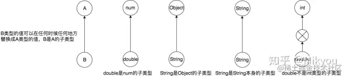
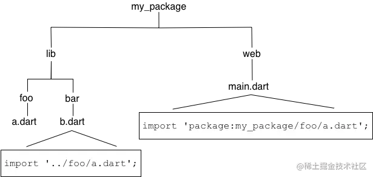

# 基础四：泛型、库

## 1.1 思维导图


## 1.2 Dart 基础将分五篇讲解：

<table><thead><tr><th>一</th><th align="left"><a href="https://juejin.cn/post/6928375103780552717" target="_blank" title="https://juejin.cn/post/6928375103780552717">主要讲解关键字、变量、内置类型、操作符、控制流程语句</a></th></tr></thead><tbody><tr><td>二</td><td align="left"><a href="https://juejin.cn/post/6931340267324702733" target="_blank" title="https://juejin.cn/post/6931340267324702733">主要讲解函数</a></td></tr><tr><td>三</td><td align="left"><a href="https://juejin.cn/post/6934661883567800327" target="_blank" title="https://juejin.cn/post/6934661883567800327">主要讲解类</a></td></tr><tr><td>四</td><td align="left"><a href="https://juejin.cn/post/6936901921412382728" target="_blank" title="https://juejin.cn/post/6936901921412382728">主要讲解泛型、库及可见性</a></td></tr><tr><td>五</td><td align="left"><a href="https://juejin.cn/post/6939493546713939982" target="_blank" title="https://juejin.cn/post/6939493546713939982">主要讲解异步支持、异常</a></td></tr></tbody></table>

# 二、泛型

在 API 文档中你会发现基础数组类型 [List](https://link.juejin.cn?target=https%3A%2F%2Fapi.dartlang.org%2Fstable%2Fdart-core%2FList-class.html "https://api.dartlang.org/stable/dart-core/List-class.html") 的实际类型是 `List<E>` 。 <…> 符号将 List 标记为 _泛型_ (或 _参数化_) 类型。 这种类型具有形式化的参数。 通常情况下，使用一个字母来代表类型参数， 例如 E, T, S, K, 和 V 等。

## 2.1 为什么使用泛型

在类型安全上通常需要泛型支持， 它的好处不仅仅是保证代码的正常运行：

*   泛型可以在多种类型之间定义同一个实现，同时还可以继续使用检查模式和静态分析工具提供的代码分析功能，正确指定泛型类型可以提高代码质量。
*   在 Dart 中类型是可选的，可以通过泛型来限定类型。
*   使用泛型可以减少重复的代码。

  
如果想让 List 仅仅支持字符串类型， 可以将其声明为 `List<String>` （读作 “字符串类型的 list”）。 那么，当一个非字符串被赋值给了这个 list 时，开发工具就能够检测到这样的做法可能存在错误。 例如：

```dart
var names = List<String>();
names.addAll(['Seth', 'Kathy', 'Lars']);
names.add(42); // 错误
```

另外一个使用泛型的原因是减少重复的代码。 泛型可以在多种类型之间定义同一个实现， 同时还可以继续使用检查模式和静态分析工具提供的代码分析功能。 例如，假设你创建了一个用于缓存对象的接口：

```dart
abstract class ObjectCache {
  Object getByKey(String key);
  void setByKey(String key, Object value);
}
```

后来发现需要一个相同功能的字符串类型接口，因此又创建了另一个接口：

```dart
abstract class StringCache {
  String getByKey(String key);
  void setByKey(String key, String value);
}
```

后来，又发现需要一个相同功能的数字类型接口 … 这里你应该明白了。  
泛型可以省去创建所有这些接口的麻烦。 通过创建一个带有泛型参数的接口，来代替上述接口：

```dart
abstract class Cache<T> {
  T getByKey(String key);
  void setByKey(String key, T value);
}
```

在上面的代码中，T 是一个备用类型。 这是一个类型占位符，在开发者调用该接口的时候会指定具体类型。  
此外，补充一点 Dart 中可以指定实际的泛型参数类型，也可以省略。**省略实际上就相当于指定了泛型参数类型为`dynamic`类型。**

```dart
class Test {
  List<int> nums = [1, 2, 3, 4];
  Map<String, int> maps = {'a': 1, 'b': 2, 'c': 3, 'd': 4};
  
  //上述定义可简写成如下形式,但是不太建议使用这种形式，仅在必要且适当的时候使用
  List nums = [1, 2, 3, 4];
  Map maps = {'a': 1, 'b': 2, 'c': 3, 'd': 4};
  
  //上述定义相当于如下形式
  List<dynamic> nums = [1, 2, 3, 4];
  Map<dynamic, dynamic> maps = {'a': 1, 'b': 2, 'c': 3, 'd': 4};
}
```

## 2.2 泛型的语法

泛型的语法非常简单，使用 `<>` 标识符即可声明泛型。List , Set 和 Map 字面量也是可以参数化的。 参数化字面量和之前的字面量定义类似， 对于 List 或 Set 只需要在声明语句前加 `<_type_>` 前缀， 对于 Map 只需要在声明语句前加 `<_keyType_, _valueType_>` 前缀， 下面是参数化字面量的示例：

```dart
var names = <String>['Seth', 'Kathy', 'Lars'];

var uniqueNames = <String>{'Seth', 'Kathy', 'Lars'};

var pages = <String, String>{
  'index.html': 'Homepage',
  'robots.txt': 'Hints for web robots',
  'humans.txt': 'We are people, not machines'
};
```

## 2.3 泛型的使用

### 2.3.1 使用泛型类型的构造函数

在调用构造函数的时，在类名字后面使用尖括号（`<...>`）来指定泛型类型。 例如：

```dart
class Person<T> {
  T sayhello(T value) {
    print("hello,我是$value");
    return value;
  }
}

void main() {
  Person student = new Person<String>();
  var name = student.sayhello("小明"); // hello,我是小明
  print(name); // 小明
  print(name is String); // true
}
```

在定义类时使用泛型, 类中的方法, 包括属性都可以使用泛型；  

### 2.3.2 泛型函数

最初，Dart 的泛型只能用于类（Dart 1.21 之后的版本开始支持泛型函数）， 新语法的泛型，允许在方法和函数上使用类型参数：

```dart
T getInfo<T> (T value){
    T num = value;
    return num;
}
```

  
示例函数中不同的`T`各表示什么意思

*   函数的返回值类型 (T，表示 getInfo 返回值的类型)。
*   函数名后面，确定`T`代表哪一种类型.
*   参数的类型 (T value，参数的类型) ).
*   局部变量的类型 (T num，局部变量的类型).

**所有 T 表示的类型都是一样的, 由使用函数的时候指定的类型.**

### 2.3.3 集合泛型的使用

```dart
var names = <String>['Seth', 'Kathy', 'Lars'];

var uniqueNames = <String>{'Seth', 'Kathy', 'Lars'};
```

### 2.3.4 泛型的上界限定

使用泛型类型的时候， 可以使用 `extends` 实现参数类型的限制。

```dart
class Foo<T extends SomeBaseClass> {
  // Implementation goes here...
  String toString() => "Instance of 'Foo<$T>'";
}
class Extender extends SomeBaseClass {...}
```

可以使用 `SomeBaseClass` 或其任意子类作为通用参数：

```dart
var someBaseClassFoo = Foo<SomeBaseClass>();
var extenderFoo = Foo<Extender>();
```

也可以不指定泛型参数：

```dart
var foo = Foo();
print(foo); // Instance of 'Foo<SomeBaseClass>'
```

指定任何非 `SomeBaseClass` 类型会导致错误：

```dart
var foo = Foo<Object>();
```

## 2.4 子类、子类型和子类型化关系

**Dart 中泛型类型是 _固化的_，也就是说它们在运行时是携带着类型信息的**。 例如， 在运行时检测集合的类型：

```dart
var names = List<String>();
names.addAll(['Seth', 'Kathy', 'Lars']);
print(names is List<String>); // true
```

> **提示：** 相反，Java 中的泛型会被 _擦除_ ，也就是说在运行时泛型类型参数的信息是不存在的。 在 Java 中，可以测试对象是否为 List 类型， 但无法测试它是否为 `List<String>` 。

什么叫类型擦除呢？简单的说就是，类型参数只存在于编译期，在运行时，Java 的虚拟机 (JVM) 并不知道泛型的存在，比如有两个不同的 ArrayList：ArrayList< Integer > 和 ArrayList< String >。在我们看来它们的参数化类型不同，一个保存整性，一个保存字符串。但是通过比较它们的 Class 对象，代码输出是 true，这说明在 JVM 看来它们是同一个类。而在 C++、C# 这些支持真泛型的语言中，它们就是不同的类。  
泛型参数会擦除到它的第一个边界，之所以取出来自动就是我们传入的参数类型，这是因为编译器在编译生成的字节码文件中插入了类型转换的代码，不需要我们手动转型了。  
所以在 java 中，泛型在运行时就会被擦除，所以在 Java 中可以测试对象是否为列表，但不能检查它是否为 List<String>，而 Dart 泛型类型被固化了，这意味着它们在运行时携带着自己的类型信息。  

### 2.4.1 泛型类与非泛型类

我们可以把 Dart 中的类可分为两大类: **泛型类**和**非泛型类**  
先说**非泛型类**也就是开发中接触最多的一般类，一般的类去定义一个变量的时候，它的**类**实际就是这个变量的类型. 例如定义一个 Student 类，我们会得到一个 Student 类型.  
泛型类比非泛型类要更加复杂，实际上**一个泛型类可以对应无限种类型**。为什么这么说，其实很容易理解。我们从上面知道，在定义泛型类的时候会定义泛型形参，要想拿到一个合法的泛型类型就需要在外部使用地方传入具体的类型实参替换定义中的类型形参。我们知道在 Dart 中`List`是一个类，它不是一个类型。由它可以衍生成无限种泛型类型。例如： List<String>、List< int>、List<List< num>>、List<Map<String,int>>  

### 2.4.2 何为子类型

我们可能会经常在 Flutter 开发中遇到 subtype 子类型的错误:  
`type 'String' is not a subtype of type 'num' of 'other'`.  
到底啥是子类型呢? 它和子类是一个概念吗?  
首先给出一个数学归纳公式:

> **如果 G 是一个有 n 个类型参数的泛型类，而 A[i] 是 B[i] 的子类型且属于 1..n 的范围，那么可表示为 G * G 的子类型，其中 A * B 可表示 A 是 B 的子类型。**

上述是不是很抽象，其实 Dart 中的子类型概念和 Kotlin 中子类型概念极其相似。  
我们一般说**子类**就是派生类，该类一般会继承它的父类 (也叫基类)。例如:

```dart
class Student extends Person{//...},
```

这里的 Student 一般称为 Person 的**子类**。  
而**子类型**则不一样，我们从上面就知道一个类可以有很多种类型，那么子类型就不会像子类那样继承关系的那么严格。子类型定义的规则一般是这样的: **任何时候如果需要的是 A 类型值的任何地方，都可以使用 B 类型的值来替换的，那么就可以说 B 类型是 A 类型的子类型或者称 A 类型是 B 类型的超类型**。  



> **注意:** **某个类型也是它自己本身的子类型，很明显 String 类型的值任意出现地方，String 肯定都是可以替换的**。

可以明显看出子类型的规则会比子类规则更为宽松, 属于子类关系的一般也是子类型关系。像 double 类型值肯定不能替代 int 类型值出现的地方，所以它们不存在子类型关系.  

### 2.4.3 子类型化关系:

如果 A 类型的值在任何时候任何地方出现都能被 B 类型的值替换，B 类型就是 A 类型的子类型，那么 B 类型到 A 类型之间这种映射替换关系就是**子类型化关系。**  

## 2.5 协变 (covariant)

一提到协变，可能我们还会对应另外一个词那就是逆变，实际上在 Dart1.x 的版本中是既支持协变又支持逆变的，但是在 Dart2.x 版本仅仅支持协变的。有了子类型化关系的概念，那么协变就更好理解了，协变实际上就是**保留子类型化关系**，首先，我们需要去明确一下这里所说的保留子类型化关系是针对谁而言的呢?  
比如说`int`是`num`的子类型，因为**在 Dart 中所有泛型类都默认是协变**的，所以`List<int>`就是`List<num>`的子类型，这就是保留了子类型化关系，保留的是泛型参数 (`int`和`num`) 类型的子类型化关系.  
一起看个例子:

```dart
class Fruit {
  final String color;
  
  Fruit(this.color);
}

class Apple extends Fruit {
  Apple() : super("red");
}

class Orange extends Fruit {
  Orange() : super("orange");
}

void printColors(List<Fruit> fruits) {
  for (var fruit in fruits) {
    print('${fruit.color}');
  }
}

main() {
  List<Apple> apples = <Apple>[];
  apples.add(Apple());
  printColors(apples);
  // Apple是Fruit的子类型，所以List<Apple>是List<Fruit>子类型。
  // 所以printColors函数接收一个List<Fruit>类型，可以使用List<Apple>类型替代
  
  List<Orange> oranges = <Orange>[];
  oranges.add(Orange());
  printColors(oranges); // 同理
  
  List<Fruit> fruits = <Fruit>[];
  fruits.add(Fruit('purple'));
  printColors(fruits);
  // Fruit本身也是Fruit的子类型，所以List<Fruit>肯定是List<Fruit>子类型
}
```

  
实际上，在 Dart 中协变默认用于泛型类型实际上还有用于另一种场景**协变方法参数类型**. 可能对专业术语有点懵逼，先通过一个例子来看下:

```dart
// 定义动物基类
class Animal {
  final String color;
  Animal(this.color);
}

// 定义Cat类继承Animal
class Cat extends Animal {
  Cat() : super('black cat');
}

// 定义Dog类继承Animal
class Dog extends Animal {
  Dog() : super('white dog');
}

// 定义一个装动物的笼子类
class AnimalCage {
  void putAnimal(Animal animal) {
    print('putAnimal: ${animal.color}');
  }
}

// 定义一个猫笼类
class CatCage extends AnimalCage {
  @override
  void putAnimal(Animal animal) {
    // 注意: 这里方法参数是Animal类型
    super.putAnimal(animal);
  }
}

// 定义一个狗笼类
class DogCage extends AnimalCage {
    @override
    void putAnimal(Animal animal) {
      // 注意: 这里方法参数是Animal类型
      super.putAnimal(animal);
    }
}
```

我们需要去重写 putAnimal 方法，由于是继承自 AnimalCage 类，所以方法参数类型是 Animal，这会造成什么问题呢? 一起来看下:

```dart
main() {
  //创建一个猫笼对象
  var catCage = CatCage();
  //然后却可以把一条狗放进去，如果按照设计原理应该猫笼子只能put猫。
  catCage.putAnimal(Dog());//这行静态检查以及运行都可以通过。
  
  //创建一个狗笼对象
  var dogCage = DogCage();
  //然后却可以把一条猫放进去，如果按照设计原理应该狗笼子只能put狗。
  dogCage.putAnimal(Cat());//这行静态检查以及运行都可以通过。
}
```

其实对于上述的出现问题，我们更希望 putAnimal 的参数更具体些，为了解决上述问题你需要使用 **`covariant`** 协变关键字。

```dart
// 定义一个猫笼类
class CatCage extends AnimalCage {
  @override
  void putAnimal(covariant Cat animal) {
    // 注意: 这里使用covariant协变关键字 表示CatCage对象中的putAnimal方法只接收Cat对象
    super.putAnimal(animal);
  }
}

// 定义一个狗笼类
class DogCage extends AnimalCage {
    @override
    void putAnimal(covariant Dog animal) {
      // 注意: 这里使用covariant协变关键字 表示DogCage对象中的putAnimal方法只接收Dog对象
      super.putAnimal(animal);
    }
}

main() {
  // 创建一个猫笼对象
  var catCage = CatCage();
  catCage.putAnimal(Dog());
  //这时候这样调用就会报错, 
  // 报错信息: Error: The argument type 'Dog' can't be assigned to the parameter type 'Cat'.
}
```

为了进一步验证结论，可以看下这个例子:

```dart
typedef void PutAnimal(Animal animal);

class TestFunction {
  void putCat(covariant Cat animal) {}//使用covariant协变关键字
  void putDog(Dog animal) {}
  void putAnimal(Animal animal) {}
}

main() {
  var function = TestFunction()
  print(function.putCat is PutAnimal); // true 因为使用协变关键字
  print(function.putDog is PutAnimal); // false
  print(function.putAnimal is PutAnimal); // true 本身就是其子类型
}
```

  
实际上 Dart 和 Java 一样，泛型型变都存在安全问题。以及`List`集合为例，`List`在 Dart 中既是**可变的，又是协变的**，这样就会存在安全问题。然而 Kotlin 却不一样，在 Kotlin 把集合分为可变集合`MutableList<E>`和只读集合`List<E>`，其中`List<E>`在 Kotlin 中就是**不可变的，协变的**，这样就不会存在安全问题。下面这个例子将对比 Dart 和 Kotlin 的实现:

*   Dart 中的实现

```dart
class Fruit {
  final String color;
  Fruit(this.color);
}

class Apple extends Fruit {
  Apple() : super("red");
}

class Orange extends Fruit {
  Orange() : super("orange");
}

void printColors(List<Fruit> fruits) {
  // 实际上这里List是不安全的。
  for (var fruit in fruits) {
    print('${fruit.color}');
  }
}

main() {
  List<Apple> apples = <Apple>[];
  apples.add(Apple());
  printColors(apples);
  // printColors传入是一个List<Apple>，因为是协变的
}
```

为什么说 printColors 函数中的`List<Fruit>`是不安全的呢，外部`main`函数中传入的是一个`List<Apple>`. 所以 printColors 函数中的`fruits`实际上是一个`List<Apple>`. 可是`printColors`这样改动呢?

```dart
void printColors(List<Fruit> fruits) {
  // 实际上这里List是不安全的。
  fruits.add(Orange());
  // 静态检查都是通过的,Dart1.x版本中运行也是可以通过的，但是好在Dart2.x版本进行了优化，
  // 在2.x版本中运行是会报错的:type 'Orange' is not a subtype of type 'Apple' of 'value'
  // 由于在Dart中List都是可变的，在fruits中添加Orange(),实际上是在List<Apple>中添加Orange对象，这里就会出现安全问题。
  
  for (var fruit in fruits) {
    print('${fruit.color}');
  }
}
```

*   Kotlin 中的实现

然而在 Kotlin 中的不会存在上面那种问题，Kotlin 对集合做了很细致的划分，分为可变与只读。只读且协变的泛型类型更具安全性。一起看下 Kotlin 怎么做到的。

```dart
open class Fruit(val color: String)

class Apple : Fruit("red")

class Orange : Fruit("orange")

fun printColors(fruits: List<Fruit>) {
    fruits.add(Orange())
    // 此处编译不通过，因为在Kotlin中只读集合List<E>,
    // 没有add, remove之类修改集合的方法只有读的方法，
    // 所以它不会存在List<Apple>中还添加一个Orange的情况出现。
    for (fruit in fruits) {
        println(fruit.color)
    }
}
fun main() {
    val apples = listOf(Apple())
    printColors(apples)
}
```

## 2.6 类型具体化

### 2.6.1 类型检测

在 Dart 中一般使用 **`is`** 关键字做类型检测，这一点和 Kotlin 中是一致的，如果判断不是某个类型 dart 中使用 **is!**, 而在 Kotlin 中正好相反则用 **!is** 表示。类型检测就是对表达式结果值的动态类型与目标类型做对比测试。

```dart
main() {
  var apples = [Apple()];
  print(apples is List<Apple>);
}
```

### 2.6.2 强制类型转化

强制类型转换在 Dart 中一般使用 **as** 关键字，这一点也和 Kotlin 中是一致的。强制类型转换是对一个表达式的值转化目标类型，如果转化失败就会抛出`CastError`异常。

```dart
Object o = [1, 2, 3];
o as List;
o as Map;//抛出异常
```

# 三、库和可见性

`import` 和 `library` 指令可以用来创建一个模块化的，可共享的代码库。 库不仅提供了 API ，而且对代码起到了封装的作用： 以下划线 (_) 开头的标识符仅在库内可见。 _每个 Dart 应用程序都是一个库_ ，虽然没有使用 `library` 指令。  
库可以通过包来分发。有关 pub（集成在 SDK 中的包管理器）的信息，请参考 [Pub Package 和 Asset Manager](https://link.juejin.cn?target=https%3A%2F%2Fwww.dartcn.com%2Ftools%2Fpub "https://www.dartcn.com/tools/pub")。  

## 3.1 使用库

通过 `import` 指定一个库命名空间中的内如如何在另一个库中使用。 例如，Dart Web 应用程序通常使用 [dart:html](https://link.juejin.cn?target=https%3A%2F%2Fapi.dartlang.org%2Fstable%2Fdart-html "https://api.dartlang.org/stable/dart-html") 库，它们可以像这样导入：

```dart
import 'dart:html';
```

`import` 参数只需要一个指向库的 URI。 对于内置库，URI 拥有自己特殊的 dart: 方案。 对于其他的库，使用系统文件路径或者 package: 方案 。  
`package:` 方案指定由包管理器（如 pub 工具）提供的库。例如：

```dart
import 'package:test/test.dart';
```

> **提示：** _URI_ 代表统一资源标识符。 _URL_（统一资源定位符）是一种常见的 URI。

### 3.1.1 指定库前缀

如果导入两个存在冲突标识符的库， 则可以为这两个库，或者其中一个指定前缀。 例如，如果 library1 和 library2 都有一个 Element 类， 那么可以通过下面的方式处理：

```dart
import 'package:lib1/lib1.dart';
import 'package:lib2/lib2.dart' as lib2;

// 使用 lib1 中的 Element。
Element element1 = Element();

// 使用 lib2 中的 Element。
lib2.Element element2 = lib2.Element();
```

### 3.1.2 导入库的一部分

如果你只使用库的一部分功能，则可以选择需要导入的内容。例如：

*   只导入需要的部分，使用 show 关键字；
*   隐藏不需要的部分，使用 hide 关键字。

```dart
// Import only foo.
import 'package:lib1/lib1.dart' show foo;

// Import all names EXCEPT foo.
import 'package:lib2/lib2.dart' hide foo;
```

### 3.1.3 延迟加载库

_Deferred loading_ (也称之为 _lazy loading_) 可以让应用在需要的时候再加载库。 下面是一些使用延迟加载库的场景：

*   减少 APP 的启动时间。
*   执行 A/B 测试，例如 尝试各种算法的 不同实现。
*   加载很少使用的功能，例如可选的屏幕和对话框。

要延迟加载一个库，需要先使用 `deferred as` 来导入：

```dart
import 'package:greetings/hello.dart' deferred as hello;
```

  
当需要使用的时候，使用库标识符调用 `loadLibrary()` 函数来加载库：  

```dart
Future greet() async {
  await hello.loadLibrary();
  hello.printGreeting();
}
```

在前面的代码，使用 `await` 关键字暂停代码执行一直到库加载完成。 关于 `async` 和 `await` 的更多信息请参考 [异步支持](https://link.juejin.cn?target=https%3A%2F%2Fwww.dartcn.com%2Fguides%2Flanguage%2Flanguage-tour%23%25E5%25BC%2582%25E6%25AD%25A5%25E6%2594%25AF%25E6%258C%2581 "https://www.dartcn.com/guides/language/language-tour#%E5%BC%82%E6%AD%A5%E6%94%AF%E6%8C%81")。  
在一个库上你可以多次调用 `loadLibrary()` 函数。但是该库只是载入一次。  
使用延迟加载库的时候，请注意一下问题：

*   延迟加载库的常量在导入的时候是不可用的。 只有当库加载完毕的时候，库中常量才可以使用。
*   在导入文件的时候无法使用延迟库中的类型。 如果你需要使用类型，则考虑把接口类型移动到另外一个库中， 让两个库都分别导入这个接口库。
*   Dart 隐含的把 `loadLibrary()` 函数导入到使用 `deferred as _的命名空间_` 中。 `loadLibrary()` 方法返回一个 [Future](https://link.juejin.cn?target=https%3A%2F%2Fwww.dartcn.com%2Fguides%2Flibraries%2Flibrary-tour%23future "https://www.dartcn.com/guides/libraries/library-tour#future")。

> 目前只有 dart2js 支持延迟加载， Flutter、Dart VM 以及 DartDevc 目前都不支持延迟加载。你可以查阅 [issue #33118](https://link.juejin.cn?target=https%3A%2F%2Fgithub.com%2Fdart-lang%2Fsdk%2Fissues%2F33118 "https://github.com/dart-lang/sdk/issues/33118") 和 [issue #27776.](https://link.juejin.cn?target=https%3A%2F%2Fgithub.com%2Fdart-lang%2Fsdk%2Fissues%2F27776 "https://github.com/dart-lang/sdk/issues/27776") 获取更多的相关信息。

## 3.2 实现库

在 Dart 生态系统中使用 [Package][] 实现共享软件，比如一些 Library 和工具。本章将通过最常见的 [Library Package](https://link.juejin.cn?target=https%3A%2F%2Fdart.cn%2Ftools%2Fpub%2Fglossary%23library-package "https://dart.cn/tools/pub/glossary#library-package") 来介绍如何创建一个 Package。  

### 3.2.1 Library Package 的组成

下图展示了最简单的 Library Package 布局：  
  
Library 的最基本要求包括：  
**pubspec 文件**  
Library 的 `pubspec.yaml` 文件与应用程序的 `pubspec.yaml` 文件相同 — `pubspec.yaml` 文件中并没有特别的指出这个 Package 是一个 Library 。  
**lib directory lib 目录**  
如你所料， Library 的代码位于 _lib_ 目录下，且对于其他 Package 是公开的。你可以根据需要在 **lib** 下任意创建组织文件结构。按照惯例，实现代码会放在 **lib/src** 目录下。**lib/src 目录下的代码被认为是私有的**。其他 Package 应该永远不需要导入 `src/...` 目录下代码。通过导出 lib/src 目录的文件到一个 lib 目录的文件，实现对 lib/src 目录中 API 的公开。

> **提示：** 在未指定 `library` 命令下，每个 Library 会根据它的路径及文件生成一个唯一标记。因此，这里我们建议在你的代码中忽略 `library` 命令，除非想要 [生成 Library-Level 文档](https://link.juejin.cn?target=https%3A%2F%2Fdart.cn%2Fguides%2Flibraries%2Fcreate-library-packages%23documenting-a-library "https://dart.cn/guides/libraries/create-library-packages#documenting-a-library")。

### 3.2.2 组织 Library Package

在创建一个小的，独立的 Library（称之为 **Mini Library**）。 Library Package 非常容易维护，扩展和测试。大多数情况下，除非存在两个类紧密耦合的情况，否则每个类都应该将自己视为一个 Mini Library 。

> **提示：** 在文件的头部使用 `part` 命令，能够将一个 Library 分割成多个 Dart 文件。这里，我们建议应该创建 Mini Library ，而避免使用 `part` 命令。

直接在 lib 目录下创建 “主” Library 文件，lib/_<package-name>_.dart，该文件导出所有的公开的 API 。这样就可以允许使用者导入单个文件就能够获得 Library 的所有功能。  
lib 目录还可能包含其他可导入的非 src Library。例如，主 Library 可能是跨平台的，但创建的独立 Library 依赖于 dart:io 或 dart:html 。 有些包有单独的库，当主库没有导入时，需要使用前缀导入这些库。  
这里让我们来看下一个真实 Library Package 的组织结构：shelf 。 [shelf](https://link.juejin.cn?target=https%3A%2F%2Fgithub.com%2Fdart-lang%2Fshelf "https://github.com/dart-lang/shelf") Package 提供了一种使用 Dart 创建 Web 服务器的简便方法，它的布局在 Dart Library Package 中是一种常用布局：  
  
主 Library 文件 `shelf.dart` 在 lib 目录下，通过 `shelf.dart` 文件导出 lib/src 目录下的若干文件：  

```dart
export 'src/cascade.dart';
export 'src/handler.dart';
export 'src/handlers/logger.dart';
export 'src/hijack_exception.dart';
export 'src/middleware.dart';
export 'src/pipeline.dart';
export 'src/request.dart';
export 'src/response.dart';
export 'src/server.dart';
export 'src/server_handler.dart';
```

在 shelf Package 中同样包含了 Mini Library：shelf_io 。适配器用来处理来自 dart:io 的 HttpRequest 对象。

> **针对 Web 应用的提示：** 为了在开发时使 [dartdevc](https://link.juejin.cn?target=https%3A%2F%2Fdart.cn%2Ftools%2Fdartdevc "https://dart.cn/tools/dartdevc") 工具能够达到最佳新能，应该将 [实现文件](https://link.juejin.cn?target=https%3A%2F%2Fdart.cn%2Ftools%2Fpub%2Fpackage-layout%23implementation-files "https://dart.cn/tools/pub/package-layout#implementation-files") 放到目录 `/lib/src` 下，而不是 `/lib` 目录的其他地方。另外，避免通过 `package:_package_name_/src/...` 导入文件。

### 3.3.3 导入 Library 文件

在从其他 package 导入 Library 文件时，使用 `package:` 命令来指定文件的 URI 。

```dart
import 'package:utilities/utilities.dart';
```

  
在两个文件都在 lib 目录中，或两个文件都在 lib 目录外，我们都可以使用相对路径的方式导入 Library 。但是，如果两个文件不都在 lib 目录中，需要对 lib 内或者 lib 外进行查找，那么此时必须要使用 `package:` 导入。如果对当前使用存在疑惑，那么直接 `package:` , `package:` 满足所有情况。  
下面图片展示分别从 lib 和 web 目录中导入 `lib/foo/a.dart` 。  


> **注意：** 尽管 lib 图形显示`lib/bar/b.dart`使用相对 import（`import '../foo/a.dart'`），但它也可以使用`package:`指令（`import 'package:my_package/foo/a.dart'`）。

### 3.3.4 条件导入或条件导出 Library 文件

如果你的 library 支持多平台，那么你应该会用到条件导入或条件导出 library 文件。常见的用例是，一个库同时支持 Web 和 Native 平台。  
为了使用条件导入或条件导出，你需要检查是否存在 `dart:*` 库。下面是一个条件导出代码的样例，它将检查是否存在 `dart:io` and `dart:html` 库：

```dart
export 'src/hw_none.dart' // Stub implementation
    if (dart.library.io) 'src/hw_io.dart' // dart:io implementation
    if (dart.library.html) 'src/hw_html.dart'; // dart:html implementation
```

该代码的作用如下：

*   在一个可以使用 `dart:io` 的 app 中（例如一个命令行应用），导出 `src/hw_io.dart`。  
    
*   在一个 web 应用中可以使用 `dart:html` 导出 `src/hw_io.dart`。  
    
*   若是其他情况，则导出 `src/hw_none.dart`。  
    

要条件导入一个文件可以使用和上面一样的方式，仅需将 `export` 改为 `import` 即可。  

> **备忘:** 条件导入或条件导出仅检查该库在当前平台上_是否可用_，而不管是实际导入还是使用。

  
所有条件导出的库必须实现相同的 API。下面是 `dart:io` 实现的一个例子：

```dart
// lib/src/hw_io.dart
import 'dart:io';

void alarm([String text]) {
  stderr.writeln(text ?? message);
}

String get message => 'Hello World from the VM!';

// lib/src/hw_none.dart
// 这是一个默认实现，它会导致抛出 UnsupportedErrors：
void alarm([String text]) => throw UnsupportedError('hw_none alarm');

String get message => throw UnsupportedError('hw_none message');
```

在任何平台上，你都可以导入具有条件导出代码的库：

```dart
import 'package:hw_mp/hw_mp.dart';
void main() {
  print(message);
}
```

### 3.3.5 提供额外文件

一个精心设计的 Library Package 很容易被测试。我们建议使用 [test](https://link.juejin.cn?target=https%3A%2F%2Fgithub.com%2Fdart-lang%2Ftest "https://github.com/dart-lang/test") Package 编写测试用例，并将测试代码放到 Package 根目录的 `test` 目录中。  
如果要创建一个公用的命令行工具，应该将这些工具放到公共目录 `bin` 中。使用 [`pub global activate`](https://link.juejin.cn?target=https%3A%2F%2Fdart.cn%2Ftools%2Fpub%2Fcmd%2Fpub-global%23activating-a-package "https://dart.cn/tools/pub/cmd/pub-global#activating-a-package") 命令行来运行工具。在 pubspec 的 [`executables` 部分](https://link.juejin.cn?target=https%3A%2F%2Fdart.cn%2Ftools%2Fpub%2Fpubspec%23executables "https://dart.cn/tools/pub/pubspec#executables") 列出的工具允许用户直接运行它而无需调用 [`pub global run`](https://link.juejin.cn?target=https%3A%2F%2Fdart.cn%2Ftools%2Fpub%2Fcmd%2Fpub-global%23running-a-script-using-pub-global-run "https://dart.cn/tools/pub/cmd/pub-global#running-a-script-using-pub-global-run")。  
在 Library 中包含一个 example 程序演示如何使用 Library 是非常有用的。 example 程序在 Package 根目录的 `example` 目录中。  
在开发过程中任何非公开的工具或可执行程序，应该放到 `tool` 文件夹。  
如果要将 Library 发布到 Pub 网站还要求一些其他的文件来描述 [发布的 Package](https://link.juejin.cn?target=https%3A%2F%2Fdart.cn%2Ftools%2Fpub%2Fpublishing "https://dart.cn/tools/pub/publishing") ，例如：`README.md` 和 `CHANGELOG.md` 文件。更多关于如何组织 Package 目录的内容，参见 [Pub Package 布局约定](https://link.juejin.cn?target=https%3A%2F%2Fdart.cn%2Ftools%2Fpub%2Fpackage-layout "https://dart.cn/tools/pub/package-layout")。

### 3.3.6 为 Library 制作文档

使用 [dartdoc](https://link.juejin.cn?target=https%3A%2F%2Fgithub.com%2Fdart-lang%2Fdartdoc%23dartdoc "https://github.com/dart-lang/dartdoc#dartdoc") 可以为 Library 生成 API 文档。 dartdoc 解析源文件去查找使用 `///` 语法标注的 [文档注释](https://link.juejin.cn?target=https%3A%2F%2Fdart.cn%2Fguides%2Flanguage%2Feffective-dart%2Fdocumentation%23doc-comments "https://dart.cn/guides/language/effective-dart/documentation#doc-comments")：

```dart
/// The event handler responsible for updating the badge in the UI.
void updateBadge() {
  ...
}
```

  
文档生成示例，参见 [shelf 文档](https://link.juejin.cn?target=https%3A%2F%2Fpub.flutter-io.cn%2Fdocumentation%2Fshelf%2Flatest "https://pub.flutter-io.cn/documentation/shelf/latest")。  

> **提示：** 在生成的文档中要包含任何 Library-Level 的文档，必须要指定 `library` 命令。参见 [issue 1082](https://link.juejin.cn?target=https%3A%2F%2Fgithub.com%2Fdart-lang%2Fdartdoc%2Fissues%2F1082 "https://github.com/dart-lang/dartdoc/issues/1082")。

### 3.3.7 分发开源 Library

如果 Library 是开源的，我们建议将他共享到 [Pub 网站](https://link.juejin.cn?target=https%3A%2F%2Fpub.flutter-io.cn%2F "https://pub.flutter-io.cn/")。使用 [pub publish](https://link.juejin.cn?target=https%3A%2F%2Fdart.cn%2Ftools%2Fpub%2Fcmd%2Fpub-lish "https://dart.cn/tools/pub/cmd/pub-lish") 来发布或者更新 Library，该命令将会上传 Package 并创建或更新其页面。示例参见 [shelf Package](https://link.juejin.cn?target=https%3A%2F%2Fpub.flutter-io.cn%2Fpackages%2Fshelf "https://pub.flutter-io.cn/packages/shelf") 页面。有关如何准备发布 Package 的详细内容，参见 [发布 Package](https://link.juejin.cn?target=https%3A%2F%2Fdart.cn%2Ftools%2Fpub%2Fpublishing "https://dart.cn/tools/pub/publishing")。  
Pub.dev 网站不仅仅是 Dart Packages 的发布网站， Pub 网站不仅用于托管 Package ，还能够生成托管 Package 的 API 参考文档。最新生成的文档的链接位于 Package 的 **About** 选项卡中; 示例参见 shelf Package 的 [API 文档](https://link.juejin.cn?target=https%3A%2F%2Fpub.flutter-io.cn%2Fdocumentation%2Fshelf "https://pub.flutter-io.cn/documentation/shelf")。链接到以前版本的文档，位于 Package 页面的 **Versions** 选项卡中。  
为了确保 Package 的 API 文档在 Pub 网站上看起来更美观，请遵循以下步骤：

*   在发布 Package 前，请通过执行 [dartdoc](https://link.juejin.cn?target=https%3A%2F%2Fgithub.com%2Fdart-lang%2Fdartdoc%23dartdoc "https://github.com/dart-lang/dartdoc#dartdoc") 工具确保文档能够生成成功且符合预期。  
    
*   在发布 Package 后，请检查 **Versions** 选项卡，确保文档生成成功。  
    
*   如果文档没有生成，点击 **Versions** 选项卡中的 **failed** 查看 dartdoc 的输出。  
    

  
**参考资料：**

1.  [Dart 中文官网](https://link.juejin.cn?target=https%3A%2F%2Fwww.dartcn.com%2Fguides%2Flanguage%2Flanguage-tour "https://www.dartcn.com/guides/language/language-tour")
2.  [Dart 语法篇之类型系统与泛型 (七)](https://link.juejin.cn?target=https%3A%2F%2Fzhuanlan.zhihu.com%2Fp%2F93671943 "https://zhuanlan.zhihu.com/p/93671943")
3.  [深入理解 Dart Function & Closure](https://link.juejin.cn?target=https%3A%2F%2Fcloud.tencent.com%2Fdeveloper%2Farticle%2F1644633 "https://cloud.tencent.com/developer/article/1644633")