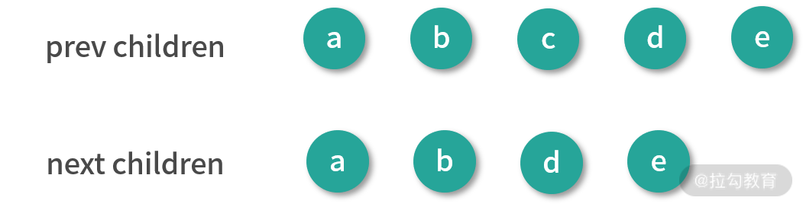
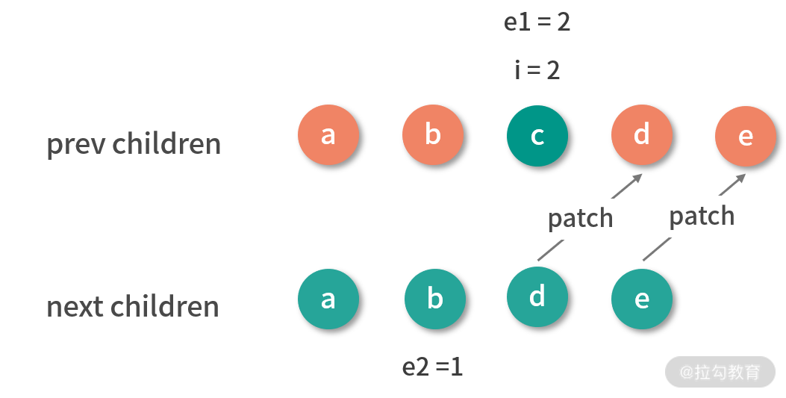
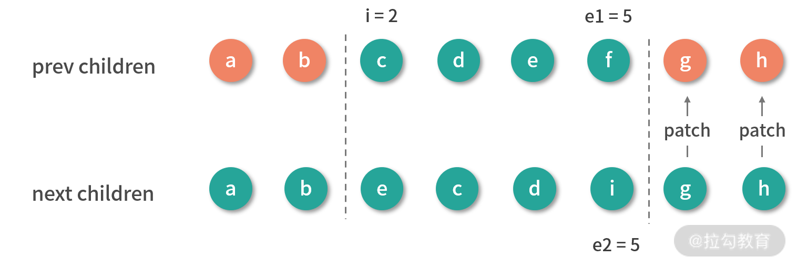
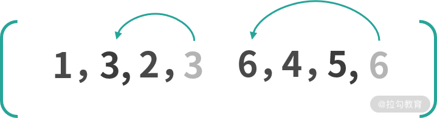
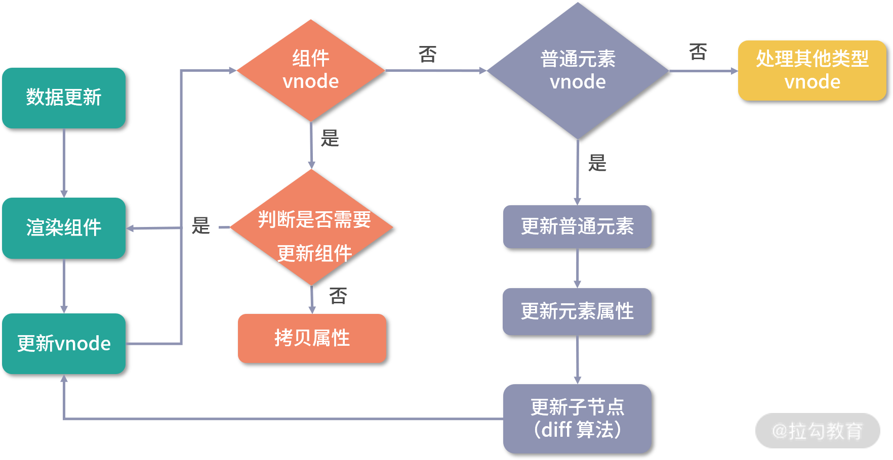

下面我们来继续讲解上节课提到的**核心 diff 算法**。

新子节点数组相对于旧子节点数组的变化，无非是通过更新、删除、添加和移动节点来完成，而核心 diff 算法，就是在已知旧子节点的 DOM 结构、vnode 和新子节点的 vnode 情况下，以较低的成本完成子节点的更新为目的，求解生成新子节点 DOM 的系列操作。

为了方便你理解，我先举个例子，假设有这样一个列表：

```html
<ul>
  <li key="a">a</li>
  <li key="b">b</li>
  <li key="c">c</li>
  <li key="d">d</li>
</ul>
```

然后我们在中间插入一行，得到一个新列表：

```html
<ul>
  <li key="a">a</li>
  <li key="b">b</li>
  <li key="e">e</li>
  <li key="c">c</li>
  <li key="d">d</li>
</ul>
```

在插入操作的前后，它们对应渲染生成的 vnode 可以用一张图表示：


从图中我们可以直观地感受到，差异主要在新子节点中的 b 节点后面多了一个 e 节点。

我们再把这个例子稍微修改一下，多添加一个 e 节点：

```html
<ul>
  <li key="a">a</li>
  <li key="b">b</li>
  <li key="c">c</li>
  <li key="d">d</li>
  <li key="e">e</li>
</ul>
```

然后我们删除中间一项，得到一个新列表：

```html
<ul>
  <li key="a">a</li>
  <li key="b">b</li>
  <li key="d">d</li>
  <li key="e">e</li>
</ul>
```

在删除操作的前后，它们对应渲染生成的 vnode 可以用一张图表示：



我们可以看到，这时差异主要在新子节点中的 b 节点后面少了一个 c 节点。

综合这两个例子，我们很容易发现新旧 children 拥有相同的头尾节点。对于相同的节点，我们只需要做对比更新即可，所以 diff 算法的第一步**从头部开始同步**。

### 同步头部节点

我们先来看一下头部节点同步的实现代码：

```js
const patchKeyedChildren = (c1, c2, container, parentAnchor, parentComponent, parentSuspense, isSVG, optimized) => {
  let i = 0
  const l2 = c2.length
  // 旧子节点的尾部索引
  let e1 = c1.length - 1
  // 新子节点的尾部索引
  let e2 = l2 - 1
  // 1. 从头部开始同步
  // i = 0, e1 = 3, e2 = 4
  // (a b) c d
  // (a b) e c d
  while (i <= e1 && i <= e2) {
    const n1 = c1[i]
    const n2 = c2[i]
    if (isSameVNodeType(n1, n2)) {
      // 相同的节点，递归执行 patch 更新节点
      patch(n1, n2, container, parentAnchor, parentComponent, parentSuspense, isSVG, optimized)
    }
    else {
      break
    }
    i++
  }
}
```

在整个 diff 的过程，我们需要维护几个变量：头部的索引 i、旧子节点的尾部索引 e1和新子节点的尾部索引 e2。

同步头部节点就是从头部开始，依次对比新节点和旧节点，如果它们相同的则执行 patch 更新节点；如果不同或者索引 i 大于索引 e1 或者 e2，则同步过程结束。

我们拿第一个例子来说，通过下图看一下同步头部节点后的结果：


可以看到，完成头部节点同步后：i 是 2，e1 是 3，e2 是 4。

### 同步尾部节点

接着从尾部开始**同步尾部节点**，实现代码如下：

```js
const patchKeyedChildren = (c1, c2, container, parentAnchor, parentComponent, parentSuspense, isSVG, optimized) => {
  let i = 0
  const l2 = c2.length
  // 旧子节点的尾部索引
  let e1 = c1.length - 1
  // 新子节点的尾部索引
  let e2 = l2 - 1
  // 1. 从头部开始同步
  // i = 0, e1 = 3, e2 = 4
  // (a b) c d
  // (a b) e c d
  // 2. 从尾部开始同步
  // i = 2, e1 = 3, e2 = 4
  // (a b) (c d)
  // (a b) e (c d)
  while (i <= e1 && i <= e2) {
    const n1 = c1[e1]
    const n2 = c2[e2]
    if (isSameVNodeType(n1, n2)) {
      patch(n1, n2, container, parentAnchor, parentComponent, parentSuspense, isSVG, optimized)
    }
    else {
      break
    }
    e1--
    e2--
  }
}
```

同步尾部节点就是从尾部开始，依次对比新节点和旧节点，如果相同的则执行 patch 更新节点；如果不同或者索引 i 大于索引 e1 或者 e2，则同步过程结束。

我们来通过下图看一下同步尾部节点后的结果：


可以看到，完成尾部节点同步后：i 是 2，e1 是 1，e2 是 2。

接下来只有 3 种情况要处理：

- 新子节点有剩余要添加的新节点；
- 旧子节点有剩余要删除的多余节点；
- 未知子序列。

我们继续看一下具体是怎样操作的。

### 添加新的节点

首先要判断新子节点是否有剩余的情况，如果满足则添加新子节点，实现代码如下：

复制代码

```
const patchKeyedChildren = (c1, c2, container, parentAnchor, parentComponent, parentSuspense, isSVG, optimized) => {
  let i = 0
  const l2 = c2.length
  // 旧子节点的尾部索引
  let e1 = c1.length - 1
  // 新子节点的尾部索引
  let e2 = l2 - 1
  // 1. 从头部开始同步
  // i = 0, e1 = 3, e2 = 4
  // (a b) c d
  // (a b) e c d
  // ...
  // 2. 从尾部开始同步
  // i = 2, e1 = 3, e2 = 4
  // (a b) (c d)
  // (a b) e (c d)
  // 3. 挂载剩余的新节点
  // i = 2, e1 = 1, e2 = 2
  if (i > e1) {
    if (i <= e2) {
      const nextPos = e2 + 1
      const anchor = nextPos < l2 ? c2[nextPos].el : parentAnchor
      while (i <= e2) {
        // 挂载新节点
        patch(null, c2[i], container, anchor, parentComponent, parentSuspense, isSVG)
        i++
      }
    }
  }
}
```

如果索引 i 大于尾部索引 e1 且 i 小于 e2，那么从索引 i 开始到索引 e2 之间，我们直接挂载新子树这部分的节点。

对我们的例子而言，同步完尾部节点后 i 是 2，e1 是 1，e2 是 2，此时满足条件需要添加新的节点，我们来通过下图看一下添加后的结果：


添加完 e 节点后，旧子节点的 DOM 和新子节点对应的 vnode 映射一致，也就完成了更新。

### 删除多余节点

如果不满足添加新节点的情况，我就要接着判断旧子节点是否有剩余，如果满足则删除旧子节点，实现代码如下：

复制代码

```
const patchKeyedChildren = (c1, c2, container, parentAnchor, parentComponent, parentSuspense, isSVG, optimized) => {
  let i = 0
  const l2 = c2.length
  // 旧子节点的尾部索引
  let e1 = c1.length - 1
  // 新子节点的尾部索引
  let e2 = l2 - 1
  // 1. 从头部开始同步
  // i = 0, e1 = 4, e2 = 3
  // (a b) c d e
  // (a b) d e
  // ...
  // 2. 从尾部开始同步
  // i = 2, e1 = 4, e2 = 3
  // (a b) c (d e)
  // (a b) (d e)
  // 3. 普通序列挂载剩余的新节点
  // i = 2, e1 = 2, e2 = 1
  // 不满足
  if (i > e1) {
  }
  // 4. 普通序列删除多余的旧节点
  // i = 2, e1 = 2, e2 = 1
  else if (i > e2) {
    while (i <= e1) {
      // 删除节点
      unmount(c1[i], parentComponent, parentSuspense, true)
      i++
    }
  }
}
```

如果索引 i 大于尾部索引 e2，那么从索引 i 开始到索引 e1 之间，我们直接删除旧子树这部分的节点。

第二个例子是就删除节点的情况，我们从同步头部节点开始，用图的方式演示这一过程。

首先从头部同步节点：


此时的结果：i 是 2，e1 是 4，e2 是 3。

接着从尾部同步节点：



此时的结果：i 是 2，e1 是 2，e2 是 1，满足删除条件，因此删除子节点中的多余节点：


删除完 c 节点后，旧子节点的 DOM 和新子节点对应的 vnode 映射一致，也就完成了更新。

### 处理未知子序列

单纯的添加和删除节点都是比较理想的情况，操作起来也很容易，但是有些时候并非这么幸运，我们会遇到比较复杂的未知子序列，这时候 diff 算法会怎么做呢？

我们再通过例子来演示存在未知子序列的情况，假设一个按照字母表排列的列表：

复制代码

```
<ul>
  <li key="a">a</li>
  <li key="b">b</li>
  <li key="c">c</li>
  <li key="d">d</li>
  <li key="e">e</li>
  <li key="f">f</li>
  <li key="g">g</li>
  <li key="h">h</li>
</ul>
```

然后我们打乱之前的顺序得到一个新列表：

复制代码

```
<ul>
  <li key="a">a</li>
  <li key="b">b</li>
  <li key="e">e</li>
  <li key="d">c</li>
  <li key="c">d</li>
  <li key="i">i</li>
  <li key="g">g</li>
  <li key="h">h</li>
</ul>
```

在操作前，它们对应渲染生成的 vnode 可以用一张图表示：


我们还是从同步头部节点开始，用图的方式演示这一过程。

首先从头部同步节点：


同步头部节点后的结果：i 是 2，e1 是 7，e2 是 7。

接着从尾部同步节点：



同步尾部节点后的结果：i 是 2，e1 是 5，e2 是 5。可以看到它既不满足添加新节点的条件，也不满足删除旧节点的条件。那么对于这种情况，我们应该怎么处理呢？

结合上图可以知道，要把旧子节点的 c、d、e、f 转变成新子节点的 e、c、d、i。从直观上看，我们把 e 节点移动到 c 节点前面，删除 f 节点，然后在 d 节点后面添加 i 节点即可。

其实无论多复杂的情况，最终无非都是通过更新、删除、添加、移动这些动作来操作节点，而我们要做的就是找到相对优的解。

当两个节点类型相同时，我们执行更新操作；当新子节点中没有旧子节点中的某些节点时，我们执行删除操作；当新子节点中多了旧子节点中没有的节点时，我们执行添加操作，这些操作我们在前面已经阐述清楚了。相对来说这些操作中最麻烦的就是移动，我们既要判断哪些节点需要移动也要清楚如何移动。

#### 移动子节点

那么什么时候需要移动呢，就是当子节点排列顺序发生变化的时候，举个简单的例子具体看一下：

复制代码

```
var prev = [1, 2, 3, 4, 5, 6]
var next = [1, 3, 2, 6, 4, 5]
```

可以看到，从 prev 变成 next，数组里的一些元素的顺序发生了变化，我们可以把子节点类比为元素，现在问题就简化为我们如何用最少的移动使元素顺序从 prev 变化为 next 。

一种思路是在 next 中找到一个递增子序列，比如 [1, 3, 6] 、[1, 2, 4, 5]。之后对 next 数组进行倒序遍历，移动所有不在递增序列中的元素即可。

如果选择了 [1, 3, 6] 作为递增子序列，那么在倒序遍历的过程中，遇到 6、3、1 不动，遇到 5、4、2 移动即可，如下图所示：


如果选择了 [1, 2, 4, 5] 作为递增子序列，那么在倒序遍历的过程中，遇到 5、4、2、1 不动，遇到 6、3 移动即可，如下图所示：



可以看到第一种移动了三次，而第二种只移动了两次，递增子序列越长，所需要移动元素的次数越少，所以如何移动的问题就回到了求解最长递增子序列的问题。我们稍后会详细讲求解最长递增子序列的算法，所以先回到我们这里的问题，对未知子序列的处理。

我们现在要做的是在新旧子节点序列中找出相同节点并更新，找出多余的节点删除，找出新的节点添加，找出是否有需要移动的节点，如果有该如何移动。

在查找过程中需要对比新旧子序列，那么我们就要遍历某个序列，如果在遍历旧子序列的过程中需要判断某个节点是否在新子序列中存在，这就需要双重循环，而双重循环的复杂度是 O(n2) ，为了优化这个复杂度，我们可以用一种空间换时间的思路，建立索引图，把时间复杂度降低到 O(n)。

#### 建立索引图

所以处理未知子序列的第一步，就是建立索引图。

通常我们在开发过程中， 会给 v-for 生成的列表中的每一项分配唯一 key 作为项的唯一 ID，这个 key 在 diff 过程中起到很关键的作用。对于新旧子序列中的节点，我们认为 key 相同的就是同一个节点，直接执行 patch 更新即可。

我们根据 key 建立新子序列的索引图，实现如下：

复制代码

```
const patchKeyedChildren = (c1, c2, container, parentAnchor, parentComponent, parentSuspense, isSVG, optimized) => {
  let i = 0
  const l2 = c2.length
  // 旧子节点的尾部索引
  let e1 = c1.length - 1
  // 新子节点的尾部索引
  let e2 = l2 - 1
  // 1. 从头部开始同步
  // i = 0, e1 = 7, e2 = 7
  // (a b) c d e f g h
  // (a b) e c d i g h
  // 2. 从尾部开始同步
  // i = 2, e1 = 7, e2 = 7
  // (a b) c d e f (g h)
  // (a b) e c d i (g h)
  // 3. 普通序列挂载剩余的新节点， 不满足
  // 4. 普通序列删除多余的旧节点，不满足
  // i = 2, e1 = 4, e2 = 5
  // 旧子序列开始索引，从 i 开始记录
  const s1 = i
  // 新子序列开始索引，从 i 开始记录
  const s2 = i //
  // 5.1 根据 key 建立新子序列的索引图
  const keyToNewIndexMap = new Map()
  for (i = s2; i <= e2; i++) {
    const nextChild = c2[i]
    keyToNewIndexMap.set(nextChild.key, i)
  }
}
```

新旧子序列是从 i 开始的，所以我们先用 s1、s2 分别作为新旧子序列的开始索引，接着建立一个 keyToNewIndexMap 的 Map<key, index> 结构，遍历新子序列，把节点的 key 和 index 添加到这个 Map 中，注意我们这里假设所有节点都是有 key 标识的。

keyToNewIndexMap 存储的就是新子序列中每个节点在新子序列中的索引，我们来看一下示例处理后的结果，如下图所示：


我们得到了一个值为 {e:2,c:3,d:4,i:5} 的新子序列索引图。

#### 更新和移除旧节点

接下来，我们就需要遍历旧子序列，有相同的节点就通过 patch 更新，并且移除那些不在新子序列中的节点，同时找出是否有需要移动的节点，我们来看一下这部分逻辑的实现：

复制代码

```
const patchKeyedChildren = (c1, c2, container, parentAnchor, parentComponent, parentSuspense, isSVG, optimized) => {
  let i = 0
  const l2 = c2.length
  // 旧子节点的尾部索引
  let e1 = c1.length - 1
  // 新子节点的尾部索引
  let e2 = l2 - 1
  // 1. 从头部开始同步
  // i = 0, e1 = 7, e2 = 7
  // (a b) c d e f g h
  // (a b) e c d i g h
  // 2. 从尾部开始同步
  // i = 2, e1 = 7, e2 = 7
  // (a b) c d e f (g h)
  // (a b) e c d i (g h)
  // 3. 普通序列挂载剩余的新节点，不满足
  // 4. 普通序列删除多余的旧节点，不满足
  // i = 2, e1 = 4, e2 = 5
  // 旧子序列开始索引，从 i 开始记录
  const s1 = i
  // 新子序列开始索引，从 i 开始记录
  const s2 = i
  // 5.1 根据 key 建立新子序列的索引图
  // 5.2 正序遍历旧子序列，找到匹配的节点更新，删除不在新子序列中的节点，判断是否有移动节点
  // 新子序列已更新节点的数量
  let patched = 0
  // 新子序列待更新节点的数量，等于新子序列的长度
  const toBePatched = e2 - s2 + 1
  // 是否存在要移动的节点
  let moved = false
  // 用于跟踪判断是否有节点移动
  let maxNewIndexSoFar = 0
  // 这个数组存储新子序列中的元素在旧子序列节点的索引，用于确定最长递增子序列
  const newIndexToOldIndexMap = new Array(toBePatched)
  // 初始化数组，每个元素的值都是 0
  // 0 是一个特殊的值，如果遍历完了仍有元素的值为 0，则说明这个新节点没有对应的旧节点
  for (i = 0; i < toBePatched; i++)
    newIndexToOldIndexMap[i] = 0
  // 正序遍历旧子序列
  for (i = s1; i <= e1; i++) {
    // 拿到每一个旧子序列节点
    const prevChild = c1[i]
    if (patched >= toBePatched) {
      // 所有新的子序列节点都已经更新，剩余的节点删除
      unmount(prevChild, parentComponent, parentSuspense, true)
      continue
    }
    // 查找旧子序列中的节点在新子序列中的索引
    let newIndex = keyToNewIndexMap.get(prevChild.key)
    if (newIndex === undefined) {
      // 找不到说明旧子序列已经不存在于新子序列中，则删除该节点
      unmount(prevChild, parentComponent, parentSuspense, true)
    }
    else {
      // 更新新子序列中的元素在旧子序列中的索引，这里加 1 偏移，是为了避免 i 为 0 的特殊情况，影响对后续最长递增子序列的求解
      newIndexToOldIndexMap[newIndex - s2] = i + 1
      // maxNewIndexSoFar 始终存储的是上次求值的 newIndex，如果不是一直递增，则说明有移动
      if (newIndex >= maxNewIndexSoFar) {
        maxNewIndexSoFar = newIndex
      }
      else {
        moved = true
      }
      // 更新新旧子序列中匹配的节点
      patch(prevChild, c2[newIndex], container, null, parentComponent, parentSuspense, isSVG, optimized)
      patched++
    }
  }
}
```

我们建立了一个 newIndexToOldIndexMap 的数组，来存储新子序列节点的索引和旧子序列节点的索引之间的映射关系，用于确定最长递增子序列，这个数组的长度为新子序列的长度，每个元素的初始值设为 0， 它是一个特殊的值，如果遍历完了仍有元素的值为 0，则说明遍历旧子序列的过程中没有处理过这个节点，这个节点是新添加的。

下面我们说说具体的操作过程：正序遍历旧子序列，根据前面建立的 keyToNewIndexMap 查找旧子序列中的节点在新子序列中的索引，如果找不到就说明新子序列中没有该节点，就删除它；如果找得到则将它在旧子序列中的索引更新到 newIndexToOldIndexMap 中。

注意这里索引加了长度为 1 的偏移，是为了应对 i 为 0 的特殊情况，如果不这样处理就会影响后续求解最长递增子序列。

遍历过程中，我们用变量 maxNewIndexSoFar 跟踪判断节点是否移动，maxNewIndexSoFar 始终存储的是上次求值的 newIndex，一旦本次求值的 newIndex 小于 maxNewIndexSoFar，这说明顺序遍历旧子序列的节点在新子序列中的索引并不是一直递增的，也就说明存在移动的情况。

除此之外，这个过程中我们也会更新新旧子序列中匹配的节点，另外如果所有新的子序列节点都已经更新，而对旧子序列遍历还未结束，说明剩余的节点就是多余的，删除即可。

至此，我们完成了新旧子序列节点的更新、多余旧节点的删除，并且建立了一个 newIndexToOldIndexMap 存储新子序列节点的索引和旧子序列节点的索引之间的映射关系，并确定是否有移动。

我们来看一下示例处理后的结果，如下图所示：


可以看到， c、d、e 节点被更新，f 节点被删除，newIndexToOldIndexMap 的值为 [5, 3, 4 ,0]，此时 moved 也为 true，也就是存在节点移动的情况。

#### 移动和挂载新节点

接下来，就到了处理未知子序列的最后一个流程，移动和挂载新节点，我们来看一下这部分逻辑的实现：

复制代码

```
const patchKeyedChildren = (c1, c2, container, parentAnchor, parentComponent, parentSuspense, isSVG, optimized) => {
  let i = 0
  const l2 = c2.length
  // 旧子节点的尾部索引
  let e1 = c1.length - 1
  // 新子节点的尾部索引
  let e2 = l2 - 1
  // 1. 从头部开始同步
  // i = 0, e1 = 6, e2 = 7
  // (a b) c d e f g
  // (a b) e c d h f g
  // 2. 从尾部开始同步
  // i = 2, e1 = 6, e2 = 7
  // (a b) c (d e)
  // (a b) (d e)
  // 3. 普通序列挂载剩余的新节点， 不满足
  // 4. 普通序列删除多余的节点，不满足
  // i = 2, e1 = 4, e2 = 5
  // 旧子节点开始索引，从 i 开始记录
  const s1 = i
  // 新子节点开始索引，从 i 开始记录
  const s2 = i //
  // 5.1 根据 key 建立新子序列的索引图
  // 5.2 正序遍历旧子序列，找到匹配的节点更新，删除不在新子序列中的节点，判断是否有移动节点
  // 5.3 移动和挂载新节点
  // 仅当节点移动时生成最长递增子序列
  const increasingNewIndexSequence = moved
    ? getSequence(newIndexToOldIndexMap)
    : EMPTY_ARR
  let j = increasingNewIndexSequence.length - 1
  // 倒序遍历以便我们可以使用最后更新的节点作为锚点
  for (i = toBePatched - 1; i >= 0; i--) {
    const nextIndex = s2 + i
    const nextChild = c2[nextIndex]
    // 锚点指向上一个更新的节点，如果 nextIndex 超过新子节点的长度，则指向 parentAnchor
    const anchor = nextIndex + 1 < l2 ? c2[nextIndex + 1].el : parentAnchor
    if (newIndexToOldIndexMap[i] === 0) {
      // 挂载新的子节点
      patch(null, nextChild, container, anchor, parentComponent, parentSuspense, isSVG)
    }
    else if (moved) {
      // 没有最长递增子序列（reverse 的场景）或者当前的节点索引不在最长递增子序列中，需要移动
      if (j < 0 || i !== increasingNewIndexSequence[j]) {
        move(nextChild, container, anchor, 2)
      }
      else {
        // 倒序递增子序列
        j--
      }
    }
  }
}
```

我们前面已经判断了是否移动，如果 moved 为 true 就通过 getSequence(newIndexToOldIndexMap) 计算最长递增子序列，这部分算法我会放在后文详细介绍。

接着我们采用倒序的方式遍历新子序列，因为倒序遍历可以方便我们使用最后更新的节点作为锚点。在倒序的过程中，锚点指向上一个更新的节点，然后判断 newIndexToOldIndexMap[i] 是否为 0，如果是则表示这是新节点，就需要挂载它；接着判断是否存在节点移动的情况，如果存在的话则看节点的索引是不是在最长递增子序列中，如果在则倒序最长递增子序列，否则把它移动到锚点的前面。

为了便于你更直观地理解，我们用前面的例子展示一下这个过程，此时 toBePatched 的值为 4，j 的值为 1，最长递增子序列 increasingNewIndexSequence 的值是 [1, 2]。在倒序新子序列的过程中，首先遇到节点 i，发现它在 newIndexToOldIndexMap 中的值是 0，则说明它是新节点，我们需要挂载它；然后继续遍历遇到节点 d，因为 moved 为 true，且 d 的索引存在于最长递增子序列中，则执行 j-- 倒序最长递增子序列，j 此时为 0；接着继续遍历遇到节点 c，它和 d 一样，索引也存在于最长递增子序列中，则执行 j--，j 此时为 -1；接着继续遍历遇到节点 e，此时 j 是 -1 并且 e 的索引也不在最长递增子序列中，所以做一次移动操作，把 e 节点移到上一个更新的节点，也就是 c 节点的前面。

新子序列倒序完成，即完成了新节点的插入和旧节点的移动操作，也就完成了整个核心 diff 算法对节点的更新。

我们来看一下示例处理后的结果，如下图所示：


可以看到新子序列中的新节点 i 被挂载，旧子序列中的节点 e 移动到了 c 节点前面，至此，我们就在已知旧子节点 DOM 结构和 vnode、新子节点 vnode 的情况下，求解出生成新子节点的 DOM 的更新、移动、删除、新增等系列操作，并且以一种较小成本的方式完成 DOM 更新。

我们知道了子节点更新调用的是 patch 方法， Vue.js 正是通过这种递归的方式完成了整个组件树的更新。

核心 diff 算法中最复杂就是求解最长递增子序列，下面我们再来详细学习一下这个算法。

#### 最长递增子序列

求解最长递增子序列是一道经典的算法题，多数解法是使用动态规划的思想，算法的时间复杂度是 O(n2)，而 Vue.js 内部使用的是维基百科提供的一套“贪心 + 二分查找”的算法，贪心算法的时间复杂度是 O(n)，二分查找的时间复杂度是 O(logn)，所以它的总时间复杂度是 O(nlogn)。

单纯地看代码并不好理解，我们用示例来看一下这个子序列的求解过程。

假设我们有这个样一个数组 arr：[2, 1, 5, 3, 6, 4, 8, 9, 7]，求解它最长递增子序列的步骤如下：


最终求得最长递增子序列的值就是 [1, 3, 4, 8, 9]。

通过演示我们可以得到这个算法的主要思路：对数组遍历，依次求解长度为 i 时的最长递增子序列，当 i 元素大于 i - 1 的元素时，添加 i 元素并更新最长子序列；否则往前查找直到找到一个比 i 小的元素，然后插在该元素后面并更新对应的最长递增子序列。

这种做法的主要目的是让递增序列的差尽可能的小，从而可以获得更长的递增子序列，这便是一种贪心算法的思想。

了解了算法的大致思想后，接下来我们看一下源码实现：

复制代码

```
function getSequence (arr) {
  const p = arr.slice()
  const result = [0]
  let i, j, u, v, c
  const len = arr.length
  for (i = 0; i < len; i++) {
    const arrI = arr[i]
    if (arrI !== 0) {
      j = result[result.length - 1]
      if (arr[j] < arrI) {
        // 存储在 result 更新前的最后一个索引的值
        p[i] = j
        result.push(i)
        continue
      }
      u = 0
      v = result.length - 1
      // 二分搜索，查找比 arrI 小的节点，更新 result 的值
      while (u < v) {
        c = ((u + v) / 2) | 0
        if (arr[result[c]] < arrI) {
          u = c + 1
        }
        else {
          v = c
        }
      }
      if (arrI < arr[result[u]]) {
        if (u > 0) {
          p[i] = result[u - 1]
        }
        result[u] = i
      }
    }
  }
  u = result.length
  v = result[u - 1]

  // 回溯数组 p，找到最终的索引
  while (u-- > 0) {
    result[u] = v
    v = p[v]
  }
  return result
}
```

其中 result 存储的是长度为 i 的递增子序列最小末尾值的索引。比如我们上述例子的第九步，在对数组 p 回溯之前， result 值就是 [1, 3, 4, 7, 9] ，这不是最长递增子序列，它只是存储的对应长度递增子序列的最小末尾。因此在整个遍历过程中会额外用一个数组 p，来存储在每次更新 result 前最后一个索引的值，并且它的 key 是这次要更新的 result 值：

复制代码

```
j = result[result.length - 1]
p[i] = j
result.push(i)
```

可以看到，result 添加的新值 i 是作为 p 存储 result 最后一个值 j 的 key。上述例子遍历后 p 的结果如图所示：


从 result 最后一个元素 9 对应的索引 7 开始回溯，可以看到 p[7] = 6，p[6] = 5，p[5] = 3，p[3] = 1，所以通过对 p 的回溯，得到最终的 result 值是 [1, 3 ,5 ,6 ,7]，也就找到最长递增子序列的最终索引了。这里要注意，我们求解的是最长子序列索引值，它的每个元素其实对应的是数组的下标。对于我们的例子而言，[2, 1, 5, 3, 6, 4, 8, 9, 7] 的最长子序列是 [1, 3, 4, 8, 9]，而我们求解的 [1, 3 ,5 ,6 ,7] 就是最长子序列中元素在原数组中的下标所构成的新数组。

## 总结

这两节课我们主要分析了组件的更新流程，知道了 Vue.js 的更新粒度是组件级别的，并且 Vue.js 在 patch 某个组件的时候，如果遇到组件这类抽象节点，在某些条件下也会触发子组件的更新。

对于普通元素节点的更新，主要是更新一些属性，以及它的子节点。子节点的更新又分为多种情况，其中最复杂的情况为数组到数组的更新，内部又根据不同情况分成几个流程去 diff，遇到需要移动的情况还要去求解子节点的最长递增子序列。

整个更新过程还是利用了树的深度遍历，递归执行 patch 方法，最终完成了整个组件树的更新。

下面，我们通过一张图来更加直观感受组件的更新流程：



最后，给你留一道思考题目，我们使用 v-for 编写列表的时候 key 能用遍历索引 index 表示吗，为什么？欢迎你在留言区与我分享。

> **本节课的相关代码在源代码中的位置如下：**
> packages/runtime-core/src/renderer.ts