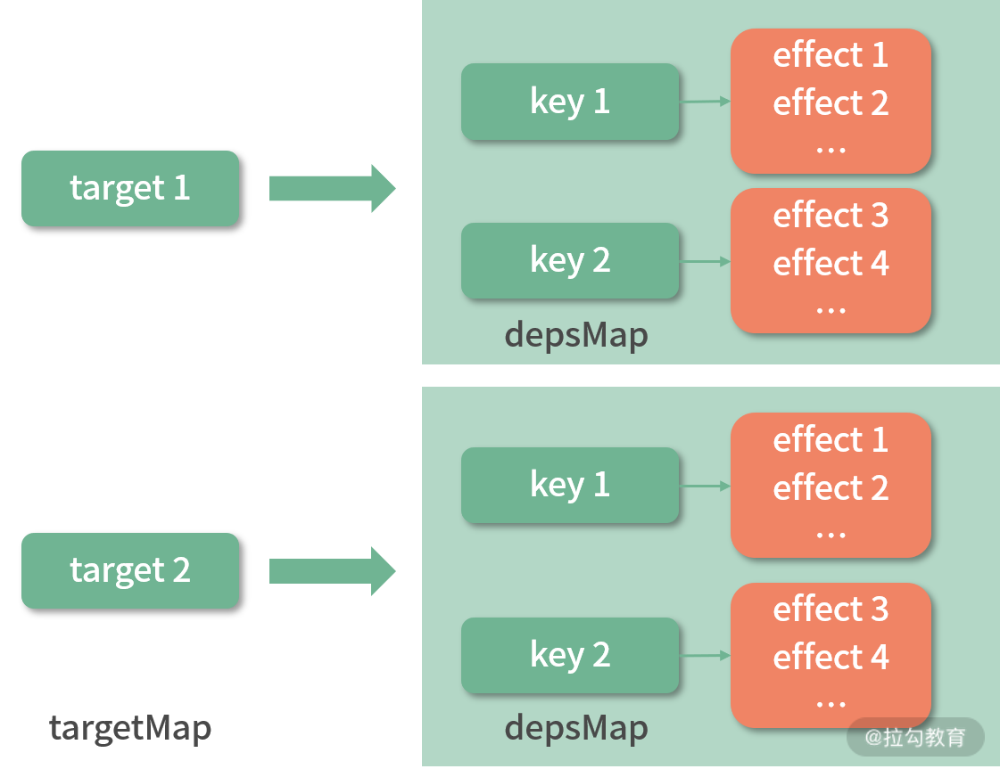

# 响应式：响应式内部的实现原理（上）

上一节课我们学习了 Composition API 的核心 setup 函数的实现，在 setup 函数中，我们多次使用一些 API 让数据变成响应式，那么这节课我们就来深入学习响应式内部的实现原理。

除了组件化，Vue.js 另一个核心设计思想就是**响应式**。它的本质是当数据变化后会自动执行某个函数，映射到组件的实现就是，当数据变化后，会自动触发组件的重新渲染。**响应式是 Vue.js 组件化更新渲染的一个核心机制**。

在介绍 Vue.js 3.0 响应式实现之前，我们先来回顾一下 Vue.js 2.x 响应式实现的部分： 它在内部通过 Object.defineProperty API 劫持数据的变化，在数据被访问的时候收集依赖，然后在数据被修改的时候通知依赖更新。我们用一张图可以直观地看清这个流程。


在 Vue.js 2.x 中，Watcher 就是依赖，有专门针对组件渲染的 render watcher。注意这里有两个流程，首先是**依赖收集流程**，组件在 render 的时候会访问模板中的数据，触发 getter 把 render watcher 作为依赖收集，并和数据建立联系；然后是派发通知流程，当我对这些数据修改的时候，会触发 setter，通知 render watcher 更新，进而触发了组件的重新渲染。

在导读章节，我们提到了 Object.defineProperty API 的一些缺点：不能监听对象属性新增和删除；初始化阶段递归执行 Object.defineProperty 带来的性能负担。

Vue.js 3.0 为了解决 Object.defineProperty 的这些缺陷，使用 Proxy API 重写了响应式部分，并独立维护和发布整个 reactivity 库，下面我们就一起来深入学习 Vue.js 3.0 响应式部分的实现原理。

### 响应式对象的实现差异

在 **Vue.js 2.x 中**构建组件时，只要我们在 data、props、computed 中定义数据，那么它就是响应式的，举个例子：

```html
<template>
  <div>
    <p>{{ msg }}</p>
    <button @click="random">Random msg</button>
  </div>
</template>
<script>
  export default {
    data() {
      return {
        msg: "msg reactive",
      };
    },
    methods: {
      random() {
        this.msg = Math.random();
      },
    },
  };
</script>
```

上述组件初次渲染会显示“msg reactive”，当我们点击按钮的时候，会执行 random 函数，random 函数会修改 this.msg，就会发现组件重新渲染了。

我们对这个例子做一些改动，模板部分不变，我们把 msg 数据的定义放到 created 钩子中：

```js
export default {
  created() {
    this.msg = "msg not reactive";
  },
  methods: {
    random() {
      this.msg = Math.random();
    },
  },
};
```

此时，组件初次渲染显示“msg not reactive”，但是我们再次点击按钮就会发现组件并没有重新渲染。

这个问题相信你可能遇到过，其中的根本原因是我们在 created 中定义的 this.msg 并不是响应式对象，所以 Vue.js 内部不会对它做额外的处理。而 data 中定义的数据，Vue.js 内部在组件初始化的过程中会把它变成响应式，这是一个相对黑盒的过程，用户通常不会感知到。

你可能会好奇，为什么我在 created 钩子函数中定义数据而不在 data 中去定义？其实在 data 中定义数据最终也是挂载到组件实例 this 上，这和我直接在 created 钩子函数通过 this.xxx 定义的数据唯一区别就是，在 data 中定义的数据**是响应式的**。

在一些场景下，如果我们仅仅想在组件上下文中共享某个变量，而不必去监测它的~~这个数据~~变化，这时就特别适合在 created 钩子函数中去定义这个变量，因为创建响应式的过程是有性能代价的，这相当于一种 Vue.js 应用的性能优化小技巧，你掌握了这一点就可以在合适的场景中应用了。

到了 **Vue.js 3.0** 构建组件时，你可以不依赖于 Options API，而**使用 Composition API** 去编写。对于刚才的例子，我们可以用 Composition API 这样改写：

```html
<template>
  <div>
    <p>{{ state.msg }}</p>
    <button @click="random">Random msg</button>
  </div>
</template>
<script>
  import { reactive } from "vue";
  export default {
    setup() {
      const state = reactive({
        msg: "msg reactive",
      });

      const random = function () {
        state.msg = Math.random();
      };

      return {
        random,
        state,
      };
    },
  };
</script>
```

可以看到，我们通过 setup 函数实现和前面示例同样的功能。请注意，这里我们引入了 **reactive API，它可以把一个对象数据变成响应式。** 可以看出来 Composition API 更推荐用户主动定义响应式对象，而非内部的黑盒处理。这样用户可以更加明确哪些数据是响应式的，如果你不想让数据变成响应式，就定义成它的原始数据类型即可。

也就是在 Vue.js 3.0 中，我们用 reactive 这个有魔力的函数，把数据变成了响应式，那么它内部到底是怎么实现的呢？我们接下来一探究竟。

### Reactive API

我们先来看一下 reactive 函数的具体实现过程：

```js
function reactive(target) {
  // 如果尝试把一个 readonly proxy 变成响应式，直接返回这个 readonly proxy
  if (target && target.__v_isReadonly) {
    return target;
  }
  return createReactiveObject(
    target,
    false,
    mutableHandlers,
    mutableCollectionHandlers
  );
}
function createReactiveObject(
  target,
  isReadonly,
  baseHandlers,
  collectionHandlers
) {
  if (!isObject(target)) {
    // 目标必须是对象或数组类型
    if (process.env.NODE_ENV !== "production") {
      console.warn(`value cannot be made reactive: ${String(target)}`);
    }
    return target;
  }
  if (target.__v_raw && !(isReadonly && target.__v_isReactive)) {
    // target 已经是 Proxy 对象，直接返回
    // 有个例外，如果是 readonly 作用于一个响应式对象，则继续
    return target;
  }
  if (
    hasOwn(
      target,
      isReadonly ? "__v_readonly" /* readonly */ : "__v_reactive" /* reactive */
    )
  ) {
    // target 已经有对应的 Proxy 了
    return isReadonly ? target.__v_readonly : target.__v_reactive;
  }
  // 只有在白名单里的数据类型才能变成响应式
  if (!canObserve(target)) {
    return target;
  }
  // 利用 Proxy 创建响应式
  const observed = new Proxy(
    target,
    collectionTypes.has(target.constructor) ? collectionHandlers : baseHandlers
  );
  // 给原始数据打个标识，说明它已经变成响应式，并且有对应的 Proxy 了
  def(
    target,
    isReadonly ? "__v_readonly" /* readonly */ : "__v_reactive" /* reactive */,
    observed
  );
  return observed;
}
```

可以看到，reactive 内部通过 createReactiveObject 函数把 target 变成了一个响应式对象。

在这个过程中，createReactiveObject 函数主要做了以下几件事情。

1.函数首先判断 target 是不是数组或者对象类型，如果不是则直接返回。所以**原始数据 target 必须是对象或者数组**。 2.如果对一个已经是响应式的对象再次执行 reactive，还应该返回这个响应式对象，举个例子：

```js
import { reactive } from "vue";
const original = { foo: 1 };
const observed = reactive(original);
const observed2 = reactive(observed);
observed === observed2;
```

可以看到 observed 已经是响应式结果了，如果对它再去执行 reactive，返回的值 observed2 和 observed 还是同一个对象引用。

因为这里 reactive 函数会通过 target.**v_raw 属性来判断 target 是否已经是一个响应式对象（因为响应式对象的 **v_raw 属性会指向它自身，后面会提到），如果是的话则直接返回响应式对象。

3.如果对同一个原始数据多次执行 reactive ，那么会返回相同的响应式对象，举个例子：

```js
import { reactive } from "vue";
const original = { foo: 1 };
const observed = reactive(original);
const observed2 = reactive(original);
observed === observed2;
```

可以看到，原始数据 original 被反复执行 reactive，但是响应式结果 observed 和 observed2 是同一个对象。

所以这里 reactive 函数会通过 target.**v_reactive 判断 target 是否已经有对应的响应式对象（因为创建完响应式对象后，会给原始对象打上 **v_reactive 标识，后面会提到），如果有则返回这个响应式对象。

4.使用 canObserve 函数对 target 对象做一进步限制：

```js
const canObserve = (value) => {
  return (
    !value.__v_skip &&
    isObservableType(toRawType(value)) &&
    !Object.isFrozen(value)
  );
};
const isObservableType = /*#__PURE__*/ makeMap(
  "Object,Array,Map,Set,WeakMap,WeakSet"
);
```

比如，带有 \_\_v_skip 属性的对象、被冻结的对象，以及不在白名单内的对象如 Date 类型的对象实例是不能变成响应式的。

5.通过 Proxy API 劫持 target 对象，把它变成响应式。我们把 Proxy 函数返回的结果称作响应式对象，这里 Proxy 对应的处理器对象会根据数据类型的不同而不同，我们稍后会重点分析基本数据类型的 Proxy 处理器对象，reactive 函数传入的 baseHandlers 值是 mutableHandlers。

6.给原始数据打个标识，如下：

```js
target.__v_reactive = observed;
```

这就是前面“对同一个原始数据多次执行 reactive ，那么会返回相同的响应式对象”逻辑的判断依据。

仔细想想看，响应式的实现方式无非就是劫持数据，Vue.js 3.0 的 reactive API 就是通过 Proxy 劫持数据，而且由于 Proxy 劫持的是整个对象，所以我们可以检测到任何对对象的修改，弥补了 Object.defineProperty API 的不足。

接下来，我们继续看 Proxy 处理器对象 mutableHandlers 的实现：

```js
const mutableHandlers = {
  get,
  set,
  deleteProperty,
  has,
  ownKeys,
};
```

它其实就是劫持了我们对 observed 对象的一些操作，比如：

- 访问对象属性会触发 get 函数；
- 设置对象属性会触发 set 函数；
- 删除对象属性会触发 deleteProperty 函数；
- in 操作符会触发 has 函数；
- 通过 Object.getOwnPropertyNames 访问对象属性名会触发 ownKeys 函数。

因为无论命中哪个处理器函数，它都会做依赖收集和派发通知这两件事其中的一个，所以这里我只要分析常用的 get 和 set 函数就可以了。

#### 依赖收集：get 函数

**依赖收集发生在数据访问的阶段**，由于我们用 Proxy API 劫持了数据对象，所以当这个响应式对象属性被访问的时候就会执行 get 函数，我们来看一下 get 函数的实现，其实它是执行 createGetter 函数的返回值，为了分析主要流程，这里省略了 get 函数中的一些分支逻辑，isReadonly 也默认为 false：

```js
function createGetter(isReadonly = false) {
  return function get(target, key, receiver) {
    if (key === "__v_isReactive" /* isReactive */) {
      // 代理 observed.__v_isReactive
      return !isReadonly;
    } else if (key === "__v_isReadonly" /* isReadonly */) {
      // 代理 observed.__v_isReadonly
      return isReadonly;
    } else if (key === "__v_raw" /* raw */) {
      // 代理 observed.__v_raw
      return target;
    }
    const targetIsArray = isArray(target);
    // arrayInstrumentations 包含对数组一些方法修改的函数
    if (targetIsArray && hasOwn(arrayInstrumentations, key)) {
      return Reflect.get(arrayInstrumentations, key, receiver);
    }
    // 求值
    const res = Reflect.get(target, key, receiver);
    // 内置 Symbol key 不需要依赖收集
    if ((isSymbol(key) && builtInSymbols.has(key)) || key === "__proto__") {
      return res;
    }
    // 依赖收集
    !isReadonly && track(target, "get" /* GET */, key);
    return isObject(res)
      ? isReadonly
        ? readonly(res)
        : // 如果 res 是个对象或者数组类型，则递归执行 reactive 函数把 res 变成响应式
          reactive(res)
      : res;
  };
}
```

结合上述代码来看，get 函数主要做了四件事情，**首先对特殊的 key 做了代理**，这就是为什么我们在 createReactiveObject 函数中判断响应式对象是否存在 \_\_v_raw 属性，如果存在就返回这个响应式对象本身。

**接着通过 Reflect.get 方法求值**，如果 target 是数组且 key 命中了 arrayInstrumentations，则执行对应的函数，我们可以大概看一下 arrayInstrumentations 的实现：

```js
const arrayInstrumentations = {}[
  ("includes", "indexOf", "lastIndexOf")
].forEach((key) => {
  arrayInstrumentations[key] = function (...args) {
    // toRaw 可以把响应式对象转成原始数据
    const arr = toRaw(this);
    for (let i = 0, l = this.length; i < l; i++) {
      // 依赖收集
      track(arr, "get" /* GET */, i + "");
    }
    // 先尝试用参数本身，可能是响应式数据
    const res = arr[key](...args);
    if (res === -1 || res === false) {
      // 如果失败，再尝试把参数转成原始数据
      return arr[key](...args.map(toRaw));
    } else {
      return res;
    }
  };
});
```

也就是说，当 target 是一个数组的时候，我们去访问 target.includes、target.indexOf 或者 target.lastIndexOf 就会执行 arrayInstrumentations 代理的函数，除了调用数组本身的方法求值外，还对数组每个元素做了依赖收集。因为一旦数组的元素被修改，数组的这几个 API 的返回结果都可能发生变化，所以我们需要跟踪数组每个元素的变化。

回到 get 函数，第三步就是**通过 Reflect.get 求值，然后会执行 track 函数收集依赖**，我们稍后重点分析这个过程。

函数最后**会对计算的值 res 进行判断**，如果它也是数组或对象，则递归执行 reactive 把 res 变成响应式对象。这么做是因为 Proxy 劫持的是对象本身，并不能劫持子对象的变化，这点和 Object.defineProperty API 一致。但是 Object.defineProperty 是在初始化阶段，即定义劫持对象的时候就已经递归执行了，而 Proxy 是在对象属性被访问的时候才递归执行下一步 reactive，这其实是一种延时定义子对象响应式的实现，在性能上会有较大的提升。

整个 get 函数最核心的部分其实是**执行 track 函数收集依赖**，下面我们重点分析这个过程。

我们先来看一下 track 函数的实现：

```js
// 是否应该收集依赖
let shouldTrack = true;
// 当前激活的 effect
let activeEffect;
// 原始数据对象 map
const targetMap = new WeakMap();
function track(target, type, key) {
  if (!shouldTrack || activeEffect === undefined) {
    return;
  }
  let depsMap = targetMap.get(target);
  if (!depsMap) {
    // 每个 target 对应一个 depsMap
    targetMap.set(target, (depsMap = new Map()));
  }
  let dep = depsMap.get(key);
  if (!dep) {
    // 每个 key 对应一个 dep 集合
    depsMap.set(key, (dep = new Set()));
  }
  if (!dep.has(activeEffect)) {
    // 收集当前激活的 effect 作为依赖
    dep.add(activeEffect);
    // 当前激活的 effect 收集 dep 集合作为依赖
    activeEffect.deps.push(dep);
  }
}
```

分析这个函数的实现前，我们先想一下要收集的依赖是什么，我们的目的是实现响应式，就是当数据变化的时候可以自动做一些事情，比如执行某些函数，所以我们**收集的依赖就是数据变化后执行的副作用函数**。

再来看实现，我们把 target 作为原始的数据，key 作为访问的属性。我们创建了全局的 targetMap 作为原始数据对象的 Map，它的键是 target，值是 depsMap，作为依赖的 Map；这个 depsMap 的键是 target 的 key，值是 dep 集合，dep 集合中存储的是依赖的副作用函数。为了方便理解，可以通过下图表示它们之间的关系：



所以每次 track ，就是把当前激活的副作用函数 activeEffect 作为依赖，然后收集到 target 相关的 depsMap 对应 key 下的依赖集合 dep 中。

了解完依赖收集的过程，下节课我们来分析派发通知的过程。

> **本节课的相关代码在源代码中的位置如下：**
> packages/reactivity/src/baseHandlers.ts
> packages/reactivity/src/effect.ts
> packages/reactivity/src/reactive.ts
