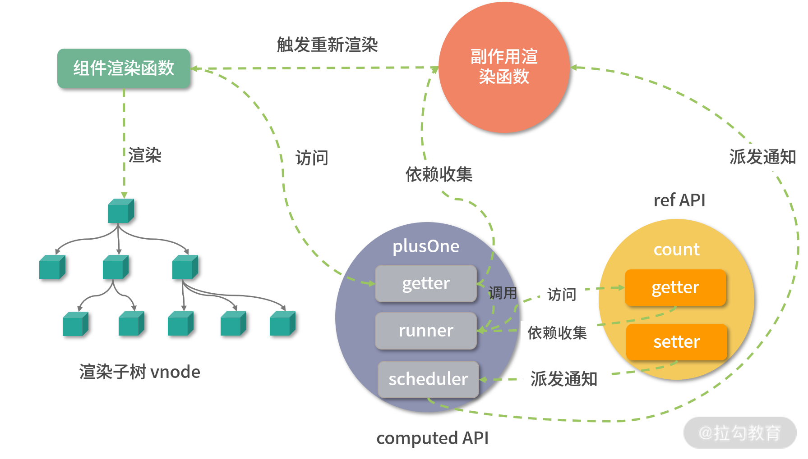

# 计算属性：计算属性对比普通函数

上一节课，我们学习了响应式的实现原理，这节课我们将学习一个非常常用的响应式 API——**计算属性**。

计算属性是 Vue.js 开发中一个非常实用的 API ，它允许用户定义一个计算方法，然后根据一些依赖的响应式数据计算出新值并返回。当依赖发生变化时，计算属性可以自动重新计算获取新值，所以使用起来非常方便。

在 Vue.js 2.x 中，相信你对计算属性的应用已经如数家珍了，我们可以在组件对象中定义 computed 属性。到了 Vue.js 3.0 ，虽然也可以在组件中沿用 Vue.js 2.x 的使用方式，但是我们也可以单独使用计算属性 API。

计算属性本质上还是对依赖的计算，那么为什么我们不直接用函数呢？在 Vue.js 3.0 中计算属性的 API 又是如何实现呢？接下来，就请你带着这些疑问，随我一起深入其实现原理的学习吧。

### 计算属性 API： computed

Vue.js 3.0 提供了一个 computed 函数作为计算属性 API，我们先来看看它是如何使用的。

我们举个简单的例子：

```js
const count = ref(1);
const plusOne = computed(() => count.value + 1);
console.log(plusOne.value); // 2
plusOne.value++; // error
count.value++;
console.log(plusOne.value); // 3
```

从代码中可以看到，我们先使用 ref API 创建了一个响应式对象 count，然后使用 computed API 创建了另一个响应式对象 plusOne，它的值是 count.value + 1，当我们修改 count.value 的时候， plusOne.value 就会自动发生变化。

注意，这里我们直接修改 plusOne.value 会报一个错误，这是因为如果我们传递给 computed 的是一个函数，那么这就是一个 getter 函数，我们只能获取它的值，而不能直接修改它。

在 getter 函数中，我们会根据响应式对象重新计算出新的值，这也就是它被叫做计算属性的原因，而这个响应式对象，就是计算属性的依赖。

当然，有时候我们也希望能够直接修改 computed 的返回值，那么我们可以给 computed 传入一个对象：

```js
const count = ref(1);
const plusOne = computed({
  get: () => count.value + 1,
  set: (val) => {
    count.value = val - 1;
  },
});
plusOne.value = 1;
console.log(count.value); // 0
```

在这个例子中，结合上述代码可以看到，我们给 computed 函数传入了一个拥有 getter 函数和 setter 函数的对象，getter 函数和之前一样，还是返回 count.value + 1；而 setter 函数，请注意，这里我们修改 plusOne.value 的值就会触发 setter 函数，其实 setter 函数内部实际上会根据传入的参数修改计算属性的依赖值 count.value，因为一旦依赖的值被修改了，我们再去获取计算属性就会重新执行一遍 getter，所以这样获取的值也就发生了变化。

好了，我们现在已经知道了 computed API 的两种使用方式了，接下来就看看它是怎样实现的：

```js
function computed(getterOrOptions) {
  // getter 函数
  let getter;
  // setter 函数
  let setter;
  // 标准化参数
  if (isFunction(getterOrOptions)) {
    // 表面传入的是 getter 函数，不能修改计算属性的值
    getter = getterOrOptions;
    setter =
      process.env.NODE_ENV !== "production"
        ? () => {
            console.warn("Write operation failed: computed value is readonly");
          }
        : NOOP;
  } else {
    getter = getterOrOptions.get;
    setter = getterOrOptions.set;
  }
  // 数据是否脏的
  let dirty = true;
  // 计算结果
  let value;
  let computed;
  // 创建副作用函数
  const runner = effect(getter, {
    // 延时执行
    lazy: true,
    // 标记这是一个 computed effect 用于在 trigger 阶段的优先级排序
    computed: true,
    // 调度执行的实现
    scheduler: () => {
      if (!dirty) {
        dirty = true;
        // 派发通知，通知运行访问该计算属性的 activeEffect
        trigger(computed, "set" /* SET */, "value");
      }
    },
  });
  // 创建 computed 对象
  computed = {
    __v_isRef: true,
    // 暴露 effect 对象以便计算属性可以停止计算
    effect: runner,
    get value() {
      // 计算属性的 getter
      if (dirty) {
        // 只有数据为脏的时候才会重新计算
        value = runner();
        dirty = false;
      }
      // 依赖收集，收集运行访问该计算属性的 activeEffect
      track(computed, "get" /* GET */, "value");
      return value;
    },
    set value(newValue) {
      // 计算属性的 setter
      setter(newValue);
    },
  };
  return computed;
}
```

从代码中可以看到，computed 函数的流程主要做了三件事情：标准化参数，创建副作用函数和创建 computed 对象。我们来详细分析一下这几个步骤。

首先是**标准化参数**。computed 函数接受两种类型的参数，一个是 getter 函数，一个是拥有 getter 和 setter 函数的对象，通过判断参数的类型，我们初始化了函数内部定义的 getter 和 setter 函数。

接着是**创建副作用函数 runner**。computed 内部通过 effect 创建了一个副作用函数，它是对 getter 函数做的一层封装，另外我们这里要注意第二个参数，也就是 effect 函数的配置对象。其中 lazy 为 true 表示 effect 函数返回的 runner 并不会立即执行；computed 为 true 用于表示这是一个 computed effect，用于 trigger 阶段的优先级排序，我们稍后会分析；scheduler 表示它的调度运行的方式，我们也稍后分析。

最后是**创建 computed 对象并返回**，这个对象也拥有 getter 和 setter 函数。当 computed 对象被访问的时候会触发 getter，然后会判断是否 dirty，如果是就执行 runner，然后做依赖收集；当我们直接设置 computed 对象时会触发 setter，即执行 computed 函数内部定义的 setter 函数。

#### 计算属性的运行机制

computed 函数的逻辑会有一点绕，不过不要紧，我们可以结合一个应用 computed 计算属性的例子，来理解整个计算属性的运行机制。分析之前我们需要记住 computed 内部两个重要的变量，第一个 dirty 表示一个计算属性的值是否是“脏的”，用来判断需不需要重新计算，第二个 value 表示计算属性每次计算后的结果。

现在，我们来看这个示例：

```html
<template>
  <div>{{ plusOne }}</div>
  <button @click="plus">plus</button>
</template>
<script>
  import { ref, computed } from "vue";
  export default {
    setup() {
      const count = ref(0);
      const plusOne = computed(() => {
        return count.value + 1;
      });

      function plus() {
        count.value++;
      }
      return {
        plusOne,
        plus,
      };
    },
  };
</script>
```

可以看到，在这个例子中我们利用 computed API 创建了计算属性对象 plusOne，它传入的是一个 getter 函数，为了和后面计算属性对象的 getter 函数区分，我们把它称作 computed getter。另外，组件模板中引用了 plusOne 变量和 plus 函数。

组件渲染阶段会访问 plusOne，也就触发了 plusOne 对象的 getter 函数：

```js
get value() {
  // 计算属性的 getter
  if (dirty) {
    // 只有数据为脏的时候才会重新计算
    value = runner()
    dirty = false
  }
  // 依赖收集，收集运行访问该计算属性的 activeEffect
  track(computed, "get" /* GET */, 'value')
  return value
}
```

由于默认 dirty 是 true，所以这个时候会执行 runner 函数，并进一步执行 computed getter，也就是 count.value + 1，因为访问了 count 的值，并且由于 count 也是一个响应式对象，所以就会触发 count 对象的依赖收集过程。

请注意，由于是在 runner 执行的时候访问 count，所以这个时候的 activeEffect 是 runner 函数。runner 函数执行完毕，会把 dirty 设置为 false，并进一步执行 track（computed,"get",'value') 函数做依赖收集，这个时候 runner 已经执行完了，所以 activeEffect 是组件副作用渲染函数。

所以你要特别注意这是两个依赖收集过程：对于 plusOne 来说，它收集的依赖是组件副作用渲染函数；对于 count 来说，它收集的依赖是 plusOne 内部的 runner 函数。

然后当我们点击按钮的时候，会执行 plus 函数，函数内部通过 count.value++ 修改 count 的值，并派发通知。请注意，这里不是直接调用 runner 函数，而是把 runner 作为参数去执行 scheduler 函数。我们来回顾一下 trigger 函数内部对于 effect 函数的执行方式:

```js
const run = (effect) => {
  // 调度执行
  if (effect.options.scheduler) {
    effect.options.scheduler(effect);
  } else {
    // 直接运行
    effect();
  }
};
```

computed API 内部创建副作用函数时，已经配置了 scheduler 函数，如下：

```js
scheduler: () => {
  if (!dirty) {
    dirty = true;
    // 派发通知，通知运行访问该计算属性的 activeEffect
    trigger(computed, "set" /* SET */, "value");
  }
};
```

它并没有对计算属性求新值，而仅仅是把 dirty 设置为 true，再执行 trigger(computed, "set" , 'value')，去通知执行 plusOne 依赖的组件渲染副作用函数，即触发组件的重新渲染。

在组件重新渲染的时候，会再次访问 plusOne，我们发现这个时候 dirty 为 true，然后会再次执行 computed getter，此时才会执行 count.value + 1 求得新值。这就是虽然组件没有直接访问 count，但是当我们修改 count 的值的时候，组件仍然会重新渲染的原因。

为了更加直观展示上述过程，我画了一张图：



通过以上分析，我们可以看出 computed 计算属性有两个特点：

1. **延时计算**，只有当我们访问计算属性的时候，它才会真正运行 computed getter 函数计算；
2. **缓存**，它的内部会缓存上次的计算结果 value，而且只有 dirty 为 true 时才会重新计算。如果访问计算属性时 dirty 为 false，那么直接返回这个 value。

现在，我们就可以回答开头提的问题了。和单纯使用普通函数相比，计算属性的优势是：**只要依赖不变化**，**就可以使用缓存的 value 而不用每次在渲染组件的时候都执行函数去计算**，这是典型的空间换时间的优化思想。

#### 嵌套计算属性

计算属性也支持嵌套，我们可以针对上述例子做个小修改，即不在渲染函数中访问 plusOne，而在另一个计算属性中访问：

```js
const count = ref(0);
const plusOne = computed(() => {
  return count.value + 1;
});
const plusTwo = computed(() => {
  return plusOne.value + 1;
});
console.log(plusTwo.value);
```

从代码中可以看到，当我们访问 plusTwo 的时候，过程和前面都差不多，同样也是两个依赖收集的过程。对于 plusOne 来说，它收集的依赖是 plusTwo 内部的 runner 函数；对于 count 来说，它收集的依赖是 plusOne 内部的 runner 函数。

接着当我们修改 count 的值时，它会派发通知，先运行 plusOne 内部的 scheduler 函数，把 plusOne 内部的 dirty 变为 true，然后执行 trigger 函数再次派发通知，接着运行 plusTwo 内部的 scheduler 函数，把 plusTwo 内部的 dirty 设置为 true。

然后当我们再次访问 plusTwo 的值时，发现 dirty 为 true，就会执行 plusTwo 的 computed getter 函数去执行 plusOne.value + 1，进而执行 plusOne 的 computed gette 即 count.value + 1 + 1，求得最终新值 2。

得益于 computed 这种巧妙的设计，无论嵌套多少层计算属性都可以正常工作。

#### 计算属性的执行顺序

我们曾提到计算属性内部创建副作用函数的时候会配置 computed 为 true，标识这是一个 computed effect，用于在 trigger 阶段的优先级排序。我们来回顾一下 trigger 函数执行 effects 的过程：

```js
const add = (effectsToAdd) => {
  if (effectsToAdd) {
    effectsToAdd.forEach((effect) => {
      if (effect !== activeEffect || !shouldTrack) {
        if (effect.options.computed) {
          computedRunners.add(effect);
        } else {
          effects.add(effect);
        }
      }
    });
  }
};
const run = (effect) => {
  if (effect.options.scheduler) {
    effect.options.scheduler(effect);
  } else {
    effect();
  }
};
computedRunners.forEach(run);
effects.forEach(run);
```

在上一节课分析 trigger 函数的时候，为了方便你理解主干逻辑，我省略了 computedRunners 的分支逻辑。实际上，在添加待运行的 effects 的时候，我们会判断每一个 effect 是不是一个 computed effect，如果是的话会添加到 computedRunners 中，在后面运行的时候会优先执行 computedRunners，然后再执行普通的 effects。

那么为什么要这么设计呢？其实是考虑到了一些特殊场景，我们通过一个示例来说明：

```js
import { ref, computed } from "vue";
import { effect } from "@vue/reactivity";
const count = ref(0);
const plusOne = computed(() => {
  return count.value + 1;
});
effect(() => {
  console.log(plusOne.value + count.value);
});
function plus() {
  count.value++;
}
plus();
```

这个示例运行后的结果输出：

```js
1;
3;
3;
```

在执行 effect 函数时运行 console.log(plusOne.value + count.value)，所以第一次输出 1，此时 count.value 是 0，plusOne.value 是 1。

后面连续输出两次 3 是因为， plusOne 和 count 的依赖都是这个 effect 函数，所以当我们执行 plus 函数修改 count 的值时，会触发并执行这个 effect 函数，因为 plusOne 的 runner 也是 count 的依赖，count 值修改也会执行 plusOne 的 runner，也就会再次执行 plusOne 的依赖即 effect 函数，因此会输出两次。

那么为什么两次都输出 3 呢？这就跟先执行 computed runner 有关。首先，由于 plusOne 的 runner 和 effect 都是 count 的依赖，当我们修改 count 值的时候， plusOne 的 runner 和 effect 都会执行，那么此时执行顺序就很重要了。

这里先执行 plusOne 的 runner，把 plusOne 的 dirty 设置为 true，然后通知它的依赖 effect 执行 plusOne.value + count.value。这个时候，由于 dirty 为 true，就会再次执行 plusOne 的 getter 计算新值，拿到了新值 2， 再加上 1 就得到 3。执行完 plusOne 的 runner 以及依赖更新之后，再去执行 count 的普通 effect 依赖，从而去执行 plusOne.value + count.value，这个时候 plusOne dirty 为 false， 直接返回上次的计算结果 2，然后再加 1 就又得到 3。

如果我们把 computed runner 和 effect 的执行顺序换一下会怎样呢？我来告诉你，会输出如下结果：

```js
1;
2;
3;
```

第一次输出 1 很好理解，因为流程是一样的。第二次为什么会输出 2 呢？我们来分析一下，当我们执行 plus 函数修改 count 的值时，会触发 plusOne 的 runner 和 effect 的执行，这一次我们先让 effect 执行 plusOne.value + count.value，那么就会访问 plusOne.value，但由于 plusOne 的 runner 还没执行，所以此时 dirty 为 false，得到的值还是上一次的计算结果 1，然后再加 1 得到 2。

接着再执行 plusOne 的 runner，把 plusOne 的 dirty 设置为 true，然后通知它的依赖 effect 执行 plusOne.value + count.value，这个时候由于 dirty 为 true，就会再次执行 plusOne 的 getter 计算新值，拿到了 2，然后再加上 1 就得到 3。

知道原因后，我们再回过头看例子。因为 effect 函数依赖了 plusOne 和 count，所以 plusOne 先计算会更合理，这就是为什么我们需要让 computed runner 的执行优先于普通的 effect 函数。

### 总结

好的，到这里我们这一节的学习就结束啦，我希望通过学习，你能理解计算属性的工作机制，能搞明白计算属性嵌套场景代码的执行顺序，知道计算属性的两个特点——延时计算和缓存，也希望你能够在组件的开发中合理使用计算属性。

最后，给你留一道思考题目，computed 函数返回的对象实际上劫持的是 value 属性的 getter 和 setter，但为什么我们在组件的模板中访问一个计算属性变量，不用手动在后面加 .value 呢？欢迎你在留言区与我分享。

> **本节课的相关代码在源代码中的位置如下：**
> packages/reactivity/src/computed.ts
