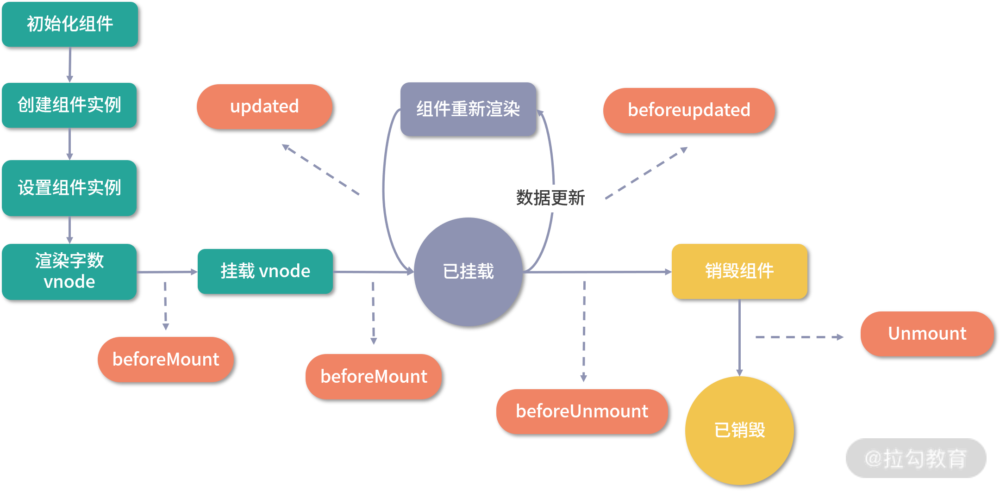

# 生命周期：各个生命周期的执行时机

Vue.js 组件的生命周期包括创建、更新、销毁等过程。在这些过程中也会运行叫生命周期钩子的函数，这给了用户在不同阶段添加自己的代码的机会。

在 Vue.js 2.x 中，我们通常会在组件对象中定义一些生命周期钩子函数，到了 Vue.js 3.0，依然兼容 Vue.js 2.x 生命周期的语法，但是 Composition API 提供了一些生命周期函数的 API，让我们可以主动注册不同的生命周期。

```js
// Vue.js 2.x 定义生命周期钩子函数
export default {
  created() {
    // 做一些初始化工作
  },
  mounted() {
    // 可以拿到 DOM 节点
  },
  beforeDestroy() {
    // 做一些清理操作
  }
}
//  Vue.js 3.x 生命周期 API 改写上例
import { onMounted, onBeforeUnmount } from 'vue'
export default {
  setup() {
    // 做一些初始化工作

    onMounted(() => {
      // 可以拿到 DOM 节点
    })
    onBeforeUnmount(()=>{
      // 做一些清理操作
    })
  }
}
```

可以看到，在 Vue.js 3.0 中，setup 函数已经替代了 Vue.js 2.x 的 beforeCreate 和 created 钩子函数，我们可以在 setup 函数做一些初始化工作，比如发送一个异步 Ajax 请求获取数据。

我们用 onMounted API 替代了 Vue.js 2.x 的 mounted 钩子函数，用 onBeforeUnmount API 替代了 Vue.js 2.x 的 beforeDestroy 钩子函数。

其实，Vue.js 3.0 针对 Vue.js 2.x 的生命周期钩子函数做了全面替换，映射关系如下：

```js
beforeCreate -> 使用 setup()
created -> 使用 use setup()
beforeMount -> onBeforeMount
mounted -> onMounted
beforeUpdate -> onBeforeUpdate
updated -> onUpdated
beforeDestroy-> onBeforeUnmount
destroyed -> onUnmounted
activated -> onActivated
deactivated -> onDeactivated
errorCaptured -> onErrorCaptured
```

除此之外，Vue.js 3.0 还新增了两个用于调试的生命周期 API：onRenderTracked 和 onRenderTriggered。

那么，这些生命周期钩子函数内部是如何实现的？它们又分别在组件生命周期的哪些阶段执行的？分别适用于哪些开发场景？

带着这些疑问，我们来深入学习生命周期钩子函数背后的实现原理。

### 注册钩子函数

首先，我们来看这些钩子函数是如何注册的，先来看一下它们的实现：

```js
const onBeforeMount = createHook("bm" /* BEFORE_MOUNT */);
const onMounted = createHook("m" /* MOUNTED */);
const onBeforeUpdate = createHook("bu" /* BEFORE_UPDATE */);
const onUpdated = createHook("u" /* UPDATED */);
const onBeforeUnmount = createHook("bum" /* BEFORE_UNMOUNT */);
const onUnmounted = createHook("um" /* UNMOUNTED */);
const onRenderTriggered = createHook("rtg" /* RENDER_TRIGGERED */);
const onRenderTracked = createHook("rtc" /* RENDER_TRACKED */);
const onErrorCaptured = (hook, target = currentInstance) => {
  injectHook("ec" /* ERROR_CAPTURED */, hook, target);
};
```

我们发现除了 onErrorCaptured，其他钩子函数都是通过 createHook 函数创建的，通过传入不同的字符串来表示不同的钩子函数。

那么，我们就来分析一下 createHook 钩子函数的实现原理：

```js
const createHook = function (lifecycle) {
  return function (hook, target = currentInstance) {
    injectHook(lifecycle, hook, target);
  };
};
```

createHook 会返回一个函数，它的内部通过 injectHook 注册钩子函数。你可能会问，这里为什么要用 createHook 做一层封装而不直接使用 injectHook API 呢？比如：

```js
const onBeforeMount = function (hook, target = currentInstance) {
  injectHook("bm", hook, target);
};
const onMounted = function (hook, target = currentInstance) {
  injectHook("m", hook, target);
};
```

这样实现当然也是可以的，不过，我们可以发现，这些钩子函数内部执行逻辑很类似，都是执行 injectHook，唯一的区别是第一个参数字符串不同，所以这样的代码是可以进一步封装的，即用 createHook 封装，这就是一个典型的函数柯里化技巧。

在调用 createHook 返回的函数时，也就不需要传入 lifecycle 字符串，因为它在执行 createHook 函数时就已经实现了该参数的保留。

所以，当我们通过 `onMounted(hook)` 注册一个钩子函数时，内部就是通过 `injectHook('m', hook)` 去注册的，接下来我们来进一步看 injectHook 函数的实现原理：

```js
function injectHook(type, hook, target = currentInstance, prepend = false) {
  const hooks = target[type] || (target[type] = []);
  // 封装 hook 钩子函数并缓存
  const wrappedHook =
    hook.__weh ||
    (hook.__weh = (...args) => {
      if (target.isUnmounted) {
        return;
      }
      // 停止依赖收集
      pauseTracking();
      // 设置 target 为当前运行的组件实例
      setCurrentInstance(target);
      // 执行钩子函数
      const res = callWithAsyncErrorHandling(hook, target, type, args);
      setCurrentInstance(null);
      // 恢复依赖收集
      resetTracking();
      return res;
    });
  if (prepend) {
    hooks.unshift(wrappedHook);
  } else {
    hooks.push(wrappedHook);
  }
}
```

结合代码来看，该函数主要是对用户注册的钩子函数 hook 做了一层封装，然后添加到一个数组中，把数组保存在当前组件实例的 target 上，这里，key 是用来区分钩子函数的字符串。比如， onMounted 注册的钩子函数在组件实例上就是通过 instance.m 来保存。

这样的设计其实非常好理解，因为生命周期的钩子函数，是在组件生命周期的各个阶段执行，所以钩子函数必须要保存在当前的组件实例上，这样后面就可以在组件实例上通过不同的字符串 key 找到对应的钩子函数数组并执行。

对于相同的钩子函数，会把封装的 wrappedHook 钩子函数缓存到 hook.\_\_weh 中，这样后续通过 scheduler 方式执行的钩子函数就会被去重。

在后续执行 wrappedHook 函数时，会先停止依赖收集，因为钩子函数内部访问的响应式对象，通常都已经执行过依赖收集，所以钩子函数执行的时候没有必要再次收集依赖，毕竟这个过程也有一定的性能消耗。

接着是设置 target 为当前组件实例。在 Vue.js 的内部，会一直维护当前运行的组件实例 currentInstance，在注册钩子函数的过程中，我们可以拿到当前运行组件实例 currentInstance，并用 target 保存，然后在钩子函数执行时，为了确保此时的 currentInstance 和注册钩子函数时一致，会通过 `setCurrentInstance(target)` 设置 target 为当前组件实例。

接下来就是通过 callWithAsyncErrorHandling 方法去执行我们注册的 hook 钩子函数，函数执行完毕则设置当前运行组件实例为 null，并恢复依赖收集。

到这里，我们就了解了生命周期钩子函数是如何注册以及如何执行的，接下来，我们来依次分析各个钩子函数的执行时机和应用场景。

首先，我们来看通过 onBeforeMount 和 onMounted 注册的钩子函数。

### onBeforeMount 和 onMounted

**onBeforeMount 注册的 beforeMount 钩子函数会在组件挂载之前执行**，**onMounted 注册的 mounted 钩子函数会在组件挂载之后执行**。我们来回顾一下组件副作用渲染函数关于组件挂载部分的实现：

```js
const setupRenderEffect = (
  instance,
  initialVNode,
  container,
  anchor,
  parentSuspense,
  isSVG,
  optimized
) => {
  // 创建响应式的副作用渲染函数
  instance.update = effect(function componentEffect() {
    if (!instance.isMounted) {
      // 获取组件实例上通过 onBeforeMount 钩子函数和 onMounted 注册的钩子函数
      const { bm, m } = instance;
      // 渲染组件生成子树 vnode
      const subTree = (instance.subTree = renderComponentRoot(instance));
      // 执行 beforemount 钩子函数
      if (bm) {
        invokeArrayFns(bm);
      }
      // 把子树 vnode 挂载到 container 中
      patch(null, subTree, container, anchor, instance, parentSuspense, isSVG);
      // 保留渲染生成的子树根 DOM 节点
      initialVNode.el = subTree.el;
      // 执行 mounted 钩子函数
      if (m) {
        queuePostRenderEffect(m, parentSuspense);
      }
      instance.isMounted = true;
    } else {
      // 更新组件
    }
  }, prodEffectOptions);
};
```

在执行 patch 挂载组件之前，会检测组件实例上是有否有注册的 beforeMount 钩子函数 bm，如果有则通过 invokeArrayFns 执行它，因为用户可以通过多次执行 onBeforeMount 函数注册多个 beforeMount 钩子函数，所以这里 instance.bm 是一个数组，通过遍历这个数组来依次执行 beforeMount 钩子函数。

在执行 patch 挂载组件之后，会检查组件实例上是否有注册的 mounted 钩子函数 m，如果有的话则执行 queuePostRenderEffect，把 mounted 钩子函数推入 postFlushCbs 中，然后在整个应用 render 完毕后，同步执行 flushPostFlushCbs 函数调用 mounted 钩子函数。

我经常在社区里听到一种争论：在组件初始化阶段，对于发送一些 Ajax 异步请求的逻辑，是应该放在 created 钩子函数中，还是应该放在 mounted 钩子函数中？

其实都可以，因为 created 和 mounted 钩子函数执行的时候都能拿到组件数据，它们执行的顺序虽然有先后，但都会在一个 Tick 内执行完毕，而异步请求是有网络耗时的，其耗时远远大于一个 Tick 的时间。所以，你无论在 created 还是在 mounted 里发请求，都要等请求的响应回来，然后更新数据，再触发组件的重新渲染。

前面说过，Vue.js 2.x 中的 beforeCreate 和 created 钩子函数可以用 setup 函数替代。所以，对于组件初始化阶段发送异步请求的逻辑，放在 setup 函数中、beforeMount 钩子函数中或者 mounted 钩子函数中都可以，它们都可以拿到组件相关的数据。当然，我更推荐在 setup 函数中执行，因为从语义化的角度来看这样更合适。

不过，如果你想依赖 DOM 去做一些初始化操作，那就只能把相关逻辑放在 mounted 钩子函数中了，这样你才能拿到组件渲染后的 DOM。

对于嵌套组件，组件在挂载相关的生命周期钩子函数时，先执行父组件的 beforeMount，然后是子组件的 beforeMount，接着是子组件的 mounted ，最后执行父组件的 mounted。

接下来，我们来看通过 onBeforeUpdate 和 onUpdated 注册的钩子函数。

### onBeforeUpdate 和 onUpdated

**onBeforeUpdate 注册的 beforeUpdate 钩子函数会在组件更新之前执行**，**onUpdated 注册的 updated 钩子函数会在组件更新之后执行**。我们来回顾一下组件副作用渲染函数关于组件更新的实现：

```js
const setupRenderEffect = (
  instance,
  initialVNode,
  container,
  anchor,
  parentSuspense,
  isSVG,
  optimized
) => {
  // 创建响应式的副作用渲染函数
  instance.update = effect(function componentEffect() {
    if (!instance.isMounted) {
      // 渲染组件
    } else {
      // 更新组件
      // 获取组件实例上通过 onBeforeUpdate 钩子函数和 onUpdated 注册的钩子函数
      let { next, vnode, bu, u } = instance;
      // next 表示新的组件 vnode
      if (next) {
        // 更新组件 vnode 节点信息
        updateComponentPreRender(instance, next, optimized);
      } else {
        next = vnode;
      }
      // 渲染新的子树 vnode
      const nextTree = renderComponentRoot(instance);
      // 缓存旧的子树 vnode
      const prevTree = instance.subTree;
      // 更新子树 vnode
      instance.subTree = nextTree;
      // 执行 beforeUpdate 钩子函数
      if (bu) {
        invokeArrayFns(bu);
      }
      // 组件更新核心逻辑，根据新旧子树 vnode 做 patch
      patch(
        prevTree,
        nextTree,
        // 如果在 teleport 组件中父节点可能已经改变，所以容器直接找旧树 DOM 元素的父节点
        hostParentNode(prevTree.el),
        // 缓存更新后的 DOM 节点
        getNextHostNode(prevTree),
        instance,
        parentSuspense,
        isSVG
      );
      // 缓存更新后的 DOM 节点
      next.el = nextTree.el;
      // 执行 updated 钩子函数
      if (u) {
        queuePostRenderEffect(u, parentSuspense);
      }
    }
  }, prodEffectOptions);
};
```

在执行 patch 更新组件之前，会检测组件实例上是有否有注册的 beforeUpdate 钩子函数 bu，如果有则通过 invokeArrayFns 执行它。

在执行 patch 更新组件之后，会检查组件实例上是否有注册的 updated 钩子函数 u，如果有，则通过 queuePostRenderEffect 把 updated 钩子函数推入 postFlushCbs 中，因为组件的更新本身就是在 nextTick 后进行 flushJobs，因此此时再次执行 queuePostRenderEffect 推入到队列的任务，会在同一个 Tick 内执行这些 postFlushCbs，也就是执行所有 updated 的钩子函数。

在 beforeUpdate 钩子函数执行时，组件的 DOM 还未更新，如果你想在组件更新前访问 DOM，比如手动移除已添加的事件监听器，你可以注册这个钩子函数。

在 updated 钩子函数执行时，组件 DOM 已经更新，所以你现在可以执行依赖于 DOM 的操作。如果要监听数据的改变并执行某些逻辑，最好不要使用 updated 钩子函数而用计算属性或 watcher 取而代之，因为任何数据的变化导致的组件更新都会执行 updated 钩子函数。另外注意， **不要在 updated 钩子函数中更改数据，因为这样会再次触发组件更新，导致无限递归更新** 。

还有，父组件的更新不一定会导致子组件的更新，因为 Vue.js 的更新粒度是组件级别的。

接下来，我们来看通过 onBeforeUnmount 和 onUnmounted 注册的钩子函数。

### onBeforeUnmount 和 onUnmounted

**onBeforeUnmount 注册的 beforeUnMount 钩子函数会在组件销毁之前执行**，onUnmounted **注册的 unmounted 钩子函数会在组件销毁之后执行** 。我们来看一下组件销毁相关逻辑实现：

```js
const unmountComponent = (instance, parentSuspense, doRemove) => {
  const { bum, effects, update, subTree, um } = instance;
  // 执行 beforeUnmount 钩子函数
  if (bum) {
    invokeArrayFns(bum);
  }
  // 清理组件引用的 effects 副作用函数
  if (effects) {
    for (let i = 0; i < effects.length; i++) {
      stop(effects[i]);
    }
  }
  // 如果一个异步组件在加载前就销毁了，则不会注册副作用渲染函数
  if (update) {
    stop(update);
    // 调用 unmount 销毁子树
    unmount(subTree, instance, parentSuspense, doRemove);
  }
  // 执行 unmounted 钩子函数
  if (um) {
    queuePostRenderEffect(um, parentSuspense);
  }
};
```

其实整个组件销毁的逻辑很简单，主要就是**清理组件实例上绑定的 effects 副作用函数和注册的副作用渲染函数 update**，以及**调用 unmount 销毁子树**。

unmount 主要就是遍历子树，它会通过递归的方式来销毁子节点，遇到组件节点时执行 unmountComponent，遇到普通节点时则删除 DOM 元素。组件的销毁过程和渲染过程类似，都是递归的过程。

在组件销毁前，会检测组件实例上是有否有注册的 beforeUnmount 钩子函数 bum，如果有则通过 invokeArrayFns 执行。

在组件销毁后，会检测组件实例上是否有注册的 unmounted 钩子函数 um，如果有则通过 queuePostRenderEffect 把 unmounted 钩子函数推入到 postFlushCbs 中，因为组件的销毁就是组件更新的一个分支逻辑，所以在 nextTick 后进行 flushJobs，因此此时再次执行 queuePostRenderEffect 推入队列的任务，会在同一个 Tick 内执行这些 postFlushCbs，也就是执行所有的 unmounted 钩子函数。

对于嵌套组件，组件在执行销毁相关的生命周期钩子函数时，先执行父组件的 beforeUnmount，再执行子组件的 beforeUnmount，然后执行子组件的 unmounted ，最后执行父组件的 unmounted。

虽然组件在销毁阶段会清理一些定义的 effects 函数，删除组件内部的 DOM 元素，但是有一些需要清理的对象，组件并不能自动完成它们的清理，比如你在组件内部创建一个定时器，就应该在 beforeUnmount 或者 unmounted 钩子函数中清除，举个例子：

```html
<template>
  <div>
    <div>
      <p>{{count}}</p>
    </div>
  </div>
</template>
<script>
  import { ref, onBeforeUnmount } from "vue";
  export default {
    setup() {
      const count = ref(0);
      const timer = setInterval(() => {
        console.log(count.value++);
      }, 1000);
      onBeforeUnmount(() => {
        clearInterval(timer);
      });
      return {
        count,
      };
    },
  };
</script>
```

可以看到，这里我们在 setup 函数内部定义了一个 timer 计时器， count 每秒会加 1 并在控制台中输出。如果这个组件被销毁，就会触发 onBeforeUnmount 注册的 beforeUnmount 钩子函数，然后清除定时器。如果你不清除，就会发现组件销毁后，虽然 DOM 被移除了，计时器仍然存在，并且会一直计时并在控制台输出，这就造成了不必要的内存泄漏。

接下来，我们来看通过 onErrorCaptured 注册的钩子函数。

### onErrorCaptured

在前面的课时中，我们多次接触过一个方法 callWithErrorHandling，它就是执行一段函数并通过 handleError 处理错误。那么，handleError 具体做了哪些事情呢？

我们先来看一下它的实现：

```js
function handleError(err, instance, type) {
  const contextVNode = instance ? instance.vnode : null;
  if (instance) {
    let cur = instance.parent;
    // 为了兼容 2.x 版本，暴露组件实例给钩子函数
    const exposedInstance = instance.proxy;
    // 获取错误信息
    const errorInfo =
      process.env.NODE_ENV !== "production" ? ErrorTypeStrings[type] : type;
    // 尝试向上查找所有父组件，执行 errorCaptured 钩子函数
    while (cur) {
      const errorCapturedHooks = cur.ec;
      if (errorCapturedHooks) {
        for (let i = 0; i < errorCapturedHooks.length; i++) {
          // 如果执行的 errorCaptured 钩子函数并返回 true，则停止向上查找。、
          if (errorCapturedHooks[i](err, exposedInstance, errorInfo)) {
            return;
          }
        }
      }
      cur = cur.parent;
    }
  }
  // 往控制台输出未处理的错误
  logError(err, type, contextVNode);
}
```

handleError 的实现其实很简单，它会从当前报错的组件的父组件实例开始，尝试去查找注册的 errorCaptured 钩子函数，如果有则遍历执行并且判断 errorCaptured 钩子函数的返回值是否为 true，如果是则说明这个错误已经得到了正确的处理，就会直接结束。

否则会继续遍历，遍历完当前组件实例的 errorCaptured 钩子函数后，如果这个错误还没得到正确处理，则向上查找它的父组件实例，以同样的逻辑去查找是否有正确处理该错误的 errorCaptured 钩子函数，直到查找完毕。

如果整个链路上都没有正确处理错误的 errorCaptured 钩子函数，则通过 logError 往控制台输出未处理的错误。所以 **errorCaptured 本质上是捕获一个来自子孙组件的错误**，**它返回 true 就可以阻止错误继续向上传播**。

errorCaptured 在平时工作中可能用的不多，但它的确是一个很实用的功能，比如你可以在根组件注册一个 errorCaptured 钩子函数，去捕获所有子孙组件的错误，并且可以根据错误的类型和信息统计和上报错误。

接下来，我们来看通过 onRenderTracked 和 onRenderTriggered 注册的钩子函数。

### onRenderTracked 和 onRenderTriggered

onRenderTracked 和 onRenderTriggered 是 Vue.js 3.0 新增的生命周期 API，它们是在开发阶段渲染调试用的。这里再次回顾一下我们创建的副作用渲染函数的第二个参数（这里你可以去 06 课时“ 响应式：响应式内部的实现原理是怎样的？ ”中复习一下），在开发环境下它的代码是这样的：

```js
instance.update = effect(function componentEffect() {
  // 创建或者更组件
}, createDevEffectOptions(instance));
function createDevEffectOptions(instance) {
  return {
    scheduler: queueJob,
    onTrack: instance.rtc ? (e) => invokeArrayFns(instance.rtc, e) : void 0,
    onTrigger: instance.rtg ? (e) => invokeArrayFns(instance.rtg, e) : void 0,
  };
}
```

通过上述代码我们发现，onRenderTracked 和 onRenderTriggered 注册的钩子函数，原来是在副作用渲染函数的 onTrack 和 onTrigger 对应的函数中执行的。

我们当时介绍 effect 副作用函数的配置时并没有介绍这两个属性，那么它们是做什么用的呢？

这就要先来看 onTrack 函数的执行时机。我们知道当访问一个响应式对象时，会执行 track 函数做依赖收集，我们来回顾一下它的实现：

```js
function track(target, type, key) {
  // 执行一些依赖收集的操作

  if (!dep.has(activeEffect)) {
    dep.add(activeEffect);
    activeEffect.deps.push(dep);
    if (process.env.NODE_ENV !== "production" && activeEffect.options.onTrack) {
      // 执行 onTrack 函数
      activeEffect.options.onTrack({
        effect: activeEffect,
        target,
        type,
        key,
      });
    }
  }
}
```

可以看到，track 函数先执行依赖收集，然后在非生产环境下检测当前的 activeEffect 的配置有没有定义 onTrack 函数，如果有的则执行该方法。

因此对应到副作用渲染函数，当它执行的时候，activeEffect 就是这个副作用渲染函数，这时访问响应式数据就会触发 track 函数，**在执行完依赖收集后**，**会执行 onTrack 函数**，**也就是遍历执行我们注册的 renderTracked 钩子函数**。

接下来，我们再来回顾一下 trigger 函数的实现：

```js
function trigger(target, type, key, newValue) {
  // 添加要运行的 effects 集合
  const run = (effect) => {
    if (process.env.NODE_ENV !== "production" && effect.options.onTrigger) {
      // 执行 onTrigger
      effect.options.onTrigger({
        effect,
        target,
        key,
        type,
        newValue,
        oldValue,
        oldTarget,
      });
    }
    if (effect.options.scheduler) {
      effect.options.scheduler(effect);
    } else {
      effect();
    }
  };
  // 遍历执行 effects
  effects.forEach(run);
}
```

我们知道，trigger 函数首先要创建运行的 effects 集合，然后遍历执行，在执行的过程中，会在非生产环境下检测待执行的 effect 配置中有没有定义 onTrigger 函数，如果有则执行该方法。

因此对应到我们的副作用渲染函数，当它内部依赖的响应式对象值被修改后，就会触发 trigger 函数 ，这个时候副作用渲染函数就会被添加到要运行的 effects 集合中，**在遍历执行 effects 的时候会执行 onTrigger 函数**，**也就是遍历执行我们注册的 renderTriggered 钩子函数**。

了解完 renderTracked 和 renderTriggered 钩子函数的执行时机后，我们来看一下实际场景的应用：

```html
<template>
  <div>
    <div>
      <p>{{count}}</p>
      <button @click="increase">Increase</button>
    </div>
  </div>
</template>
<script>
  import { ref, onRenderTracked, onRenderTriggered } from "vue";
  export default {
    setup() {
      const count = ref(0);
      function increase() {
        count.value++;
      }
      onRenderTracked((e) => {
        console.log(e);
        debugger;
      });
      onRenderTriggered((e) => {
        console.log(e);
        debugger;
      });
      return {
        count,
        increase,
      };
    },
  };
</script>
```

**像这样**在开发阶段，我们可以通过注册这两个钩子函数，来追踪组件渲染的依赖来源以及触发组件重新渲染的数据更新来源。

### 总结

好的，到这里我们这一节的学习就结束啦，通过学习，你应该掌握 Vue.js 中生命周期注册的 API，了解各个生命周期的执行时机和应用场景。

最后，我们通过一张图再来直观地感受一下组件的各个生命周期：



Vue.js 3.0 还有 2 个生命周期 API，分别是 onActivated 和 onDeactivated，我们将会在介绍 KeepAlive 组件时详细分析。

最后，给你留一道思考题目，如果你想在路由组件切换的时候，取消组件正在发送的异步 Ajax 请求，那你应该在哪个生命周期写这个逻辑呢？欢迎你在留言区与我分享。

> **本节课的相关代码在源代码中的位置如下：**
> packages/runtime-core/src/apiLifecycle.ts
> packages/runtime-core/src/renderer.ts
> packages/reactivity/src/effect.ts
