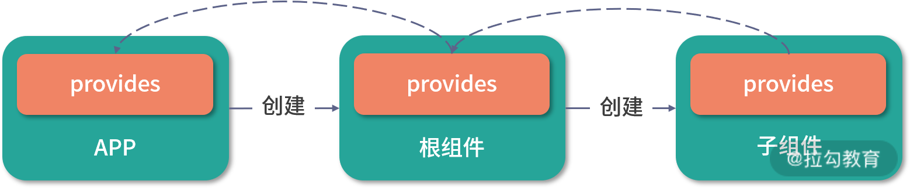

# 依赖注入：子孙组件共享数据过程

Vue.js 为我们提供了很多组件通讯的方式，常见的是父子组件通过 prop 传递数据。但是有时，我们希望能**跨父子组件通讯**，比如，无论组件之间嵌套多少层级，我都希望在后代组件中能访问它们祖先组件的数据。

Vue.js 2.x 给我们提供了一种依赖注入的解决方案，即在祖先组件提供一个 provide 选项，举个例子：

```js
// Provider
export default {
  provide: function () {
    return {
      foo: this.foo,
    };
  },
};
```

这就相当于在祖先组件提供 foo 这个变量数据，我们就可以在任意子孙组件中注入这个变量数据：

```js
// Consumer
export default {
  inject: ["foo"],
};
```

这样，我们就可以在子孙组件中通过 this.foo 访问祖先组件提供的数据，以达到组件通讯的目的。

到了 Vue.js 3.0，除了可以继续沿用这种 Options 的依赖注入，还可以使用依赖注入的 API 函数 provide 和 inject，你可以在 setup 函数中调用它们。

举个例子，我们在祖先组件调用 provide API：

```js
// Provider
import { provide, ref } from "vue";
export default {
  setup() {
    const theme = ref("dark");
    provide("theme", theme);
  },
};
```

然后在子孙组件调用 inject API：

```js
// Consumer
import { inject } from "vue";
export default {
  setup() {
    const theme = inject("theme", "light");
    return {
      theme,
    };
  },
};
```

这里要说明的是，inject 函数接受第二个参数作为默认值，如果祖先组件上下文没有提供 theme，则使用这个默认值。

实际上，你可以把依赖注入看作一部分“大范围有效的 prop”，而且它的规则更加宽松：**祖先组件不需要知道哪些后代组件在使用它提供的数据，后代组件也不需要知道注入的数据来自哪里**。

那么，依赖注入的背后实现原理是怎样的呢？接下来我们就一起分析吧。

### provide API

我们先来分析 provide API 的实现原理：

```js
function provide(key, value) {
  let provides = currentInstance.provides;
  const parentProvides =
    currentInstance.parent && currentInstance.parent.provides;
  if (parentProvides === provides) {
    provides = currentInstance.provides = Object.create(parentProvides);
  }
  provides[key] = value;
}
```

在创建组件实例的时候，组件实例的 provides 对象指向父组件实例的 provides 对象：

```js
const instance = {
  // 依赖注入相关
  provides: parent ? parent.provides : Object.create(appContext.provides),
  // 其它属性
  // ...
};
```

这里，我们可以通过一张图直观感受一下它们之间的关系：



所以在默认情况下，组件实例的 provides 继承它的父组件，但是当组件实例需要提供自己的值的时候，它使用父级提供的对象创建自己的 provides 的对象原型。通过这种方式，在 inject 阶段，我们可以非常容易通过原型链查找来自直接父级提供的数据。

另外，如果组件实例提供和父级 provides 中有相同 key 的数据，是可以覆盖父级提供的数据。举个例子：

```js
import { createApp, h, provide, inject } from "vue";
const ProviderOne = {
  setup() {
    provide("foo", "foo");
    provide("bar", "bar");
    return () => h(ProviderTwo);
  },
};
const ProviderTwo = {
  setup() {
    provide("foo", "fooOverride");
    provide("baz", "baz");
    return () => h(Consumer);
  },
};
const Consumer = {
  setup() {
    const foo = inject("foo");
    const bar = inject("bar");
    const baz = inject("baz");
    return () => h("div", [foo, bar, baz].join("&"));
  },
};
createApp(ProviderOne).mount("#app");
```

可以看到，这是一个嵌套 provider 的情况。根据 provide 函数的实现，ProviderTwo 提供的 key 为 foo 的 provider 会覆盖 ProviderOne 提供的 key 为 foo 的 provider，所以最后渲染在 Consumer 组件上的就是 `fooOverride&bar&baz` 。

接下来，我们来分析另一个依赖注入的 API —— inject。

### inject API

我们先来看 inject API 的实现原理：

```js
function inject(key, defaultValue) {
  const instance = currentInstance || currentRenderingInstance;
  if (instance) {
    const provides = instance.provides;
    if (key in provides) {
      return provides[key];
    } else if (arguments.length > 1) {
      return defaultValue;
    } else if (process.env.NODE_ENV !== "production") {
      warn(`injection "${String(key)}" not found.`);
    }
  }
}
```

前文我们已经分析了 provide 的实现后，在此基础上，理解 inject 的实现就非常简单了。inject 支持两个参数，第一个参数是 key，我们可以访问组件实例中的 provides 对象对应的 key，层层查找父级提供的数据。第二个参数是默认值，如果查找不到数据，则直接返回默认值。

如果既查找不到数据且也没有传入默认值，则在非生产环境下报警告，提示用户找不到这个注入的数据。

到这里我们就掌握了 provide 和 inject 的实现原理。但是，我曾经看到过一个问题：“ Vue.js 3 跨组件共享数据，为何要用 provide/inject ？直接 export/import 数据行吗？“

接下来我们就来探讨依赖注入和模块化共享数据的差异。

### 对比模块化共享数据的方式

我们先来看提问者给出的一个模块化共享数据的示例，即首先在根组件创建一个共享的数据 sharedData：

```js
// Root.js
export const sharedData = ref("");
export default {
  name: "Root",
  setup() {
    // ...
  },
  // ...
};
```

然后在子组件中使用 sharedData：

```js
import { sharedData } from "./Root.js";
export default {
  name: "Root",
  setup() {
    // 这里直接使用 sharedData 即可
  },
};
```

当然，从这个示例上来看，模块化的方式是可以共享数据，但是 provide 和 inject 与模块化方式有如下几点不同。

- **作用域不同**

对于依赖注入，它的作用域是局部范围，所以你只能把数据注入以这个节点为根的后代组件中，不是这棵子树上的组件是不能访问到该数据的；而对于模块化的方式，它的作用域是全局范围的，你可以在任何地方引用它导出的数据。

- **数据来源不同**

对于依赖注入，后代组件是不需要知道注入的数据来自哪里，只管注入并使用即可；而对于模块化的方式提供的数据，用户必须明确知道这个数据是在哪个模块定义的，从而引入它。

- **上下文不同**

对于依赖注入，提供数据的组件的上下文就是组件实例，而且同一个组件定义是可以有多个组件实例的，我们可以根据不同的组件上下文提供不同的数据给后代组件；而对于模块化提供的数据，它是没有任何上下文的，仅仅是这个模块定义的数据，如果想要根据不同的情况提供不同数据，那么从 API 层面设计就需要做更改。

比如允许用户传递一个参数：

```js
export function getShareData(context) {
  // 根据不同的 context 参数返回不同的数据
}
```

掌握了这些不同，在不同场景下你就应该知道选择哪种方式提供数据了。

### 依赖注入的缺陷和应用场景

我们再回到依赖注入，它确实提供了一种组件共享的方式，但并非完美的。正因为依赖注入是上下文相关的，所以它会将你应用程序中的组件与它们当前的组织方式耦合起来，这使得重构变得困难。

来回顾一下依赖注入的特点 ：**祖先组件不需要知道哪些后代组件使用它提供的数据**，**后代组件也不需要知道注入的数据来自哪里**。

如果在一次重构中我们不小心挪动了有依赖注入的后代组件的位置，或者是挪动了提供数据的祖先组件的位置，都有可能导致后代组件丢失注入的数据，进而导致应用程序异常。所以，我**并不推荐在普通应用程序代码中使用依赖注入**。

但是我推荐你在组件库的开发中使用，因为对于一个特定组件，它和其嵌套的子组件上下文联系很紧密。

这里来举一个 Element-UI 组件库 Select 组件的例子：

```js
<template>
  <el-select v-model="value" placeholder="请选择">
    <el-option
      v-for="item in options"
      :key="item.value"
      :label="item.label"
      :value="item.value">
    </el-option>
  </el-select>
</template>
<script>
  export default {
    data() {
      return {
        options: [{
          value: '选项1',
          label: '黄金糕'
        }, {
          value: '选项2',
          label: '双皮奶'
        }, {
          value: '选项3',
          label: '蚵仔煎'
        }, {
          value: '选项4',
          label: '龙须面'
        }, {
          value: '选项5',
          label: '北京烤鸭'
        }],
        value: ''
      }
    }
  }
</script>
```

这是 Select 组件的基础示例，它最终会在页面上渲染成这样：


子组件 ElOption 负责渲染每一个选项，它的内部想要访问最外层的 ElSelect 组件时，就可以通过依赖注入的方式，在 ElSelect 组件中提供组件的实例：

```js
export default {
  provide() {
    return {
      select: this,
    };
  },
};
```

就这样，我们可以在 ElOption 组件注入这个数据：

```js
export default {
  inject: ["select"],
};
```

虽然这些代码还是用的 Vue.js 2.x 的 Options API 方式，但是依赖注入的思想是不变的。

你可能会问，为什么不在 ElOption 子组件内通过 this.$parent 访问外层的 ElSelect 组件实例呢？

虽然 this.$parent 指向的是它的父组件实例，在我们这个例子是可以的，但如果组件结构发生了变化呢？

我们再来看另一个 Select 组件的例子：

```html
<template>
  <el-select v-model="value" placeholder="请选择">
    <el-option-group
      v-for="group in options"
      :key="group.label"
      :label="group.label"
    >
      <el-option
        v-for="item in group.options"
        :key="item.value"
        :label="item.label"
        :value="item.value"
      >
      </el-option>
    </el-option-group>
  </el-select>
</template>
<script>
  export default {
    data() {
      return {
        options: [
          {
            label: "热门城市",
            options: [
              {
                value: "Shanghai",
                label: "上海",
              },
              {
                value: "Beijing",
                label: "北京",
              },
            ],
          },
          {
            label: "城市名",
            options: [
              {
                value: "Chengdu",
                label: "成都",
              },
              {
                value: "Shenzhen",
                label: "深圳",
              },
              {
                value: "Guangzhou",
                label: "广州",
              },
              {
                value: "Dalian",
                label: "大连",
              },
            ],
          },
        ],
        value: "",
      };
    },
  };
</script>
```

这是 Select 组件的分组示例，最终会在页面上渲染成这样：


显然，这里 ElOption 中的 this.$parent 指向的就不是 ElSelect 组件实例，而是 ElOptionGroup 组件实例。但如果我们用依赖注入的方式，即使结构变了，还是可以在 ElOption 组件中正确访问到 ElSelect 的实例。

所以，this.$parent 是一种强耦合的获取父组件实例方式，非常不利于代码的重构，因为一旦组件层级发生变化，就会产生非预期的后果，所以在平时的开发工作中你应该慎用这个属性。

相反，在组件库的场景中，依赖注入还是很方便的，除了示例中提供组件实例数据，还可以提供任意类型的数据。因为入口组件和它的相关子组件关联性是很强的，无论后代组件的结构如何变化，最终都会渲染在入口组件的子树上。

### 总结

好的，到这里我们这一节的学习就结束啦，通过这节课的学习，你应该掌握 Vue.js 依赖注入的实现原理，了解依赖注入的使用场景和它的缺陷。

到目前为止，我们已经学习了 Vue.js 3.0 提供的所有常用的 Composition API。可以看到和 Vue.js 2.x Options API 相比，我们不再是通过编写一些组件配置去描述一个组件，更像是主动调用一些 API 去编写组件的实现逻辑。

Vue.js 2.x 中，框架背后帮我们做了很多事情，比如我们在 data 中定义的变量，在组件实例化阶段会把它们变成响应式的，这个行为是黑盒的，用户是无感知的。反观 Vue.js 3.0 Composition API，用户会利用 reactive 或者 ref API 主动去申明一个响应式对象。

所以**通过 Composition API 去编写组件**，**用户更清楚自己在做什么事情**。

另外，为什么说 Composition API 比 mixin 更适合逻辑复用呢？

其实，二者都是把复用的逻辑放在单独的文件中维护。但从使用的方式而言，用户只是在需要混入 mixin 的组件中去申明这个 mixin，使用方式如下：

```html
<template>
  <div>Mouse position: x {{ x }} / y {{ y }}</div>
</template>
<script>
  import mousePositionMixin from "./mouse";
  export default {
    mixins: [mousePositionMixin],
  };
</script>
```

我们在组件中申明了 mousePositionMixin，组件模板中使用的 x、y 就来源于这个 mixin，这一切都是 Vue.js 内部帮我们做的。如果该组件只引入这单个 mixin，问题倒不大，但如果这个组件引入的 mixin 越来越多，很容易出现命名冲突的情况，以及造成数据来源不清晰等问题。

而我们通过 Composition API 去编写功能类似的 hook 函数，使用方式如下：

```html
<template>
  <div>Mouse position: x {{ x }} / y {{ y }}</div>
</template>
<script>
  import useMousePosition from "./mouse";
  export default {
    setup() {
      const { x, y } = useMousePosition();
      return { x, y };
    },
  };
</script>
```

我们可以清楚地分辨出模板中使用的 x、y 是来源于 useMousePosition 函数，即便我们引入更多的 hook 函数，也不会出现命名冲突的情况。

Composition API 在逻辑复用上确实有不错的优势，但是它并非完美的，使用起来会增加代码量。Composition API 属于 API 的增强，它并不是 Vue.js 3.0 组件开发的范式，如果你的组件足够简单，还是可 以使用 Options API 的。

最后，给你留一道思考题目，如果你想利用依赖注入让整个应用下组件都能共享某个数据，你会怎么做？为什么？欢迎你在留言区与我分享。

> **本节课的相关代码在源代码中的位置如下：**
> packages/runtime-core/src/apiInject.ts
