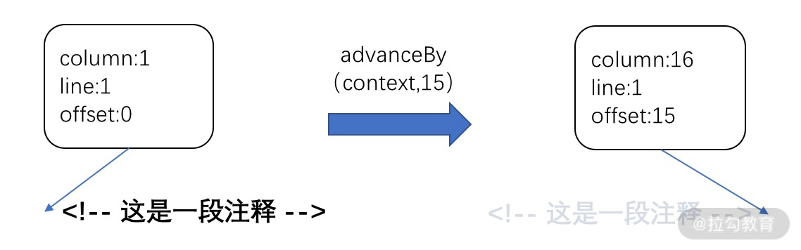

Vue.js 3.0 的编译场景分**服务端 SSR 编译**和 **web 编译**，本文我们只分析 web 的编译。

我们先来看 web 编译的入口 compile 函数，分析它的实现原理：

复制代码

```
function compile(template, options = {}) { 
  return baseCompile(template, extend({}, parserOptions, options, { 
    nodeTransforms: [...DOMNodeTransforms, ...(options.nodeTransforms || [])], 
    directiveTransforms: extend({}, DOMDirectiveTransforms, options.directiveTransforms || {}), 
    transformHoist:  null 
  })) 
} 
```

compile 函数支持两个参数，第一个参数 template 是待编译的模板字符串，第二个参数 options 是编译的一些配置信息。

compile 内部通过执行 baseCompile 方法完成编译工作，可以看到 baseCompile 在参数 options 的基础上又扩展了一些配置。对于这些编译相关的配置，我们后面会在具体的场景具体分析。

接下来，我们来看一下 baseCompile 的实现：

复制代码

```
function baseCompile(template,  options = {}) { 
  const prefixIdentifiers = false 
  // 解析 template 生成 AST 
  const ast = isString(template) ? baseParse(template, options) : template 
  const [nodeTransforms, directiveTransforms] = getBaseTransformPreset() 
  // AST 转换 
  transform(ast, extend({}, options, { 
    prefixIdentifiers, 
    nodeTransforms: [ 
      ...nodeTransforms, 
      ...(options.nodeTransforms || []) 
    ], 
    directiveTransforms: extend({}, directiveTransforms, options.directiveTransforms || {} 
    ) 
  })) 
  // 生成代码 
  return generate(ast, extend({}, options, { 
    prefixIdentifiers 
  })) 
}     
```

可以看到，baseCompile 函数主要做三件事情：**解析 template 生成 AST**，**AST 转换**和**生成代码**。

这一节课我们的目标就是**解析 template 生成 AST 背后的实现原理**。

### 生成 AST 抽象语法树

你可以在百度百科中看到 [AST 的定义](https://baike.baidu.com/item/抽象语法树/6129952?fr=aladdin)，这里我就不赘述啦，对应到我们的 template，也可以用 AST 去描述它，比如我们有如下 template：

复制代码

```
<div class="app"> 
  <!-- 这是一段注释 --> 
  <hello> 
    <p>{{ msg }}</p> 
  </hello> 
  <p>This is an app</p> 
</div> 
```

它经过第一步解析后，生成相应的 AST 对象：

复制代码

```
{ 
  "type": 0, 
  "children": [ 
    { 
      "type": 1, 
      "ns": 0, 
      "tag": "div", 
      "tagType": 0, 
      "props": [ 
        { 
          "type": 6, 
          "name": "class", 
          "value": { 
            "type": 2, 
            "content": "app", 
            "loc": { 
              "start": { 
                "column": 12, 
                "line": 1, 
                "offset": 11 
              }, 
              "end": { 
                "column": 17, 
                "line": 1, 
                "offset": 16 
              }, 
              "source": "\"app\"" 
            } 
          }, 
          "loc": { 
            "start": { 
              "column": 6, 
              "line": 1, 
              "offset": 5 
            }, 
            "end": { 
              "column": 17, 
              "line": 1, 
              "offset": 16 
            }, 
            "source": "class=\"app\"" 
          } 
        } 
      ], 
      "isSelfClosing": false, 
      "children": [ 
        { 
          "type": 3, 
          "content": " 这是一段注释 ", 
          "loc": { 
            "start": { 
              "column": 3, 
              "line": 2, 
              "offset": 20 
            }, 
            "end": { 
              "column": 18, 
              "line": 2, 
              "offset": 35 
            }, 
            "source": "<!-- 这是一段注释 -->" 
          } 
        }, 
        { 
          "type": 1, 
          "ns": 0, 
          "tag": "hello", 
          "tagType": 1, 
          "props": [], 
          "isSelfClosing": false, 
          "children": [ 
            { 
              "type": 1, 
              "ns": 0, 
              "tag": "p", 
              "tagType": 0, 
              "props": [], 
              "isSelfClosing": false, 
              "children": [ 
                { 
                  "type": 5, 
                  "content": { 
                    "type": 4, 
                    "isStatic": false, 
                    "isConstant": false, 
                    "content": "msg", 
                    "loc": { 
                      "start": { 
                        "column": 11, 
                        "line": 4, 
                        "offset": 56 
                      }, 
                      "end": { 
                        "column": 14, 
                        "line": 4, 
                        "offset": 59 
                      }, 
                      "source": "msg" 
                    } 
                  }, 
                  "loc": { 
                    "start": { 
                      "column": 8, 
                      "line": 4, 
                      "offset": 53 
                    }, 
                    "end": { 
                      "column": 17, 
                      "line": 4, 
                      "offset": 62 
                    }, 
                    "source": "{{ msg }}" 
                  } 
                } 
              ], 
              "loc": { 
                "start": { 
                  "column": 5, 
                  "line": 4, 
                  "offset": 50 
                }, 
                "end": { 
                  "column": 21, 
                  "line": 4, 
                  "offset": 66 
                }, 
                "source": "<p>{{ msg }}</p>" 
              } 
            } 
          ], 
          "loc": { 
            "start": { 
              "column": 3, 
              "line": 3, 
              "offset": 38 
            }, 
            "end": { 
              "column": 11, 
              "line": 5, 
              "offset": 77 
            }, 
            "source": "<hello>\n    <p>{{ msg }}</p>\n  </hello>" 
          } 
        }, 
        { 
          "type": 1, 
          "ns": 0, 
          "tag": "p", 
          "tagType": 0, 
          "props": [], 
          "isSelfClosing": false, 
          "children": [ 
            { 
              "type": 2, 
              "content": "This is an app", 
              "loc": { 
                "start": { 
                  "column": 6, 
                  "line": 6, 
                  "offset": 83 
                }, 
                "end": { 
                  "column": 20, 
                  "line": 6, 
                  "offset": 97 
                }, 
                "source": "This is an app" 
              } 
            } 
          ], 
          "loc": { 
            "start": { 
              "column": 3, 
              "line": 6, 
              "offset": 80 
            }, 
            "end": { 
              "column": 24, 
              "line": 6, 
              "offset": 101 
            }, 
            "source": "<p>This is an app</p>" 
          } 
        } 
      ], 
      "loc": { 
        "start": { 
          "column": 1, 
          "line": 1, 
          "offset": 0 
        }, 
        "end": { 
          "column": 7, 
          "line": 7, 
          "offset": 108 
        }, 
        "source": "<div class=\"app\">\n  <!-- 这是一段注释 -->\n  <hello>\n    <p>{{ msg }}</p>\n  </hello>\n  <p>This is an app</p>\n</div>" 
      } 
    } 
  ], 
  "helpers": [], 
  "components": [], 
  "directives": [], 
  "hoists": [], 
  "imports": [], 
  "cached": 0, 
  "temps": 0, 
  "loc": { 
    "start": { 
      "column": 1, 
      "line": 1, 
      "offset": 0 
    }, 
    "end": { 
      "column": 7, 
      "line": 7, 
      "offset": 108 
    }, 
    "source": "<div class=\"app\">\n  <!-- 这是一段注释 -->\n  <hello>\n    <p>{{ msg }}</p>\n  </hello>\n  <p>This is an app</p>\n</div>" 
  } 
} 
```

可以看到，AST 是树状结构，对于树中的每个节点，会有 type 字段描述节点的类型，tag 字段描述节点的标签，props 描述节点的属性，loc 描述节点对应代码相关信息，children 指向它的子节点对象数组。

当然 AST 中的节点还包含其他的一些属性，我在这里就不一一介绍了，你现在要理解的是 **AST 中的节点是可以完整地描述它在模板中映射的节点信息**。

注意，**AST 对象根节点其实是一个虚拟节点**，**它并不会映射到一个具体节点**，另外它还包含了其他的一些属性，这些属性在后续的 AST 转换的过程中会赋值，并在生成代码阶段用到。

那么，为什么要设计一个虚拟节点呢？

因为 Vue.js 3.0 和 Vue.js 2.x 有一个很大的不同——Vue.js 3.0 支持了 Fragment 的语法，即组件可以有多个根节点，比如：

复制代码

```
 
<hello :msg="msg"></hello> 
```

这种写法在 Vue.js 2.x 中会报错，提示模板只能有一个根节点，而 Vue.js 3.0 允许了这种写法。但是对于一棵树而言，必须有一个根节点，所以虚拟节点在这种场景下就非常有用了，它可以作为 AST 的根节点，然后其 children 包含了 img 和 hello 的节点。

好了，到这里你已经大致了解了 AST，那么接下来我们看一下如何根据模板字符串来构建这个 AST 对象吧。

先来看一下 baseParse 的实现：

复制代码

```
function baseParse(content, options = {}) { 
    // 创建解析上下文 
    const context = createPa  rserContext(content, options) 
    const start = getCursor(context) 
    // 解析子节点，并创建 AST  
    return createRoot(parseChildren(context, 0 /* DATA */, []), getSelection(context, start)) 
} 
```

baseParse 主要就做三件事情：**创建解析上下文**，**解析子节点**，**创建 AST 根节点**。

#### 创建解析上下文

首先，我们来分析创建解析上下文的过程，先来看 createParserContext 的实现：

复制代码

```
// 默认解析配置 
const defaultParserOptions = { 
  delimiters: [`{{`, `}}`], 
  getNamespace: () => 0 /* HTML */, 
  getTextMode: () => 0 /* DATA */, 
  isVoidTag: NO, 
  isPreTag: NO, 
  isCustomElement: NO, 
  decodeEntities: (rawText) => rawText.replace(decodeRE, (_, p1) => decodeMap[p1]), 
  onError: defaultOnError 
} 
function createParserContext(content, options) { 
  return { 
    options: extend({}, defaultParserOptions, options), 
    column: 1, 
    line: 1, 
    offset: 0, 
    originalSource: content, 
    source: content, 
    inPre: false, 
    inVPre: false 
  } 
} 
```

解析上下文实际上就是一个 JavaScript 对象，它维护着解析过程中的上下文，其中 options 表示解析相关配置 ，column 表示当前代码的列号，line 表示当前代码的行号，originalSource 表示最初的原始代码，source 表示当前代码，offset 表示当前代码相对于原始代码的偏移量，inPre 表示当前代码是否在 pre 标签内，inVPre 表示当前代码是否在 v-pre 指令的环境下。

在后续解析的过程中，会始终维护和更新这个解析上下文，它能够表示当前解析的状态。

创建完解析上下文，接下来就开始解析子节点了。

#### 解析子节点

我们先来看一下 parseChildren 函数的实现：

复制代码

```
function parseChildren(context, mode, ancestors) { 
  const parent = last(ancestors) 
  const ns = parent ? parent.ns : 0 /* HTML */ 
  const nodes = [] 
   
  // 自顶向下分析代码，生成 nodes 
   
  let removedWhitespace = false 
  // 空白字符管理 
   
  return removedWhitespace ? nodes.filter(Boolean) : nodes 
} 
```

parseChildren 的目的就是解析并创建 AST 节点数组。它有两个主要流程，第一个是自顶向下分析代码，生成 AST 节点数组 nodes；第二个是空白字符管理，用于提高编译的效率。

首先，我们来看**生成 AST 节点数组**的流程：

复制代码

```
function parseChildren(context, mode, ancestors) { 
  // 父节点 
  const parent = last(ancestors) 
  const ns = parent ? parent.ns : 0 /* HTML */ 
  const nodes = [] 
  // 判断是否遍历结束 
  while (!isEnd(context, mode, ancestors)) { 
    const s = context.source 
    let node = undefined 
    if (mode === 0 /* DATA */ || mode === 1 /* RCDATA */) { 
      if (!context.inVPre && startsWith(s, context.options.delimiters[0])) { 
        // 处理 {{ 插值代码 
        node = parseInterpolation(context, mode) 
      } 
      else if (mode === 0 /* DATA */ && s[0] === '<') { 
        // 处理 < 开头的代码 
        if (s.length === 1) { 
          // s 长度为 1，说明代码结尾是 <，报错 
          emitError(context, 5 /* EOF_BEFORE_TAG_NAME */, 1) 
        } 
        else if (s[1] === '!') { 
          // 处理 <! 开头的代码 
          if (startsWith(s, '<!--')) { 
            // 处理注释节点 
            node = parseComment(context) 
          } 
          else if (startsWith(s, '<!DOCTYPE')) { 
            // 处理 <!DOCTYPE 节点 
            node = parseBogusComment(context) 
          } 
          else if (startsWith(s, '<![CDATA[')) { 
            // 处理 <![CDATA[ 节点 
            if (ns !== 0 /* HTML */) { 
              node = parseCDATA(context, ancestors) 
            } 
            else { 
              emitError(context, 1 /* CDATA_IN_HTML_CONTENT */) 
              node = parseBogusComment(context) 
            } 
          } 
          else { 
            emitError(context, 11 /* INCORRECTLY_OPENED_COMMENT */) 
            node = parseBogusComment(context) 
          } 
        } 
        else if (s[1] === '/') { 
          // 处理 </ 结束标签 
          if (s.length === 2) { 
            // s 长度为 2，说明代码结尾是 </，报错 
            emitError(context, 5 /* EOF_BEFORE_TAG_NAME */, 2) 
          } 
          else if (s[2] === '>') { 
            // </> 缺少结束标签，报错 
            emitError(context, 14 /* MISSING_END_TAG_NAME */, 2) 
            advanceBy(context, 3) 
            continue 
          } 
          else if (/[a-z]/i.test(s[2])) { 
            // 多余的结束标签 
            emitError(context, 23 /* X_INVALID_END_TAG */) 
            parseTag(context, 1 /* End */, parent) 
            continue 
          } 
          else { 
            emitError(context, 12 /* INVALID_FIRST_CHARACTER_OF_TAG_NAME */, 2) 
            node = parseBogusComment(context) 
          } 
        } 
        else if (/[a-z]/i.test(s[1])) { 
          // 解析标签元素节点 
          node = parseElement(context, ancestors) 
        } 
        else if (s[1] === '?') { 
          emitError(context, 21 /* UNEXPECTED_QUESTION_MARK_INSTEAD_OF_TAG_NAME */, 1) 
          node = parseBogusComment(context) 
        } 
        else { 
          emitError(context, 12 /* INVALID_FIRST_CHARACTER_OF_TAG_NAME */, 1) 
        } 
      } 
    } 
    if (!node) { 
      // 解析普通文本节点 
      node = parseText(context, mode) 
    } 
    if (isArray(node)) { 
      // 如果 node 是数组，则遍历添加 
      for (let i = 0; i < node.length; i++) { 
        pushNode(nodes, node[i]) 
      } 
    } 
    else { 
      // 添加单个 node 
      pushNode(nodes, node) 
    } 
  } 
} 
```

这些代码看起来很复杂，但它的思路就是自顶向下地去遍历代码，然后根据不同的情况尝试去解析代码，然后把生成的 node 添加到 AST nodes 数组中。在解析的过程中，解析上下文 context 的状态也是在不断发生变化的，我们可以通过 context.source 拿到当前解析剩余的代码 s，然后根据 s 不同的情况走不同的分支处理逻辑。在解析的过程中，可能会遇到各种错误，都会通过 emitError 方法报错。

我们没有必要去了解所有代码的分支细节，只需要知道大致的解析思路即可，因此我们这里只分析四种情况：注释节点的解析、插值的解析、普通文本的解析，以及元素节点的解析。

- 注释节点的解析

首先，我们来看注释节点的解析过程，它会解析模板中的注释节点，比如 `<!-- 这是一段注释 -->，` 即当前代码 s 是以 `<!--` 开头的字符串，则走到注释节点的解析处理逻辑。

我们来看 parseComment 的实现：

复制代码

```
function parseComment(context) { 
  const start = getCursor(context) 
  let content 
  // 常规注释的结束符 
  const match = /--(\!)?>/.exec(context.source) 
  if (!match) { 
    // 没有匹配的注释结束符 
    content = context.source.slice(4) 
    advanceBy(context, context.source.length) 
    emitError(context, 7 /* EOF_IN_COMMENT */) 
  } 
  else { 
    if (match.index <= 3) { 
      // 非法的注释符号 
      emitError(context, 0 /* ABRUPT_CLOSING_OF_EMPTY_COMMENT */) 
    } 
    if (match[1]) { 
      // 注释结束符不正确 
      emitError(context, 10 /* INCORRECTLY_CLOSED_COMMENT */) 
    } 
    // 获取注释的内容 
    content = context.source.slice(4, match.index) 
    // 截取到注释结尾之间的代码，用于后续判断嵌套注释 
    const s = context.source.slice(0, match.index) 
    let prevIndex = 1, nestedIndex = 0 
    // 判断嵌套注释符的情况，存在即报错 
    while ((nestedIndex = s.indexOf('<!--', prevIndex)) !== -1) { 
      advanceBy(context, nestedIndex - prevIndex + 1) 
      if (nestedIndex + 4 < s.length) { 
        emitError(context, 16 /* NESTED_COMMENT */) 
      } 
      prevIndex = nestedIndex + 1 
    } 
    // 前进代码到注释结束符后 
    advanceBy(context, match.index + match[0].length - prevIndex + 1) 
  } 
  return { 
    type: 3 /* COMMENT */, 
    content, 
    loc: getSelection(context, start) 
  } 
} 
```

其实，parseComment 的实现很简单，首先它会利用注释结束符的正则表达式去匹配代码，找出注释结束符。如果没有匹配到或者注释结束符不合法，都会报错。
如果找到合法的注释结束符，则获取它中间的注释内容 content，然后截取注释开头到结尾之间的代码，并判断是否有嵌套注释，如果有嵌套注释也会报错。

接着就是通过调用 advanceBy 前进代码到注释结束符后，这个函数在整个模板解析过程中经常被调用，它的目的是用来前进代码，更新 context 解析上下文，我们来看一下它的实现：

复制代码

```
function advanceBy(context, numberOfCharacters) { 
  const { source } = context 
  // 更新 context 的 offset、line、column 
  advancePositionWithMutation(context, source, numberOfCharacters) 
  // 更新 context 的 source 
  context.source = source.slice(numberOfCharacters) 
} 
function advancePositionWithMutation(pos, source, numberOfCharacters = source.length) { 
  let linesCount = 0 
  let lastNewLinePos = -1 
  for (let i = 0; i < numberOfCharacters; i++) { 
    if (source.charCodeAt(i) === 10 /* newline char code */) { 
      linesCount++ 
      lastNewLinePos = i 
    } 
  } 
  pos.offset += numberOfCharacters 
  pos.line += linesCount 
  pos.column = 
    lastNewLinePos === -1 
      ? pos.column + numberOfCharacters 
      : numberOfCharacters - lastNewLinePos 
  return pos 
} 
```

advanceBy 的实现很简单，主要就是更新解析上下文 context 中的 source 来前进代码，同时更新 offset、line、column 等和代码位置相关的属性。

为了更直观地说明 advanceBy 的作用，前面的示例可以通过下图表示：



经过 advanceBy 前进代码到注释结束符后，表示注释部分代码处理完毕，可以继续解析后续代码了。

parseComment 最终返回的值就是一个描述注释节点的对象，其中 type 表示它是一个注释节点，content 表示注释的内容，loc 表示注释的代码开头和结束的位置信息。

- 插值的解析

接下来，我们来看插值的解析过程，它会解析模板中的插值，比如 `{{ msg }}` ，即当前代码 s 是以 {{ 开头的字符串，且不在 v-pre 指令的环境下（v-pre 会跳过插值的解析），则会走到插值的解析处理逻辑 parseInterpolation 函数，我们来看它的实现：

复制代码

```
function parseInterpolation(context, mode) { 
  // 从配置中获取插值开始和结束分隔符，默认是 {{ 和 }} 
  const [open, close] = context.options.delimiters 
  const closeIndex = context.source.indexOf(close, open.length) 
  if (closeIndex === -1) { 
    emitError(context, 25 /* X_MISSING_INTERPOLATION_END */) 
    return undefined 
  } 
  const start = getCursor(context) 
  // 代码前进到插值开始分隔符后 
  advanceBy(context, open.length) 
  // 内部插值开始位置 
  const innerStart = getCursor(context) 
  // 内部插值结束位置 
  const innerEnd = getCursor(context) 
  // 插值原始内容的长度 
  const rawContentLength = closeIndex - open.length 
  // 插值原始内容 
  const rawContent = context.source.slice(0, rawContentLength) 
  // 获取插值的内容，并前进代码到插值的内容后 
  const preTrimContent = parseTextData(context, rawContentLength, mode) 
  const content = preTrimContent.trim() 
  // 内容相对于插值开始分隔符的头偏移 
  const startOffset = preTrimContent.indexOf(content) 
  if (startOffset > 0) { 
    // 更新内部插值开始位置 
    advancePositionWithMutation(innerStart, rawContent, startOffset) 
  } 
  // 内容相对于插值结束分隔符的尾偏移 
  const endOffset = rawContentLength - (preTrimContent.length - content.length - startOffset) 
  // 更新内部插值结束位置 
  advancePositionWithMutation(innerEnd, rawContent, endOffset); 
  // 前进代码到插值结束分隔符后 
  advanceBy(context, close.length) 
  return { 
    type: 5 /* INTERPOLATION */, 
    content: { 
      type: 4 /* SIMPLE_EXPRESSION */, 
      isStatic: false, 
      isConstant: false, 
      content, 
      loc: getSelection(context, innerStart, innerEnd) 
    }, 
    loc: getSelection(context, start) 
  } 
} 
```

parseInterpolation 的实现也很简单，首先它会尝试找插值的结束分隔符，如果找不到则报错。

如果找到，先前进代码到插值开始分隔符后，然后通过 parseTextData 获取插值中间的内容并前进代码到插值内容后，除了普通字符串，parseTextData 内部会处理一些 HTML 实体符号比如 `&nbsp` 。由于插值的内容可能是前后有空白字符的，所以最终返回的 content 需要执行一下 trim 函数。

为了准确地反馈插值内容的代码位置信息，我们使用了 innerStart 和 innerEnd 去记录插值内容（不包含空白字符）的代码开头和结束位置。

接着就是前进代码到插值结束分隔符后，表示插值部分代码处理完毕，可以继续解析后续代码了。

parseInterpolation 最终返回的值就是一个描述插值节点的对象，其中 type 表示它是一个插值节点，loc 表示插值的代码开头和结束的位置信息，而 content 又是一个描述表达式节点的对象，其中 type 表示它是一个表达式节点，loc 表示内容的代码开头和结束的位置信息，content 表示插值的内容。

- 普通文本的解析

接下来，我们来看普通文本的解析过程，它会解析模板中的普通文本，比如 `This is an app` ，即当前代码 s 既不是以 {{ 插值分隔符开头的字符串，也不是以 < 开头的字符串，则走到普通文本的解析处理逻辑，我们来看 parseText 的实现：

复制代码

```
function parseText(context, mode) { 
  // 文本结束符 
  const endTokens = ['<', context.options.delimiters[0]] 
  if (mode === 3 /* CDATA */) { 
    // CDATA 标记 XML 中的纯文本 
    endTokens.push(']]>') 
  } 
  let endIndex = context.source.length 
  // 遍历文本结束符，匹配找到结束的位置 
  for (let i = 0; i < endTokens.length; i++) { 
    const index = context.source.indexOf(endTokens[i], 1) 
    if (index !== -1 && endIndex > index) { 
      endIndex = index 
    } 
  } 
  const start = getCursor(context) 
  // 获取文本的内容，并前进代码到文本的内容后 
  const content = parseTextData(context, endIndex, mode) 
  return { 
    type: 2 /* TEXT */, 
    content, 
    loc: getSelection(context, start) 
  } 
} 
```

同样，parseText 的实现很简单。对于一段文本来说，都是在遇到 < 或者插值分隔符 {{ 结束，所以会遍历这些结束符，匹配并找到文本结束的位置，然后执行 parseTextData 获取文本的内容，并前进代码到文本的内容后。

parseText 最终返回的值就是一个描述文本节点的对象，其中 type 表示它是一个文本节点，content 表示文本的内容，loc 表示文本的代码开头和结束的位置信息。

这部分内容比较多，所以本课时的内容就先到这。下节课中，我们接着分析元素节点，继续解析 template 生成 AST 的背后实现原理。

> **本节课的相关代码在源代码中的位置如下：**
> packages/compiler-core/src/compile.ts
> packages/compiler-core/src/parse.ts