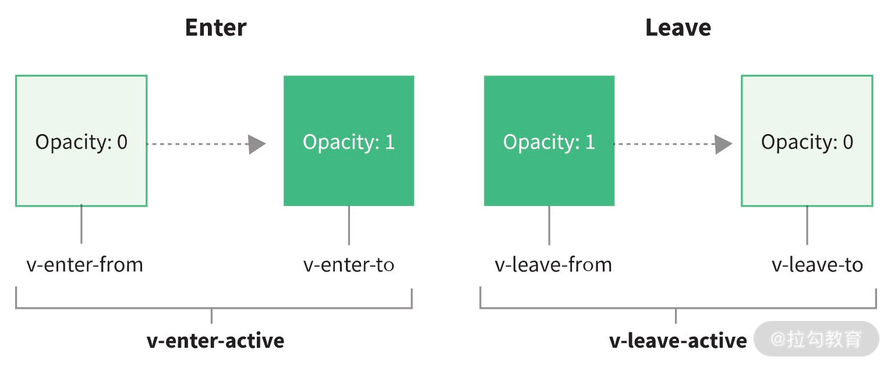

# Transition 组件：过渡动画的实现原理-上

作为一名前端开发工程师，平时开发页面少不了要写一些过渡动画，通常可以用 CSS 脚本来实现，当然一些时候也会使用 JavaScript 操作 DOM 来实现动画。那么，如果我们使用 Vue.js 技术栈，有没有好的实现动画的方式呢？

答案是肯定的——有，Vue.js 提供了内置的 Transition 组件，它可以让我们轻松实现动画过渡效果。

### Transition 组件的用法

> 如果你还不太熟悉 Transition 组件的使用，我建议你先去看它的[官网文档](https://v3.vuejs.org/guide/transitions-enterleave.html)。

Transition 组件通常有三类用法：CSS 过渡，CSS 动画和 JavaScript 钩子。我们分别用几个示例来说明，这里我希望你可以敲代码运行感受一下。

首先来看 CSS 过渡：

复制代码

```
<template>
  <div class="app">
    <button @click="show = !show">
      Toggle render
    </button>
    <transition name="fade">
      <p v-if="show">hello</p>
    </transition>
  </div>
</template>
<script>
  export default {
    data() {
      return {
        show: true
      }
    }
  }
</script>
<style>
  .fade-enter-active,
  .fade-leave-active {
    transition: opacity 0.5s ease;
  }
  .fade-enter-from,
  .fade-leave-to {
    opacity: 0;
  }
</style>
```

CSS 过渡主要定义了一些过渡的 CSS 样式，当我们点击按钮切换文本显隐的时候，就会应用这些 CSS 样式，实现过渡效果。

接着来看 CSS 动画：

复制代码

```
<template>
  <div class="app">
    <button @click="show = !show">Toggle show</button>
    <transition name="bounce">
      <p v-if="show">Vue is an awesome front-end MVVM framework. We can use it to build multiple apps.</p>
    </transition>
  </div>
</template>
<script>
  export default {
    data() {
      return {
        show: true
      }
    }
  }
</script>
<style>
  .bounce-enter-active {
    animation: bounce-in 0.5s;
  }
  .bounce-leave-active {
    animation: bounce-in 0.5s reverse;
  }
  @keyframes bounce-in {
    0% {
      transform: scale(0);
    }
    50% {
      transform: scale(1.5);
    }
    100% {
      transform: scale(1);
    }
  }
</style>
```

和 CSS 过渡类似，CSS 动画主要定义了一些动画的 CSS 样式，当我们去点击按钮切换文本显隐的时候，就会应用这些 CSS 样式，实现动画效果。

最后，是 JavaScript 钩子：

复制代码

```
<template>
  <div class="app">
    <button @click="show = !show">
      Toggle render
    </button>
    <transition
      @before-enter="beforeEnter"
      @enter="enter"
      @before-leave="beforeLeave"
      @leave="leave"
      css="false"
    >
      <p v-if="show">hello</p>
    </transition>
  </div>
</template>
<script>
  export default {
    data() {
      return {
        show: true
      }
    },
    methods: {
      beforeEnter(el) {
        el.style.opacity = 0
        el.style.transition = 'opacity 0.5s ease'
      },
      enter(el) {
        this.$el.offsetHeight
        el.style.opacity = 1
      },
      beforeLeave(el) {
        el.style.opacity = 1
      },
      leave(el) {
        el.style.transition = 'opacity 0.5s ease'
        el.style.opacity = 0
      }
    }
  }
</script>
```

Transition 组件也允许在一个过渡组件中定义它过渡生命周期的 JavaScript 钩子函数，我们可以在这些钩子函数中编写 JavaScript 操作 DOM 来实现过渡动画效果。

### Transition 组件的核心思想

通过前面三个示例，我们不难发现都是在点击按钮时，通过修改 v-if 的条件值来触发过渡动画的。

其实 Transition 组件过渡动画的触发条件有以下四点：

- 条件渲染 (使用 v-if)；
- 条件展示 (使用 v-show)；
- 动态组件；
- 组件根节点。

所以你只能在上述四种情况中使用 Transition 组件，在进入/离开过渡的时候会有 6 个 class 切换。

1. **v-enter-from**：定义进入过渡的开始状态。在元素被插入之前生效，在元素被插入之后的下一帧移除。
2. **v-enter-active**：定义进入过渡生效时的状态。在整个进入过渡的阶段中应用，在元素被插入之前生效，在过渡动画完成之后移除。这个类可以被用来定义进入过渡的过程时间，延迟和曲线函数。
3. **v-enter-to**：定义进入过渡的结束状态。在元素被插入之后下一帧生效 (与此同时 v-enter-from 被移除)，在过渡动画完成之后移除。
4. **v-leave-from**：定义离开过渡的开始状态。在离开过渡被触发时立刻生效，下一帧被移除。
5. **v-leave-active**：定义离开过渡生效时的状态。在整个离开过渡的阶段中应用，在离开过渡被触发时立刻生效，在过渡动画完成之后移除。这个类可以被用来定义离开过渡的过程时间，延迟和曲线函数。
6. **v-leave-to**：定义离开过渡的结束状态。在离开过渡被触发之后下一帧生效 (与此同时 v-leave-from 被删除)，在过渡动画完成之后移除。



其实说白了 Transition 组件的核心思想就是，**Transition 包裹的元素插入删除时**，**在适当的时机插入这些 CSS 样式**，而这些 CSS 的实现则决定了元素的过渡动画。

大致了解了 Transition 组件的用法和核心思想后，接下来我们就来探究 Transition 组件的实现原理。

### Transition 组件的实现原理

为了方便你的理解，我们还是结合示例来分析：

复制代码

```
<template>
  <div class="app">
    <button @click="show = !show">
      Toggle render
    </button>
    <transition name="fade">
      <p v-if="show">hello</p>
    </transition>
  </div>
</template>
```

先来看模板编译后生成的 render 函数：

复制代码

```
import { createVNode as _createVNode, openBlock as _openBlock, createBlock as _createBlock, createCommentVNode as _createCommentVNode, Transition as _Transition, withCtx as _withCtx } from "vue"
export function render(_ctx, _cache, $props, $setup, $data, $options) {
  return (_openBlock(), _createBlock("template", null, [
    _createVNode("div", { class: "app" }, [
      _createVNode("button", {
        onClick: $event => (_ctx.show = !_ctx.show)
      }, " Toggle render ", 8 /* PROPS */, ["onClick"]),
      _createVNode(_Transition, { name: "fade" }, {
        default: _withCtx(() => [
          (_ctx.show)
            ? (_openBlock(), _createBlock("p", { key: 0 }, "hello"))
            : _createCommentVNode("v-if", true)
        ]),
        _: 1
      })
    ])
  ]))
}
```

对于 Transition 组件部分，生成的 render 函数主要创建了 Transition 组件 vnode，并且有一个默认插槽。

我们接着来看 Transition 组件的定义：

复制代码

```
const Transition = (props, { slots }) => h(BaseTransition, resolveTransitionProps(props), slots)
const BaseTransition = {
  name: `BaseTransition`,
  props: {
    mode: String,
    appear: Boolean,
    persisted: Boolean,
    // enter
    onBeforeEnter: TransitionHookValidator,
    onEnter: TransitionHookValidator,
    onAfterEnter: TransitionHookValidator,
    onEnterCancelled: TransitionHookValidator,
    // leave
    onBeforeLeave: TransitionHookValidator,
    onLeave: TransitionHookValidator,
    onAfterLeave: TransitionHookValidator,
    onLeaveCancelled: TransitionHookValidator,
    // appear
    onBeforeAppear: TransitionHookValidator,
    onAppear: TransitionHookValidator,
    onAfterAppear: TransitionHookValidator,
    onAppearCancelled: TransitionHookValidator
  },
  setup(props, { slots }) {
    const instance = getCurrentInstance()
    const state = useTransitionState()
    let prevTransitionKey
    return () => {
      const children = slots.default && getTransitionRawChildren(slots.default(), true)
      if (!children || !children.length) {
        return
      }
      // Transition 组件只允许一个子元素节点，多个报警告，提示使用 TransitionGroup 组件
      if ((process.env.NODE_ENV !== 'production') && children.length > 1) {
        warn('<transition> can only be used on a single element or component. Use ' +
          '<transition-group> for lists.')
      }
      // 不需要追踪响应式，所以改成原始值，提升性能
      const rawProps = toRaw(props)
      const { mode } = rawProps
      // 检查 mode 是否合法
      if ((process.env.NODE_ENV !== 'production') && mode && !['in-out', 'out-in', 'default'].includes(mode)) {
        warn(`invalid <transition> mode: ${mode}`)
      }
      // 获取第一个子元素节点
      const child = children[0]
      if (state.isLeaving) {
        return emptyPlaceholder(child)
      }
      // 处理 <transition><keep-alive/></transition> 的情况
      const innerChild = getKeepAliveChild(child)
      if (!innerChild) {
        return emptyPlaceholder(child)
      }
      const enterHooks = resolveTransitionHooks(innerChild, rawProps, state, instance)
        setTransitionHooks(innerChild, enterHooks)
      const oldChild = instance.subTree
      const oldInnerChild = oldChild && getKeepAliveChild(oldChild)
      let transitionKeyChanged = false
      const { getTransitionKey } = innerChild.type
      if (getTransitionKey) {
        const key = getTransitionKey()
        if (prevTransitionKey === undefined) {
          prevTransitionKey = key
        }
        else if (key !== prevTransitionKey) {
          prevTransitionKey = key
          transitionKeyChanged = true
        }
      }
      if (oldInnerChild &&
        oldInnerChild.type !== Comment &&
        (!isSameVNodeType(innerChild, oldInnerChild) || transitionKeyChanged)) {
        const leavingHooks = resolveTransitionHooks(oldInnerChild, rawProps, state, instance)
        // 更新旧树的钩子函数
        setTransitionHooks(oldInnerChild, leavingHooks)
        // 在两个视图之间切换
        if (mode === 'out-in') {
          state.isLeaving = true
          // 返回空的占位符节点，当离开过渡结束后，重新渲染组件
          leavingHooks.afterLeave = () => {
            state.isLeaving = false
            instance.update()
          }
          return emptyPlaceholder(child)
        }
        else if (mode === 'in-out') {
          leavingHooks.delayLeave = (el, earlyRemove, delayedLeave) => {
            const leavingVNodesCache = getLeavingNodesForType(state, oldInnerChild)
            leavingVNodesCache[String(oldInnerChild.key)] = oldInnerChild
            // early removal callback
            el._leaveCb = () => {
              earlyRemove()
              el._leaveCb = undefined
              delete enterHooks.delayedLeave
            }
            enterHooks.delayedLeave = delayedLeave
          }
        }
      }
      return child
    }
  }
}
```

可以看到，Transition 组件是在 BaseTransition 的基础上封装的高阶函数式组件。由于整个 Transition 的实现代码较多，我就挑重点，为你讲清楚整体的实现思路。

我把 Transition 组件的实现分成组件的渲染、钩子函数的执行、模式的应用三个部分去详细说明。

#### 组件的渲染

先来看 Transition 组件是如何渲染的。我们重点看 setup 函数部分的逻辑。

Transition 组件和前面学习的 KeepAlive 组件一样，是一个抽象组件，组件本身不渲染任何实体节点，只渲染第一个子元素节点。

> 注意，Transition 组件内部只能嵌套一个子元素节点，如果有多个节点需要用 TransitionGroup 组件。

如果 Transition 组件内部嵌套的是 KeepAlive 组件，那么它会继续查找 KeepAlive 组件嵌套的第一个子元素节点，来作为渲染的元素节点。

如果 Transition 组件内部没有嵌套任何子节点，那么它会渲染空的注释节点。

在渲染的过程中，Transition 组件还会通过 resolveTransitionHooks 去定义组件创建和删除阶段的钩子函数对象，然后再通过 setTransitionHooks 函数去把这个钩子函数对象设置到 vnode.transition 上。

渲染过程中，还会判断这是否是一次更新渲染，如果是会对不同的模式执行不同的处理逻辑，我会在后续介绍模式的应用时详细说明。

以上就是 Transition 组件渲染做的事情，你需要记住的是**Transition 渲染的是组件嵌套的第一个子元素节点**。

但是 Transition 是如何在节点的创建和删除过程中设置那些与过渡动画相关的 CSS 的呢？这些都与钩子函数相关，我们先来看 setTransitionHooks 的实现，看看它定义的钩子函数对象是怎样的：

复制代码

```
function resolveTransitionHooks(vnode, props, state, instance) {
  const { appear, mode, persisted = false, onBeforeEnter, onEnter, onAfterEnter, onEnterCancelled, onBeforeLeave, onLeave, onAfterLeave, onLeaveCancelled, onBeforeAppear, onAppear, onAfterAppear, onAppearCancelled } = props
  const key = String(vnode.key)
  const leavingVNodesCache = getLeavingNodesForType(state, vnode)
  const callHook = (hook, args) => {
    hook &&
    callWithAsyncErrorHandling(hook, instance, 9 /* TRANSITION_HOOK */, args)
  }
  const hooks = {
    mode,
    persisted,
    beforeEnter(el) {
      let hook = onBeforeEnter
      if (!state.isMounted) {
        if (appear) {
          hook = onBeforeAppear || onBeforeEnter
        }
        else {
          return
        }
      }
      if (el._leaveCb) {
        el._leaveCb(true /* cancelled */)
      }
      const leavingVNode = leavingVNodesCache[key]
      if (leavingVNode &&
        isSameVNodeType(vnode, leavingVNode) &&
        leavingVNode.el._leaveCb) {
        leavingVNode.el._leaveCb()
      }
      callHook(hook, [el])
    },
    enter(el) {
      let hook = onEnter
      let afterHook = onAfterEnter
      let cancelHook = onEnterCancelled
      if (!state.isMounted) {
        if (appear) {
          hook = onAppear || onEnter
          afterHook = onAfterAppear || onAfterEnter
          cancelHook = onAppearCancelled || onEnterCancelled
        }
        else {
          return
        }
      }
      let called = false
      const done = (el._enterCb = (cancelled) => {
        if (called)
          return
        called = true
        if (cancelled) {
          callHook(cancelHook, [el])
        }
        else {
          callHook(afterHook, [el])
        }
        if (hooks.delayedLeave) {
          hooks.delayedLeave()
        }
        el._enterCb = undefined
      })
      if (hook) {
        hook(el, done)
        if (hook.length <= 1) {
          done()
        }
      }
      else {
        done()
      }
    },
    leave(el, remove) {
      const key = String(vnode.key)
      if (el._enterCb) {
        el._enterCb(true /* cancelled */)
      }
      if (state.isUnmounting) {
        return remove()
      }
      callHook(onBeforeLeave, [el])
      let called = false
      const done = (el._leaveCb = (cancelled) => {
        if (called)
          return
        called = true
        remove()
        if (cancelled) {
          callHook(onLeaveCancelled, [el])
        }
        else {
          callHook(onAfterLeave, [el])
        }
        el._leaveCb = undefined
        if (leavingVNodesCache[key] === vnode) {
          delete leavingVNodesCache[key]
        }
      })
      leavingVNodesCache[key] = vnode
      if (onLeave) {
        onLeave(el, done)
        if (onLeave.length <= 1) {
          done()
        }
      }
      else {
        done()
      }
    },
    clone(vnode) {
      return resolveTransitionHooks(vnode, props, state, instance)
    }
  }
  return hooks
}
```

钩子函数对象定义了 4 个钩子函数，分别是 beforeEnter，enter，leave 和 clone，它们的执行时机是什么，又是怎么处理 我们给 Transition 组件传递的一些 Prop 的？其中，beforeEnter、enter 和 leave 发生在元素的插入和删除阶段，接下来我们就来分析这几个钩子函数的执行过程。

好的，今天我们就先讲到这里，下节课继续分析钩子函数的执行。

> 本节课的相关代码在源代码中的位置如下：
> packages/runtime-core/src/components/BasetTransition.ts
> packages/runtime-core/src/renderer.ts
> packages/runtime-dom/src/components/Transition.ts
