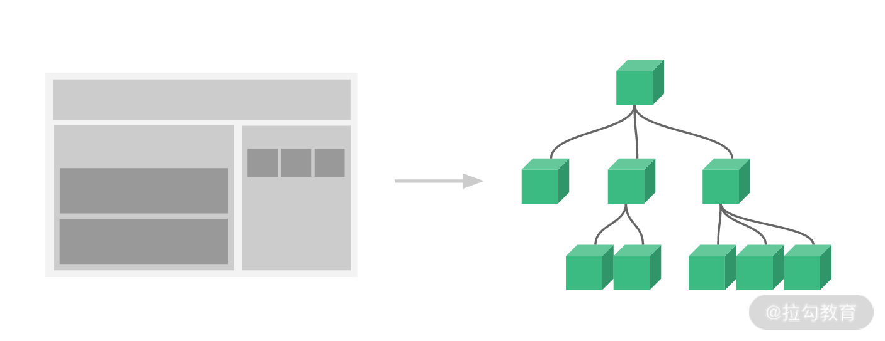

相信作为一个 Vue.js 的开发者，最熟悉的应该就是组件了，我们开发 Vue.js 的项目，大部分时间都是在写组件，组件系统是 Vue.js 的一个重要概念，它是一种对 DOM 结构的抽象，我们可以使用小型、独立和通常可复用的组件构建大型应用。仔细想想，几乎任意类型的应用界面都可以抽象为一个组件树，如下：

组件化也是 Vue.js 的核心思想之一，它允许我们用模板加对象描述的方式去创建一个组件，再加上我们给组件注入不同的数据，就可以完整地渲染出组件：

当数据更新后，组件可以自动重新渲染，因此用户只需要专注于数据逻辑的处理，而无须关心 DOM 的操作，无论是开发体验和开发效率都得到了很大的提升。

短短几行代码，就可以构建庞大的组件结构，这一切都是 Vue.js 框架的功劳。那它究竟是怎么做到的呢，这一部分我就带你去探究组件内部实现的奥秘，看看它是如何渲染到 DOM 上并且在数据变化后又是如何重新渲染的。