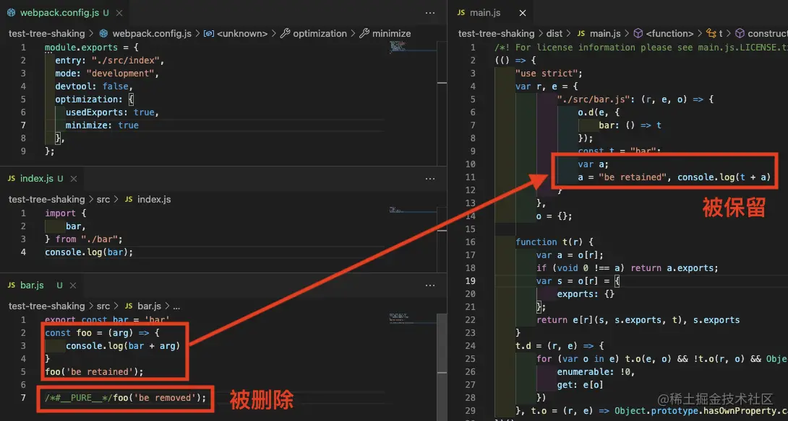

# TreeShaking

## 一、什么是 Tree Shaking(动摇)

Tree-Shaking(动摇) 是一种基于 ES Module 规范的 Dead Code Elimination(消除) 技术，它会在运行过程中静态分析模块之间的导入导出，确定 ESM 模块中哪些导出值未曾其它模块使用，并将其删除，以此实现打包产物的优化。

Tree Shaking(动摇) 较早前由 Rich Harris 在 Rollup 中率先实现，Webpack 自 2.0 版本开始接入，至今已经成为一种应用广泛的性能优化手段。

### 1.1 在 Webpack 中启动 Tree Shaking(动摇)

在 Webpack 中，启动 Tree Shaking(动摇) 功能必须同时满足三个条件：

- 使用 ESM 规范编写模块代码
- 配置 `optimization.usedExports` 为 `true`，启动标记功能
- 启动代码优化功能，可以通过如下方式实现：
  - 配置 `mode = production`
  - 配置 `optimization.minimize = true`
  - 提供 `optimization.minimizer` 数组

例如：

```js
// webpack.config.js
module.exports = {
  entry: "./src/index",
  mode: "production",
  devtool: false,
  optimization: {
    usedExports: true,
  },
};
```

### 1.2 理论基础

在 CommonJs、AMD、CMD 等旧版本的 JavaScript 模块化方案中，导入导出行为是高度动态，难以预测的，例如：

```js
if (process.env.NODE_ENV === "development") {
  require("./bar");
  exports.foo = "foo";
}
```

而 ESM 方案则从规范层面规避这一行为，它要求所有的导入导出语句只能出现在模块顶层，且导入导出的模块名必须为字符串常量，这意味着下述代码在 ESM 方案下是非法的：

```js
if (process.env.NODE_ENV === "development") {
  import bar from "bar";
  export const foo = "foo";
}
```

所以，ESM 下模块之间的依赖关系是高度确定的，与运行状态无关，编译工具只需要对 ESM 模块做静态分析，就可以从代码字面量中推断出哪些模块值未曾被其它模块使用，这是实现 Tree Shaking(动摇) 技术的必要条件。

### 1.3 示例

对于下述代码：

```js
// index.js
import { bar } from "./bar";
console.log(bar);

// bar.js
export const bar = "bar";
export const foo = "foo";
```

示例中，`bar.js` 模块导出了 `bar` 、`foo` ，但只有 `bar` 导出值被其它模块使用，经过 Tree Shaking(动摇) 处理后，`foo` 变量会被视作无用代码删除。

## 二、实现原理

Webpack 中，Tree-shaking(动摇) 的实现一是先**标记**出模块导出值中哪些没有被用过，二是使用 Terser 删掉这些没被用到的导出语句。标记过程大致可划分为三个步骤：

- Make 阶段，收集模块导出变量并记录到模块依赖关系图 ModuleGraph 变量中
- Seal(密封) 阶段，遍历 ModuleGraph 标记模块导出变量有没有被使用
- 生成产物时，若变量没有被其它模块使用则删除对应的导出语句

> 标记功能需要配置 `optimization.usedExports = true` 开启

也就是说，标记的效果就是删除没有被其它模块使用的导出语句，比如：


示例中，`bar.js` 模块 (左二) 导出了两个变量：`bar` 与 `foo`，其中 `foo` 没有被其它模块用到，所以经过标记后，构建产物 (右一) 中 `foo` 变量对应的导出语句就被删除了。作为对比，如果没有启动标记功能 (`optimization.usedExports = false` 时)，则变量无论有没有被用到都会保留导出语句，如上图右二的产物代码所示。

注意，这个时候 `foo` 变量对应的代码 `const foo='foo'` 都还保留完整，这是因为标记功能只会影响到模块的导出语句，真正执行 “**Shaking(动摇)**” 操作的是 Terser 插件。例如在上例中 `foo` 变量经过标记后，已经变成一段 Dead Code —— 不可能被执行到的代码，这个时候只需要用 Terser 提供的 DCE 功能就可以删除这一段定义语句，以此实现完整的 Tree Shaking(动摇) 效果。

接下来我会展开标记过程的源码，详细讲解 Webpack 5 中 Tree Shaking(动摇) 的实现过程，对源码不感兴趣的同学可以直接跳到下一章。

### 2.1 收集模块导出

首先，Webpack 需要弄清楚每个模块分别有什么导出值，这一过程发生在 make 阶段，大体流程：

> 关于 Make 阶段的更多说明，请参考前文 [[万字总结] 一文吃透 Webpack 核心原理](https://link.juejin.cn?target=https%3A%2F%2Fmp.weixin.qq.com%2Fs%2FSbJNbSVzSPSKBe2YStn2Zw "https://mp.weixin.qq.com/s/SbJNbSVzSPSKBe2YStn2Zw") 。

1.  将模块的所有 ESM 导出语句转换为 Dependency 对象，并记录到 `module` 对象的 `dependencies` 集合，转换规则：

- 具名导出转换为 `HarmonyExportSpecifierDependency` 对象
- `default` 导出转换为 `HarmonyExportExpressionDependency` 对象

例如对于下面的模块：

```js
export const bar = "bar";
export const foo = "foo";

export default "foo-bar";
```

对应的`dependencies` 值为：


2.  所有模块都编译完毕后，触发 `compilation.hooks.finishModules` 钩子，开始执行 `FlagDependencyExportsPlugin` 插件回调
3.  `FlagDependencyExportsPlugin` 插件从 entry(条目) 开始读取 ModuleGraph 中存储的模块信息，遍历所有 `module` 对象
4.  遍历 `module` 对象的 `dependencies` 数组，找到所有 `HarmonyExportXXXDependency` 类型的依赖对象，将其转换为 `ExportInfo` 对象并记录到 ModuleGraph 体系中

经过 `FlagDependencyExportsPlugin` 插件处理后，所有 ESM 风格的 export(出口) 语句都会记录在 ModuleGraph 体系内，后续操作就可以从 ModuleGraph 中直接读取出模块的导出值。

> 参考资料：

1.  > [[万字总结] 一文吃透 Webpack 核心原理](https://link.juejin.cn?target=https%3A%2F%2Fmp.weixin.qq.com%2Fs%2FSbJNbSVzSPSKBe2YStn2Zw "https://mp.weixin.qq.com/s/SbJNbSVzSPSKBe2YStn2Zw")
2.  > [有点难的 webpack 知识点：Dependency Graph(图) 深度解析](https://link.juejin.cn?target=https%3A%2F%2Fmp.weixin.qq.com%2Fs%2Fkr73Epnn6wAx9DH7KRVUaA "https://mp.weixin.qq.com/s/kr73Epnn6wAx9DH7KRVUaA")

### 2.2 标记模块导出

模块导出信息收集完毕后，Webpack 需要标记出各个模块的导出列表中，哪些导出值有被其它模块用到，哪些没有，这一过程发生在 Seal(密封) 阶段，主流程：

1.  触发 `compilation.hooks.optimizeDependencies` 钩子，开始执行 `FlagDependencyUsagePlugin` 插件逻辑
2.  在 `FlagDependencyUsagePlugin` 插件中，从 entry(条目) 开始逐步遍历 ModuleGraph 存储的所有 `module` 对象
3.  遍历 `module` 对象对应的 `exportInfo` 数组
4.  为每一个 `exportInfo` 对象执行 `compilation.getDependencyReferencedExports` 方法，确定其对应的 `dependency` 对象有否被其它模块使用
5.  被任意模块使用到的导出值，调用 `exportInfo.setUsedConditionally` 方法将其标记为已被使用。
6.  `exportInfo.setUsedConditionally` 内部修改 `exportInfo._usedInRuntime` 属性，记录该导出被如何使用
7.  结束

上面是极度简化过的版本，中间还存在非常多的分支逻辑与复杂的集合操作，我们抓住重点：标记模块导出这一操作集中在 `FlagDependencyUsagePlugin` 插件中，执行结果最终会记录在模块导出语句对应的 `exportInfo._usedInRuntime` 字典中。

### 2.3 生成代码

经过前面的收集与标记步骤后，Webpack 已经在 ModuleGraph 体系中清楚地记录了每个模块都导出了哪些值，每个导出值又没那块模块所使用。接下来，Webpack 会根据导出值的使用情况生成不同的代码，例如：


重点关注 `bar.js` 文件，同样是导出值，`bar` 被 `index.js` 模块使用因此对应生成了 `__webpack_require__.d` 调用 `"bar": ()=>(/* binding */ bar)`，作为对比 `foo` 则仅仅保留了定义语句，没有在 chunk 中生成对应的 export(出口)。

> 关于 Webpack 产物的内容及 `__webpack_require__.d` 方法的含义，可参考 [Webpack 原理系列六： 彻底理解 Webpack 运行时](https://link.juejin.cn?target=https%3A%2F%2Fmp.weixin.qq.com%2Fs%2FnkBvbwpzeb0fzG02HXta8A "https://mp.weixin.qq.com/s/nkBvbwpzeb0fzG02HXta8A") 一文。

这一段生成逻辑均由导出语句对应的 `HarmonyExportXXXDependency` 类实现，大体的流程：

1.  打包阶段，调用 `HarmonyExportXXXDependency.Template.apply` 方法生成代码
2.  在 `apply` 方法内，读取 ModuleGraph 中存储的 `exportsInfo` 信息，判断哪些导出值被使用，哪些未被使用
3.  对已经被使用及未被使用的导出值，分别创建对应的 `HarmonyExportInitFragment` 对象，保存到 `initFragments` 数组
4.  遍历 `initFragments` 数组，生成最终结果

基本上，这一步的逻辑就是用前面收集好的 `exportsInfo` 对象未模块的导出值分别生成导出语句。

### 2.4 删除 Dead Code

经过前面几步操作之后，模块导出列表中未被使用的值都不会定义在 `__webpack_exports__` 对象中，形成一段不可能被执行的 Dead Code 效果，如上例中的 `foo` 变量：


在此之后，将由 Terser、UglifyJS 等 DCE 工具 “摇” 掉这部分无效代码，构成完整的 Tree Shaking(动摇) 操作。

### 2.5 总结

综上所述，Webpack 中 Tree Shaking(动摇) 的实现分为如下步骤：

- 在 `FlagDependencyExportsPlugin` 插件中根据模块的 `dependencies` 列表收集模块导出值，并记录到 ModuleGraph 体系的 `exportsInfo` 中
- 在 `FlagDependencyUsagePlugin` 插件中收集模块的导出值的使用情况，并记录到 `exportInfo._usedInRuntime` 集合中
- 在 `HarmonyExportXXXDependency.Template.apply` 方法中根据导出值的使用情况生成不同的导出语句
- 使用 DCE 工具删除 Dead Code，实现完整的树摇效果

上述实现原理对背景知识要求较高，建议读者同步配合以下文档食用：

1.  > [[万字总结] 一文吃透 Webpack 核心原理](https://link.juejin.cn?target=https%3A%2F%2Fmp.weixin.qq.com%2Fs%2FSbJNbSVzSPSKBe2YStn2Zw "https://mp.weixin.qq.com/s/SbJNbSVzSPSKBe2YStn2Zw")
2.  > [有点难的 webpack 知识点：Dependency Graph(图) 深度解析](https://link.juejin.cn?target=https%3A%2F%2Fmp.weixin.qq.com%2Fs%2Fkr73Epnn6wAx9DH7KRVUaA "https://mp.weixin.qq.com/s/kr73Epnn6wAx9DH7KRVUaA")
3.  > [Webpack 原理系列六： 彻底理解 Webpack 运行时](https://link.juejin.cn?target=https%3A%2F%2Fmp.weixin.qq.com%2Fs%2FnkBvbwpzeb0fzG02HXta8A "https://mp.weixin.qq.com/s/nkBvbwpzeb0fzG02HXta8A")

## 三、最佳实践

虽然 Webpack 自 2.x 开始就原生支持 Tree Shaking(动摇) 功能，但受限于 JS 的动态特性与模块的复杂性，直至最新的 5.0 版本依然没有解决许多代码副作用带来的问题，使得优化效果并不如 Tree Shaking(动摇) 原本设想的那么完美，所以需要使用者有意识地优化代码结构，或使用一些补丁技术帮助 Webpack 更精确地检测无效代码，完成 Tree Shaking(动摇) 操作。

### 3.1 避免无意义的赋值

使用 Webpack 时，需要有意识规避一些不必要的赋值操作，观察下面这段示例代码：


示例中，`index.js` 模块引用了 `bar.js` 模块的 `foo` 并赋值给 `f` 变量，但后续并没有继续用到 `foo` 或 `f` 变量，这种场景下 `bar.js` 模块导出的 `foo` 值实际上并没有被使用，理应被删除，但 Webpack 的 Tree Shaking(动摇) 操作并没有生效，产物中依然保留 `foo` 导出：


造成这一结果，浅层原因是 Webpack 的 Tree Shaking(动摇) 逻辑停留在代码静态分析层面，只是浅显地判断：

- 模块导出变量是否被其它模块引用
- 引用模块的主体代码中有没有出现这个变量

没有进一步，从语义上分析模块导出值是不是真的被有效使用。

更深层次的原因则是 JavaScript 的赋值语句并不**纯**，视具体场景有可能产生意料之外的副作用，例如：

```js
import { bar, foo } from "./bar";

let count = 0;

const mock = {};

Object.defineProperty(mock, "f", {
  set(v) {
    mock._f = v;
    count += 1;
  },
});

mock.f = foo;

console.log(count);
```

示例中，对 `mock` 对象施加的 `Object.defineProperty` 调用，导致 `mock.f = foo` 赋值语句对 `count` 变量产生了副作用，这种场景下即使用复杂的动态语义分析也很难在确保正确副作用的前提下，完美地 Shaking(动摇) 掉所有无用的代码枝叶。

因此，在使用 Webpack 时开发者需要有意识地规避这些无意义的重复赋值操作。

### 3.3 使用 `#pure` 标注纯函数调用

与赋值语句类似，JavaScript 中的函数调用语句也可能产生副作用，因此默认情况下 Webpack 并不会对函数调用做 Tree Shaking(动摇) 操作。不过，开发者可以在调用语句前添加 `/*#__PURE__*/` 备注，明确告诉 Webpack 该次函数调用并不会对上下文环境产生副作用，例如：



示例中，`foo('be retained')` 调用没有带上 `/*#__PURE__*/` 备注，代码被保留；作为对比，`foo('be removed')` 带上 Pure(纯) 声明后则被 Tree Shaking(动摇) 删除。

### 3.3 禁止 Babel 转译模块导入导出语句

Babel 是一个非常流行的 JavaScript 代码转换器，它能够将高版本的 JS 代码等价转译为兼容性更佳的低版本代码，使得前端开发者能够使用最新的语言特性开发出兼容旧版本浏览器的代码。

但 Babel 提供的部分功能特性会致使 Tree Shaking(动摇) 功能失效，例如 Babel 可以将 `import/export` 风格的 ESM 语句等价转译为 CommonJS 风格的模块化语句，但该功能却导致 Webpack 无法对转译后的模块导入导出内容做静态分析，示例：


示例使用 `babel-loader` 处理 `*.js` 文件，并设置 Babel 配置项 `modules = 'commonjs'`，将模块化方案从 ESM 转译到 CommonJS，导致转译代码 (右图上一) 没有正确标记出未被使用的导出值 `foo`。作为对比，右图 2 为 `modules = false` 时打包的结果，此时 `foo` 变量被正确标记为 Dead Code。

所以，在 Webpack 中使用 `babel-loader` 时，建议将 `babel-preset-env` 的 `moduels` 配置项设置为 `false`，关闭模块导入导出语句的转译。

### 3.4 优化导出值的粒度

Tree Shaking(动摇) 逻辑作用在 ESM 的 `export` 语句上，因此对于下面这种导出场景：

```js
export default {
  bar: "bar",
  foo: "foo",
};
```

即使实际上只用到 `default` 导出值的其中一个属性，整个 `default` 对象依然会被完整保留。所以实际开发中，应该尽量保持导出值颗粒度和原子性，上例代码的优化版本：

```js
const bar = "bar";
const foo = "foo";

export { bar, foo };
```

### 3.5 使用支持 Tree Shaking(动摇) 的包

如果可以的话，应尽量使用支持 Tree Shaking(动摇) 的 npm 包，例如：

- 使用 `lodash-es` 替代 `lodash` ，或者使用 `babel-plugin-lodash` 实现类似效果

不过，并不是所有 npm 包都存在 Tree Shaking(动摇) 的空间，诸如 React(反应)、Vue2 一类的框架原本已经对生产版本做了足够极致的优化，此时业务代码需要整个代码包提供的完整功能，基本上不太需要进行 Tree Shaking(动摇)。
