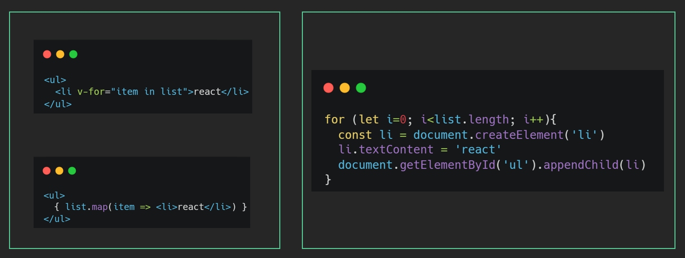
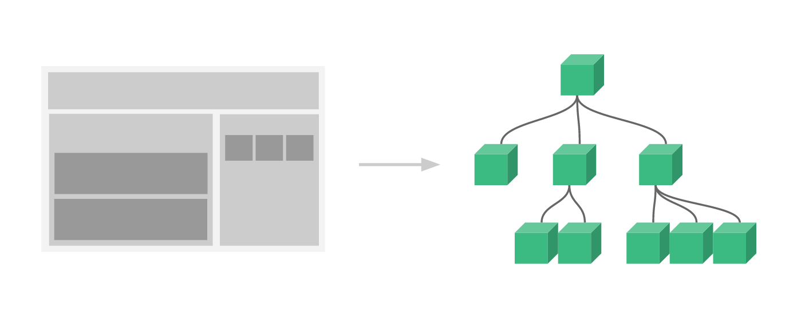

# React 介绍

`目标任务:`   了解什么是 React 以及它的特点

## **React 是什么**

一个专注于构建用户界面的 JavaScript 库，和 vue 和 angular 并称前端三大框架，不夸张的说，react 引领了很多新思想，世界范围内是最流行的 js 前端框架，最新版本已经到了 18，加入了许多很棒的新特性

React 英文文档（<https://reactjs.org/）>

React 中文文档 （<https://zh-hans.reactjs.org/）>

React 新文档（<https://beta.reactjs.org/）（开发中....）>

## **React 有什么特点**

1- 声明式 UI（JSX）

写 UI 就和写普通的 HTML 一样，抛弃命令式的繁琐实现

\

2- 组件化

组件是 react 中最重要的内容，组件可以通过搭积木的方式拼成一个完整的页面，通过组件的抽象可以增加复用能力和提高可维护性

3- 跨平台

react 既可以开发 web 应用也可以使用同样的语法开发原生应用（react-native），比如安卓和 ios 应用，甚至可以使用 react 开发 VR 应用，想象力空间十足，react 更像是一个 `元框架`   为各种领域赋能
