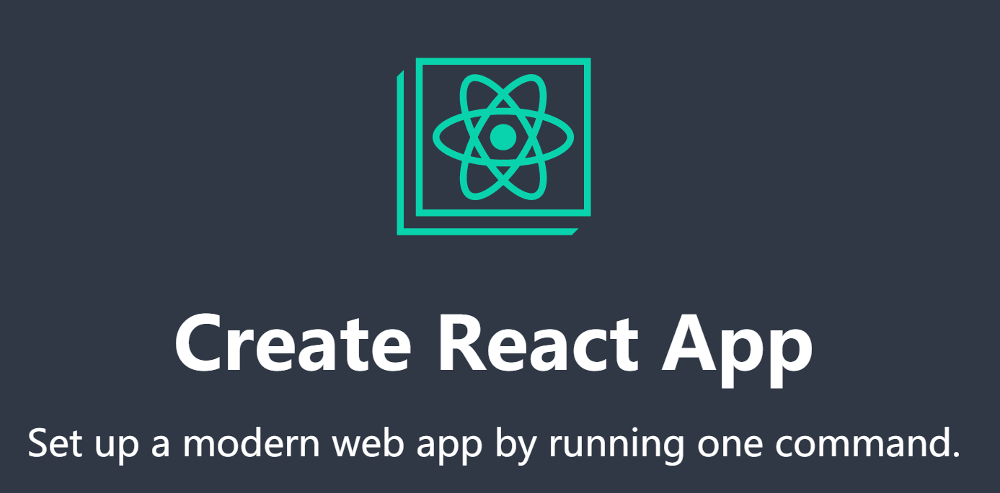

# 环境初始化

`目标任务:`   能够独立使用 React 脚手架创建一个 react 项目

## 使用脚手架创建项目



- 打开命令行窗口
- 执行命令

```bash
$ npx create-react-app react-basic
```

说明：

1.  npx create-react-app 是固定命令，`create-react-app`是 React 脚手架的名称
2.  react-basic 表示项目名称，可以自定义，保持语义化
3.  npx 命令会帮助我们临时安装 create-react-app 包，然后初始化项目完成之后会自自动删掉，所以不需要全局安装 create-react-app

- 启动项目

```bash
$ yarn start
or
$ npm start
```

## 项目目录说明调整

- 目录说明

1.  `src` 目录是我们写代码进行项目开发的目录
2.  `package.json`   中俩个核心库：react 、react-dom

- 目录调整

1.  删除 src 目录下自带的所有文件，只保留 app.js 根组件和 index.js
2.  创建 index.js 文件作为项目的入口文件，在这个文件中书写 react 代码即可

- 入口文件说明

```jsx
import React from "react";
import ReactDOM from "react-dom";
import "./index.css";
// 引入根组件App
import App from "./App";
// 通过调用ReactDOM的render方法渲染App根组件到id为root的dom节点上
ReactDOM.render(
  <React.StrictMode>
    <App />
  </React.StrictMode>,
  document.getElementById("root")
);
```
