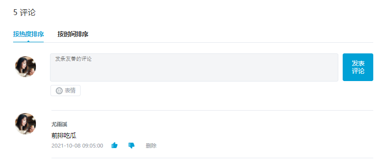

# React 组件基础

## 组件概念


> 分为组件可以提高可维护性和复用性

## 函数组件

`目标任务:`   能够独立使用函数完成 react 组件的创建和渲染

**概念**

使用 JS 的函数（或箭头函数）创建的组件，就叫做`函数组件`

**组件定义与渲染**

```jsx
// 定义函数组件
function HelloFn() {
  return <div>这是我的第一个函数组件!</div>;
}

// 定义类组件
function App() {
  return (
    <div className="App">
      {/* 渲染函数组件 */}
      <HelloFn />
      <HelloFn></HelloFn>
    </div>
  );
}
export default App;
```

**约定说明**

1.  组件的名称**必须首字母大写**，react 内部会根据这个来判断是组件还是普通的 HTML 标签
2.  函数组件**必须有返回值**，表示该组件的 UI 结构；如果不需要渲染任何内容，则返回 null
3.  组件就像 HTML 标签一样可以被渲染到页面中。组件表示的是一段结构内容，对于函数组件来说，渲染的内容是函数的**返回值**就是对应的内容
4.  使用函数名称作为组件标签名称，可以成对出现也可以自闭合

## 类组件

`目标任务:`   能够独立完成类组件的创建和渲染

使用 ES6 的 class 创建的组件，叫做类（class）组件

**组件定义与渲染**

```jsx
// 引入React
import React from "react";

// 定义类组件
class HelloC extends React.Component {
  render() {
    return <div>这是我的第一个类组件!</div>;
  }
}

function App() {
  return (
    <div className="App">
      {/* 渲染类组件 */}
      <HelloC />
      <HelloC></HelloC>
    </div>
  );
}
export default App;
```

**约定说明**

1.  **类名称也必须以大写字母开头**
2.  类组件应该继承 React.Component 父类，从而使用父类中提供的方法或属性
3.  类组件必须提供 render 方法**render 方法必须有返回值，表示该组件的 UI 结构**

## 函数组件的事件绑定

`目标任务:`   能够独立绑定任何事件并能获取到事件对象 e

### 1. 如何绑定事件

- 语法\
  on + 事件名称 = { 事件处理程序 } ，比如：`<div onClick={()=>{}}></div>`
- 注意点\
  react 事件采用驼峰命名法，比如：onMouseEnter、onFocus
- 样例

```jsx
// 函数组件
function HelloFn() {
  // 定义事件回调函数
  const clickHandler = () => {
    console.log("事件被触发了");
  };
  return (
    // 绑定事件
    <button onClick={clickHandler}>click me!</button>
  );
}
```

### 2. 获取事件对象

获取事件对象 e 只需要在 事件的回调函数中 补充一个形参 e 即可拿到

```jsx
// 函数组件
function HelloFn() {
  // 定义事件回调函数
  const clickHandler = (e) => {
    console.log("事件被触发了", e);
  };
  return (
    // 绑定事件
    <button onClick={clickHandler}>click me!</button>
  );
}
```

### 3. 传递额外参数

解决思路: 改造事件绑定为箭头函数 在箭头函数中完成参数的传递

```jsx
import React from "react"

// 如何获取额外的参数？
// onClick={ onDel } -> onClick={ () => onDel(id) }
// 注意: 一定不要在模板中写出函数调用的代码 onClick = { onDel(id) }  bad!!!!!!

const TestComponent = () => {
  const list = [
    {
      id: 1001,
      name: 'react'
    },
    {
      id: 1002,
      name: 'vue'
    }
  ]
  const onDel = (e, id) => {
    console.log(e, id)
  }
  return (
      <ul>
        {list.map(item =>（
           <li key={item.id}>
                {item.name}
                <button onClick={(e) => onDel(e, item.id)}>x</button>
           </li>
        ))}
      </ul>
  )
}

function App () {
  return (
    <div>
      <TestComponent />
    </div>
  )
}


export default App
```

## 类组件的事件绑定

类组件中的事件绑定，整体的方式和函数组件差别不大

唯一需要注意的 因为处于 class 类语境下 所以定义事件回调函数以及定它写法上有不同

1.  定义的时候: class Fields 语法

2\. 使用的时候: 需要借助 this 关键词获取

```jsx
import React from "react";
class CComponent extends React.Component {
  // class Fields
  clickHandler = (e, num) => {
    // 这里的this指向的是正确的当前的组件实例对象
    // 可以非常方便的通过this关键词拿到组件实例身上的其他属性或者方法
    console.log(this);
  };

  clickHandler1() {
    // 这里的this 不指向当前的组件实例对象而指向undefined 存在this丢失问题
    console.log(this);
  }

  render() {
    return (
      <div>
        <button onClick={(e) => this.clickHandler(e, "123")}>click me</button>
        <button onClick={this.clickHandler1}>click me</button>
      </div>
    );
  }
}

function App() {
  return (
    <div>
      <CComponent />
    </div>
  );
}

export default App;
```

## 组件状态

`目标任务:`   能够为组件添加状态和修改状态的值

一个前提：在 React hook 出来之前，函数式组件是没有自己的状态的，所以我们统一通过类组件来讲解


### 1. 初始化状态

- 通过 class 的实例属性 state 来初始化
- state 的值是一个对象结构，表示一个组件可以有多个数据状态

```jsx
class Counter extends React.Component {
  // 初始化状态
  state = {
    count: 0,
  };
  render() {
    return <button>计数器</button>;
  }
}
```

### 2. 读取状态

- 通过 this.state 来获取状态

```jsx
class Counter extends React.Component {
  // 初始化状态
  state = {
    count: 0,
  };
  render() {
    // 读取状态
    return <button>计数器{this.state.count}</button>;
  }
}
```

### 3. 修改状态

- 语法\
  `this.setState({ 要修改的部分数据 })`
- setState 方法作用

1.  修改 state 中的数据状态
2.  更新 UI(会从新触发 render 函数)

- 思想\
  &#x20;数据驱动视图，也就是只要修改数据状态，那么页面就会自动刷新，无需手动操作 dom
- 注意事项\
  &#x20;**不要直接修改 state 中的值，必须通过 setState 方法进行修改**

```jsx
class Counter extends React.Component {
  // 定义数据
  state = {
    count: 0,
  };
  // 定义修改数据的方法
  setCount = () => {
    this.setState({
      count: this.state.count + 1,
    });
  };
  // 使用数据 并绑定事件
  render() {
    return <button onClick={this.setCount}>{this.state.count}</button>;
  }
}
```

## this 问题说明


```jsx
class Counter extends React.Component {
  // 定义修改数据的方法
  setCount() {
    console.log(this); //这时候this指向undefined
  }
  // 使用数据 并绑定事件
  render() {
    return <button onClick={this.setCount}>click</button>;
  }
}
```

```jsx
class Counter extends React.Component {
  constructor() {
    super();
    this.setCount = this.setCount.bind(this); //使用bind强行修正this
  }
  // 定义修改数据的方法
  setCount() {
    console.log(this); //这时候this指向类，可以正常使用
  }
  // 使用数据 并绑定事件
  render() {
    return <button onClick={this.setCount}>click</button>;
  }
}
```

```jsx
class Counter extends React.Component {
  // 定义修改数据的方法
  setCount() {
    console.log(this); //这时候this指向类，可以正常使用
  }
  // 使用数据 并绑定事件
  render() {
    return <button onClick={() => this.setCount()}>click</button>; //通过箭头函数绑定this
  }
}
```

最推荐的还是下面写法：

```jsx
class Counter extends React.Component {
  // 定义修改数据的方法
  setCount = () => {
    console.log(this); //这时候this指向类，可以正常使用
  };
  // 使用数据 并绑定事件
  render() {
    return <button onClick={this.setCount}>click</button>; //通过箭头函数绑定this
  }
}
```

这里我们作为了解内容，随着 js 标准的发展，主流的写法已经变成了 class fields，无需考虑太多 this 问题

## React 的状态不可变

`目标任务:`   能够理解不可变的意义并且知道在实际开发中如何修改状态

**概念**：不要直接修改状态的值，而是基于当前状态创建新的状态值

**1. 错误的直接修改**

```javascript
state = {
  count: 0,
  list: [1, 2, 3],
  person: {
    name: "jack",
    age: 18,
  },
};
// 直接修改简单类型Number
this.state.count++;
++this.state.count;
this.state.count += 1;
this.state.count = 1;

// 直接修改数组
this.state.list.push(123);
this.state.list.spice(1, 1);

// 直接修改对象
this.state.person.name = "rose";
```

**2. 基于当前状态创建新值**

```javascript
this.setState({
    count: this.state.count + 1
    list: [...this.state.list, 4],
    person: {
       ...this.state.person,
       // 覆盖原来的属性 就可以达到修改对象中属性的目的
       name: 'rose'
    }
})
```

## 表单处理

`目标任务:`   能够使用受控组件的方式获取文本框的值

使用 React 处理表单元素，一般有俩种方式：

1.  受控组件 （推荐使用）
2.  非受控组件 （了解）

### 1. 受控表单组件

什么是受控组件？  `input框自己的状态被React组件状态控制`

React 组件的状态的地方是在 state 中，input 表单元素也有自己的状态是在 value 中，React 将 state 与表单元素的值（value）绑定到一起，由 state 的值来控制表单元素的值，从而保证单一数据源特性

**实现步骤**

以获取文本框的值为例，受控组件的使用步骤如下：

1.  在组件的 state 中声明一个组件的状态数据
2.  将状态数据设置为 input 标签元素的 value 属性的值
3.  为 input 添加 change 事件，在事件处理程序中，通过事件对象 e 获取到当前文本框的值（`即用户当前输入的值`）
4.  调用 setState 方法，将文本框的值作为 state 状态的最新值

**代码落地**

```jsx
import React from "react";

class InputComponent extends React.Component {
  // 声明组件状态
  state = {
    message: "this is message",
  };
  // 声明事件回调函数
  changeHandler = (e) => {
    this.setState({ message: e.target.value });
  };
  render() {
    return (
      <div>
        {/* 绑定value 绑定事件*/}
        <input value={this.state.message} onChange={this.changeHandler} />
      </div>
    );
  }
}

function App() {
  return (
    <div className="App">
      <InputComponent />
    </div>
  );
}
export default App;
```

### 2. 非受控表单组件

什么是非受控组件？

非受控组件就是通过手动操作 dom 的方式获取文本框的值，文本框的状态不受 react 组件的 state 中的状态控制，直接通过原生 dom 获取输入框的值

**实现步骤**

1.  导入`createRef` 函数
2.  调用 createRef 函数，创建一个 ref 对象，存储到名为`msgRef`的实例属性中
3.  为 input 添加 ref 属性，值为`msgRef`
4.  在按钮的事件处理程序中，通过`msgRef.current`即可拿到 input 对应的 dom 元素，而其中`msgRef.current.value`拿到的就是文本框的值

**代码落地**

```jsx
import React, { createRef } from "react";

class InputComponent extends React.Component {
  // 使用createRef产生一个存放dom的对象容器
  msgRef = createRef();

  changeHandler = () => {
    console.log(this.msgRef.current.value);
  };

  render() {
    return (
      <div>
        {/* ref绑定 获取真实dom */}
        <input ref={this.msgRef} />
        <button onClick={this.changeHandler}>click</button>
      </div>
    );
  }
}

function App() {
  return (
    <div className="App">
      <InputComponent />
    </div>
  );
}
export default App;
```

## 阶段小练习



**练习说明**

1.  拉取项目模板到本地，安装依赖，run 起来项目\
    <https://gitee.com/react-course-series/react-component-demo>
2.  完成 tab 点击切换激活状态交互
3.  完成发表评论功能\
    注意：生成独立无二的 id 可以使用  uuid 包  `yarn add uuid`

```javascript
import { v4 as uuid } from "uuid";
uuid(); // 得到一个独一无二的id
```

1.  完成删除评论功能
