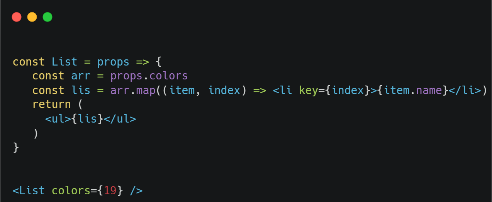
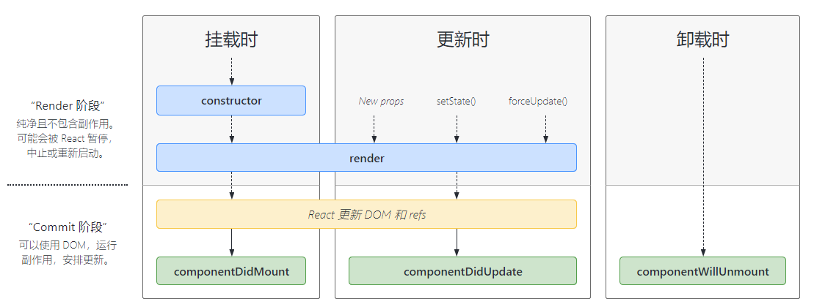
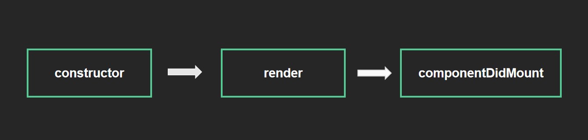

# React 组件进阶

## children 属性

`目标任务:`   掌握 props 中 children 属性的用法

**children 属性是什么**

表示该组件的子节点，只要组件内部有子节点，props 中就有该属性

**children 可以是什么**

1.  普通文本
2.  普通标签元素
3.  函数 / 对象
4.  JSX

## props 校验-场景和使用

`目标任务:`   掌握组件 props 的校验写法，增加组件的健壮性

对于组件来说，props 是由外部传入的，我们其实无法保证组件使用者传入了什么格式的数据，如果传入的数据格式不对，就有可能会导致组件内部错误，有一个点很关键 - **组件的使用者可能报错了也不知道为什么**，看下面的例子



面对这样的问题，如何解决？ **props 校验**

**实现步骤**

1.  安装属性校验包：`yarn add prop-types`
2.  导入`prop-types` 包
3.  使用 `组件名.propTypes = {}` 给组件添加校验规则

**核心代码**

```jsx
import PropTypes from "prop-types";

const List = (props) => {
  const arr = props.colors;
  const lis = arr.map((item, index) => <li key={index}>{item.name}</li>);
  return <ul>{lis}</ul>;
};

List.propTypes = {
  colors: PropTypes.array,
};
```

## props 校验-规则说明

`目标任务:`   掌握 props 常见的规则

**四种常见结构**

1.  常见类型：array、bool、func、number、object、string
2.  React 元素类型：element
3.  必填项：isRequired
4.  特定的结构对象：shape({})

**核心代码**

```javascript
// 常见类型
optionalFunc: PropTypes.func,
// 必填 只需要在类型后面串联一个isRequired
requiredFunc: PropTypes.func.isRequired,
// 特定结构的对象
optionalObjectWithShape: PropTypes.shape({
	color: PropTypes.string,
	fontSize: PropTypes.number
})
```

官网文档更多阅读：<https://reactjs.org/docs/typechecking-with-proptypes.html>

## props 校验-默认值

`目标任务:`   掌握如何给组件的 props 提供默认值

通过 `defaultProps` 可以给组件的 props 设置默认值，在未传入 props 的时候生效

### 1. 函数组件

直接使用函数参数默认值

```jsx
function List({ pageSize = 10 }) {
  return <div>此处展示props的默认值：{pageSize}</div>;
}

// 不传入pageSize属性
<List />;
```

### 2. 类组件

使用类静态属性声明默认值，`static defaultProps = {}`

```jsx
class List extends Component {
  static defaultProps = {
    pageSize: 10,
  };
  render() {
    return <div>此处展示props的默认值：{this.props.pageSize}</div>;
  }
}
<List />;
```

## 生命周期 - 概述

`目标任务:`   能够说出组件生命周期一共几个阶段

组件的生命周期是指组件从被创建到挂载到页面中运行起来，再到组件不用时卸载的过程，注意，只有类组件才有生命周期（类组件 实例化   函数组件 不需要实例化）



<http://projects.wojtekmaj.pl/react-lifecycle-methods-diagram/>

## 生命周期 - 挂载阶段

`目标任务:`   能够说出在组件挂载阶段执行的钩子函数和执行时机



| 钩子 函数         | 触发时机                                              | 作用                                                           |
| :---------------- | :---------------------------------------------------- | :------------------------------------------------------------- |
| constructor       | 创建组件时，最先执行，初始化的时候只执行一次          | 1. 初始化 state  2. 创建 Ref 3. 使用 bind 解决 this 指向问题等 |
| render            | 每次组件渲染都会触发                                  | 渲染 UI（**注意： 不能在里面调用 setState()** ）               |
| componentDidMount | 组件挂载（完成 DOM 渲染）后执行，初始化的时候执行一次 | 1. 发送网络请求   2.DOM 操作                                   |

## 生命周期 - 更新阶段

`目标任务:`   能够说出组件的更新阶段的钩子函数以及执行时机


| 钩子函数           | 触发时机                   | 作用                                                             |
| :----------------- | :------------------------- | :--------------------------------------------------------------- |
| render             | 每次组件渲染都会触发       | 渲染 UI（与 挂载阶段 是同一个 render）                           |
| componentDidUpdate | 组件更新后（DOM 渲染完毕） | DOM 操作，可以获取到更新后的 DOM 内容，**不要直接调用 setState** |

## 生命周期 - 卸载阶段

`目标任务:`   能够说出组件的销毁阶段的钩子函数以及执行时机

| 钩子函数             | 触发时机                 | 作用                               |
| :------------------- | :----------------------- | :--------------------------------- |
| componentWillUnmount | 组件卸载（从页面中消失） | 执行清理工作（比如：清理定时器等） |

## 阶段小练习 - todoMVC

案例仓库地址：<https://gitee.com/react-course-series/react-todo-mvc>

1- 克隆项目到本地

```bash
$ git clone  https://gitee.com/react-course-series/react-todo-mvc.git
```

2- 安装必要依赖

```bash
$ yarn
```

3- 开启 mock 接口服务，**保持窗口不关闭**  ！！！！！

```bash
# 启动mock服务
$ yarn mock-serve
```

**4- 另起一个 bash 窗口**开启前端服务

```bash
$ yarn start
```

5- 切换到 todo-test 分支

```bash
$ git checkout todo-test
```

**接口文档**

| 接口作用 | 接口地址                                                                          | 接口方法 | 接口参数                 |
| :------- | :-------------------------------------------------------------------------------- | :------- | :----------------------- |
| 获取列表 | <http://localhost:3001/data>                                                      | GET      | 无                       |
| 删除     | <http://localhost:3001/data/:id>                                                  | DELETE   | id                       |
| 搜索     | [http://localhost:3001/data/?name=keyword](http://localhost:3001/data/?q=keyword) | GET      | name（以 name 字段搜索） |

**实现功能**

| 功能         | 核心思路                               |
| :----------- | :------------------------------------- |
| 表格数据渲染 | 组件使用                               |
| 删除功能     | 获取当前 id   调用接口                 |
| 搜索功能     | 用的依旧是列表接口，多传一个 name 参数 |
| 清除搜索功能 | 清空搜索参数   重新获取列表            |
