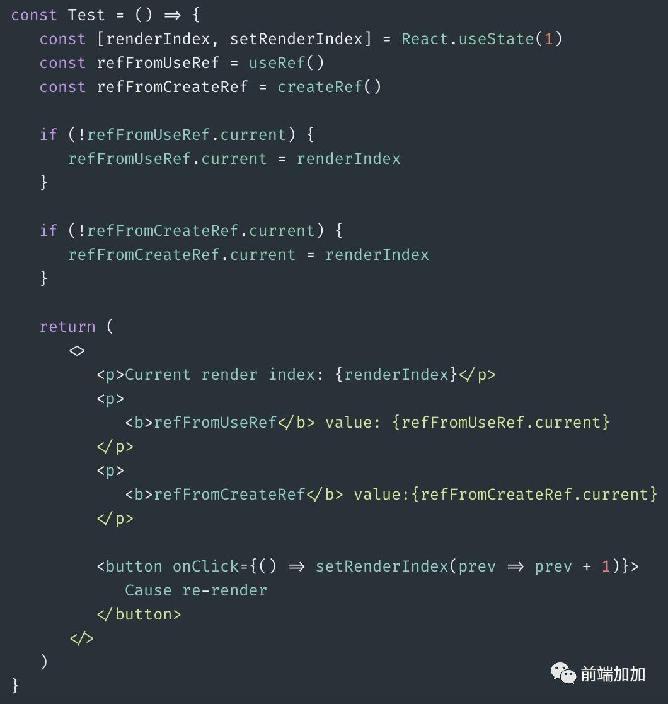
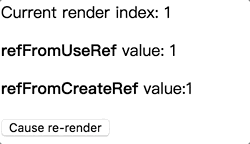

# Hooks 进阶

## useState - 回调函数的参数

`本节任务:`   能够理解 useState 回调函数作为参数的使用场景

**使用场景**

参数只会在组件的初始渲染中起作用，后续渲染时会被忽略。如果初始 state 需要通过计算才能获得，则可以传入一个函数，在函数中计算并返回初始的 state，此函数只在初始渲染时被调用

**语法**

```jsx
const [name, setName] = useState(() => {
  // 编写计算逻辑    return '计算之后的初始值'
});
```

**语法规则**

1.  回调函数 return 出去的值将作为 `name` 的初始值
2.  回调函数中的逻辑只会在组件初始化的时候执行一次

**语法选择**

1.  如果就是初始化一个普通的数据 直接使用 `useState(普通数据)` 即可
2.  如果要初始化的数据无法直接得到需要通过计算才能获取到，使用`useState(()=>{})`

**来个需求**

```jsx
import { useState } from "react";

function Counter(props) {
  const [count, setCount] = useState(() => {
    return props.count;
  });
  return (
    <div>
      <button onClick={() => setCount(count + 1)}>{count}</button>
    </div>
  );
}

function App() {
  return (
    <>
      <Counter count={10} />
      <Counter count={20} />
    </>
  );
}

export default App;
```

## useEffect - 发送网络请求

`本节任务:`   能够掌握使用 useEffect hook 发送网络请求

**使用场景**

如何在 useEffect 中发送网络请求，并且封装同步 async await 操作

**语法要求**

不可以直接在 useEffect 的回调函数外层直接包裹 await ，因为**异步会导致清理函数无法立即返回**

**错误写法**

```javascript
useEffect(async () => {
  const res = await axios.get("http://geek.itheima.net/v1_0/channels");
  console.log(res);
}, []);
```

**正确写法**

在内部单独定义一个函数，然后把这个函数包装成同步

```jsx
useEffect(()=>{
    async function fetchData(){
       const res = await axios.get('http://geek.itheima.net/v1_0/channels')                            console.log(res)
    }
},[])
```

## useRef

`本节任务:`   能够掌握使用 useRef 获取真实 dom 或组件实例的方法

**使用场景**

在函数组件中获取真实的 dom 元素对象或者是组件对象

**使用步骤**

1.  导入 `useRef` 函数
2.  执行 `useRef` 函数并传入 null，返回值为一个对象 内部有一个 current 属性存放拿到的 dom 对象（组件实例）
3.  通过 ref 绑定 要获取的元素或者组件

**获取 dom**

```jsx
import { useEffect, useRef } from "react";
function App() {
  const h1Ref = useRef(null);
  useEffect(() => {
    console.log(h1Ref);
  }, []);
  return (
    <div>
      <h1 ref={h1Ref}>this is h1</h1>
    </div>
  );
}
export default App;
```

**获取组件实例**

函数组件由于没有实例，不能使用 ref 获取，如果想获取组件实例，必须是类组件

```jsx
class Foo extends React.Component {
  sayHi = () => {
    console.log("say hi");
  };
  render() {
    return <div>Foo</div>;
  }
}

export default Foo;
```

```jsx
import { useEffect, useRef } from "react";
import Foo from "./Foo";
function App() {
  const h1Foo = useRef(null);
  useEffect(() => {
    console.log(h1Foo);
  }, []);
  return (
    <div>
      {" "}
      <Foo ref={h1Foo} />
    </div>
  );
}
export default App;
```

> useRef 在 react hook 中的作用, 正如官网说的, 它像一个变量, 类似于 this , 它就像一个盒子, 你可以存放任何东西. createRef 每次渲染都会返回一个新的引用，而 useRef 每次都会返回相同的引用。
> 

> 

## useContext

`本节任务:`   能够掌握 hooks 下的 context 使用方式

**实现步骤**

1.  使用`createContext` 创建 Context 对象
2.  在顶层组件通过`Provider` 提供数据
3.  在底层组件通过`useContext`函数获取数据

**代码实现**

```jsx
import { createContext, useContext } from "react";
// 创建Context对象
const Context = createContext();

function Foo() {
  return (
    <div>
      Foo <Bar />
    </div>
  );
}

function Bar() {
  // 底层组件通过useContext函数获取数据
  const name = useContext(Context);
  return <div>Bar {name}</div>;
}

function App() {
  return (
    // 顶层组件通过Provider 提供数据
    <Context.Provider value={"this is name"}>
      <div>
        <Foo />
      </div>
    </Context.Provider>
  );
}

export default App;
```

## 阶段小练习-todoMvc-hook 版

案例仓库地址：<https://gitee.com/react-course-series/react-tomvc-hook>

1.  克隆项目到本地

```bash
$ git clone  https://gitee.com/react-course-series/react-tomvc-hook.git
```

1.  安装必要依赖

```bash
$ yarn
```

1.  开启 mock 接口服务，**保持窗口不关闭**  ！！！！！

```bash
# 启动mock服务
$ yarn mock-serve
```

1.  **另起一个 bash 窗口**开启前端服务

```bash
$ yarn start
```

1.  浏览器输入 localhost:3000 演示效果

**项目开发步骤：**

1.  切换到 todo-test 分支

```bash
$ git checkout todo-test
```

1.  打开 app.js\
    已有基础样板代码，在这个基础上编写业务逻辑即可
2.  接口文档

| 接口作用 | 接口地址                                                                          | 接口方法 | 接口参数                 |
| :------- | :-------------------------------------------------------------------------------- | :------- | :----------------------- |
| 获取列表 | <http://localhost:3001/data>                                                      | GET      | 无                       |
| 删除     | <http://localhost:3001/data/:id>                                                  | DELETE   | id                       |
| 搜索     | [http://localhost:3001/data/?name=keyword](http://localhost:3001/data/?q=keyword) | GET      | name（以 name 字段搜索） |

实现功能

| 功能         | 核心思路                               |
| :----------- | :------------------------------------- |
| 表格数据渲染 | elementPlus el-table 组件使用          |
| 删除功能     | 获取当前 id   调用接口                 |
| 搜索功能     | 用的依旧是列表接口，多传一个 name 参数 |
| 清除搜索功能 | 清空搜索参数   重新获取列表            |
