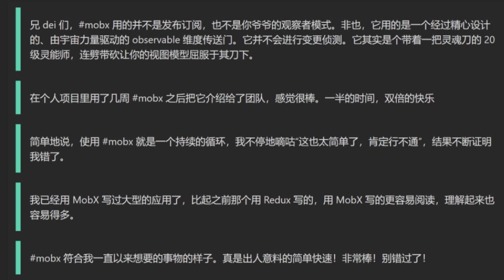
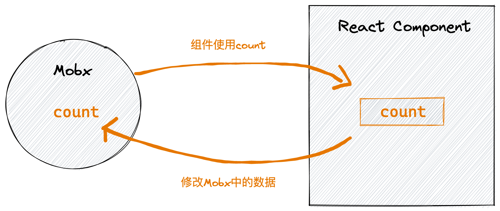
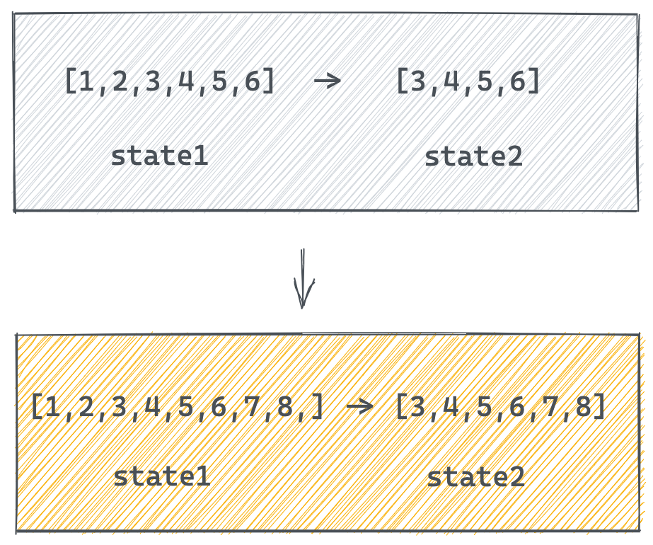
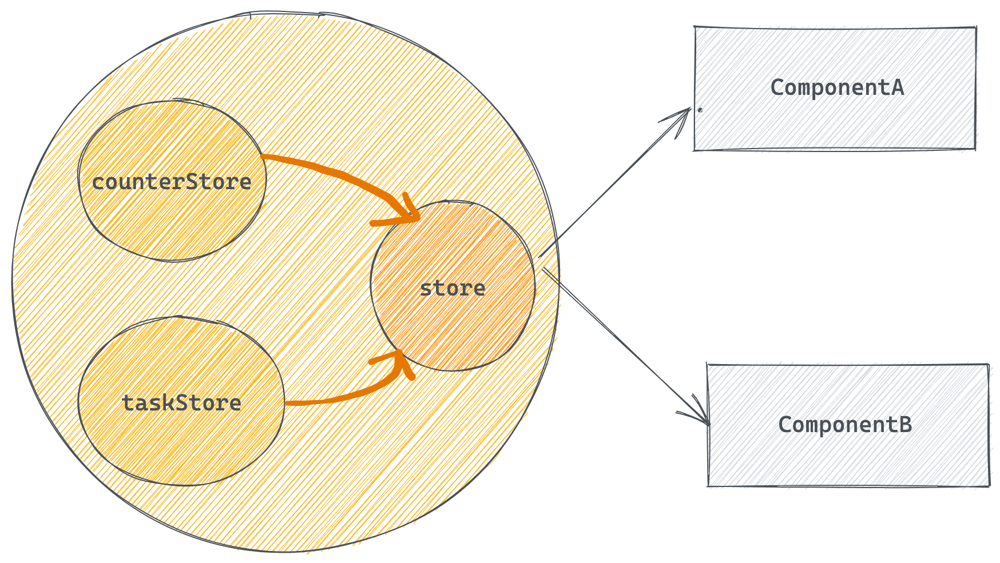
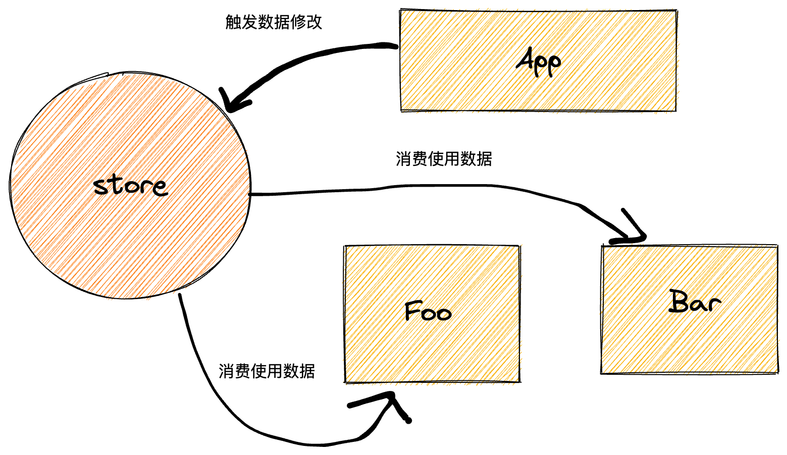
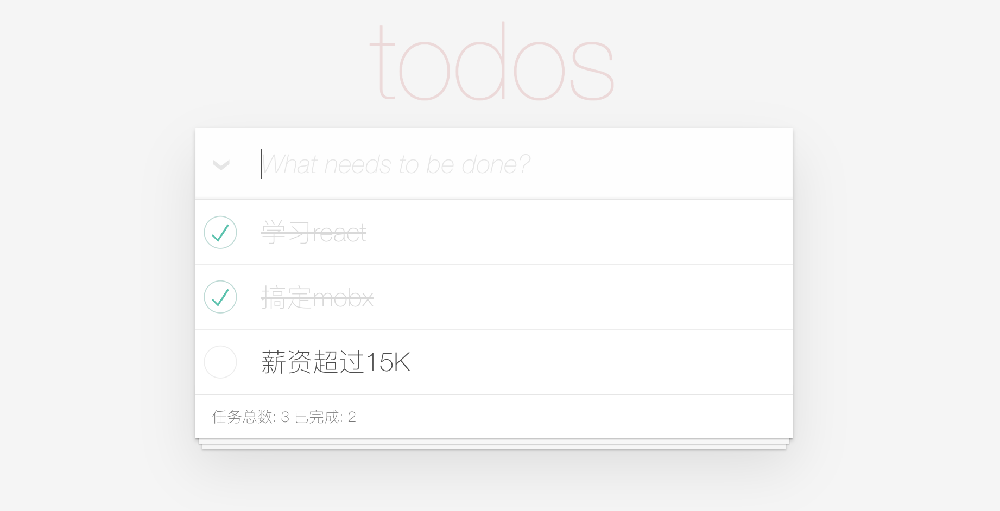
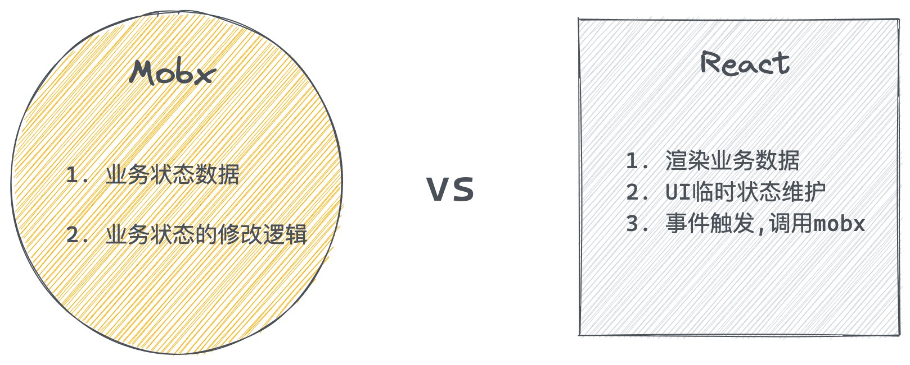

# Mobx

# 1. Mobx 介绍

一个可以和 React 良好配合的集中状态管理工具，和 Redux 解决的问题相似，都可以独立组件进行集中状态管理


## 优势

1.  简单

编写无模板的极简代码精准描述你的意图

1.  轻松实现最优渲染

依赖自动追踪，实现最小渲染优化

1.  架构自由

可移植, 可测试 无特殊心智负担

## 社区评价



# 2. 配置开发环境

Mobx 是一个独立的响应式的库，可以独立于任何 UI 框架存在，但是通常大家习惯把它和 React 进行绑定使用，用 Mobx 来做响应式数据建模，React 作为 UI 视图框架渲染内容，我们环境的配置需要三个部分

1.  一个 create-react-app 创建好的 React 项目环境
2.  mobx 框架本身
3.  一个用来链接 mobx 和 React 的中间件

```bash
# 创建项目
$ yarn create vite react-mobx --template react

# 安装mobx和中间件工具 mobx-react-lite  只能函数组件中使用
$ yarn add  mobx  mobx-react-lite
```

# 3. 基础使用

需求: 使用 mobx 实现一个计数器的案例



## 1. 初始化 mobx

初始化步骤

1.  定义数据状态**state**
2.  在构造器中实现数据响应式处理 **makeAutoObservble**
3.  定义修改数据的函数**action**
4.  实例化 store 并导出

```javascript
import { makeAutoObservable } from "mobx";

class CounterStore {
  count = 0; // 定义数据
  constructor() {
    makeAutoObservable(this); // 响应式处理
  }
  // 定义修改数据的方法
  addCount = () => {
    this.count++;
  };
}

const counter = new CounterStore();
export default counter;
```

## 2. React 使用 store

实现步骤

1.  在组件中导入 counterStore 实例对象
2.  在组件中使用 storeStore 实例对象中的数据
3.  通过事件调用修改数据的方法修改 store 中的数据
4.  让组件响应数据变化

```jsx
// 导入counterStore
import counterStore from "./store";
// 导入observer方法
import { observer } from "mobx-react-lite";
function App() {
  return (
    <div className="App">
      <button onClick={() => counterStore.addCount()}>
        {counterStore.count}
      </button>
    </div>
  );
}
// 包裹组件让视图响应数据变化
export default observer(App);
```

# 4. 计算属性（衍生状态）

概念: 有一些状态根据现有的状态计算（衍生）得到，我们把这种状态叫做计算属性, 看下面的例子



实现步骤

1.  生命一个存在的数据
2.  通过 get 关键词 定义计算属性
3.  在 makeAutoObservable 方法中标记计算属性

```javascript
import { computed, makeAutoObservable } from "mobx";

class CounterStore {
  list = [1, 2, 3, 4, 5, 6];
  constructor() {
    makeAutoObservable(this, {
      filterList: computed,
    });
  }
  // 修改原数组
  changeList = () => {
    this.list.push(7, 8, 9);
  };
  // 定义计算属性
  get filterList() {
    return this.list.filter((item) => item > 4);
  }
}

const counter = new CounterStore();

export default counter;
```

```jsx
// 导入counterStore
import counterStore from "./store";
// 导入observer方法
import { observer } from "mobx-react-lite";
function App() {
  return (
    <div className="App">
      {/* 原数组 */}
      {JSON.stringify(counterStore.list)}
      {/* 计算属性 */}
      {JSON.stringify(counterStore.filterList)}
      <button onClick={() => counterStore.changeList()}>change list</button>
    </div>
  );
}
// 包裹组件让视图响应数据变化
export default observer(App);
```

# 5. 异步数据处理

测试接口: [http://geek.itheima.net/v1_0/channels](http://geek.itheima.net/v1_0/channels')

实现步骤:

1.  在 mobx 中编写异步请求方法 获取数据 存入 state 中
2.  组件中通过 useEffect + 空依赖 触发 action 函数的执行

```javascript
// 异步的获取

import { makeAutoObservable } from "mobx";
import axios from "axios";

class ChannelStore {
  channelList = [];
  constructor() {
    makeAutoObservable(this);
  }
  // 只要调用这个方法 就可以从后端拿到数据并且存入channelList
  setChannelList = async () => {
    const res = await axios.get("http://geek.itheima.net/v1_0/channels");
    this.channelList = res.data.data.channels;
  };
}
const channlStore = new ChannelStore();
export default channlStore;
```

```jsx
import { useEffect } from "react";
import { useStore } from "./store";
import { observer } from "mobx-react-lite";
function App() {
  const { channlStore } = useStore();
  // 1. 使用数据渲染组件
  // 2. 触发action函数发送异步请求
  useEffect(() => {
    channlStore.setChannelList();
  }, []);
  return (
    <ul>
      {channlStore.channelList.map((item) => (
        <li key={item.id}>{item.name}</li>
      ))}
    </ul>
  );
}
// 让组件可以响应数据的变化[也就是数据一变组件重新渲染]
export default observer(App);
```

# 6. 模块化

场景: 一个项目有很多的业务模块，我们不能把所有的代码都写到一起，这样不好维护，提了提供可维护性，需要引入模块化机制



**实现步骤**

1.  拆分模块 js 文件，每个模块中定义自己独立的 state/action
2.  在 store/index.js 中导入拆分之后的模块，进行模块组合
3.  利用 React 的 context 的机制导出统一的 useStore 方法，给业务组件使用

1- 定义 task 模块

```javascript
import { makeAutoObservable } from "mobx";

class TaskStore {
  taskList = [];
  constructor() {
    makeAutoObservable(this);
  }
  addTask() {
    this.taskList.push("vue", "react");
  }
}

const task = new TaskStore();

export default task;
```

2- 定义 counterStore

```javascript
import { makeAutoObservable } from "mobx";

class CounterStore {
  count = 0;
  list = [1, 2, 3, 4, 5, 6];
  constructor() {
    makeAutoObservable(this);
  }
  addCount = () => {
    this.count++;
  };
  changeList = () => {
    this.list.push(7, 8, 9);
  };
  get filterList() {
    return this.list.filter((item) => item > 4);
  }
}

const counter = new CounterStore();

export default counter;
```

3- 组合模块导出统一方法

```javascript
import React from "react";

import counter from "./counterStore";
import task from "./taskStore";

class RootStore {
  constructor() {
    this.counterStore = counter;
    this.taskStore = task;
  }
}

const rootStore = new RootStore();

// context机制的数据查找链  Provider如果找不到 就找createContext方法执行时传入的参数
const context = React.createContext(rootStore);

const useStore = () => React.useContext(context);
// useStore() =>  rootStore  { counterStore, taskStore }

export { useStore };
```

4- 组件使用模块中的数据

```jsx
import { observer } from "mobx-react-lite";
// 导入方法
import { useStore } from "./store";
function App() {
  // 得到store
  const store = useStore();
  return (
    <div className="App">
      <button onClick={() => store.counterStore.addCount()}>
        {store.counterStore.count}
      </button>
    </div>
  );
}
// 包裹组件让视图响应数据变化
export default observer(App);
```

# 7. 多组件共享数据

目标：当数据发生变化 所有用到数据的组件都会得到同步的组件的更新

实现步骤：在 Foo 组件和 Bar 组件中分别使用 store 中的数据，然后在 app 组件中进行数据修改，查看 Foo 组件和 Bar 组件是否得到更新



```jsx
// 用taskStore中的taskList数据
import { useStore } from "./store";
import { observer } from "mobx-react-lite";
const Bar = () => {
  const { taskStore } = useStore();
  return (
    <ul>
      {taskStore.taskList.map((item) => (
        <li>{item}</li>
      ))}
    </ul>
  );
};

export default observer(Son);
```

```jsx
// 用taskStore中的taskList数据
import { useStore } from "./store";
import { observer } from "mobx-react-lite";
const Bar = () => {
  const { taskStore } = useStore();
  return (
    <ul>
      {taskStore.taskList.map((item) => (
        <li>{item}</li>
      ))}
    </ul>
  );
};

export default observer(Son);
```

```jsx
import Bar from "./Bar";
import Foo from "./Foo";
import { useStore } from "./store";
function App() {
  const { taskStore } = useStore();
  return (
    <div className="App">
      <Bar />
      <button onClick={() => taskStore.setTaskList("angular")}>
        修改taskStore
      </button>
    </div>
  );
}
export default App;
```

# 8. Todos 综合案例



## 1. 开发环境搭建

```bash
# 克隆模块到本地
$ git clone https://gitee.com/react-course-series/mobx_react.git

# 安装所有依赖
$ yarn

# master分支是一个静态的模板  在这个里面进行开发
# finished-mvc分支是一个写完的版本  供参考
```

## 2. Mobx 和 React 的职责划分



## 3. 列表渲染

```jsx
import './index.css'
import { useStore } from '../store'
function Task () {
  const { taskStore } = useStore()
  return (
    <section className="todoapp">
      <section className="main">
        {/* 省略 */}
        <ul className="todo-list">
          {/* 列表区域 */}
          {taskStore.list.map(item => (
            <li
              className="todo"
              key={item.id}
            >
              <div className="view">
                <input
                  className="toggle"
                  type="checkbox"
                 />
                <label >{item.name}</label>
                <button className="destroy"}></button>
              </div>
            </li>
          ))}

          {/* <li
            className="todo completed"
          >
            <div className="view">
              <input className="toggle" type="checkbox" defaultChecked={true} />
              <label >learn react</label>
              <button className="destroy"></button>
            </div>
          </li> */}
        </ul>
      </section>
      <footer className="footer">
        <span className="todo-count">
          任务总数: {10} 已完成: {1}
        </span>
      </footer>
    </section>
  )
}

export default observer(Task)
```

## 4. 单选实现

实现思路和步骤: 本质上是在实现双向绑定

1.  通过 store 中的数据状态 isDone 字段 绑定到 input 元素的 checked 属性上
2.  监听事件 调用 mobx 的对应方法 传入 id 找到要修改的项 把 isDone 字段取反操作

```jsx
import { makeAutoObservable } from "mobx";
class TaskStore {
  list = [
    {
      id: 1,
      name: "学习react",
      isDone: true,
    },
    {
      id: 2,
      name: "搞定mobx",
      isDone: false,
    },
  ];
  constructor() {
    makeAutoObservable(this);
  }
  // 进行单选修改数据的方法
  checkItem = (id) => {
    const item = this.list.find((item) => item.id === id);
    item.isDone = !item.isDone;
  };
}
export default TaskStore;
```

```jsx
const onChange = (id) => taskStore.checkItem(id)

<input
    className="toggle"
    type="checkbox"
    checked={item.isDone}
    onChange={() => onChange(item.id)}
/>
```

## 5. 删除功能

实现思路和步骤：

1.  在 mobx 中定义好删除数据的方法

2\. 点击删除 调用 mobx 提供的删除方法 传出 id 进行删除

```json
// 删除的方法
delItem = (id) => {
  this.list = this.list.filter(item => item.id !== id)
}
```

```jsx
// 删除操作
const onDel = (id) => taskStore.delItem(id)

<button className="destroy" onClick={() => onDel(item.id)}></button>
```

## 6. 全选功能

实现思路和步骤:

1.  实现数据驱动权限 UI 显示 通过计算属性 + every 方法
2.  实现点击权限 控制所有子项 change 事件拿到 e.target.checked 遍历 list 进行 isDone 赋值

```javascript
// 是否全选的计算属性
get isAll () {
  return this.list.every(item => item.isDone)
}

// 遍历修改所有item
allCheckItem = (checked) => {
  this.list.forEach(item => {
    item.isDone = checked
  })
}
```

```jsx
// 全选操作回调
const allChange = (e) => {
  // 通过事件对象e拿到当前是否选中的状态
  taskStore.allCheckItem(e.target.checked);
};

{
  /* 全选框 */
}
<input
  id="toggle-all"
  className="toggle-all"
  type="checkbox"
  checked={taskStore.isAll}
  onChange={allChange}
/>;
```

7\. 新增功能

实现思路和步骤:

1.  在 mobx 中编写新增方法的逻辑
2.  在组件中通过受控方式维护输入框中的数据
3.  在组件中监听 keyUp 方法 判断当前是否点击的是回车键 如果是 调用 mobx 的方法进行新增

```javascript
addItem = (item) => {
  this.list.push(item);
};
```

```javascript
// 受控方式维护输入框数据
const [keyword, setKeyword] = useState("");
const keywordChange = (e) => {
  setKeyword(e.target.value);
};

// 键盘抬起事件中 判断code码进行新增
const onKeyUp = (e) => {
  console.log(e);
  if (e.keyCode === 13) {
    taskStore.addItem({
      id: 3,
      name: keyword,
      isDone: false,
    });
    // 新增完毕置空
    setKeyword("");
  }
};

<input
  className="new-todo"
  autoFocus
  autoComplete="off"
  placeholder="What needs to be done?"
  value={keyword}
  onChange={keywordChange}
  onKeyUp={onKeyUp}
/>;
```
