# (一)环境搭建 ForMac

在学习`Flutter`之前，我们需要先安装`Flutter`的开发环境，那么我们就从环境的安装开始；

## 安装环境

本人是`Mac`电脑，所以此次演示`Mac`下`Flutter`的环境安装；

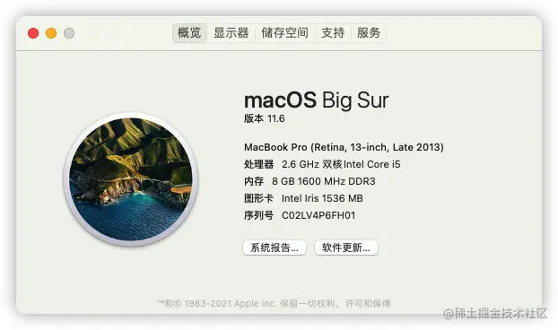

**电脑系统：macOS Big Sur 11.6**

**Flutter：2.5.1**

由于`Flutter`是`Google`开发的编程语言，所以无法只使用`Xcode`来进行开发，除了`Xcode`之外，我们还需要安装其他的开发工具，这里有两个常用的：`Android Studio`和`Visual Studio Code`；`Android Studio`集成了大量的插件，功能更强大，但是占用内存大，比较笨重，所以可以合理选择我们使用的开发工具；

## Flutter 安装

### SDK 下载

关于`Flutter`的安装流程，我们也可以直接参考[官方网站](https://link.juejin.cn?target=https%3A%2F%2Fflutter.dev%2F "https://flutter.dev/")，国内可以直接打开；


点击`Get started`进入`install`界面，我们选择需要下载的那个平台的：

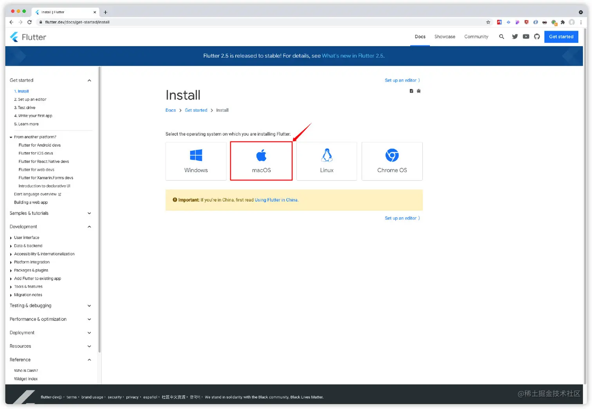

之后可以一步一步按照流程进行环境安装；

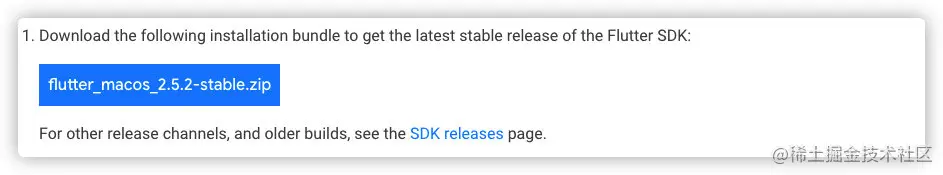

最新的版本为：`flutter_macos_2.5.2-stable.zip`，`stable`意为`稳定的`，当然，也可以下载指定版本[下载地址](https://link.juejin.cn?target=https%3A%2F%2Fflutter.dev%2Fdocs%2Fdevelopment%2Ftools%2Fsdk%2Freleases "https://flutter.dev/docs/development/tools/sdk/releases")

### SDK 解压缩

压缩包下载完成之后，就可以直接解压缩到某个路径下；

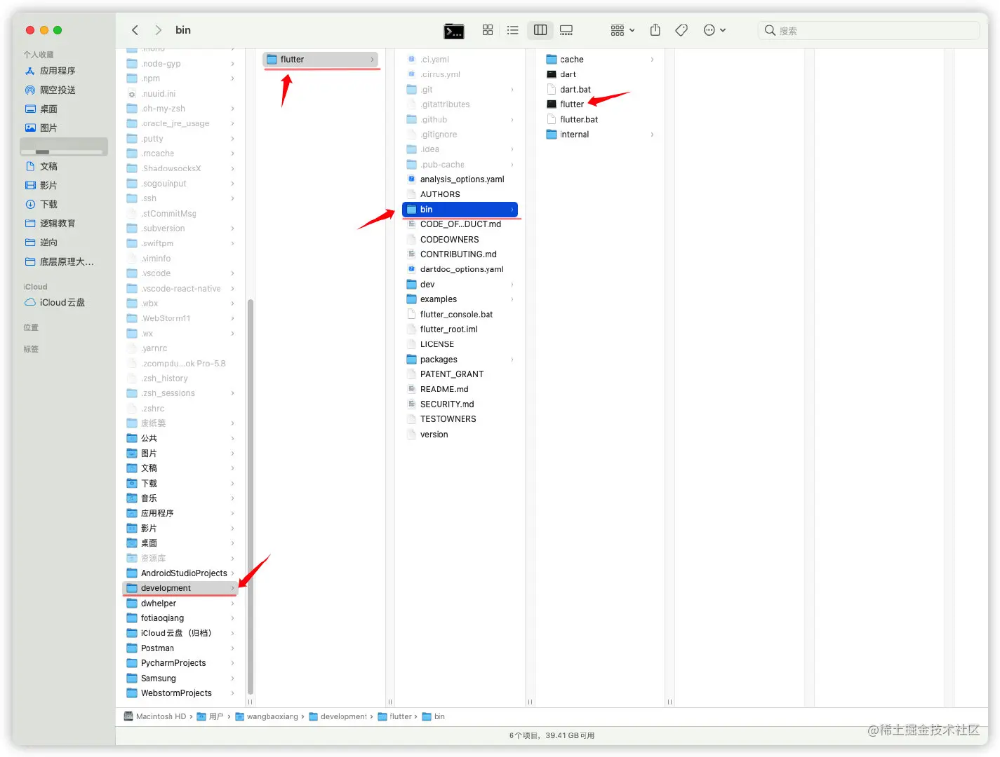

> 需要注意的是，将其解压缩到`opt`目录的话，可以多用户访问，但是`opt`目录有访问权限的问题，可能会造成一些困扰；

### 配置镜像文件

解压缩之后，因为我们需要用到`bin`目录下的命令，所以还需要配置`环境变量`；

因为`Flutter`在运行的时候，需要去官方下载一些所需要的资源，这个时候，我们就需要用到`科学工具`，但是`Flutter`比较友好，很人性的在官方直接给出了镜像：[入口](https://link.juejin.cn?target=https%3A%2F%2Fflutter.dev%2Fcommunity%2Fchina "https://flutter.dev/community/china")

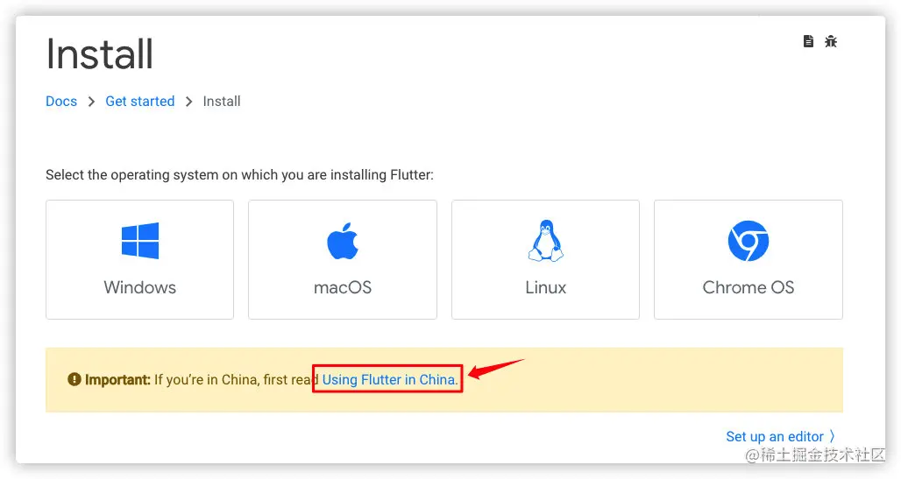

新版的`Mac`电脑终端都是使用的`zsh`，其配置文件路径为`~/.zshrc`;

老版本`Mac`电脑中断使用的是`bash`，其配置文件路径为`~/.bash_profile`;

我们需要在配置文件中，进行镜像的配置：

```
export PUB_HOSTED_URL=https://pub.flutter-io.cn
export FLUTTER_STORAGE_BASE_URL=https://storage.flutter-io.cn
```

> 可能有一部分之前用的老电脑，配置信息放在了`bash_profile`文件中，现在更新到新系统之后，默认的是`zsh`，这样的话我们会有两份配置文件，那么我们只需要在`zshrc`文件最后添加如下指令，就可以直接将`bash_profile`文件中所有的环境变量引入`zshrc`中：

```
if [ -f ~/.bash_profile ]; then
    . ~/.bash_profile;
fi
```

### 配置 Flutter 环境变量

在配置文件中添加配置如下：

```
#flutter环境变量
export PUB_HOSTED_URL=https://pub.flutter-io.cn #国内用户需要设置
export FLUTTER_STORAGE_BASE_URL=https://storage.flutter-io.cn #国内用户需要设置
export PATH=/Users/******/development/flutter/bin:$PATH
```

> Flutter 的指令在 bin 目录，所以配置环境变量时要指定到 bin 目录才行

配置完成之后，重新打开终端，或者直接在终端中输入指令重新载入配置：

```
## zsh 指令
source ~/.zshrc

## bash 指令
source ~/.bash_profile
```

## 安卓环境配置

### 安装 Android Studio

前往`Android Studio`的中国官网[下载 Android Studio](https://link.juejin.cn?target=https%3A%2F%2Fdeveloper.android.google.cn%2Fstudio "https://developer.android.google.cn/studio")

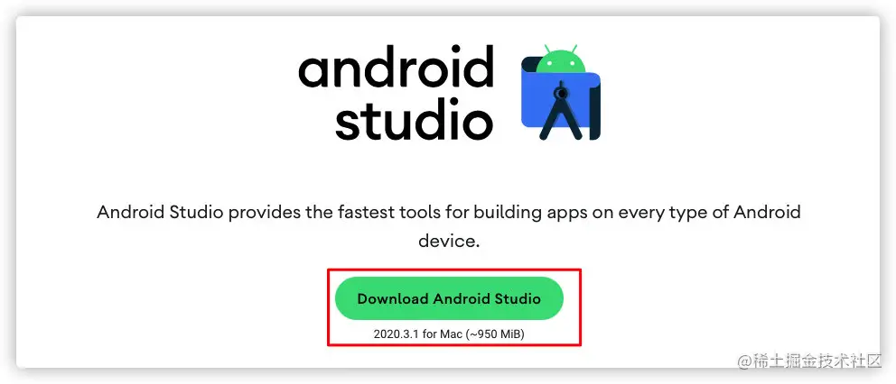

点击前往下载界面，勾选条款之后，此处有两个下载按钮，分别针对`Mac`的两种芯片`intel`和`M1`，请根据电脑芯片下载：

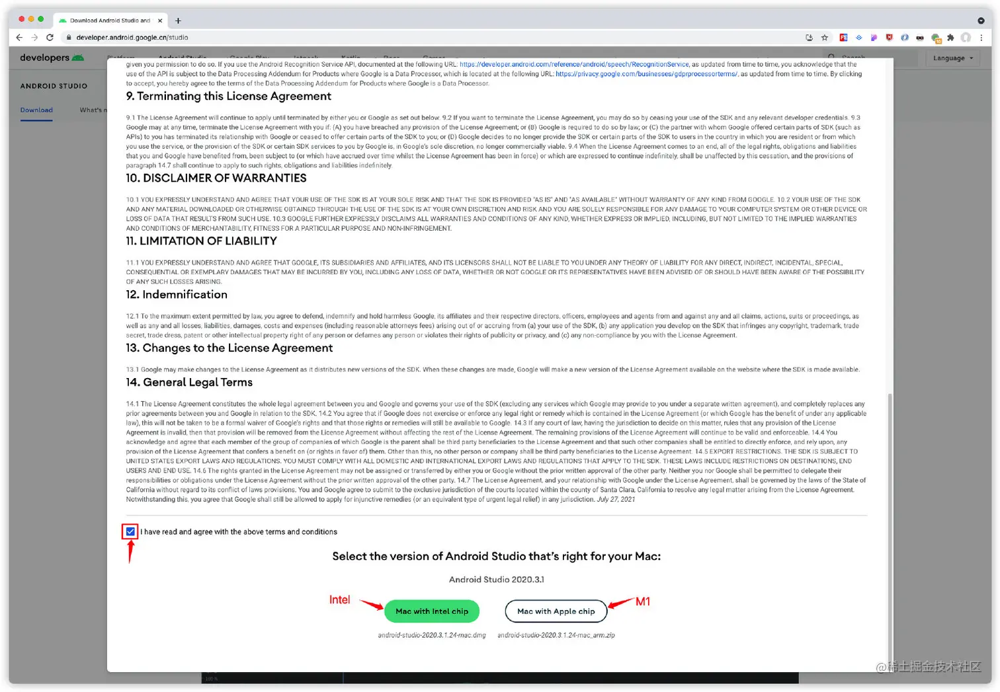

### 配置 SDK

下载完成之后，安装`Android Studio`，安装过程中，根据安装安装向导安装即可，我们需要安装以下几个`SDK`：

- Android SDK
- Android SDK Command-line Tools
- Android SDK Build-Tools

安装过程无需科学上网；

如果之前安装过`Android Studio`，那么可以前往偏好设置（快捷键`cmd+,`）进行`SDK`的安装：

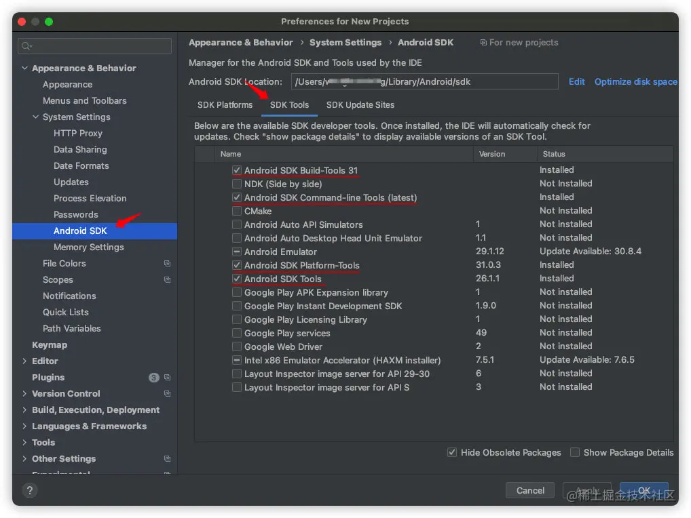

### 安装插件

此处，我们需要安装两个插件`Flutter`和`dart`：

可以在偏好设置中的`Plugins`中进行插件的搜索和安装：

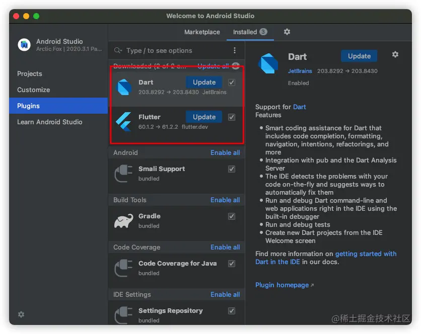

安装完成之后，重新启动`Android Studio`时我们可以看到创建`Flutter`项目的入口：

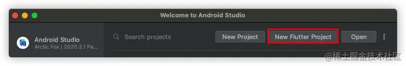

## 验证

配置完成之后，我们需要进行验证

### flutter doctor

终端输入`flutter doctor`:

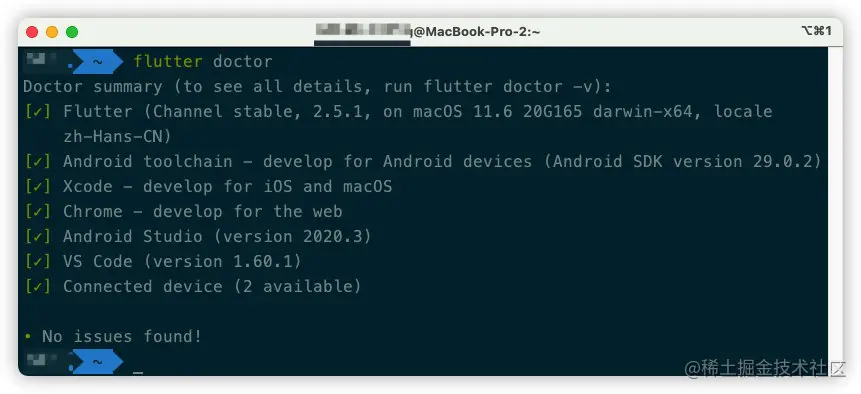

### flutter doctor -v

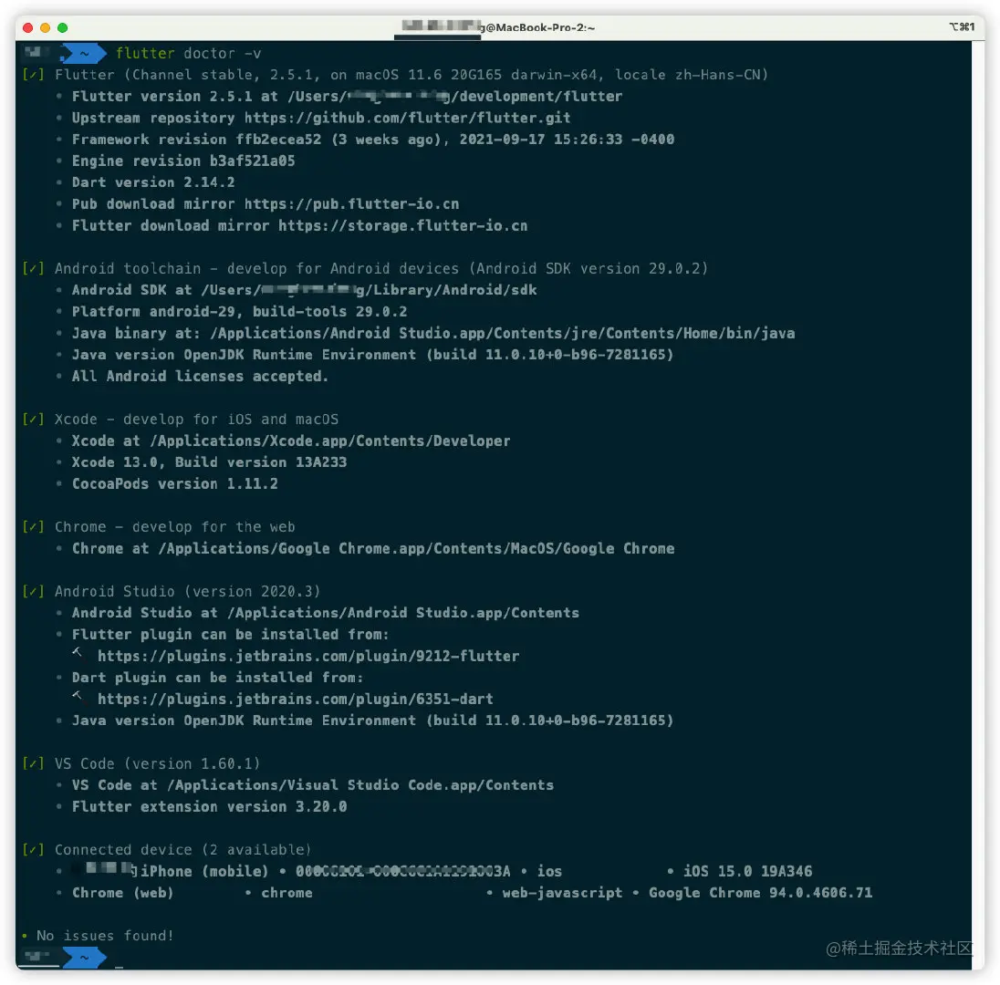

出现这两种结果，那么就说明环境配置已经~解决了~差不多了......

如果有出错信息，那么根据提示解决即可；

## 其他问题解决

### JDK 问题解决

即使我们已经安装好了`Android Studio`，此时还可能出现`JDK`的版本问题，目前`JDK`已经是`10+`的版本，而此处需要`1.8`版本 (好像，貌似是这个版本)，所以我们需要指定一个`软链接`:

```
cd /Applications/Android\ Studio.app/Contents/jre
ln -s ../jre jdk
ln -s "/Library/Internet Plug-Ins/JavaAppletPlugin.plugin" jdk
```

### 许可证问题解决

在进行`flutter doctor`指令时会发生许可证的问题，解决方案如下：

执行指令：

```
flutter doctor --android-licenses
```

全部输入`YES`；
