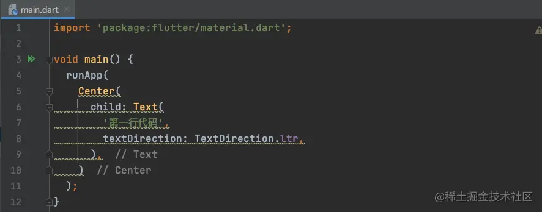
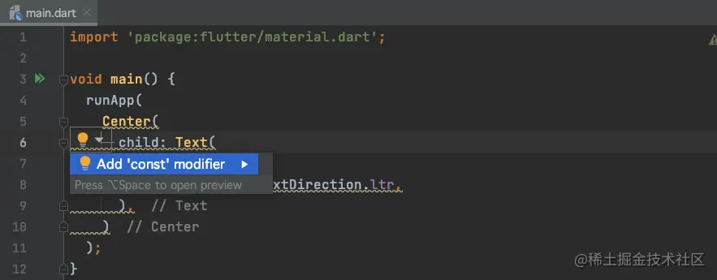

# (三)Flutter 从零开始

在此之前，我们已经运行成功`Flutter`的示例工程，在`main.dart`文件中默认生成了很多代码，这个时候，这些代码我们是看不大明白的，所以我们从零开始学习`Flutter`组件，将`main.dart`文件清空，我们自己来写界面，一步步熟悉`Flutter`界面的搭建流程；

## 导入头文件

我们在`iOS`工程中写`UI`控件的时候一般需要导入`UIKit`框架，那么在`Flutter`中也是同样的道理，需要导入框架，在`Flutter`中，这个框架名叫`material.dart`，导入方式为：

```js
import "package:flutter/material.dart";
```

这个库类似于`iOS`中的`UIKit`，是一个`素材库`；

> 注意：如果导入了文件，而没有使用，那么光标点击其他地方的时候，此处的 import 有可能会消失；

## 万物皆 Widget

我们在做`iOS`开发的时候，我们会经常使用`UIView`，那么在`Flutter`中，对应的控件名为`Widget`(小部件)，万物皆为`Widget`；

## 一切从 runApp 开始

在`iOS`中我们把`容器`放在`UIWindow`上，那么在`Flutter`上，如果我们需要显示界面，那么需要先执行`runApp()`方法

```js
void main() {
  runApp(

  );
}
```

我们需要在`runApp`函数中，传入一个`Widget`部件；

## 两个简单的 Widget

### Center

我们先在界面上显示一个`Center`，这个`Widget`看名字就是将控件显示在视图中间的;

```js
void main() {
  runApp(
    Center(

    )
  );
}
```

在`Center`中，有一个`child`，意思类似于`iOS`中的`subView`，存放子控件；

### Text

我们在`Center`中添加一个显示文字的`Text`：

```js
void main() {
  runApp(
    Center(
      child: Text(
        '第一行代码',
        textDirection: TextDirection.ltr,
      ),
    )
  );
}
```

- `textDirection`为`Flutter`中`Text`特有的属性，不写的话，在此处的`Text`控件无法显示，可以理解为文字的阅读方向，`ltr`为从左到右，`rtl`为从右到左，但是其显示效果一样；

这个时候，我们发现我们的代码会发出警告信息：  将光标移动到黄色虚线位置时，将会出现`💡`(灯泡)，点击出现提示信息：  最终代码变为：

```js
void main() {
  runApp(
    const Center(
      child: Text(
        '第一行代码',
        textDirection: TextDirection.ltr,
      ),
    )
  );
}
```

加上`const`之后，`Center`将会变成一个`常量`，因为目前`Center`组件不会动态改变，那么`Flutter`将会推荐将其定义为`const`； ​

运行代码，效果如下： 

此时界面中存在两个`Widget`：`Center`和`Text`；

## Flutter 的小知识

### Flutter 的渲染机制

`Flutter`的渲染机制我们称之为`增量渲染`，这个渲染机制的存在也是`Flutter`效率高的原因； ​

那么什么是`增量渲染`呢？我们在`iOS`中要改变`UIView`的样式时，我们可以直接调用其`属性`进行修改；但是在`Flutter`中，如果我们想要改变`view1`的效果，那么我们就需要创建一个`view2`，用`view2`将`view1`替换掉，重新渲染`这一部分控件`； ​

被标记为`const`的控件是不会改变的 (静态的)，那么在`Flutter`的`渲染树`中，被标记为`const`的控件将不会改变； ​

> 在`Flutter`中没有`图层`的说法；在`Xcode`中进行调试的时候，`Flutter`视图只有一层；逆向的时候也就很难从`UI`入手了；
