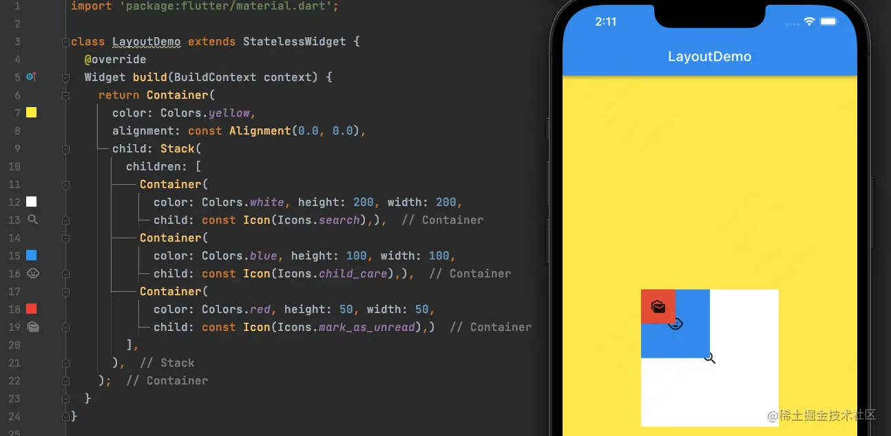
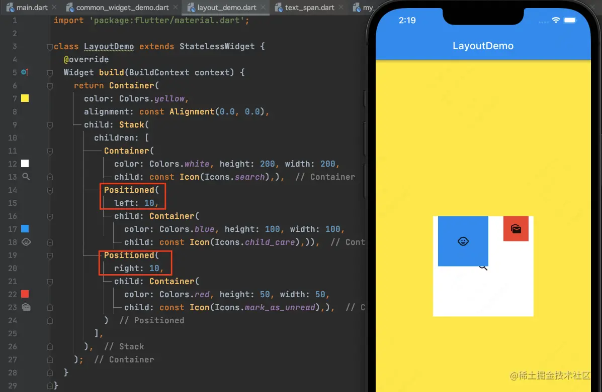
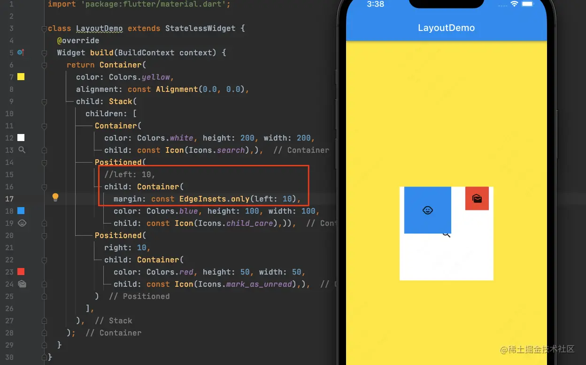
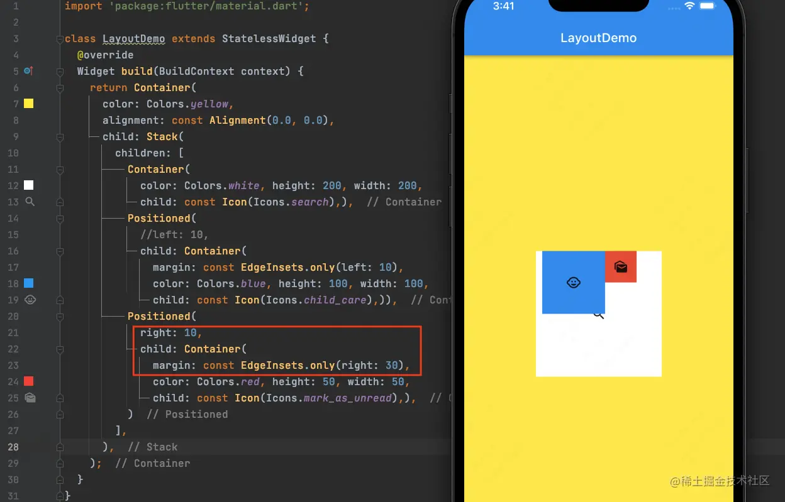
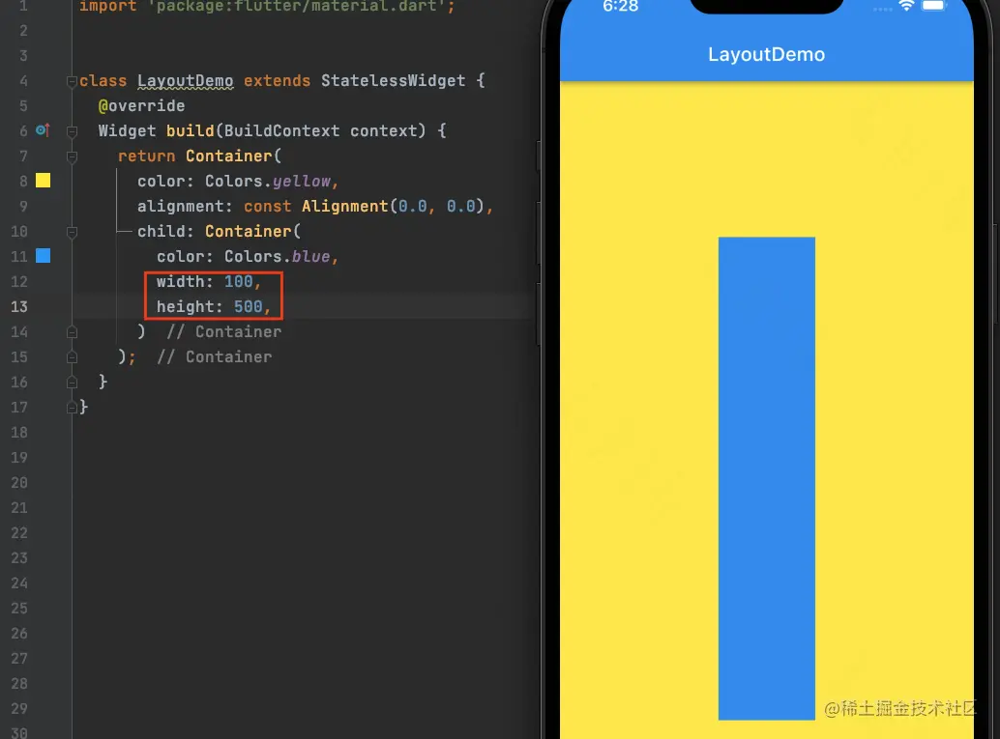
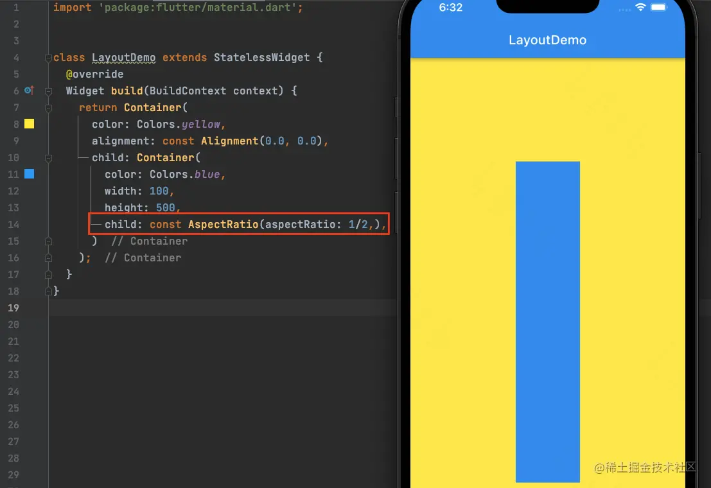
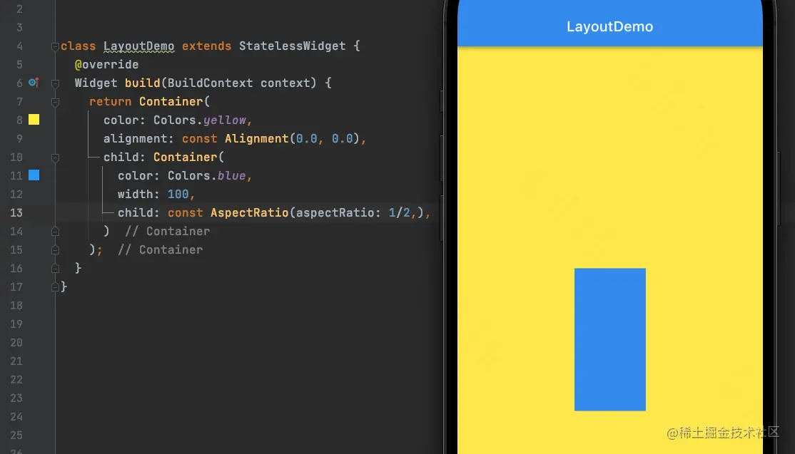

# (九)层叠布局-Stack

层叠布局和`Web`中的绝对定位，以及 iOS 中的`Frame`布局是相似的，子部件可以根据距离父部件资格角的位置来确定自身的位置；其允许子部件按照代码中声明 (添加) 的顺序堆叠起来。

通常情况下，在`Flutter`中我们使用`Stack`和`Positioned`两个部件组合使用来实现绝对定位。`Stack`来实现足部件堆叠起来，而`Positioned`用来根据`Stack`的四个角来确定子部件的具体位置；

## Stack

在`Flutter`中，`Stack`定义如下：

```js
Stack({
    Key? key,
    this.alignment = AlignmentDirectional.topStart,
    this.textDirection,
    this.fit = StackFit.loose,
    this.overflow = Overflow.clip,
    this.clipBehavior = Clip.hardEdge,
    List<Widget> children = const <Widget>[],
  })
```

- `alignment`：此参数表示如果我们没有定位子部件或者子部件只进行了部分定位时的对齐方式；
  - 没有定位：没有使用`Positioned`进行定位；
  - 部分定位：特指没有在某一个轴上定位：
    - `left`，`right`为横轴；`top`，`bottom`为纵轴；只要包含某个轴上的一个定位属性，那么就算在该轴上有定位
- `textDirection`：和`Row`的`textDirection`功能一样，都用于确定`alignment`对齐时的参考系；
  - `textDirection`值为`TextDirection.ltr`，则`alignment`的`start`表示左边，`end`表示右边；也就是`从左到右`的顺序；
  - `textDirection`值为`TextDirection.rtl`，则`alignment`的`start`表示右边，`end`表示左边；也就是`从右到左`的顺序；
- `fix`：用来确定没有定位的子部件如何适应`Stack`的大小；
  - `StackFit.loose`：使用子部件的大小；
  - `StackFit.expand`：拉伸到`Stack`的大小；
- `overflow`：用来决定如何显示超出了`Stack`显示区域的子部件；
  - `Overflow.clip`：子部件超出`Stack`显示区域的那部分会被裁剪，或者说隐藏；
  - `Overflow.visible`：超出显示区域的那部分不会被裁剪；

## Positioned

`Positioned`定义如下：

```js
const Positioned({
    Key? key,
    this.left,
    this.top,
    this.right,
    this.bottom,
    this.width,
    this.height,
    required Widget child,
  })
```

- `left`：距离`Stack`左边的距离；
- `top`：距离`Stack`上边的距离；
- `right`：距离`Stack`右边的距离；
- `bottom`：距离`Stack`下边的距离；
- `width`：指定当前需要定位的部件的宽度；
- `height`：指定当前需要定位的部件的高度；

> **需要注意的是：**`**Positioned**`**的**`**width**`**和**`**height**`**与其它地方的意义不同，在**`**Positioned**`**中**`**width**`**和**`**height**`**是用来配合**`**left**`**，**`**top**`**，**`**right**`**和**`**bottom**`**来定位部件的；比如在水平方向上，我们只能指定**`**left**`**，**`**right**`**和**`**width**`**三个属性中的两个属性，因为剩下的那个会根据指定的两个属性计算得到。举个例子：当我们指定了**`**left**`**和**`**width**`**之后，那么**`**right**`**的值就会自动计算得到 (**`**left**`**+**`**width**`**)。同时指定三个属性则会报错，垂直方向同理；**

## Stack 布局

我们创建一个`Stack`布局，在里边放三个`Container`，先来看一下默认的效果：  可以看到，先创建的部件在最下层，之后创建的部件，从里到外以此叠放在一起； ​

接下来，我们`Positioned`来修改上边`Container`部件的位置：  将蓝色`Container`距离最底层`Container`左边`10`像素，红色`Container`距离右边`10`个像素； ​

同样的效果，我们使用`margin`也能实现：  需要注意的是`margin`是相对于父视图而言的； ​

那么，如果我们同时设置了`Positioned`的`right`和`margin`的话，结果如何呢：  最终结果：同时设置`Positioned`的`right`和`margin`时，最终位置由`margin`决定； ​

如果我们只考虑部件的位置，不考虑其与父部件的关系的话，这时我们一般推荐使用`Positioned`，否则使用`margin`；需要注意的是，如果外部部件是灵活布局的话，那么`margin`可能将会影响外部部件的大小； ​

## AspectRatio

除了`Positioned`之外，在`Stack`部件中，我们还经常使用一个宽高比组件`AspectRatio`，其定义如下：

```js
const AspectRatio({
    Key? key,
    required this.aspectRatio,
    Widget? child,
  })
```

- `aspectRatio`：必传属性，宽高比；

​

我们先来看一段代码：  我们的蓝色区域为宽`100`，高`500`的矩形区域，这个时候我们使用`AspectRatio`来进行宽高比的设置：  我们发现，通过`AspectRatio`设置了宽高比之后，蓝色区域并没有发生改变，这是因为，我们将蓝色区域的`height`和`width`都给了固定的值，此时`AspectRatio`将不会生效，我们将高度去掉：  `AspectRatio`设置的宽高比生效了，蓝色区域的高度发生了变化，并且是宽度的`2`倍； ​

> `AspectRatio`影响的是其父部件，父部件只需要设置宽高中的一个属性即可；`AspectRatio`的`child`属性一般不再赋值；因为`child`赋值的部件不受`AspectRatio`约束，其大小有`AspectRatio`影响的父部件决定；
