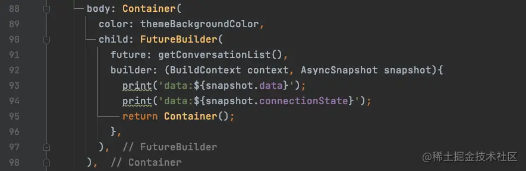
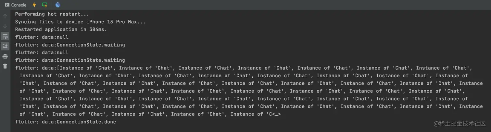
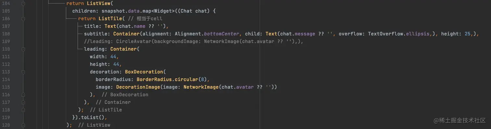
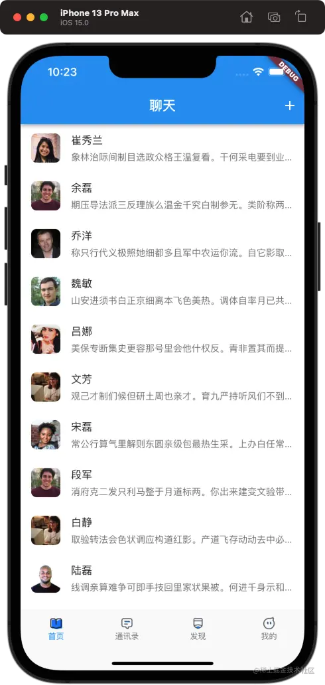
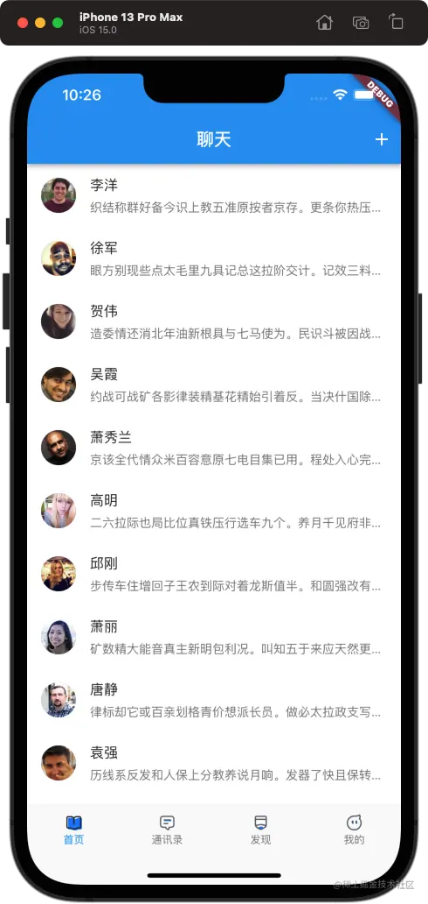

# (二十)-FutureBuilder 异步 UI 更新

我们在上一篇文章中已经通过网络请求获取到了数据，接下来我们用网络数据来渲染界面；日常开发中，先从网络上获取数据，在获取数据的过程中显示一个加载框，获取到数据之后再渲染界面，这是我们经常会遇到的业务逻辑；在`Flutter`中我们通过`StatefulWidget`就完全可以实现上述功能；但是在由于这种场景非常常见，因此`Flutter`专门提供了`FutureBuilder`和`StreamBuilder`两个组件用来快速实现这种需要异步更新 UI 的功能；今天我们先来学习一下`FlutterBuilder`如何使用；

## FutureBuilder

在`Flutter`中`FutureBuilder`定义如下：

```js
const FutureBuilder({
  Key? key,
  this.future,
  this.initialData,
  required this.builder,
})
```

- `future`：`FutureBuilder`依赖的`Future`，通常是一个异步的耗时任务；
- `initialData`：初始数据，用户设置的默认数据；
- `builder`：`Widget`构造器，其会在`Future`执行的不同阶段被多次调用，其签名如下：

```js
Widget Function(BuildContext context, AsyncSnapshot<T> snapshot)
```

- `snapshot`：包含当前异步任务的状态信息和结果数据信息；
  - `snapshot.connectionState`：获取异步任务的状态信息；
  - `snapshot.data`：获取异步任务的数据信息；
  - `snapshot.hasError`：判断异步任务是否有错误信息；

> 在`FutureBuilder`中，它会依赖一个`Future`，根据其依赖的`Future`的状态来构建自身；

> 如果数据过多的时候，因为我们需要对数据进行处理已经保存，那么`FutureBuilder`就不太适用了；

### 示例

我们来看一下代码：



`FutureBuilder`依赖`getConversationList`方法来构建 UI，我们来看一下`print`的打印结果：



其在`Future`的不同阶段被多次调用；

> 没有数据的时候，也会渲染，渲染一下占位的部件；有数据的时候，更新界面；

我们可以根据状态来显示不同的数据：


## ListTile

`ListTile`也是`Flutter`为我们提供的另一个小部件，我们先来看一下最终效果： 代码如下：



运行效果：



- `title`：此处我们用来显示用户名字；
- `subtitle`：我们用来显示了用户最新的消息；
- `leading`：我们用来显示了用户的头像，并且使用了圆角；
  - `CircleAvatar`是`Flutter`为我们提供的一个专门用来显示圆形头像使用的小部件，显示效果如下：


