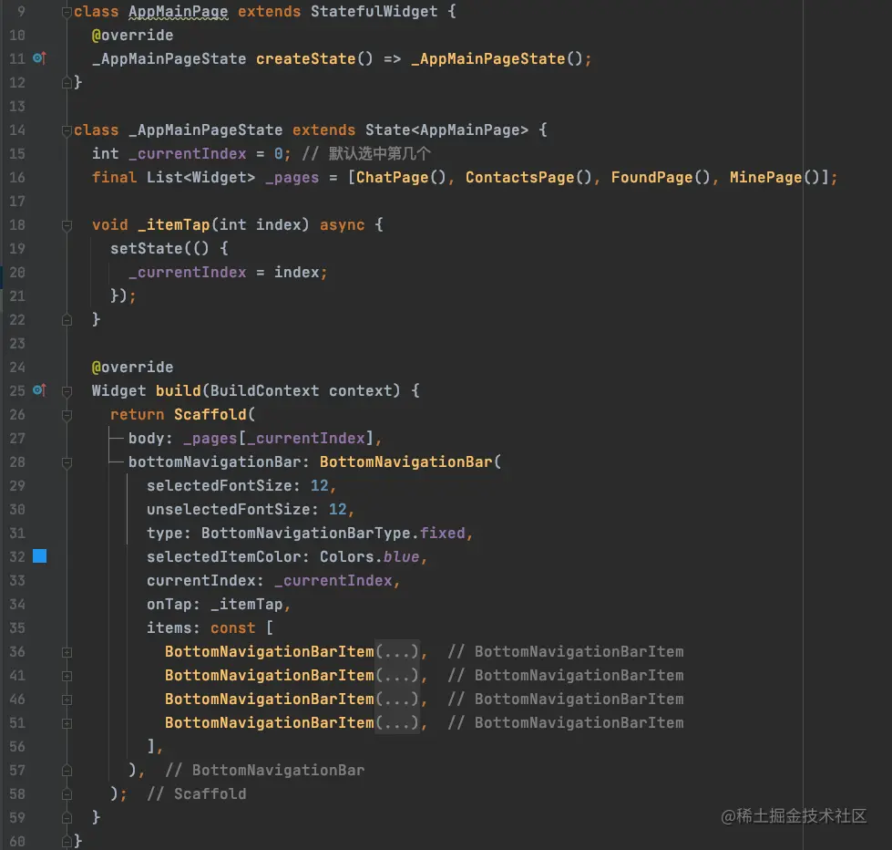
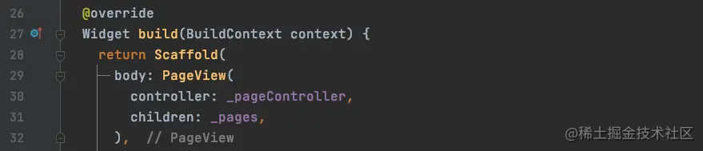
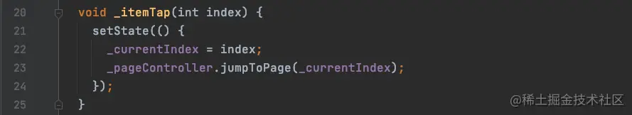
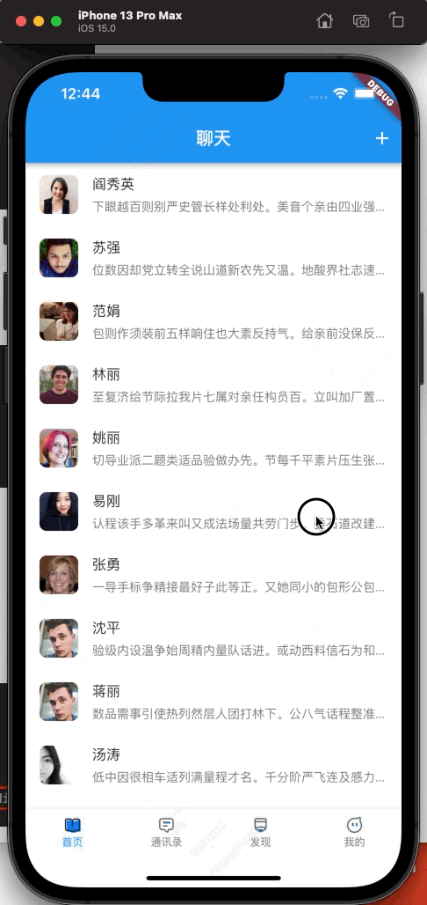
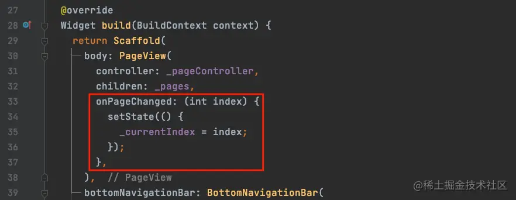
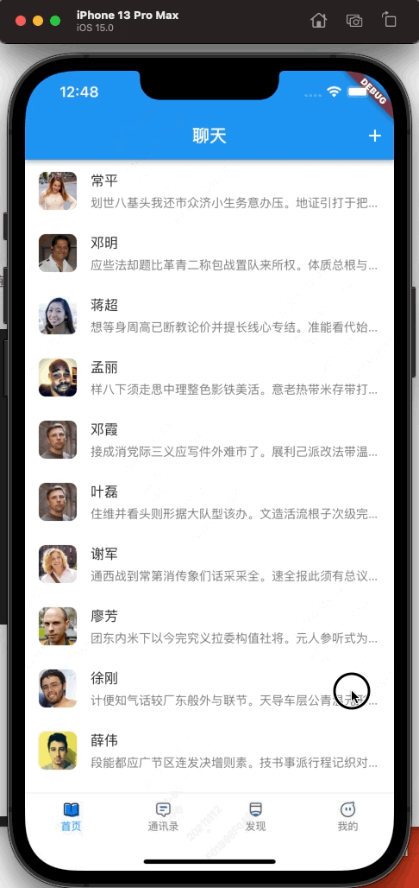
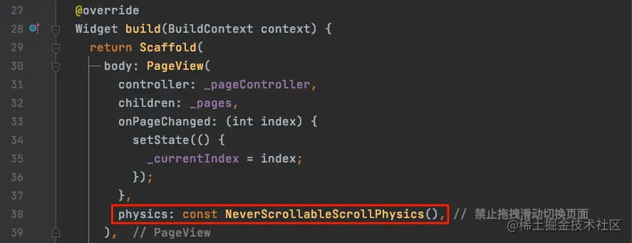
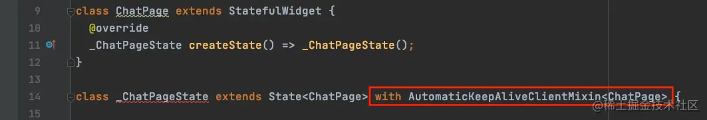
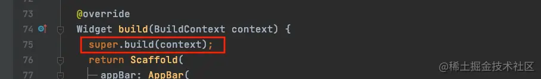

# (二十一)-部件状态的保持

我们已经使用`Flutter`有一段时间了，但是目前我们使用`Flutter`构建的界面都有一个问题，一旦这个界面切换之后，再次出现时界面状态就会被重置，尤其是底部导航所对应的几个主界面，每次切换都会重新渲染，这样显然是不合适的；那么有没有办法，能够在主界面切换之后，再次切换回来时，依然能够保持之前的状态呢？这就需要使用到`Flutter`中的混入`Mixins`；

## Mixins

在`Flutter`中，`Dart`是不支持多继承的，但是我们可以通过`Mixins`给一个类添加功能，通过这种方式实现多继承；接下来，我们以上篇文章中实现的聊天界面来演示一下`Mixins`的使用；

在`Flutter`中`Mixins`并不是操作继承自`StatefulWidget`的界面，因为我们要保留状态，所以应该操作其对应的`State`，其通过`with`关键字实现；

想要实现状态的保留，需要有三步操作：

- `with`关键字实现混入；
- 重写`wantKeepAlive`的`get`方法，返回`true`；
- 实现`super.build(context)`方法；

比如，我们想要实现聊天界面与通讯录界面切换之后，两个界面都能够保持之前的状态，那么我们需要做两方面的工作：

- 底部导航所在页面的状态保持；
- 聊天界面你的状态保持

## 底部导航栏状态保持

我们先来看一下当前底部导航栏切换界面的代码：



我们是通过`Scaffold`部件的`bottomNavigationBar`中的点击事件`onTap`来切换页面索引，然后通过所以从数组中取出界面，而数组中的界面每一次都是最新的，每一次切换界面都是在做状态的更新 (点击方法中调用了`setState`)，那么之前的界面切换之后就会被销毁；

那么想要保持状态不更新，就需要将数组中的界面都放在`Widget`树中，只控制显示和隐藏；

### PageController

我们需要先创建一个`PageController`：

```js
final PageController _pageController = PageController();
```

我们通过`PageController`来切换界面；

### PageView

接下来，我们将`Scaffold`的`body`使用`PageView`:



- `controller`：传我们创建的`PageController`；
- `children`：传我们存放页面的数组；

这样就能将我们的界面存入`Widget`树中；

接下来修改我们的`onTap`方法：



使用`_pageController`进行页面切换；但是此时还有一个问题：



我们使用了`PageController`和`PageView`之后，页面具备了滑动切换的功能，但是滑动时，底部的状态平没有随着切换；所以在页面改变时，我们还需要同步改变选中的索引，也就是`_currentIndex`：



效果如下：



### 禁止滑动切换

如果想要禁用滑动切换页面的效果，可以通过`PageView`的`physics`属性：



## 聊天界面状态保持

### with 关键字

我们想要保留聊天界面的状态，那么我们需要将代码修改为：



- `with`使用该关键字试下混入；
- `AutomaticKeepAliveClientMixin`保持该页面状态时，需要混入的`Mixins`
- `ChatPage`传入泛型，也就是对应的页面；

### 重写 wantKeepAlive 方法

我们可以看到，此时`_ChatPageState`爆出错误；这是因为实现混入功能，我们需要重写`wantKeepAlive`，代码如下：


> `wantKeepAlive`是一个`get`方法；

### super.build

最后，我们需要在原来的渲染方法`build`方法中实现`super.build(context)`：



其他几个页面我们一次按照这三部进行修改，最终效果如下：


