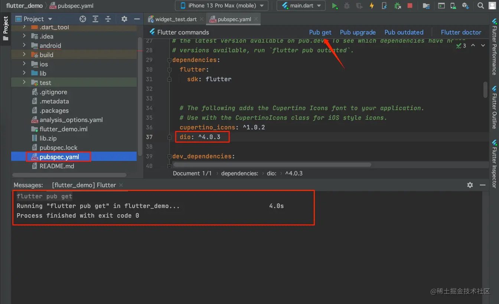
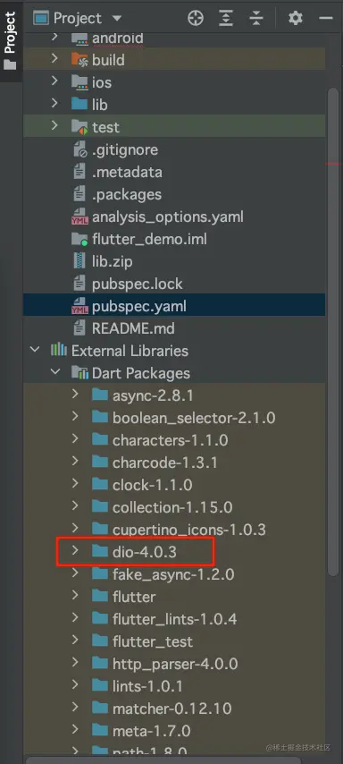
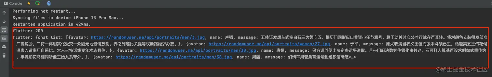
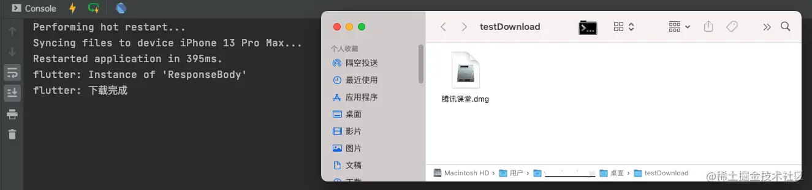
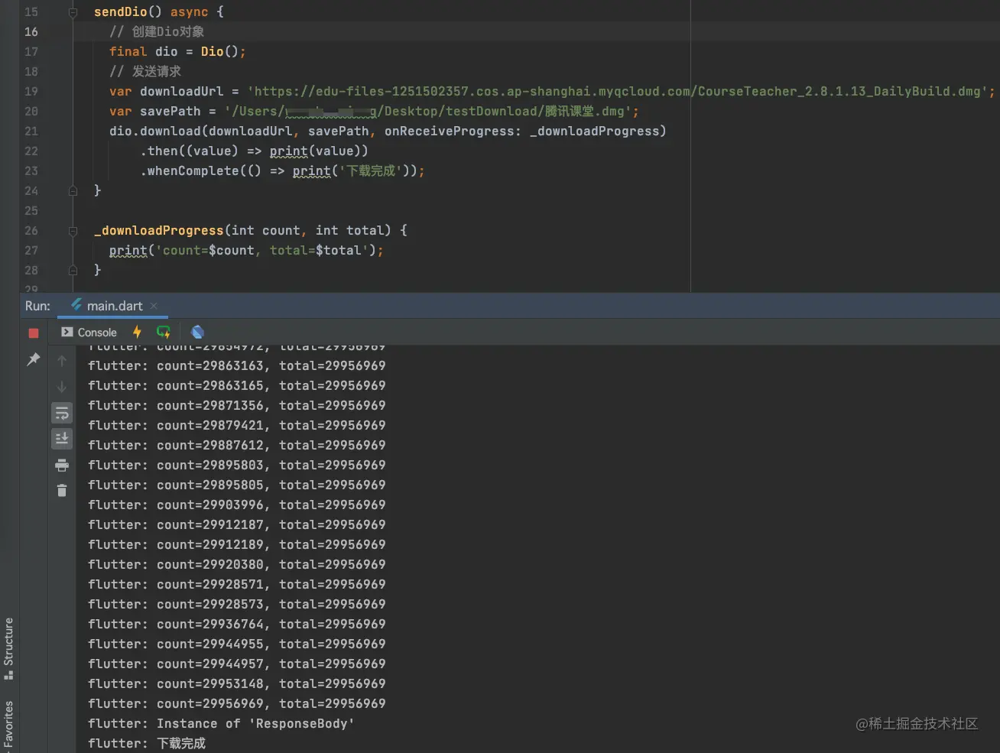
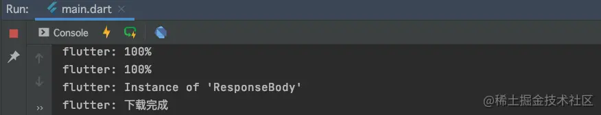
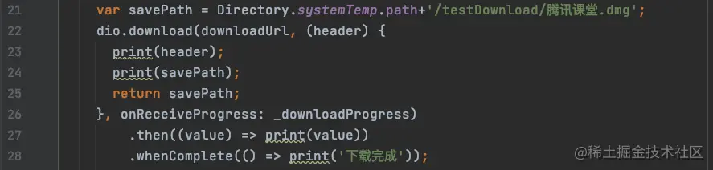
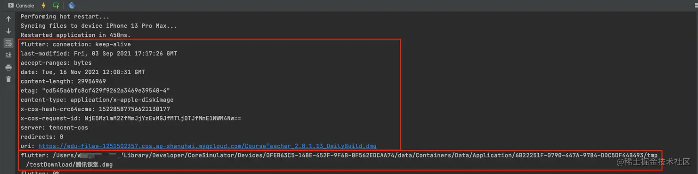

# (二十九)-网络框架 Dio

## 引入 Dio

我们可以在 [pub.dev](https://link.juejin.cn?target=https%3A%2F%2Fpub.dev "https://pub.dev") 网站上，找到`dio`包的地址：[Dio 地址](https://link.juejin.cn?target=https%3A%2F%2Fpub.dev%2Fpackages%2Fdio "https://pub.dev/packages/dio")，其`GitHub`中文简介地址为：[Dio 中文简介](https://link.juejin.cn?target=https%3A%2F%2Fgithub.com%2Fflutterchina%2Fdio%2Fblob%2Fmaster%2FREADME-ZH.md "https://github.com/flutterchina/dio/blob/master/README-ZH.md")；

要想使用`Dio`，我们需要先在项目中引入`dio`：



如果导入成功，我们可以在此目录中看到`dio`包及其版本信息：



## Dio 的使用

### get

`Dio`的使用很简单，只需要创建一个`Dio`对象，即可直接发送网络请求，如下代码：

```js
sendDio() async {
  // 创建Dio对象
  final dio = Dio();
  // 发送请求
  Response response = await dio.getUri(Uri.parse('http://rap2api.taobao.org/app/mock/293614/api/chat/list'));
  // 返回数据
  print(response.statusCode);
	print(response.data.toString());
}
```

因为网络请求是异步的，所以需要使用`await`和`async`，这样才能直接接收请求返回的对象；我们来看一下打印结果：



如果`get`请求需要添加参数，可使用如下请求方式:

```js
Response response = await dio.get('http://rap2api.taobao.org/app/mock/293614/api/chat/list', queryParameters: {});
```

- `queryParameters`用来传递参数；

### download

使用`Dio`进行下载操作，需要调用`dio`的`download`方法，我们来看一下其定义：

```js
Future<Response> download(
  String urlPath,
  savePath, {
  ProgressCallback? onReceiveProgress,
  Map<String, dynamic>? queryParameters,
  CancelToken? cancelToken,
  bool deleteOnError = true,
  String lengthHeader = Headers.contentLengthHeader,
  data,
  Options? options,
});
```

- `urlPath`：下载的文件地址；
- `savePath`：文件下载之后的保存地址；

我们先来下载一下`腾讯课堂`的`mac版`试一下：

```js
sendDio() async {
  // 创建Dio对象
  final dio = Dio();
  // 发送请求
  var downloadUrl = 'https://edu-files-1251502357.cos.ap-shanghai.myqcloud.com/CourseTeacher_2.8.1.13_DailyBuild.dmg';
  var savePath = '/Users/***********/Desktop/testDownload/腾讯课堂.dmg';
  dio.download(downloadUrl, savePath).then((value) => print(value)).whenComplete(() => print('下载完成'));
}
```

需要注意的是，我们先将文件下载到电脑的桌面，当前桌面是没有`testDownload`文件夹的，在下载的时候，其会自动创建这个文件夹；并且我们需要在路径后边跟上文件的名字；

我们看一下最终的执行结果： 

那么如何获取下载进度呢？



给`download`中的`onReceiveProgress`方法传递一个`_downloadProgress`方法，可以在该方法中接收下载的进度；

转换成百分比，我们将`_downloadProgress`方法修改如下：

```js
_downloadProgress(int count, int total) {
  if (total != -1) {
    print((count / total * 100).toStringAsFixed(0)+'%');
  }
}
```

运行结果：



在设置下载地址的时候，我们也可以通过回调的方式，赋值一个下载地址给`download`方法，代码如下：

 我们在这个地方，将下载地址换成了手机端的沙盒`tmp`的文件夹，需要注意的是，这是个`iOS`的沙盒目录；查看`header`和`savePath`的打印结果：



想要了解更多关于`Dio`网络库的使用，请移步 [Dio 中文文档](https://link.juejin.cn?target=https%3A%2F%2Fgithub.com%2Fflutterchina%2Fdio%2Fblob%2Fmaster%2FREADME-ZH.md "https://github.com/flutterchina/dio/blob/master/README-ZH.md")；
